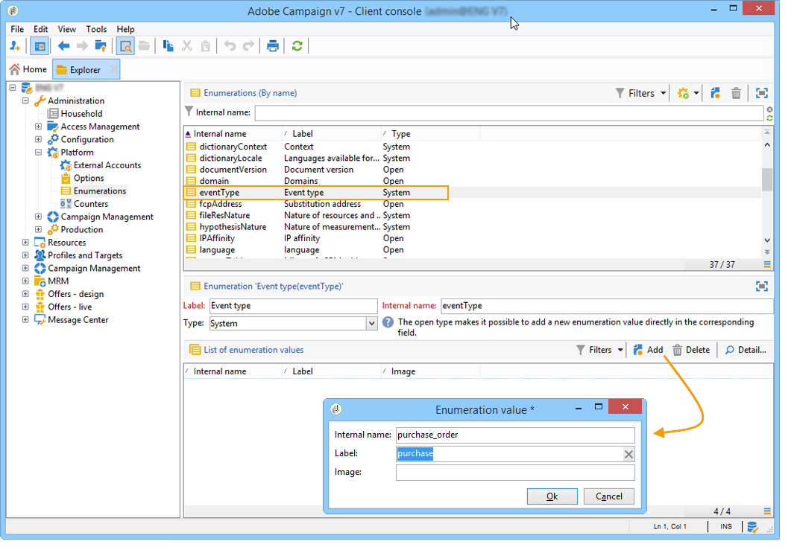

# Create event types {#creating-event-types}

To make sure each event can be changed into a personalized message, you first need to create **event types**.

When [creating a message template](../../message-center/using/creating-the-message-template.md), you will select the type of event that matches the message you want to send.

>[!IMPORTANT]
>
>You must create event types before being able to use them in message templates.

To create event types that will be processed by Adobe Campaign, follow the steps below:

1. Log on to the **control instance**.

1. Go to the **[!UICONTROL Administration > Platform > Enumerations]** folder of the tree.

1. Select **[!UICONTROL Event type]** from the list.

1. Click **[!UICONTROL Add]** to create an enumeration value. This can be an order confirmation, password change, order delivery change, etc.

    

    >[!IMPORTANT]
    >
    >Each event type must match a value in the **[!UICONTROL Event type]** enumeration.

1. Once the itemized list values have been created, log off and back on to your instance for the creation to be effective.

>[!NOTE]
>
>Learn more on itemized lists in [Enumeration management](../../platform/using/managing-enumerations.md).

