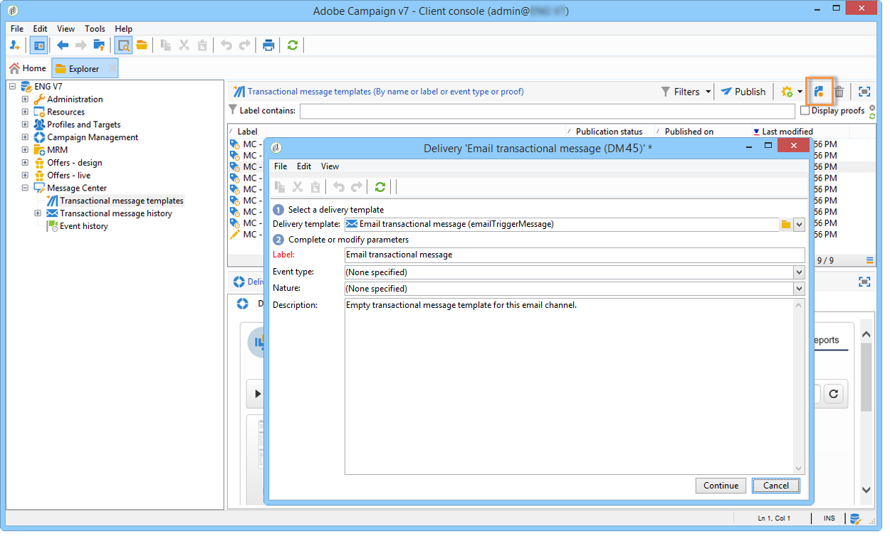
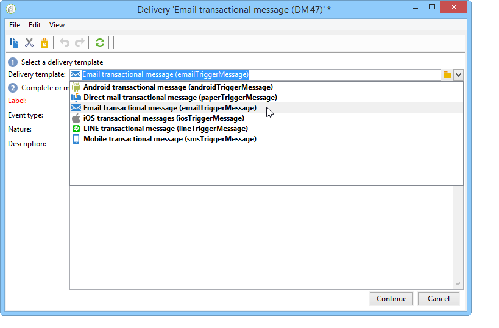
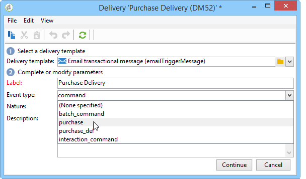

# Creating the message template{#creating-the-message-template}

1. Go to the **[!UICONTROL Message Center >Transactional message templates]** folder in the Adobe Campaign tree.
1. In the list of transactional message templates, right-click and select **[!UICONTROL New]** in the drop-down menu or click the **[!UICONTROL New]** button above the list of transactional message templates. 

   

1. In the delivery window, select the delivery template suitable for the channel you want to use.

   

1. Change its label if necessary.
1. Select the type of event that matches the message you want to send.

   

   Event types need to be created beforehand in the console. For more on this, refer to [Creating event types](../../message-center/using/creating-event-types.md).

   >[!NOTE]
   >
   >An event type should never be linked to more than one template.

1. Enter a nature and a description, then click **[!UICONTROL Continue]** to create the message body (refer to [Creating message content](../../message-center/using/creating-message-content.md)).

   
