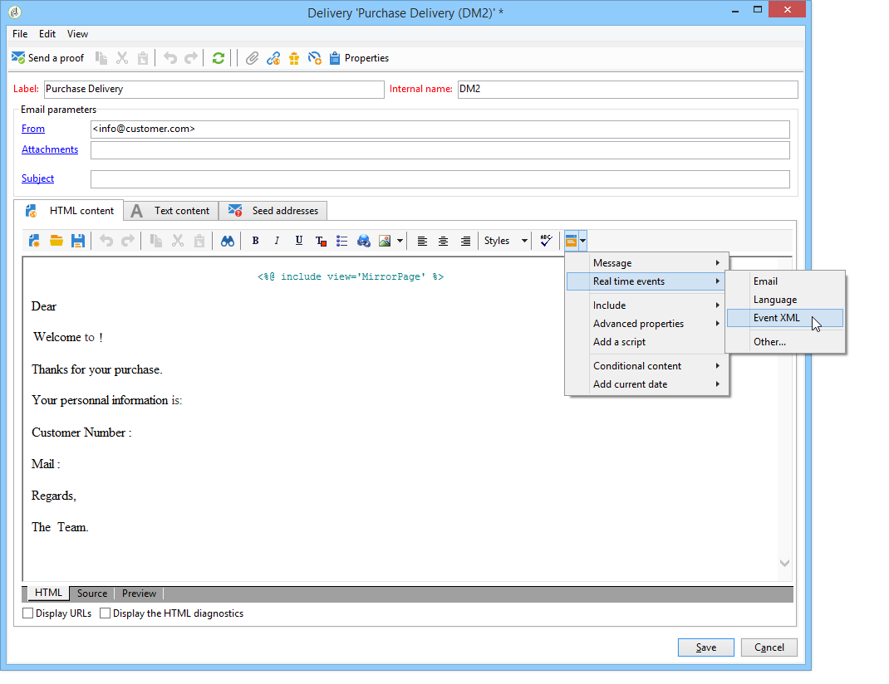
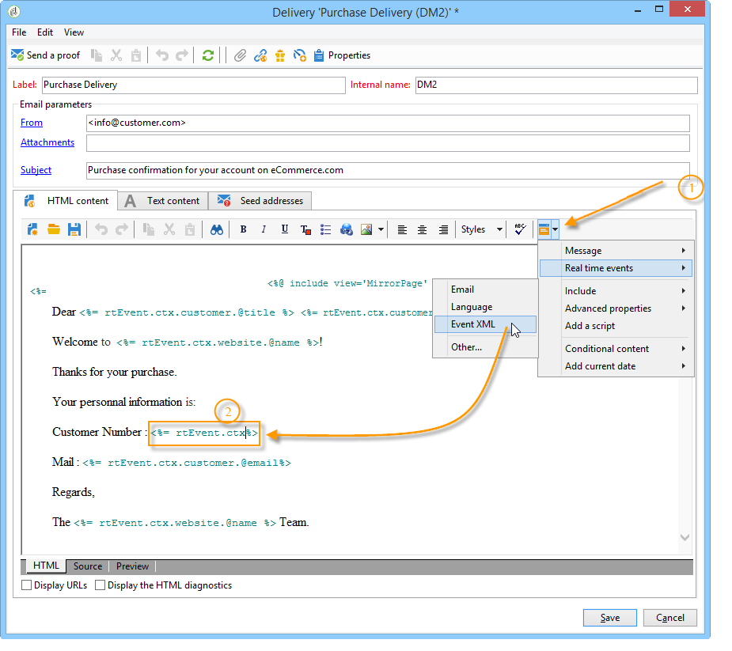
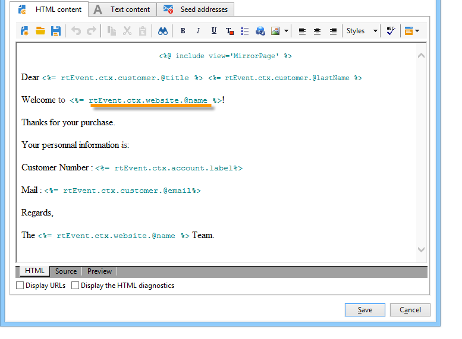

# Design transactional message templates {#creating-the-message-template}

To make sure each event can be changed into a personalized message, you need to create a message template to match each event type.

>[!IMPORTANT]
>
>Event types need to be created beforehand. For more on this, refer to [Create event types](../../message-center/using/creating-event-types.md).

Transactional message templates contain the necessary information for personalizing the transactional message. You can also use templates to test the message preview and send proofs using seed addresses before delivering to the final target. For more on this, see [Test transactional message templates](../../message-center/using/testing-message-templates.md).

## Create the message template {#creating-message-template}

1. Go to the **[!UICONTROL Message Center >Transactional message templates]** folder in the Adobe Campaign tree.

1. In the list of transactional message templates, right-click and select **[!UICONTROL New]** in the drop-down menu or click the **[!UICONTROL New]** button above the list of transactional message templates. 

   

1. In the delivery window, select the delivery template suitable for the channel you want to use.

   

1. Change its label if necessary.

1. Select the type of event that matches the message you want to send.

   

   Event types need to be created beforehand in the console. For more on this, refer to [Create event types](../../message-center/using/creating-event-types.md).

   >[!IMPORTANT]
   >
   >An event type cannot be linked to more than one template.

1. Enter a nature and a description, then click **[!UICONTROL Continue]** to create the message body (refer to [Create the message content](#creating-message-content)).

   

## Create the message content {#creating-message-content}

The definition of the transactional message content is the same as for regular deliveries in Adobe Campaign. For instance, for an email delivery, you can create content in HTML or text format, add attachments or personalize the delivery object. For more on this, refer to the [Email delivery](../../delivery/using/about-email-channel.md) chapter.

>[!IMPORTANT]
>
>Images included in the message must be publicly accessible. Adobe Campaign does not provide any image upload mechanism for transactional messages.  
>Unlike in JSSP or webApp, `<%=` doesn’t have any default escaping.
>
>In this case, you have to escape each data coming from the event properly. This escaping depends on how this field is used. For example, within a URL, please use encodeURIComponent. To be displayed in the HTML, you can use escapeXMLString.

Once you have defined your message content, you can integrate event information into the message body and personalize it. Event information is inserted into the body of the text thanks to personalization tags.

* All the personalization fields are coming from the payload.
* It is possible to reference one or several personalization blocks in a transactional message. The block content will be added to the delivery content during the publication to the execution instance.

To insert personalization tags into the body of an email message, apply the following steps:

1. In the message template, click the tab that matches the email format (HTML or text).

1. Enter the body of the message.

1. In the body of the text, insert the tag using the **[!UICONTROL Real time events > Event XML]** menu.

   

1. Fill in the tag using the following syntax: **element name**.@**attribute name** as shown below.

   

1. Save your content.

Your message is now ready to be [tested](../../message-center/using/testing-message-templates.md).
