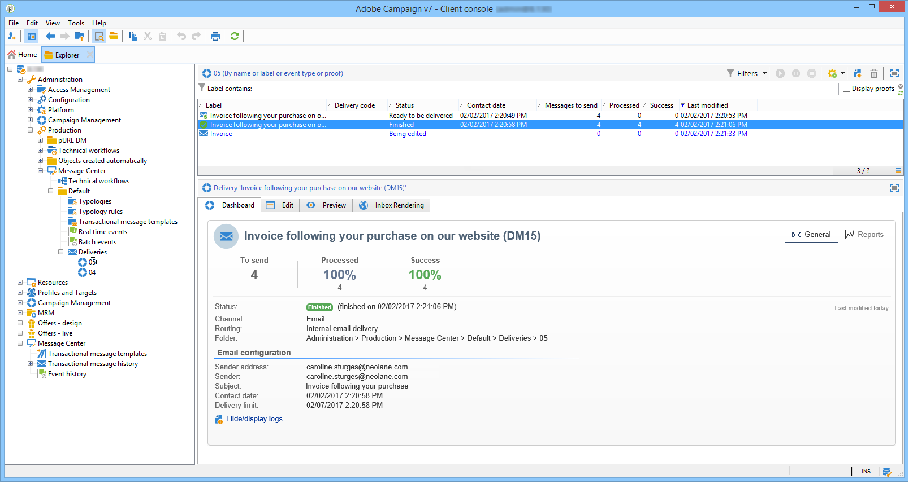
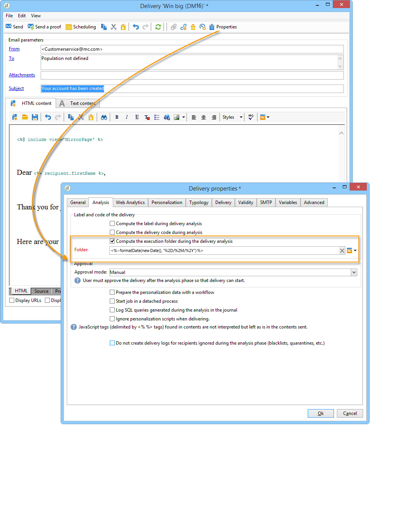

# Delivery execution{#delivery-execution}

## Transactional message send {#transactional-message-send}

On the execution instance, once the enrichment stage is complete and a delivery template has been linked to the event, the delivery is sent.

>[!NOTE]
>
>The MTA prioritizes processing the transactional messages over any other delivery.

All deliveries are grouped in the **[!UICONTROL Administration > Production > Message Center > Default > Deliveries]** folder.

By default, they are sorted into sub-folders by delivery month. This sort can be changed in the message template properties as shown below.

>[!NOTE]
>
>For hosted or hybrid installations, if you have upgraded to the Enhanced MTA, all transactional messages may also be sent with the Adobe Campaign Enhanced MTA for improved deliverability, throughput, and bounce handling. All impacts are the same as for standard marketing messages and they are detailed in the [Adobe Campaign Enhanced MTA](https://helpx.adobe.com/campaign/kb/acc-campaign-enhanced-mta.html) document.

## Transactional message log updates {#transactional-message-log-update}

When extracting transactional messaging delivery logs from the control instance, you may observe that the delivery ID associated with each broadlog ID changes every month.

This is because the [delivery logs](../../delivery/using/monitoring-a-delivery.md#delivery-logs-and-history) of the transactional deliveries sent from the execution instance are synchronized back to the control instance as follows.

<!--To access the delivery logs, see [this section](../../delivery/using/monitoring-a-delivery.md#delivery-logs-and-history).-->

Let's take a [delivery template](../../message-center/using/introduction.md) labelled *Template_1*.

1. An event corresponding to *Template_1* is received on the execution instance.
1. The **Processing real time events** (rtEventsProcessing) workflow processes the event and searches for an existing delivery for the current month.

    >[!NOTE]
    >
    >If not found, a new delivery is created and the event is assigned to the new delivery.

1. The transactional email is sent and the delivery status changes to **[!UICONTROL Sent]**.
1. The **Message Center execution instance** (mcSync_mcExec) workflow retrieves the delivery logs from the execution instance and updates the delivery logs on the control instance.
1. The control instance searches for an existing delivery for the current week (2020-03-16_Template_1).

    >[!NOTE]
    >
    >If not found, a new delivery is created.

1. An inbound bounce is received for the event.
1. The status of the event changes to **[!UICONTROL Delivery failed]**.
1. The **Message Center execution instance** (mcSync_mcExec) workflow retrieves the delivery logs from the execution instance and searches for a delivery for the current week (2020-03-20_Template_1) to update the delivery logs. The delivery logs are then linked to a new delivery for the current week.

To summarize, the deliveries accumulate on a weekly basis the events based on the latest event update instead of the event creation date.
