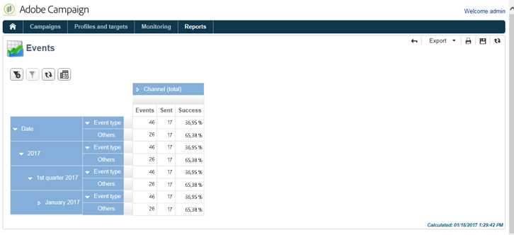

# History of Message Center events {#history-of-message-center-events}

The **[!UICONTROL History of Message Center events]** report provides you with an overview of the Message Center activity, i.e. the number of events processed and delivered as transactional messages.

When the report is opened, the information displayed by default coincides with the rate of successfully sent transactional messages. To view more levels, you can open the various nodes and place your cursor on the appropriate level to select it. 

You can view the data specific to each event type, per time period. The **[!UICONTROL Events]** column corresponds to the number of events received per control instance. The number of events transformed into personalized transactional messages is detailed in the **[!UICONTROL Sent]** column.

The **[!UICONTROL History of Message Center events]** report is a pivot table type report. For more on this, refer to the [Analyzing populations](../../reporting/using/about-descriptive-analysis.md) section.
