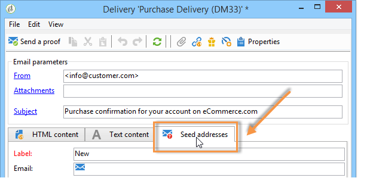
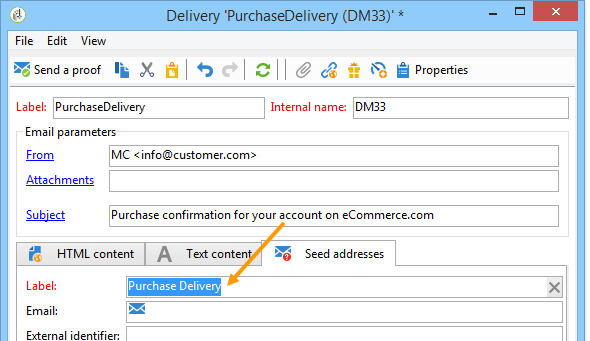
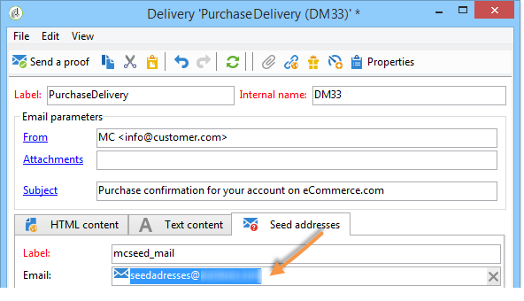
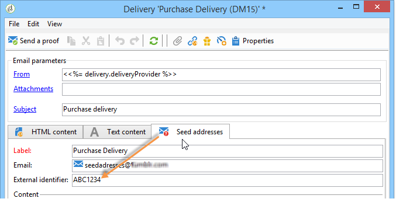
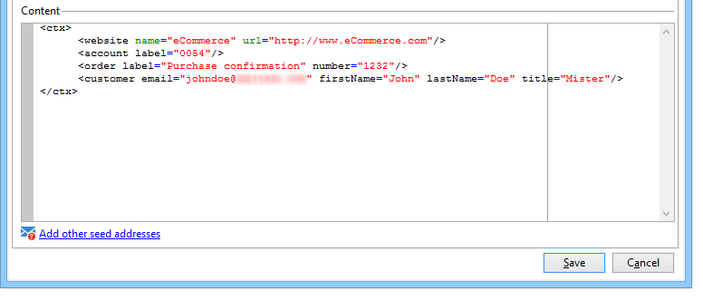
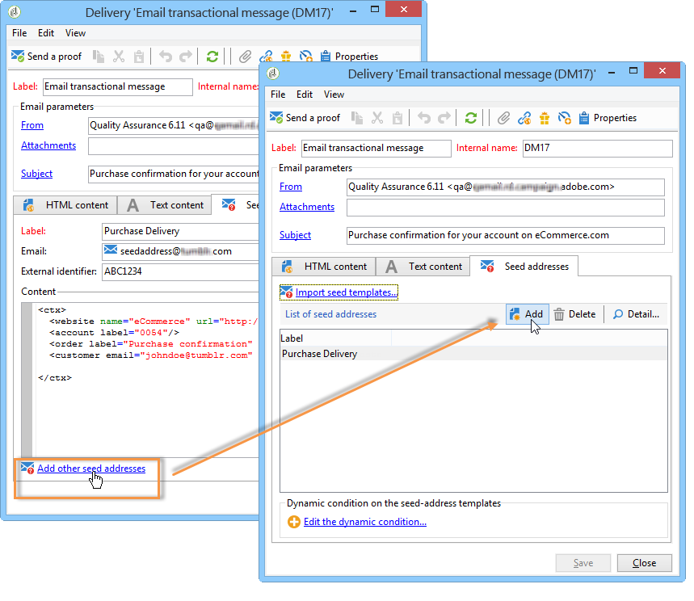
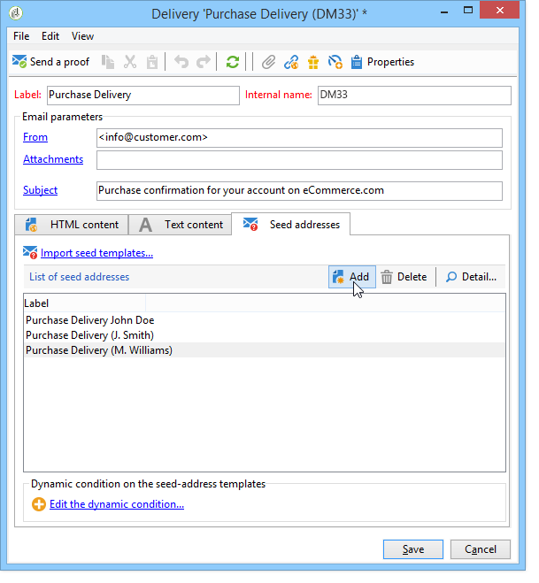

# Managing seed addresses in transactional messages{#managing-seed-addresses-in-transactional-messages}

A seed address lets you display a preview of your message, send a proof, and test message personalization before email or SMS delivery. Seed addresses are linked to the delivery and cannot be used for other deliveries.

## Creating seed addresses {#creating-a-seed-address}

1. In the transactional message template, click the **[!UICONTROL Seed addresses]** tab.

   

1. Assign a label to it for easy selection later.

   

1. Enter the seed address (email or mobile phone depending on the communication channel). 

   

1. Enter the external identifier: this optional field allows you to enter a business key (unique ID, name + email, etc.) that is common to all applications on your website, used to identify your profiles. If this field is also present in the Adobe Campaign marketing database, you can then reconcile an event with a profile in the database.

   

1. Insert test data (refer to [Personalization data](../../message-center/using/personalization-data.md)).

   

   <!--## Creating several seed addresses {#creating-several-seed-addresses}-->
1. Click the **[!UICONTROL Add other seed addresses]** link, then click the **[!UICONTROL Add]** button.

   

   <!--1. Follow the configuration steps for a seed address detailed in the [Creating a seed address](#creating-a-seed-address) section.-->
1. Repeat the process to create as many addresses as you need.

   

Once the addresses are created, you can display their preview and personalization. Refer to [Transactional message preview](../../message-center/using/transactional-message-preview.md).
