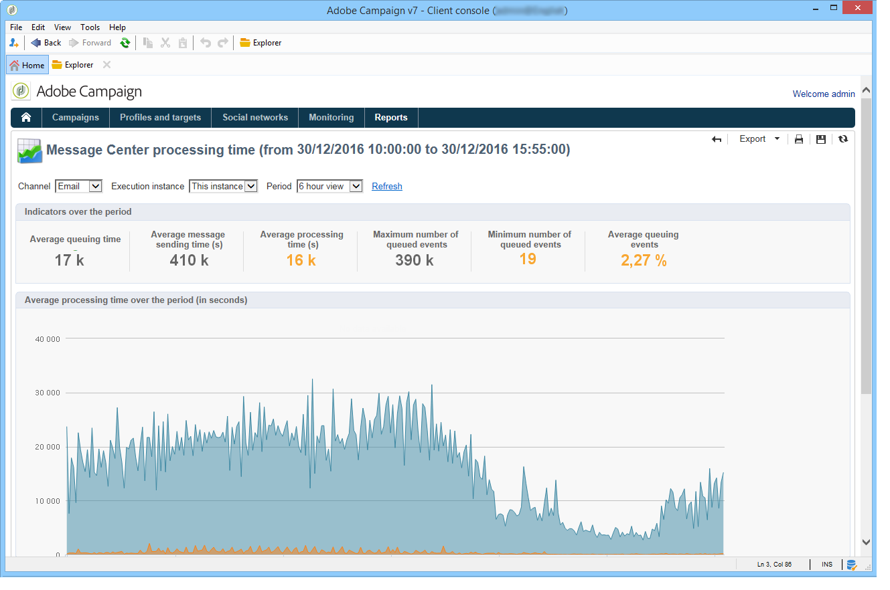

# Message Center processing time{#message-center-processing-time}

This report displays the main indicators related to the real time queue. This report, aimed at technical administrators, can also be accessed via the **[!UICONTROL Monitoring]** tab in the control instance.

Just like for the **[!UICONTROL Message Center service level]** report, you can choose to display the overall statistics or those relative to a particular execution instance. You can also filter the data by channel and over a specific period. The indicators displayed in the **[!UICONTROL Indicators over the period]** section are calculated over the period selected:

* **[!UICONTROL Average queuing time]** : the average time that successfully processed events spent in Message Center. Only the processing time is taken into account.
* **[!UICONTROL Average message sending time (s)]** : the average time that successfully processed events spent in Message Center. Only the mta delivery time is taken into account.
* **[!UICONTROL Average processing time (s)]** : the average time that successfully processed events spent in Message Center. The calculation takes the processing time and the mta sending time into account.
* **[!UICONTROL Maximum number of queued events]** : maximum number of events present in the Message Center queue at any given moment.
* **[!UICONTROL Minimum number of queued events]** : minimum number of events present in the Message Center queue at any given moment.
* **[!UICONTROL Average number of queued events]** : average number of events present in the Message Center queue at any given moment.

>[!NOTE]
>
>The warning (orange) and alert (red) indicator thresholds can be configured in Adobe Campaign deployment wizard. Refer to [Monitoring thresholds](../../message-center/using/monitoring-thresholds.md).
