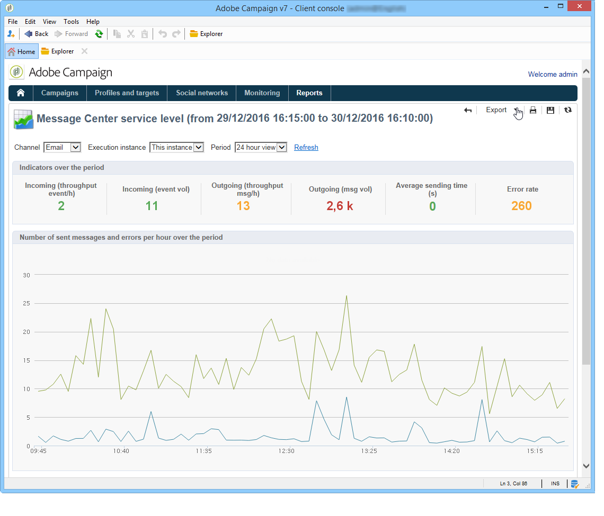

# Message Center service level {#message-center-service-level}

This report displays the delivery statistics related to transactional messages as well as the error breakdown. You can click on an error type to display its details.

This report, aimed at technical administrators, can also be accessed via the **[!UICONTROL Monitoring]** tab on the control instance.

In this report, you can choose to display the overall statistics or those relative to a particular execution instance. You can also filter the data by channel and over a specific period.

The indicators displayed in the **[!UICONTROL Indicators over the period]** section are calculated over the period selected:

* **[!UICONTROL Incoming (throughput event/h)]** : average hourly number of events entered in the Message Center queue.
* **[!UICONTROL Incoming (event vol)]** : number of events entered in the Message Center queue.
* **[!UICONTROL Outgoing (throughput msg/h)]** : average hourly number of successful outgoing Message Center events (sent by a delivery).
* **[!UICONTROL Outgoing (msg vol)]** : number of successful outgoing Message Center events (sent by a delivery).
* **[!UICONTROL Average sending time (seconds)]** : average time spent in Message Center for successfully processed events. The calculation takes the processing time and the mta sending time into account.
* **[!UICONTROL Error rate]** : number of events with errors compared to the number of events that have entered the Message Center queue. The following errors are taken into account: routing error, expired event (event that has been in the queue too long), delivery error, ignored by the delivery (quarantine, etc.).

>[!NOTE]
>
>The warning (orange) and alert (red) indicator thresholds can be configured in the deployment wizard. Refer to [Monitor thresholds](../../message-center/using/additional-configurations.md#monitoring-thresholds).
