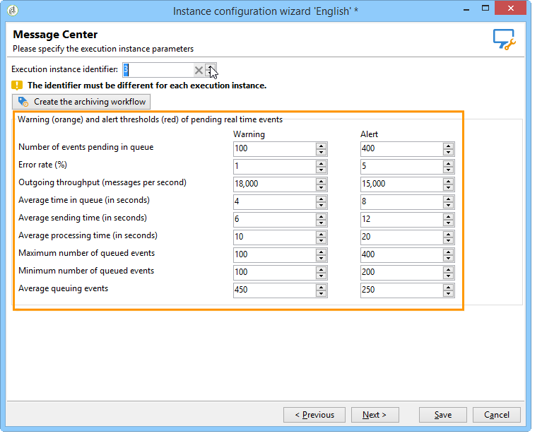

# Monitoring thresholds{#monitoring-thresholds}

You can configure the warning thresholds (orange) and alert thresholds (red) of the indicators that appear in the **Message Center service level** and **Message Center processing time** reports (refer to [About transactional messaging reports](../../message-center/using/about-transactional-messaging-reports.md)). To do this, open the deployment wizard of the execution instance, go to the **[!UICONTROL Message Center]** page and use the arrows to change the thresholds.

>[!NOTE]
>
>The number of events pending in queue is displayed in the [System indicators](../../production/using/monitoring-processes.md#system-indicators) section of the Adobe Campaign process monitoring page. For more information on the deployment wizard, refer to [this section](../../installation/using/deploying-an-instance.md#deployment-wizard).
