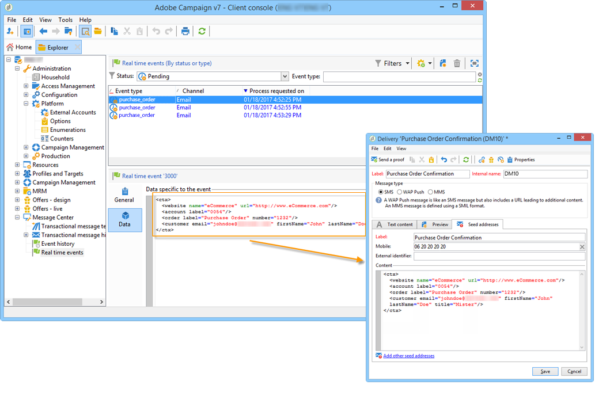

# Personalization data{#personalization-data}

It is possible to use data in the message template to test transactional message personalization. This functionality is used to generate a preview or send a proof. If you install the **Deliverability** module, this data allows you to display a rendering of the messages for various internet access providers (**Inbox rendering**: for more on this, refer to [this section](../../delivery/using/inbox-rendering.md)).

The purpose of this data is to test your messages before their final delivery. These messages do not coincide with actual data to be processed by Message Center. However, the XML structure must be identical to that of the event stored in the execution instance, as shown below. 

This information enables you to personalize message content using personalization tags (for more on this, refer to [Creating message content](../../message-center/using/creating-message-content.md)).

1. In the message template, click the **[!UICONTROL Seed addresses]** tab.
1. In the event content, enter the test information in XML format.

   
