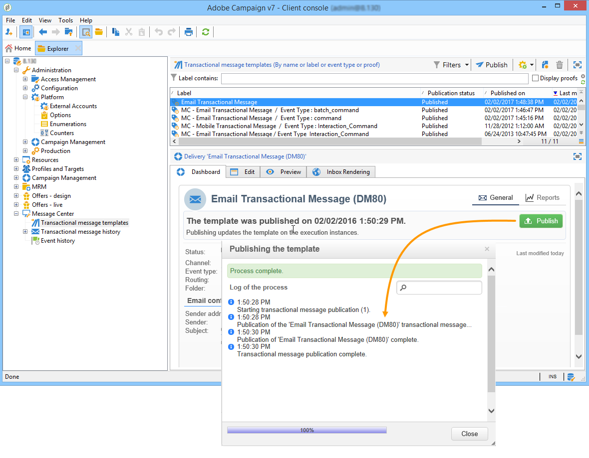
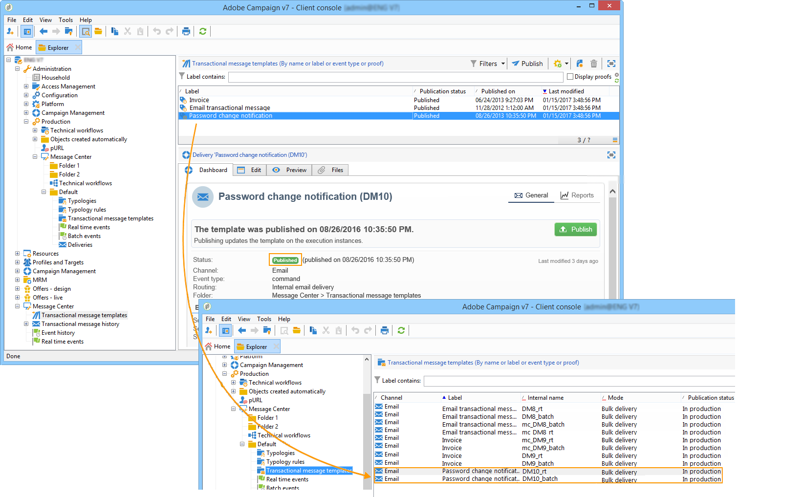

# Publish message templates {#publishing-template-messages}

## Template publication {#template-publication}

When the [message template](../../message-center/using/creating-the-message-template.md) created on the control instance is complete and once you have [tested](../../message-center/using/testing-message-templates.md) it, you can publish it. This process will also publish it on all execution instances.

Publication lets you automatically create **two message templates** on the execution instances, which will allow you to send messages linked to **real-time events** and **batch events**.

>[!NOTE]
>
>When publishing transactional message templates, typology rules are also automatically published on the execution instances.

>[!IMPORTANT]
>
>Whenever you make any changes to a template, make sure you publish it again for these changes to be effective during transactional message delivery.

1. On the control instance, go to the **[!UICONTROL Message Center > Transactional message templates]** folder of the tree.
1. Select the template you want to publish on your execution instances.
1. Click **[!UICONTROL Publish]**.

   

Once publication is complete, both message templates to be applied to batch and real-time type events are created in the tree of the production instance in the **[!UICONTROL Administration > Production > Message Center Execution> Default > Transactional message templates]** folder.

Once a template is published, if the corresponding event is triggered, the execution instance will receive the event, link it to the transactional template and send the corresponding transactional message to each recipient. For more on this, see [Event processing](../../message-center/using/about-event-processing.md).

>[!NOTE]
>
>If you replace an existing field of the transactional message template, such as the sender address, with an empty value, the corresponding field on the execution instance(s) will not be updated once the transactional message is published again. It will still contain the previous value.
>
>However, if you add a non-empty value, the corresponding field will be updated as usual after the next publication.

## Template unpublication {#template-unpublication}

Once a message template is published on the execution instances, it can be unpublished. For more on the template publication process, see [this section](#template-publication).

* Indeed, a published template can still be called if the corresponding event is triggered: if you are no longer using a message template, it is recommended to unpublish it. This is to avoid sending an unwanted transactional message by mistake.

    For example, you published a message template that you only use for Christmas campaigns. You may want to unpublish it after the Christmas period is over, and publish it again next year.

* Also, you cannot delete a transactional message template that has the **[!UICONTROL Published]** status. You must unpublish it first.

>[!NOTE]
>
>This capability is available starting Campaign 20.2 release.

To unpublish a transactional message template, follow the steps below.

1. On the control instance, go to the **[!UICONTROL Message Center > Transactional message templates]** folder of the tree.
1. Select the template you want to unpublish.
1. Click **[!UICONTROL Unpublish]**.

    <!--1. Fill in the **[!UICONTROL Log of the process]** field.-->

1. Click **[!UICONTROL Start]**.

The transactional message template status changes back from **[!UICONTROL Published]** to **[!UICONTROL Being edited]**.

Once unpublication is complete:

* Both message templates (applied to batch and real-time type events) are deleted from each execution instance.

    They no longer appear in the **[!UICONTROL Administration > Production > Message Center Execution > Default > Transactional message templates]** folder (see [this section](#template-publication)).

* Once a template is unpublished, you can delete it from the control instance.

    To do so, select it from the list and click the **[!UICONTROL Delete]** button on top right of the screen.
