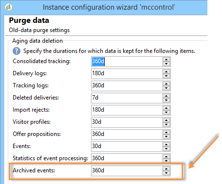
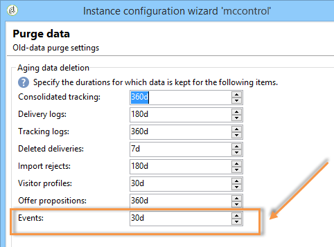

# Purging events{#purging-events}

You can use the [deployment wizard](../../production/using/database-cleanup-workflow.md#deployment-wizard) to configure how long the data is to be stored in the database.

Event purging is carried out automatically by the [Database cleanup workflow](../../production/using/database-cleanup-workflow.md). This workflow purges the events received and stored on the execution instances and events archived on a control instance.

Use the arrows as appropriate to change the purge settings.

Event purge settings on a control instance:

Event purge settings on an execution instance:

For more on the database cleanup workflow, refer to [this section](../../production/using/database-cleanup-workflow.md).
