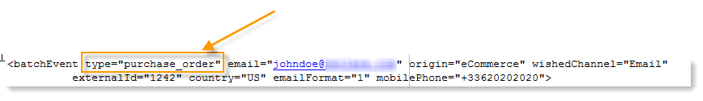
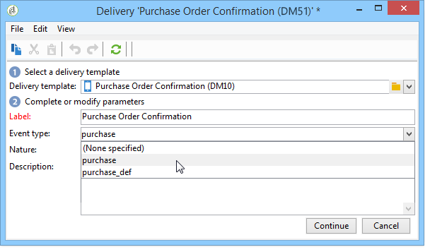

# Routing towards a template{#routing-towards-a-template}

Once the message template is published on the execution instance(s), two templates to be linked to a real time or a batch event are automatically generated. The routing step consists of linking an event to the appropriate message template. Linking is based on the event type specified in the properties of the event itself and those of the template.

Definition of the event type in the event properties:

Definition of the event type in the message template properties:

By default, routing is based on the following information:

* The event type
* The channel to be used (by default: email)
* The most recent delivery template, based on the publication date
