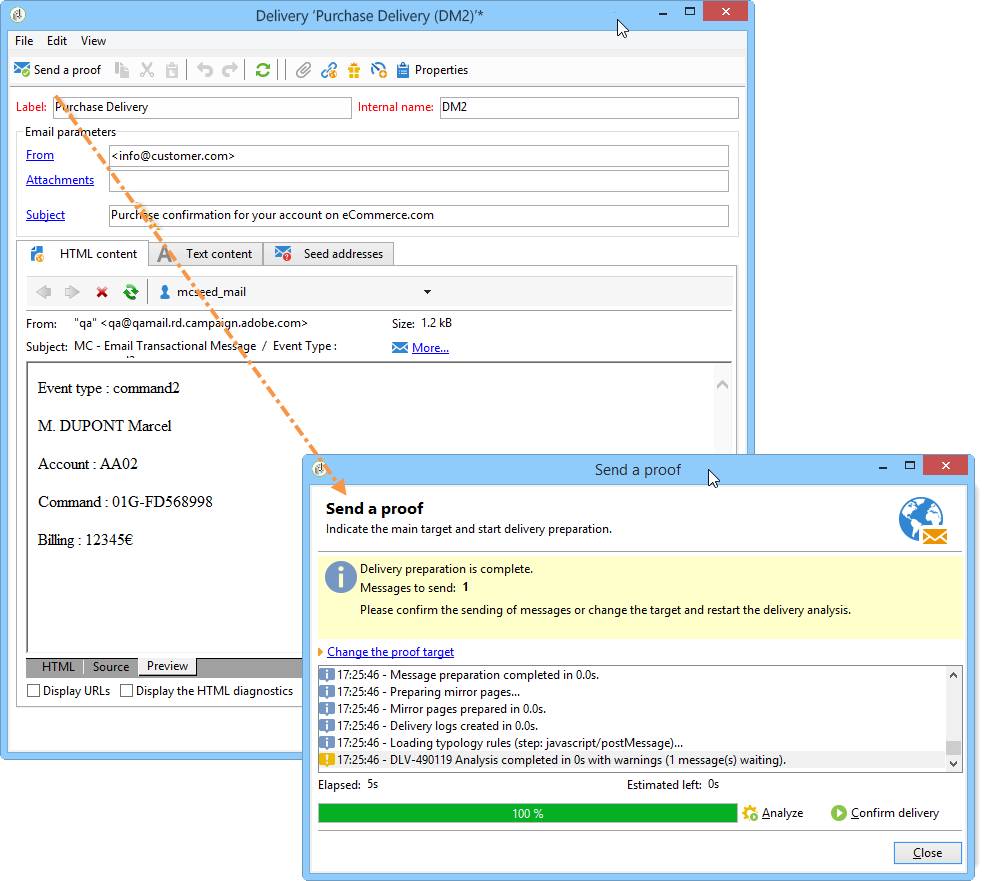
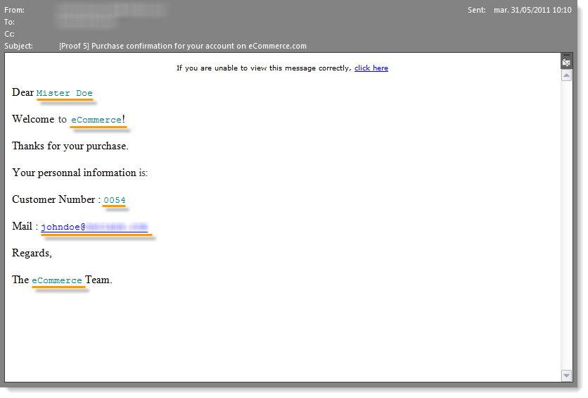
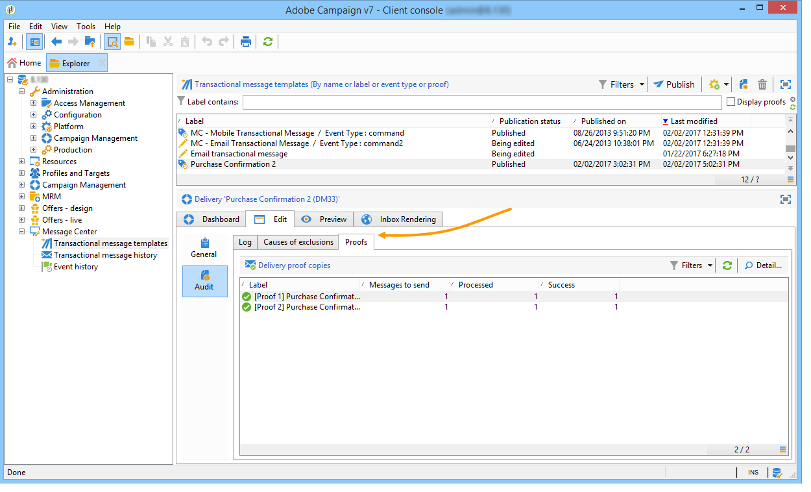

# Sending a proof{#sending-a-proof}

You can test message delivery by sending a proof to a previously created seed address.

Sending a proof involves the same process as for a regular delivery (for more on this, refer to [this section](../../delivery/using/steps-validating-the-delivery.md#sending-a-proof)). However, to send a proof within Message Center you need to carry out the following operations beforehand:

* Create one or more seed addresses (refer to [Managing seed addresses in transactional messages](../../message-center/using/managing-seed-addresses-in-transactional-messages.md)) with test data (refer to [Personalization data](../../message-center/using/personalization-data.md)).
* Create the message content (refer to [Creating message content](../../message-center/using/creating-message-content.md)).

To send the proof:

1. Click the **[!UICONTROL Send a proof]** button in the delivery window.
1. Analyze the delivery.
1. Correct any errors and confirm the delivery.

   

1. Check that the message was delivered to the seed address and that its content complies with your configuration.

   

Proofs can be accessed in each template via the **[!UICONTROL Audit]** tab.

