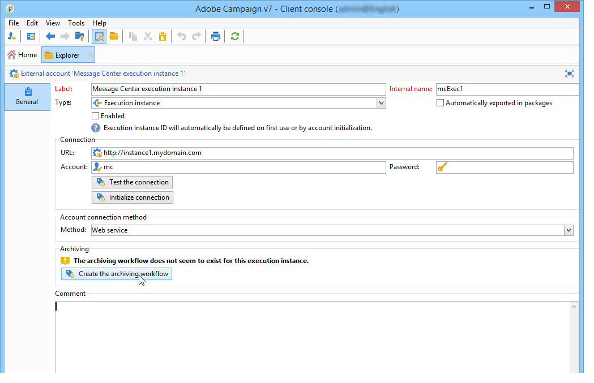
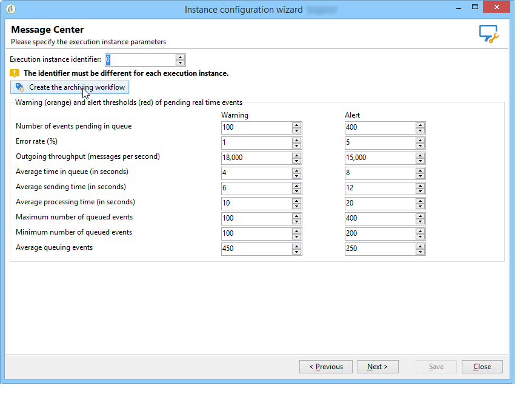

# Technical workflows{#technical-workflows}

You must ensure that the technical workflows on the control instance and the different execution instances have indeed been created and started before deploying any transactional message templates.

The various technical workflows related to transactional messaging (Message Center) are broken down between the control instance and the execution instance(s).

## Control instance workflows {#control-instance-workflows}

On the control instance, whether you have one or several execution instances registered, you must create one archiving workflow for each **[!UICONTROL Message Center execution instance]** external account. Click the **[!UICONTROL Create the archiving workflow]** button to create and start the workflow.

These workflows can then be accessed from the **Administration > Production > Message Center** folder. Once created, the archiving workflows are automatically started.

<!--**Minimal architecture**

Once the control and execution modules are installed on the same instance, you must create the archiving workflow using the deployment wizard. Click the **[!UICONTROL Create the archiving workflow]** button to create and start the workflow.

-->

## Execution instance workflows {#execution-instance-workflows}

On the execution instance(s), the technical workflows for transactional messaging can be accessed from the **Administration > Production > Message Center** folder. You just have to start them. The workflows in the list are:

* **[!UICONTROL Processing batch events]** (internal name: **[!UICONTROL batchEventsProcessing]** ): this workflow lets you break down batch events in a queue before they are linked to a message template.
* **[!UICONTROL Processing real time events]** (internal name: **[!UICONTROL rtEventsProcessing]** ): this workflow lets you break down real time events in a queue before they are linked to a message template.
* **[!UICONTROL Update event status]** (internal name: **[!UICONTROL updateEventStatus]** ): this workflow lets you attribute a status to the event.

  The following event statuses are available:

    * **[!UICONTROL Pending]** : the event is in the queue. No message template has been assigned to it yet.
    * **[!UICONTROL Pending delivery]** : the event is in the queue, a message template has been assigned to it and it is being processed by the delivery.
    * **[!UICONTROL Sent]** : this status is copied from the delivery logs. It means that the delivery has been sent.
    * **[!UICONTROL Ignored by the delivery]** : this status is copied from the delivery logs. It means that the delivery was ignored.
    * **[!UICONTROL Delivery failed]** : this status is copied from the delivery logs. It means that the delivery failed.
    * **[!UICONTROL Event not taken into account]** : the event could not be linked to a message template. The event will not be processed.
