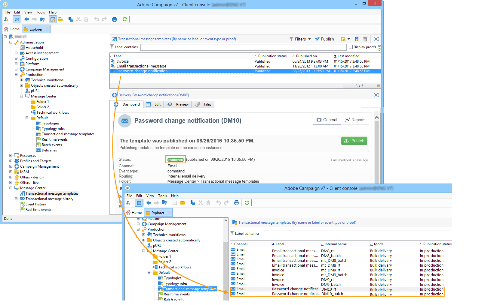

# Template publication{#template-publication}

Once the message template created on the control instance is complete, you can publish it. This process will also publish it on all execution instances.

Once a template is published, when the corresponding event is triggered, the execution instance will receive the event, link it to the transactional template and send a transactional message to each recipient.

Publication lets you automatically create two message templates on the execution instance which will allow you to send messages linked to real-time and batch events.

>[!IMPORTANT]
>
>Remember to publish the template whenever you make any changes to it in order for these changes to be effective during transactional message delivery.

>[!NOTE]
>
>When publishing transactional message templates, typology rules are automatically published on the execution instances.

1. In the control instance, go to the **[!UICONTROL Message Center > Transactional message templates]** folder of the tree.
1. Select the template you want to publish on your execution instances.
1. Click **[!UICONTROL Publish]**.

   

Once publication is complete, both message templates to be applied to batch and real-time type events are created in the tree of the production instance in the **[!UICONTROL Administration > Production > Message Center Execution> Default > Transactional message templates]** folder.

>[!NOTE]
>
>If you replace an existing field of the transactional message template, such as the sender address, with an empty value, the corresponding field on the execution instance(s) will not be updated once the transactional message is published again. It will still contain the previous value. However, if you add a non-empty value, the corresponding field will be updated as usual after the next publication.
