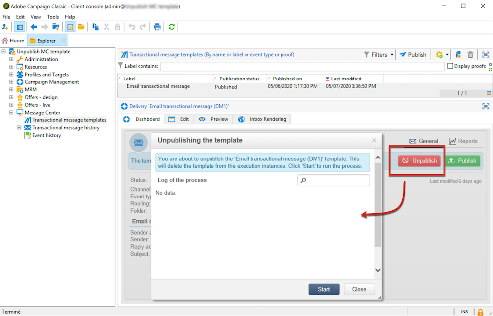

# Template unpublication{#template-unpublication}

Once a message template is published on the execution instances, it can be unpublished. For more on the template publication process, see [this section](../../message-center/using/template-publication.md).

* Indeed, a published template can still be called if the corresponding event is triggered: if you are no longer using a message template, it is recommended to unpublish it. This is to avoid sending an unwanted transactional message by mistake.

    For example, you published a message template that you only use for Christmas campaigns. You may want to unpublish it after the Christmas period is over, and publish it again next year.

* Also, you cannot delete a transactional message template that has the **[!UICONTROL Published]** status. You must unpublish it first.

>[!NOTE]
>
>This capability is available starting Campaign 20.2 release.

To unpublish a transactional message template, follow the steps below.

1. On the control instance, go to the **[!UICONTROL Message Center > Transactional message templates]** folder of the tree.
1. Select the template you want to unpublish.
1. Click **[!UICONTROL Unpublish]**.

    <!--1. Fill in the **[!UICONTROL Log of the process]** field.-->

1. Click **[!UICONTROL Start]**.

The transactional message template status changes back from **[!UICONTROL Published]** to **[!UICONTROL Being edited]**.

Once unpublication is complete:

* Both message templates (applied to batch and real-time type events) are deleted from each execution instance.

    They no longer appear in the **[!UICONTROL Administration > Production > Message Center Execution > Default > Transactional message templates]** folder (see [this section](../../message-center/using/template-publication.md)).

* Once a template is unpublished, you can delete it from the control instance.

    To do so, select it from the list and click the **[!UICONTROL Delete]** button on top right of the screen.
