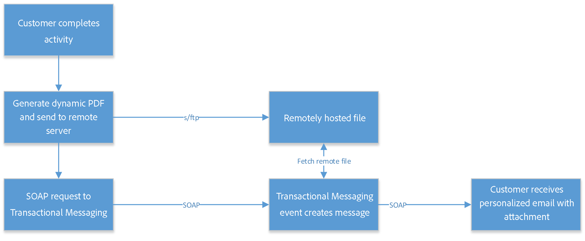
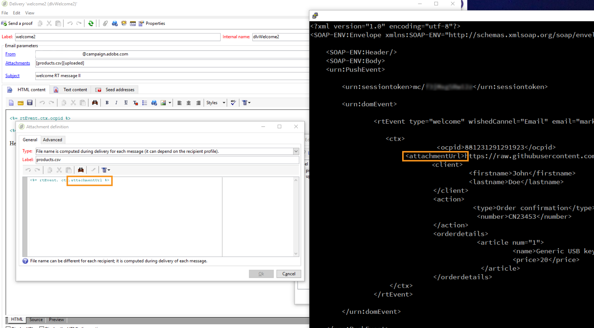

# Use case: Send transactional emails with attachments {#transactional-email-with-attachments}

The purpose of this use case is to add email attachments on the fly to outbound dispatches.

## Key steps {#key-steps}

In this scenario, you will learn how to send transactional emails with individual and/or personalized attachments. The attachments will not be pre-uploaded on the Transactional messaging server: instead they will be generated on the fly.

When you capture customer interactions or details, you may need to send this information back to the customer at the end of the process, for example in a PDF file attached to an email.

Below are the main steps of this scenario:

1. The customer enters the website, finds a product that they want to purchase.
1. The customer selects the product and customizes some options.
1. The customer completes the transaction.
1. An email is sent to the customer confirming the transaction. Because it is not recommended to send PII (Personally Identifiable Information) out in the email, a secure PDF is generated and attached to the email.
1. The customer receives the email and its attachment containing the relevant data.

In this scenario, the attachments are not pre-created, but added on the fly to the outbound emails, which offers the following benefits:

* This allows you to personalize the content of the attachment.
* If the attachment is associated with a transaction (as in the example scenario described above), it may contain dynamic data that is generated during the customer process.
* Attaching PDF files optimizes security as you can encrypt them and send them over HTTPS.

>[!NOTE]
>
>To avoid performance issue, if you include images downloaded on the fly from a personalized URL as attachment, each image size should not exceed 100,000 bytes by default. This recommended threshold can be configured from [the list of Campaign Classic options](../../installation/using/configuring-campaign-options.md#delivery).

## Recommendations {#important-notes}

Before implementing this scenario, read carefully the guidelines below:

* The Transactional messaging instances should not be used to store, export, or upload files or data. They can only be used for event data and related information. They should not be considered as a file storage system.
* Since there is no direct access to the Transactional messaging instances or servers outside of Adobe, there is no standard way to push such files on these servers (no FTP access). 
* It is not contractually correct to use the disk space on the Transactional messaging instances to store files of any sort, not even for attachments.
* You need to use another online disk system to host these files. You need an FTP access to this system and you must be able to write and delete files.

>[!NOTE]
>
>To avoid performance issue, it is recommended not to include more than one attachment per email. The recommended threshold can be configured from [the list of Campaign Classic options](../../installation/using/configuring-campaign-options.md#delivery).

## Implementation {#implementation}

The diagram below shows the different steps when implementing this scenario:



To add an email attachment on the fly to a transactional message, follow the steps below:

1. Start by designing your attachment. For more on this, see [this section](../../delivery/using/attaching-files.md#attach-a-personalized-file).
    
    This allows you to have the files attached to an email, even if they are not hosted on the execution instance.

1. You can send emails via a SOAP message trigger. In the SOAP call, there is a URL parameter (attachmentURL).

    For more information on SOAP requests, see [Event description](../../message-center/using/event-description.md).

1. When designing your email, click **[!UICONTROL Attachment]**.

1. In the **[!UICONTROL Attachment definition]** screen, enter the SOAP attachment parameter:

    ```
    <%= rtEvent.ctx.attachementUrl %>
    ```

1. When the message is processed, the system will get the file from the remote location (third-party server) and attach it to the individual message.

    Since this parameter can be a variable, it should accept the fully formed remote URL variable of your file, sent via the SOAP call.

    
