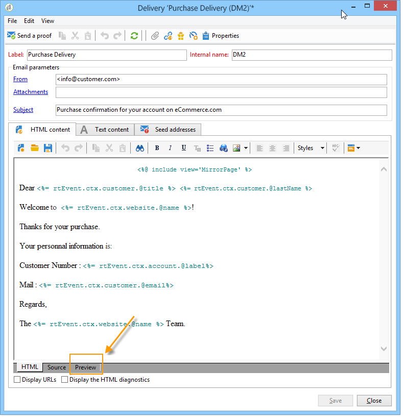
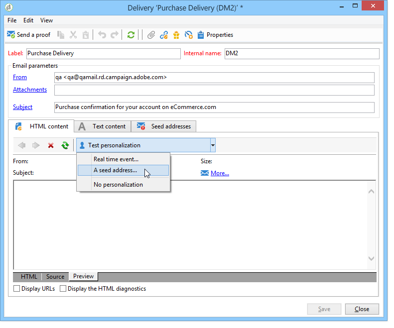
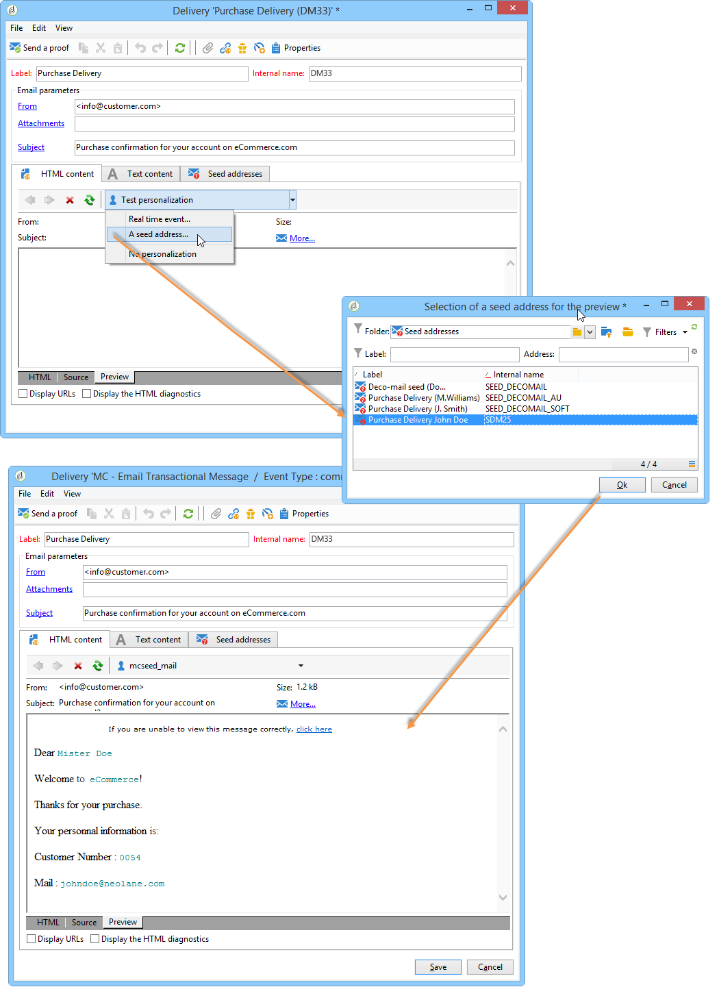

# Transactional message preview{#transactional-message-preview}

Once you have created one or more seed addresses and the message body, you can preview the message and check its personalization.

1. In the message template, click the **[!UICONTROL Preview]** tab.

   

1. Select **[!UICONTROL A seed address]** in the drop-down list.

   

1. Select the seed address created previously to display the personalized message.

   
