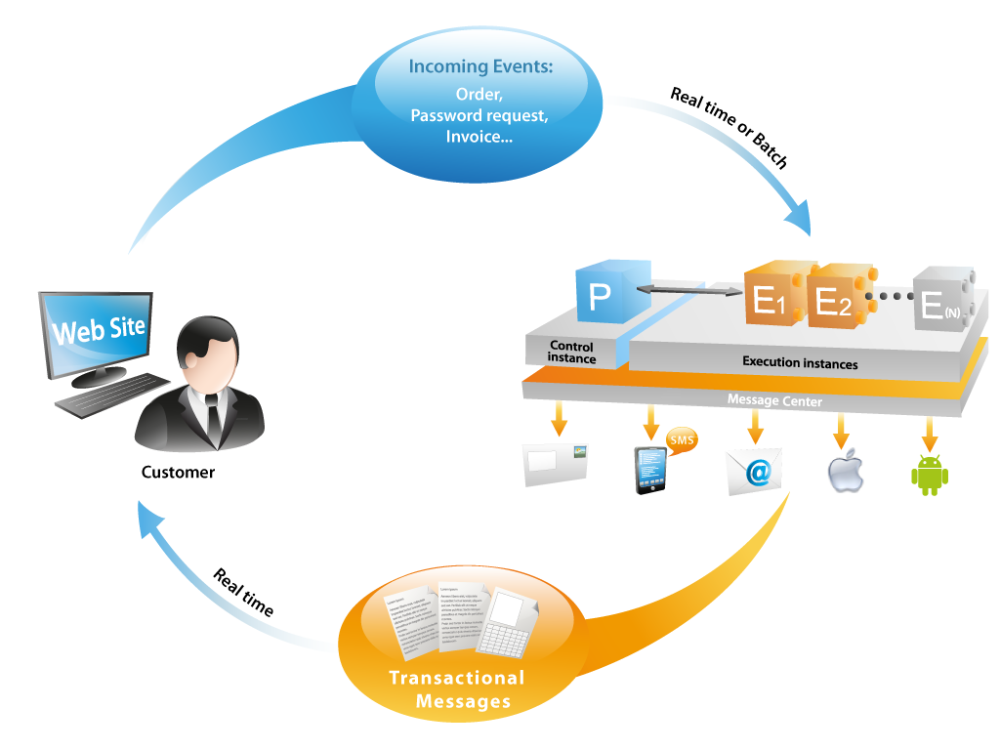
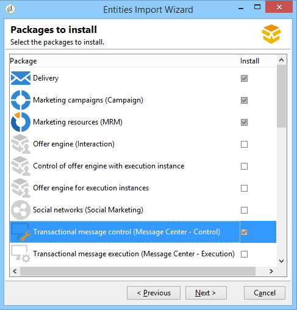
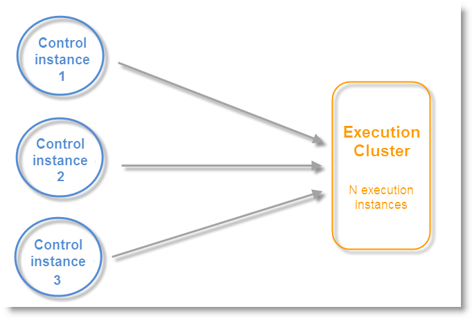
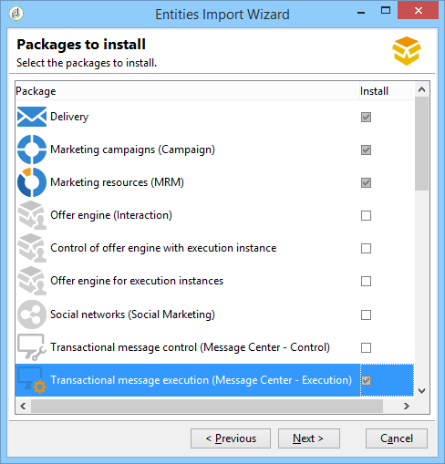
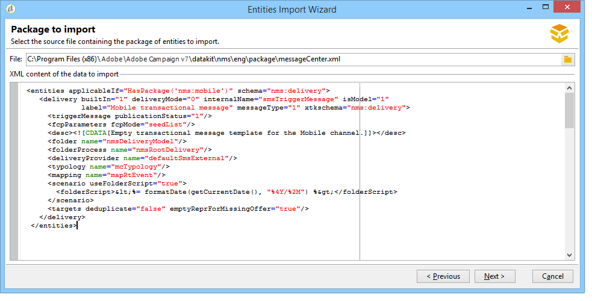
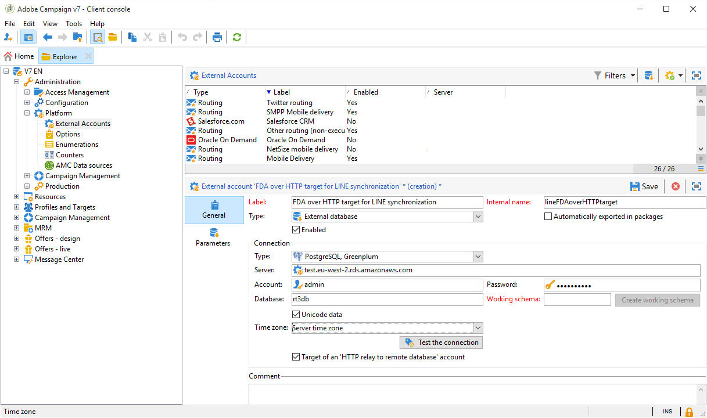
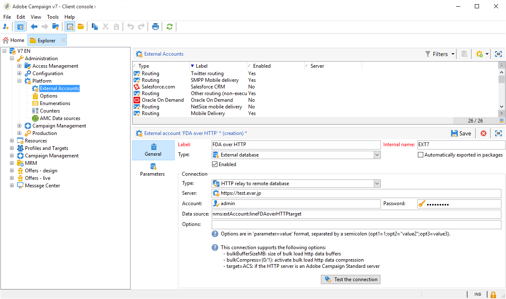
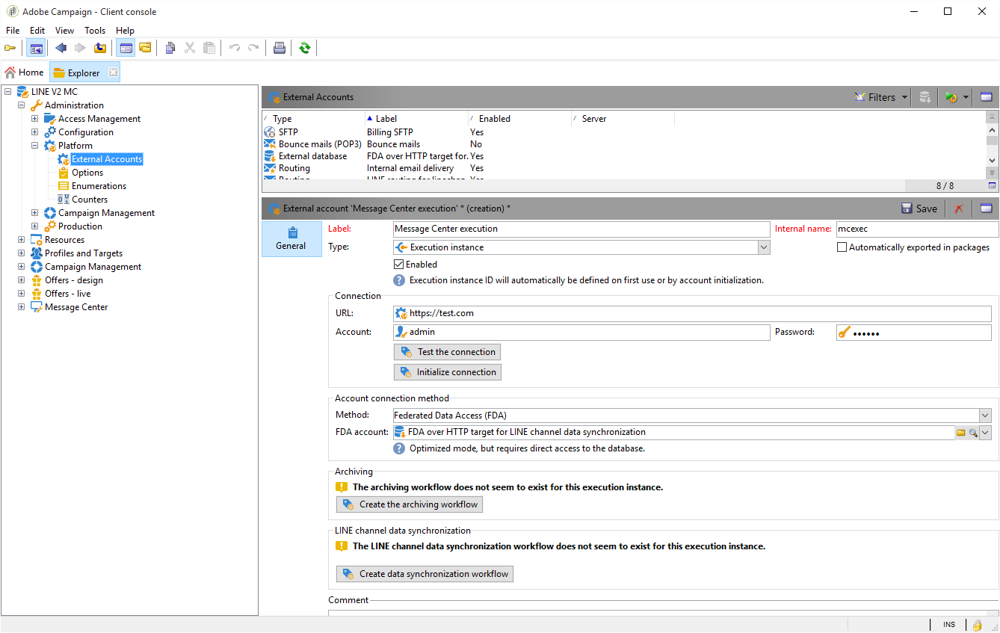

# Transactional messaging architecture {#transactional-messaging-architecture}

Transactional messaging relies on a specific architecture, which is made up of several instances:

* A **control instance**, on which the message templates are created.

* One or more **execution instances**, which receive events and deliver messages.



| Control instance | Execution instance |
|--- |--- |
| Adobe Campaign users log on to the control instance to: <ul><li>Create transactional message templates</li><li>Generate the message preview using a seed list</li><li>Display reports</li><li>Monitor the execution instances</li></ul> | Execution instances are here to: <ul><li>Receive events</li><li>Link them to transactional message templates</li><li>Send a personalized message to each recipient</li></ul> |

## Install instances {#installing-instances}

There are several precautions to take when installing the Transactional message packages. Adobe recommends you to work in a test environment before putting into production. You also need to have a compatible Adobe Campaign license. For more information, please contact your Adobe account executive.

>[!IMPORTANT]
>
>The control instance and the execution instance(s) must be installed on different machines. They cannot share the same Campaign instance.

If you need to use several channels, you must install and configure related packages before installing Transactional message packages. For more on this, see [Add a delivery channel](#adding-a-delivery-channel).

## Control instance {#control-instance}

To install the control instance on your machine, select the **[!UICONTROL Transactional message control]** package via the **[!UICONTROL Tools]** > **[!UICONTROL Advanced]** > **[!UICONTROL Import package]** menu. For more on this, see [Installing Campaign Classic standard packages](../../installation/using/installing-campaign-standard-packages.md).



The detailed steps to configure the control instance are presented in [this section](../../message-center/using/configuring-instances.md#control-instance).

### Support several control instances {#supporting-several-control-instances}

>[!IMPORTANT]
>
>Sharing an execution cluster with several control instances is only supported for on-premise environments.

It is possible to share an execution cluster among several control instances. For example, if you manage several specialized stores, you can configure one control instance per brand and link them all to the same execution cluster.



>[!NOTE]
>
>For more on the necessary configuration, refer to [Use several control instances](../../message-center/using/configuring-instances.md#using-several-control-instances).

## Execution instance {#execution-instance}

To install an execution instance on your machine, select the **[!UICONTROL Transactional message execution]** package via the **[!UICONTROL Tools]** > **[!UICONTROL Advanced]** > **[!UICONTROL Import package]** menu. For more on this, see [Installing Campaign Classic standard packages](../../installation/using/installing-campaign-standard-packages.md).



The detailed steps to configure an execution instance are presented in [this section](../../message-center/using/configuring-instances.md#execution-instance).

## Available delivery channels

The email channel is available by default. To deliver your transactional messages on multiple channels, you can add other channels (mobile channel, Mobile App channel, etc.).

>[!IMPORTANT]
>
>Adding a delivery channel (mobile channel, Mobile App channel, etc.) must be performed before installing the Transactional message package.

### Add a delivery channel {#adding-a-delivery-channel}

Adobe recommends you **always add the delivery channel package before installing the Transactional message package**.

However, if you have started a transactional messaging project on the email channel, then decide during the project to add a new channel, you can follow the steps below.

>[!NOTE]
>
>This procedure only applies to customers using a Windows NLServer installed on the same machine as they are working on.

1. Install the channel you need, for example the **Mobile channel**, using the package import wizard (**[!UICONTROL Tools > Advanced > Import package... > Adobe Campaign Package]**).
1. Perform a file import (**[!UICONTROL Tools > Advanced > Import package... > File]**), and select the **datakitnms**`[Your language]`**packagemessageCenter.xml** file.
1. In the **[!UICONTROL XML content of the data to import]**, keep only the delivery template that corresponds to the added channel. For example, if you have added the **Mobile channel**, keep only the **entities** element that corresponds to the **[!UICONTROL Mobile transactional message]** (smsTriggerMessage). If you have added the **Mobile App Channel**, keep only the **iOS transactional message** (iosTriggerMessage) and the **Android transactional message** (androidTriggerMessage).

   

<!--## Transactional messages and inbound Interaction {#transactional-messages-and-inbound-interaction}

When combined with the Inbound Interaction module, transactional messaging enables you to insert a marketing offer dedicated to the recipient into the message.

>[!NOTE]
>
>The Interaction module is detailed in [Interaction](../../interaction/using/interaction-and-offer-management.md).

To use transactional messaging with Interaction, you need to apply the following configurations:

* Install the **Interaction** package onto the control instance and configure your offer catalog.

  >[!IMPORTANT]
  >
  >Do not replicate the offers onto the execution instances.

* The event must include an identifier linked to the recipients, for personalizing offers. The **@externalId** attribute must contain the value of this identifier. **Interaction** is configured by default to identify the recipient of the primary key:

  ```
  <rtEvent type="order_confirmation" email="john.doe@adobe.com" externalId="1242"> 
  ```

  You can configure **Interaction** so that identification takes place in the field of your choice, for example on the email address:

  ```
  <rtEvent type="order_confirmation" email="john.doe@adobe.com" externalId="john.doe@yahoo.com"> 
  ```

Create your delivery templates the way you would for an email campaign:

* Add the offer to your transactional message template.
* Check the preview, send a proof and publish the template.

You also have to enable the unitary mode on your offer spaces. For more on this, refer to [this section](../../interaction/using/creating-offer-spaces.md).-->

### Transactional push notifications {#transactional-messaging-and-push-notifications}

When combined with Mobile App channel module, transactional messaging enables you to push transactional messages through notifications on mobile devices.

>[!NOTE]
>
>The Mobile App channel is detailed in [this section](../../delivery/using/about-mobile-app-channel.md).

To use transactional message modules with Mobile App Channel, you need to apply the following configurations:

1. Install the **Mobile App Channel** package onto the control and execution instances.
1. Replicate the **Mobile application** type Adobe Campaign service as well as the mobile applications that it contains on the execution instances.

The event must contain the following elements:

* The mobile device ID (**registrationId** for Android and **deviceToken** for iOS). This ID represents the "address" that the notification will be sent to. 
* The link to the mobile application or integration key (**uuid**) which lets you recover connection information specific to the application.
* The channel to which the notification will be sent (**wishedChannel**): 41 for iOS and 42 for Android
* All data useful for personalization

Here is an example of an event that contains this information:

```
<SOAP-ENV:Envelope xmlns:xsd="http://www.w3.org/2001/XMLSchema" xmlns:xsi="http://www.w3.org/2001/XMLSchema-instance" xmlns:SOAP-ENV="http://schemas.xmlsoap.org/soap/envelope/">
   <SOAP-ENV:Body>
     <urn:PushEvent>
         <urn:sessiontoken>mc/</urn:sessiontoken>
         <urn:domEvent>

              <rtEvent wishedChannel="41" type="DELIVERY" registrationToken="2cefnefzef758398493srefzefkzq483974">
                <mobileApp _operation=”none” uuid="com.adobe.NeoMiles"/>
                <ctx>
                    <deliveryTime>1:30 PM</deliveryTime>
                    <url>http://www.adobe.com</url>
                </ctx>
              </rtEvent>

         </urn:domEvent>
     </urn:PushEvent>           
   </SOAP-ENV:Body>
</SOAP-ENV:Envelope>
```

>[!NOTE]
>
>The creation of message templates remains the same.

### Transactional messaging and LINE {#transactional-messaging-and-line}

Combined with LINE Channel, transactional messages allow you to send real time messages on the LINE app installed in consumer mobile devices. This is used to send the Welcome message when a LINE user adds the brand's page.

To use transactional message module with LINE, the following elements are needed for the configuration on your **marketing** instance and your **execution** instance:

* Install the **[!UICONTROL LINE Connect]** package on both instances.
* Install the **[!UICONTROL Transactional message control]** package on your marketing instance, and the **[!UICONTROL Transactional message execution]** package on the execution instance.
* Create a LINE **external account** and **service** on both instances with identical naming for them to be synchronized. For more information on how to create a LINE external account and service, refer to [this section](../../delivery/using/line-channel.md#setting-up-line-channel).

Then, from the **[!UICONTROL Explorer]** , in **[!UICONTROL Platform]** > **[!UICONTROL External account]** , you need to configure different external accounts on both instances:

1. Create an **[!UICONTROL External database]** external account in your **execution** instance with the following configuration:

   

    * **[!UICONTROL Label]** and **[!UICONTROL Internal name]** : name your external account as needed.
    * **[!UICONTROL Type]** : select **[!UICONTROL External database]** .
    * **[!UICONTROL Enabled]** box must be checked.

   From the **[!UICONTROL Connection]** category:

    * **[!UICONTROL Type]** : select your database server e.g. PostgresSQL.
    * **[!UICONTROL Server]** : enter your database server URL.
    * **[!UICONTROL Account]** : enter your database account.

      >[!NOTE]
      >
      >The database user needs to have read rights on the following tables for FDA connection: XtkOption, NmsVisitor, NmsVisitorSub, NmsService, NmsBroadLogRtEvent, NmsBroadLogBatchEvent, NmsTrackingLogRtEvent, NmsTrackingLogBatchEvent, NmsRtEvent, NmsBatchEvent, NmsBroadLogMsg, NmsTrackingUrl, NmsDelivery, NmsWebTrackingLogXtkFolder.

    * **[!UICONTROL Password]** : enter the password for your database account.
    * **[!UICONTROL Database]** : enter the database name of the execution instance.
    * **[!UICONTROL Target of an HTTP relay to remote database's account]** box must be checked.

1. Create an **[!UICONTROL External Database]** account in your **marketing** instance with the following configuration.

   

    * **[!UICONTROL Label]** and **[!UICONTROL Internal name]** : name your external account as needed.
    * **[!UICONTROL Type]** : select **[!UICONTROL External database]** .
    * Enabled box must be checked.

   From the **[!UICONTROL Connection]** category:

    * **[!UICONTROL Type]** : select **[!UICONTROL HTTP relay to remote Database]** .
    * **[!UICONTROL Server]** : enter your campaign's server URL of the execution instance.
    * **[!UICONTROL Account]** : enter the account used to access your execution instance.
    * **[!UICONTROL Password]** : enter the password for the account used to access your execution instance.
    * **[!UICONTROL Data Source]** : enter the following syntax **[!UICONTROL nms:extAccount:ID of your external database account in the execution instance]** .

1. Create an **[!UICONTROL Execution instance]** external account in your **marketing** instance using the following configuration to create the data synchronization workflow:

   

    * **[!UICONTROL Label]** and **[!UICONTROL Internal name]** : name your external account as needed.
    * **[!UICONTROL Type]** : select **[!UICONTROL Execution instance]** .
    * Enabled box must be checked.

   From the **[!UICONTROL Connection]** category:

    * **[!UICONTROL URL]** : enter your execution instance's URL.
    * **[!UICONTROL Account]** : enter your account used to access your execution instance.
    * **[!UICONTROL Password]** : enter the password for the account used to access your execution instance.

   From the **[!UICONTROL Account connection method]** category:

    * **[!UICONTROL Method]** : select **[!UICONTROL Federated Data Access (FDA)]** .
    * **[!UICONTROL FDA account]** : select your FDA account from the drop-down.
    * Click the **[!UICONTROL Create the archiving workflow]** button.
    * Click the **[!UICONTROL Create data synchronization workflow]** button to create the LINE data sync workflow.

1. You can now start [creating transactional messages](../../message-center/using/creating-the-message-template.md).
