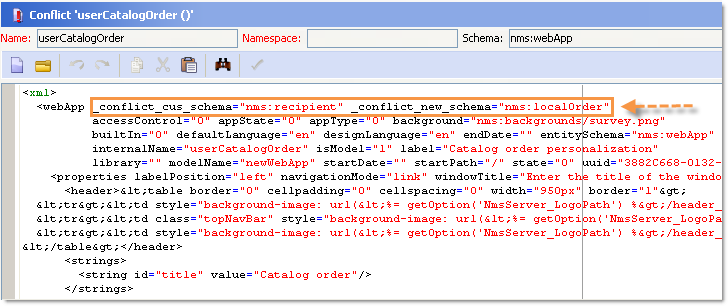
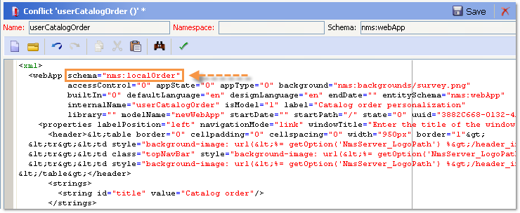
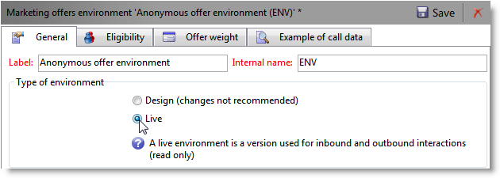
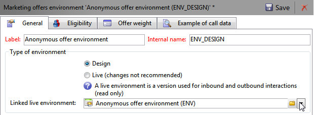
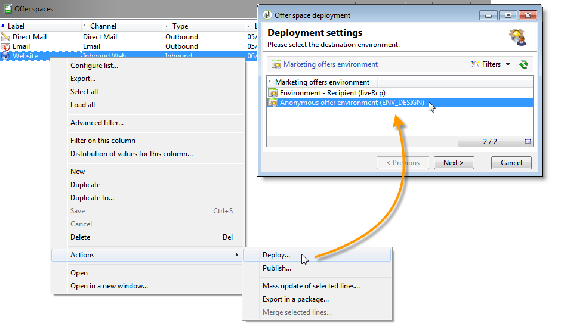
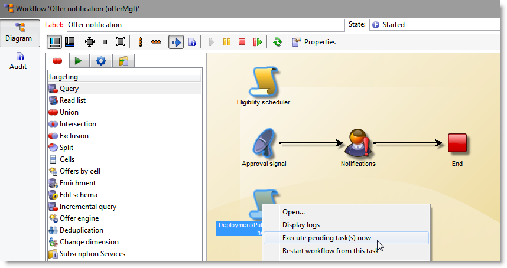
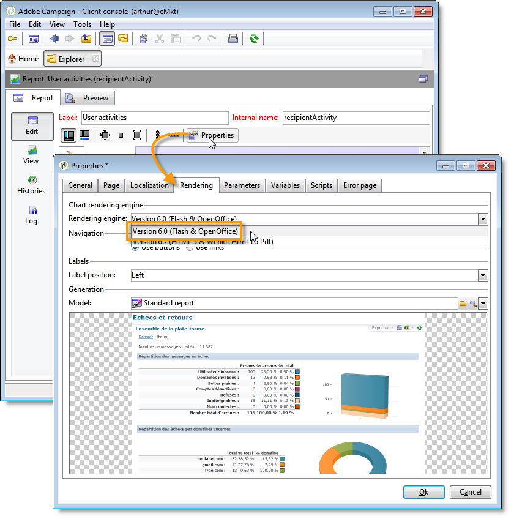

# General configurations{#general-configurations}

This section details the configuration to be carried out in Adobe Campaign v7 if you're migrating from a v5.11 or a v6.02.

In addition:

* If you migrate from v5.11, you must also complete the configuration detailed in the [Specific configurations in v5.11](../../migration/using/specific-configurations-in-v5-11.md) section.
* If you migrate from v6.02, you must also complete the configuration detailed in the [Specific configurations in v6.02](../../migration/using/specific-configurations-in-v6-02.md) section.

## Time zones {#time-zones}

### Multi time zone mode {#multi-time-zone-mode}

In v6.02, the "multi time zone" mode was only available for PostgreSQL database engines. It is now offered no matter what type of database engine is used. We strongly recommend that you transform your base to a "multi timezone" base.

To use the TIMESTAMP WITH TIMEZONE mode, you also need to add the **-userTimestamptz:1** option to the postupgrade command line.

>[!IMPORTANT]
>
>If the **-usetimestamptz:1** parameter is used with an incompatible database engine, your database will be corrupted and you will have to restore a backup of your database and re-execute the command above.

>[!NOTE]
>
>It is possible to alter the timezone after migration via the console (**[!UICONTROL Administration > Platform > Options > WdbcTimeZone]** node).
>
>For more on time zone management, refer to [this section](../../installation/using/time-zone-management.md).

### Oracle {#oracle}

If you get an **ORA 01805** error during postupgrade, this means that the Oracle timezone files between the application server and the database server are out of sync. To re-synchronize them, apply the following steps:

1. To identify the time zone file used, run the following command:

   ```
   select * from v$timezone_file
   ```

   Time zone files are usually found in the **ORACLE_HOME/oracore/zoneinfo/** folder.

1. Make sure the time zone files are identical on both servers.

For more information, visit: [https://docs.oracle.com/cd/E11882_01/server.112/e10729/ch4datetime.htm#NLSPG004](https://docs.oracle.com/cd/E11882_01/server.112/e10729/ch4datetime.htm#NLSPG004).

A time zone misalignment between client and server can also cause some lags. That is why we recommend using the same version of Oracle library on the client and server sides, both time zones must be the same.

To check if both sides are on the same time zones:

1. Check the version of the time zone file on the client side by running the following command:

   ```
   genezi -v
   ```

   genezi is a binary found in **$ORACLE_HOME/bin** repository.

1. Check the version of the time zone file on the server side by running the following command:

   ```
   select * from v$timezone_file
   ```

1. To change the time zone file on the client side, use the **ORA_TZFILE** environment variable.

## Security {#security}

### Security zones {#security-zones}

>[!IMPORTANT]
>
>For security reasons, the Adobe Campaign platform is no longer accessible by default: you must configure the security zones, and therefore collect operator IP addresses.

Adobe Campaign v7 involves the concept of **security zones**. Each user must be associated with a zone in order to log on to an instance and the user's IP address must be included in the addresses or address ranges defined in the security zone. Configuring the security zones can be done in the Adobe Campaign server configuration file. The security zone to which a user is associated must be defined in the console (**[!UICONTROL Administration > Access management > Operators]**).

**Before the migration**, ask your network administrator to help you define the security zones to be activated after the migration.

**After the postupgrade** (before the server restart), you must configure the security zones.

Security zone configuration is found in [this section](../../installation/using/security-zones.md).

### User passwords {#user-passwords}

In v7, **internal** and **admin** operator connection must be secured by a password. We strongly recommend assigning passwords to these accounts and all operator accounts, **before migration**. If you have not specified a password for **internal**, you will not be able to connect. To assign a password to **internal**, enter the following command:

```
nlserver config -internalpassword
```

>[!IMPORTANT]
>
>The **internal** password must be identical for all the tracking servers. For more information, refer to [this section](../../installation/using/configuring-campaign-server.md#internal-identifier) and [this section](../../platform/using/access-management.md).

### New features in v7 {#new-features-in-v7}

* Users with no permissions can no longer connect to Adobe Campaign. Their permissions must be manually added, for example, by creating a permission called **connect**.

  Users impacted by this modification are identified and listed during the postupgrade.

* Tracking no longer works if the password is empty. If this is the case, an error message will let you know and ask you to reconfigure it.
* User passwords are no longer stored in the **xtk:sessionInfo** schema.
* Administration permissions are now necessary to use the **xtk:builder:EvaluateJavaScript** and **xtk:builder:EvaluateJavaScriptTemplate** functions.

Certain out-of-the-box schemas have been modified and are now by default only accessible with write access for operators with the **admin** permission:

* ncm:publishing
* nl:monitoring
* nms:calendar
* xtk:builder
* xtk:connections
* xtk:dbInit
* xtk:entityBackupNew
* xtk:entityBackupOriginal
* xtk:entityOriginal
* xtk:form
* xtk:funcList
* xtk:fusion
* xtk:image
* xtk:javascript
* xtk:jssp
* xtk:jst
* xtk:navtree
* xtk:operatorGroup
* xtk:package
* xtk:queryDef
* xtk:resourceMenu
* xtk:rights
* xtk:schema
* xtk:scriptContext
* xtk:specFile
* xtk:sql
* xtk:sqlSchema
* xtk:srcSchema
* xtk:strings
* xtk:xslt

### Sessiontoken parameter {#sessiontoken-parameter}

In v5, the **sessiontoken** parameter worked on both client side (list of overview type screens, link editor, etc.) and server side (web applications, reports, jsp, jssp, etc.). In v7, it only works on the server side. If you would like to go back to full functionality as on v5, you must modify the links using this parameter and pass via the connection page:

Link example:

```
/view/recipientOverview?__sessiontoken=<trusted login>
```

New link using the connection page:

```
/nl/jsp/logon.jsp?login=<trusted login>&action=submit&target=/view/recipientOverview
```

>[!IMPORTANT]
>
>If you use an operator linked with a trusted IP mask, check that it has the minimum rights and that it is in a security zone in **sessionTokenOnly** mode.

### SQL Functions {#sql-functions}

Unknown SQL function calls are no longer naturally sent to the server. Currently, all SQL functions must be added to the **xtk:funcList** schema (for more on this, refer to [this section](../../configuration/using/adding-additional-sql-functions.md)). When migrating, an option is added during the postupgrade that allows you to maintain compatibility with old undeclared SQL functions. If you would like to continue using these functions, check that the **XtkPassUnknownSQLFunctionsToRDBMS** option is indeed defined at the **[!UICONTROL Administration > Platform > Options]** node level.

>[!IMPORTANT]
>
>We strongly recommend against using this option due to the security risks it introduces.

### JSSP {#jssp}

If you would like to authorize access to certain pages via the HTTP protocol (not HTTPS), in your Web apps for example, regardless of the configuration carried out in the security zones, you must specify the **httpAllowed="true"** parameter in the corresponding relay rule.

If you use anonymous JSSPs, you must add the **httpAllowed="true"** parameter in a relay rule for your JSSP (**[!UICONTROL serverConf.xml]** file):

For example:

```
<url IPMask="" deny="" hostMask="" httpAllowed="true" relayHost="true" relayPath="true"
           status="blacklist" targetUrl="https://localhost:8080" timeout="" urlPath="*/cus/myPublicPage.jssp"/>
```

## Syntax {#syntax}

### JavaScript {#javascript}

Adobe Campaign v7 integrates a more recent JavaScript interpreter. However, this update may lead to certain scripts malfunctioning. As the previous engine was more permissive, certain syntaxes would work which is no longer the case with the new version of the engine.

The **[!UICONTROL myObject.@attribute]** syntax is now only valid for XML objects. This syntax may be used for personalizing deliveries and content management. If you used this type of syntax on a non XML object, the personalization features will no longer work.

For all other object types, the syntax is now **[!UICONTROL myObject`[`"attribute"`]`]**. For instance, a non-XML object which used the following syntax: **[!UICONTROL employee.@sn]**, must now use the following syntax: **[!UICONTROL employee`[`"sn"`]`]**.

* Former syntax:

  ```
  employee.@sn
  ```

* New syntax:

  ```
  employee["sn"]
  ```

To change a value in an XML object, you now need to start by updating the value before you add the XML node:

* Old JavaScript code:

  ```
  var cellStyle = node.style.copy();
  this.styles.appendChild(cellStyle);
  cellStyle.@width = column.@width;
  ```

* New JavaScript code:

  ```
  
  var cellStyle = node.style.copy();
  cellStyle.@width = column.@width;
  this.styles.appendChild(cellStyle);
  ```

You can no longer use an XML attribute as a table key.

* Former syntax:

  ```
  if(serverForm.activities[ctx.activityHistory.activity[0].@name].type !="end")
  ```

* New syntax:

  ```
  if(serverForm.activities[String(ctx.activityHistory.activity[0].@name)].type !="end"
  ```

### SQLData {#sqldata}

In order to strengthen the instance security, a new syntax has been introduced in Adobe Campaign v7 to replace the syntax based on SQLData. If you use these code elements with this syntax, you have to modify them. The main elements concerned are:

* Filtering by sub-query: the new syntax is based on the `<subQuery>`  element to define a sub-query
* Aggregates: the new syntax is "aggregate function(collection)"
* Filtering by join: the new syntax is `[schemaName:alias:xPath]`

The queryDef (xtk:queryDef) schema has been modified:

* a new `<subQuery>`  element is available to replace the SELECT included in SQLData
* two new values, "IN" and "NOT IN" are introduced for the @setOperator attribute
* a new `<where>`  element, which is a child of the `<node>` element: this enables you to make "sub-selections" in SELECT

When an "@expr" attribute is used, the SQLData may be present. A search for the following terms can be performed: "SQLData", "aliasSqlTable", "sql".

Adobe Campaign v7 instances are secured by default. Security comes in terms of definitions of security zones in the **[!UICONTROL serverConf.xml]** file: the **allowSQLInjection** attribute manages the SQL syntax security.

If an SQLData error occurs during postupgrade execution, you must modify this attribute to temporarily allow the use of SQLData based syntaxes, allowing you to rewrite the code. In order to do this, the following option must be changed in the **serverConf.xml** file:

```
allowSQLInjection="true"
```

Therefore, relaunch the postupgrade with the following command:

```
nlserver config -postupgrade -instance:<instance_name> -force
```

You must configure the security zones (refer to [Security](#security)), then reactivate the security by changing the option:

```
allowSQLInjection="false"
```

Below you will find comparative examples between the old and new syntax.

**Filtering by sub-queries**

* Former syntax:

  ```
  <condition expr="@id NOT IN ([SQLDATA[SELECT iOperatorId FROM XtkOperatorGroup WHERE iGroupId = $(../@owner-id)]])" enabledIf="$(/ignored/@ownerType)=1"/>
  ```

* New syntax:

  ```
  <condition setOperator="NOT IN" expr="@id" enabledIf="$(/ignored/@ownerType)=1">
    <subQuery schema="xtk:operatorGroup">
       <select>
         <node expr="[@operator-id]" />
       </select>
       <where>
         <condition expr="[@group-id]=$long(../@owner-id)"/>
       </where>
     </subQuery>
  </condition>
  ```

* Former syntax:

  ```
  <queryFilter name="dupEmail" label="Emails duplicated in the folder" schema="nms:recipient">
      <where>
        <condition sql="sEmail in (select sEmail from nmsRecipient where iFolderId=$(folderId) group by sEmail having count(sEmail)>1)" internalId="1"/>
      </where>
      <folder _operation="none" name="nmsSegment"/>
    </queryFilter>
  ```

* New syntax:

  ```
  <queryFilter name="dupEmail" label=" Emails duplicated in the folder " schema="nms:recipient">
      <where>
        <condition expr="@email" setOperator="IN" internalId="1">
          <subQuery schema="nms:recipient">
            <select><node expr="@email"/></select>
            <where><condition expr="[@folder-id]=$(folderId)"/></where>
            <groupBy><node expr="@email"/></groupBy>
            <having><condition expr="count(@email)>1"/></having>
          </subQuery>
        </condition>
      </where>
      <folder _operation="none" name="nmsSegment"/>
    </queryFilter>
  ```

**The aggregate**

Aggregate function(collection)

* Former syntax:

  ```
  <node sql="(select count(*) from NmsNewsgroup WHERE O0.iOperationId=iOperationId)" alias="@nbMessages"/>
  ```

* New syntax:

  ```
  <node expr="count([newsgroup/@id])" alias="../@nbMessages"/>
  ```

  >[!NOTE]
  >
  >Joints are automatically carried out for the aggregate functions. It is no longer necessary to specify the condition WHERE O0.iOperationId=iOperationId.
  >
  >It is no longer possible to use the "count(&#42;)" function. You must use "countall()".

* Former syntax:

  ```
  <node sql="(select Sum(iToDeliver) from NmsDelivery WHERE O0.iOperationId=iOperationId AND iSandboxMode=0 AND iState>=45)" alias="@nbMessages"/>
  ```

* New syntax:

  ```
  <node expr="Sum([delivery-linkedDelivery/properties/@toDeliver])" alias= "../@sumToDeliver">
                    <where><condition expr="[validation/@sandboxMode]=0 AND @state>=45" /></where></node>
  ```

**Filters by joins**

`[schemaName:alias:xPath]`

The alias is optional

* Former syntax:

  ```
  <condition expr={"[" + joinPart.destination.nodePath + "] = [SQLDATA[W." + joinPart.source.SQLName + "]]"}
                                           aliasSqlTable={nodeSchemaRoot.SQLTable + " W"}/>
  ```

* New syntax:

  ```
  <condition expr={"[" + joinPart.destination.nodePath + "] = [" + nodeSchema.id + ":" + joinPart.source.nodePath + "]]"}/>
  ```

**Tips and tricks**

In a `<subQuery>` element, to reference a "field" field of the main `<queryDef>`   element, use the following syntax: `[../@field]`

Example:

```
<queryDef operation="select" schema="xtk:jobLog" startPath="/" xtkschema="xtk:queryDef">
  <select>
    <node expr="[job/@pid]" alias="@pid"/>
    <node expr="@id" ordered="true"/>
    <node expr="@logType"/>
  </select>
  <where>
    <condition expr="[@job-id]=99"/>
    <condition expr="@logType" setOperator="IN">
      <subQuery schema="xtk:jobLog">
        <select><node expr="@logType"/></select>
        <where><condition expr="[@job-id]=[../job/@id]"/></where>
        <groupBy><node expr="@logType"/></groupBy>
        <having><condition expr="count(@logType)>1"/></having>
      </subQuery>
    </condition>
  </where>
</queryDef>
```

## Conflicts {#conflicts}

The migration is performed through a postupgrade and conflicts may appear in reports, forms or web applications. These conflicts can be resolved from the console.

After the resource synchronization, the **postupgrade** command lets you detect if the synchronization generates errors or warnings.

### View the synchronization result {#view-the-synchronization-result}

The synchronization result can be viewed in two ways:

* In the command-line interface, errors are materialized by a triple chevron **>>>** and synchronization is stopped automatically. Warnings are materialized by a double chevron **>>** and must be resolved once synchronization is complete. At the end of the postupgrade, a summary is displayed in the command prompt. For example:

  ```
  2013-04-09 07:48:39.749Z        00002E7A          1     info    log     =========Summary of the update==========
  2013-04-09 07:48:39.749Z        00002E7A          1     info    log     test instance, 6 warning(s) and 0 error(s) during the update.
  2013-04-09 07:48:39.749Z        00002E7A          1     warning log     The document with identifier 'mobileAppDeliveryFeedback' and type 'xtk:report' is in conflict with the new version.
  2013-04-09 07:48:39.749Z        00002E7A          1     warning log     The document with identifier 'opensByUserAgent' and type 'xtk:report' is in conflict with the new version.
  2013-04-09 07:48:39.750Z        00002E7A          1     warning log     The document with identifier 'deliveryValidation' and type 'nms:webApp' is in conflict with the new version.
  2013-04-09 07:48:39.750Z        00002E7A          1     warning log     Document of identifier 'nms:includeView' and type 'xtk:srcSchema' updated in the database and found in the file system. You will have to merge the two versions manually.
  ```

  If the warning concerns a conflict of resources, operator attention is required to resolve it.

* The **postupgrade_`<server version number>`_time of postupgrade`>`.log** file contains the synchronization result. It is available by default in the following directory: **installation directory/var/`<instance>`postupgrade**. Errors and warnings are indicated by the **error** and **warning** attributes.

### Resolve a conflict {#resolve-a-conflict}

Resolving conflicts must only be performed by advanced operators and those that have been given 'Administrator' rights.

To resolve a conflict, apply the following process:

1. In the Adobe Campaign tree structure, place your cursor over **[!UICONTROL Administration > Configuration > Package management > Edit conflicts]**.
1. Select the conflict that you want to resolve in the list.

There are three possible ways to resolve a conflict:

* **[!UICONTROL Declared as resolved]**: requires operator intervention beforehand.
* **[!UICONTROL Accept the new version]**: recommended if the resources provided with Adobe Campaign have not been changed by the user.
* **[!UICONTROL Keep the current version]**: means that the update is rejected.

  >[!IMPORTANT]
  >
  >If you select this resolution mode, you risk losing patches in the new version. It is therefore strongly recommended that this option is not used or reserved only for expert operators.

If you choose to manually resolve the conflict, proceed as follows:

1. In the lower section of the window, search for the **`_conflict_ string`** to locate the entities with conflicts. The entity installed with the new version contains the **new** argument, the entity that matches the previous version contains the **cus** argument.

   

1. Delete the version you do not want to keep. Delete the **`_conflict_argument_ string`** of the entity you are keeping.

   

1. Go to the conflict you would have resolved. Click the **[!UICONTROL Actions]** icon and select **[!UICONTROL Declare as resolved]**. 
1. Save your changes: the conflict is now resolved.

## Tomcat {#tomcat}

The integrated Tomcat server in Adobe Campaign v7 has changed version. Its installation folder (tomcat-6) has therefore also changed (tomcat 7). After the postupgrade, make sure to check that the paths do link to the updated folder (in the **[!UICONTROL serverConf.xml]** file):

```
$(XTK_INSTALL_DIR)/tomcat-8/bin/bootstrap.jar 
$(XTK_INSTALL_DIR)/tomcat-8/bin/tomcat-juli.jar
$(XTK_INSTALL_DIR)/tomcat-8/lib/tomcat-util.jar
$(XTK_INSTALL_DIR)/tomcat-8/lib/tomcat-api.jar
$(XTK_INSTALL_DIR)/tomcat-8/lib/servlet-api.jar
$(XTK_INSTALL_DIR)/tomcat-8/lib/jsp-api.jar
$(XTK_INSTALL_DIR)/tomcat-8/lib/el-api.jar
```

## Interaction {#interaction}

### Prerequisites {#prerequisites}

**Before the postupgrade**, you must delete all schema references from 6.02 that will no longer exist in v7.

* nms:emailOfferView
* nms:webOfferView 
* nms:callCenterOfferView 
* nms:mobileOfferView 
* nms:paperOfferView

### Offer content {#offer-content}

In v7, the offer content has been moved. In v6.02 the content was in each representation schema (**nms:emailOfferView**). In v7, the content is now in the offer schema. After the postupgrade, the content will therefore not be visible in the interface. After the postupgrade, you must recreate the offer content, or develop a script which automatically moves the content from the representation schema to the offer schema.

>[!IMPORTANT]
>
>If some deliveries using configured offers were to be sent after the migration, you must delete and recreate all these deliveries in v7. If you cannot do that, a "compatibility mode" is offered. This mode is not recommended because you will not benefit from all the new features in Interaction v7. This is a transitional mode which allows you to complete ongoing campaigns before the actual 6.1 migration. For more information regarding this mode, please contact us.

An example of a movement script (**interactionTo610_full_XX.js**) is available in the **Migration** folder within the Adobe Campaign v7 folder. This file shows an example of a script for a client using a single email representation per offer (the **[!UICONTROL htmlSource]** and **[!UICONTROL textSource]** fields). The content that was in the **NmsEmailOfferView** table has been moved to the offer table.

>[!NOTE]
>
>Using this script does not allow you to benefit from the "content management" and "rendering functions" options. To benefit from these functions, you must rethink the catalog offers, particularly the offer content and configuration spaces.

```
loadLibrary("/nl/core/shared/nl.js");

NL.require("/nl/core/shared/xtk.js");

// 1. Restore old emailOfferView schema
logInfo("Restoring old emailOfferView schema");
var oldOfferViewSchemas = <entities schema="xtk:srcSchema"/>;

oldOfferViewSchemas.appendChild(
  <srcSchema img="nms:offerView.png"
             label="Email offer representations"
             labelSingular="Email offer representation"
             name="emailOfferView" namespace="nlmig"
             genAccessors="false" implements="xtk:persist">
    <element name="emailOfferView" template="nms:offerView" sqltable="NmsEmailOfferView">
      <element name="offer" revLabel="Email representation" revIntegrity="owncopy"/>
      <element   name="htmlSource"      type="html" label="HTML content"  xml="true"/>
      <element   name="textSource"      type="CDATA" label="Text content" xml="true"/>
      <element   name="htmlSource_jst"  type="CDATA" label="HTML script"  desc="HTML content calculation script."  xml="true" advanced="true"/>
      <element   name="textSource_jst"  type="CDATA" label="Text script" desc="Text content calculation script." xml="true" advanced="true"/>
    </element>
  </srcSchema>);

var oldOfferViewsPkg = <builder><package buildNumber="*">{oldOfferViewSchemas}</package></builder>;
xtk.builder.InstallPackage(oldOfferViewsPkg);

// 2. Migrate data from old emailOfferView table to nms:offer
logInfo("Moving data from old EmailOfferView table to NmsOffer");
var OFFER_STATUS_VALIDATED = 3;

var queryDef = xtk.queryDef.create(
  <queryDef operation="select" schema="nlmig:emailOfferView">
    <select>
      <node expr="[@offer-id]"/>
      <node expr="[@space-id]"/>
      <node expr="htmlSource_jst"/>
      <node expr="textSource_jst"/>
    </select>
  </queryDef>);
var res = queryDef.ExecuteQuery();

var processedOffers = {};
for each( var emailOfferView in res.emailOfferView )
{
  if( processedOffers[String(emailOfferView.@["offer-id"])] != undefined )
  {
    logWarning("Found 2 or more eff fffffmail representations for offer " + String(emailOfferView.@["offer-id"]) + ". Only keep the first one here.");
    continue;
  }
  xtk.session.Write(
    <offer id={emailOfferView.@["offer-id"]} status={OFFER_STATUS_VALIDATED} xtkschema="nms:offer">
      <view>
        {emailOfferView.mdSource_jst}
        {emailOfferView.textSource_jst}
      </view>
    </offer>
  );
  processedOffers[String(emailOfferView.@["offer-id"])] = 1;
}

// 3. Get rid of emailOfferView schema now that data has been moved.
logInfo("Deleting EmailOfferView schema");
xtk.session.Write(<srcSchema xtkschema="xtk:srcSchema" name="emailOfferView" namespace="nlmig" _operation="delete"/>);

logInfo("Done");
```

### Tests and configuration {#tests-and-configuration}

Here is the procedure to follow after having moved the offer content if you only have one environment. In this case let's take "ENV" as an example.

1. In all "ENV" environment offer spaces, update the list of fields used. For example, for an offer space that only uses the **[!UICONTROL htmlSource]**, you must add the **[!UICONTROL view/htmlSource]**. 

   

1. In the **[!UICONTROL Type of Environment]** field within the **[!UICONTROL General]** tab, select **[!UICONTROL Live]**.

   

1. Create a design environment ("ENV_DESIGN", for example) and connect it to the ENV online environment. 

   

1. Deploy all "ENV" environment offer spaces (right click > **[!UICONTROL Actions > Deploy]**) and select the "ENV_DESIGN" environment.

   

1. Do the same for all "ENV" environment offers.
1. Activate all environment offers "ENV_DESIGN" on the relevant channels.
1. Test making an offer go live. If you do not encounter any problems, execute pending tasks on the latest workflow task **[!UICONTROL Offer notification]** (offerMgt) to make all of the offers go live. 

   

1. Perform comprehensive tests.

   >[!NOTE]
   >
   >The names of categories and offers online are modified after going live. On the incoming channel, update all references to offers and categories.

## Reports {#reports}

### Standard reports {#standard-reports}

All standard reports currently use rendering engine v6.x. If you had added JavaScript into these reports, certain elements may no longer work. Indeed, the old version of JavaScript is not compatible with the v6.x rendering engine. You must therefore check the JavaScript code and later adapt it. You should test every report, particularly the exporting function.

### Personalized reports {#personalized-reports}

<!--If you want to have the blue banner from v7 (allowing you access to the tabs), you must republish reports. If you encounter problems, you can force the v6.0 rendering engine. To do this, go to **[!UICONTROL Properties]** within the report, click **[!UICONTROL Rendering]** and choose the **[!UICONTROL Version 6.0 (Flash & OpenOffice)]** rendering engine.


-->
If you wish to benefit from the new report functionalities, you must republish reports. To do this, edit the report **[!UICONTROL Properties]**, click **[!UICONTROL Rendering]** and select the v.6.x rendering engine. In this case, check all of your scripts and change them if necessary. In regards to PDF export, if you had added specific script for Open Office, this will no longer work with the new PDF export engine (PhantomJS).

## Web applications {#web-applications}

There are two web application families:

* identified web applications (seen together, approval forms, extranet internal developments),
* anonymous web applications (web or questionnaire forms).

### Identified web applications {#identified-web-applications}

Just as for reports ([learn more](#reports)), if you had added JavaScript, you must check and adapt if necessary. If you wish to benefit from the v7 blue banner (containing the blue tabs), you must republish the web application. If your JavaScript code is working, you can select the v6.x rendering engine. If this is not the case, you can use the v6.0 rendering engine while you adapt your code, then use the v6.x rendering engine.

>[!NOTE]
>
>The steps to select the rendering engine are the same as those for selecting reports. See [Personalized reports](#personalized-reports).

Web application connection methods have changed in v7. If you encounter any connection problems in your identified web applications, you must temporarily activate the **allowUserPassword** and **sessionTokenOnly** options in the **serverConf.xml** file. After the postupgrade, modify these option values:

```
allowUserPassword="true"
```

```
sessionTokenOnly="true"
```

Therefore, relaunch the postupgrade with the following command:

```
nlserver config -postupgrade -instance:<instance_name> -force
```

Test your web applications in the v6.x rendering engine, before publishing them. Then deactivate these two options.

```
allowUserPassword="false"
```

```
sessionTokenOnly="false"
```

### Anonymous web applications {#anonymous-web-applications}

If you encounter any problems, republish the web application. If the problem persists, you can select the v6.0 rendering engine. Si you had not added JavaScript, you can select the v6.x rendering engine and benefit from its new features.

>[!NOTE]
>
>The steps to select the rendering engine are the same as those for selecting reports. See [Personalized reports](#personalized-reports).

## Red-Hat {#red-hat}

If out-of-the-box schemas have been deleted in v6.02 or v5.11, you may no longer be able to edit your schemas after the postupgrade. If this happens, execute the command:

```
su - neolane
nlserver config -postupgrade -instance:<instance name> -force
```
