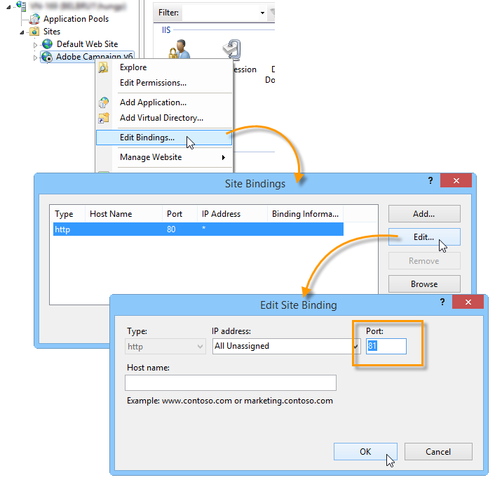
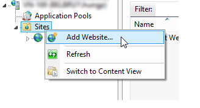
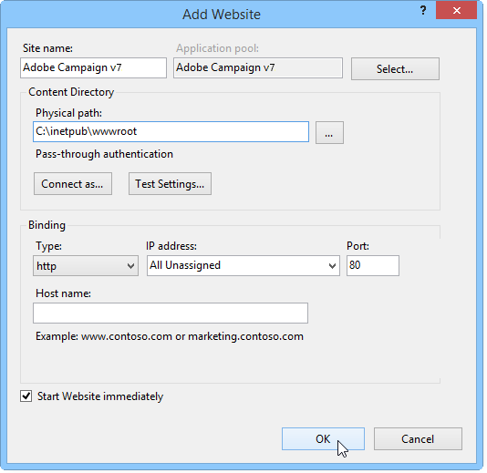
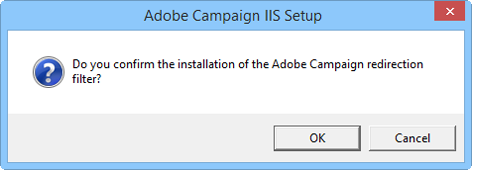
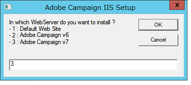
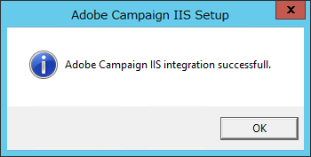
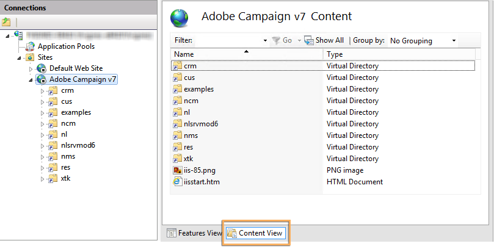
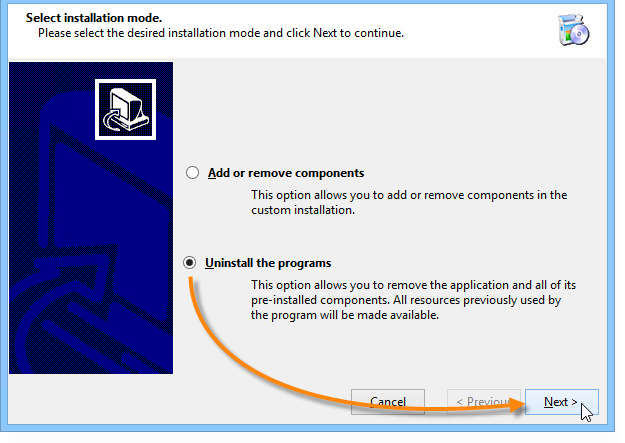

# Migrating in Windows for Adobe Campaign 7{#migrating-in-windows-for-adobe-campaign}

## General procedure {#general-procedure}

For Windows, the migration steps are as follows:

1. Stop services: refer to [Service stop](#service-stop).
1. Back up the database: refer to [Back up the database and the current installation](#back-up-the-database-and-the-current-installation).
1. Migrate the platform: refer to [Deploying Adobe Campaign v7](#deploying-adobe-campaign-v7).
1. Migrate the redirection server (IIS): refer to [Migrating the redirection server (IIS)](#migrating-the-redirection-server--iis-).
1. Re-start service: refer to [Re-starting the services](#re-starting-the-services).
1. Delete and cleanse previous Adobe Campaign version: refer to [Deleting and cleansing Adobe Campaign previous version](#deleting-and-cleansing-adobe-campaign-previous-version).

## Service stop {#service-stop}

First, stop all processes with access to the database on all machines concerned.

1. All servers using the redirection module (**webmdl** service) must be stopped. For IIS, run the following command:

   ```
   iisreset /stop
   ```

1. The **mta** module and its child modules (**mtachild**) must be stopped using the following commands:

   ```
   nlserver stop mta@<instance name>
   nlserver stop mtachild@<instance name>
   ```

1. Stop Adobe Campaign services on all servers. Log in with administrator rights and run the following command:

   ```
   net stop nlserver6
   ```

   If you are migrating from v5.11, run the following command:

   ```
   net stop nlserver5
   ```

1. For each server, make sure Adobe Campaign services are properly stopped. Log in with administrator rights and run the following command:

   ```
   tasklist /FI "IMAGENAME eq nlserver*"
   ```

   The list of active processes along with their ID (PID) is displayed.

   ```
   Image Name                     PID Session Name        Session#    Mem Usage
   ========================= ======== ================ =========== ============
   nlserver.exe                  3192 Console                    1     13,108 K
   ```

1. If one or more Adobe Campaign processes are still active or blocked after a few minutes, kill them. Log in with administrator rights and run the following command:

   ```
   taskkill /IM nlserver* /T
   ```

1. If some processes are still active after a few minutes, you can force them to close using the command:

   ```
   taskkill /F /IM nlserver* /T
   ```

## Back up the database and the current installation {#back-up-the-database-and-the-current-installation}

The procedure depends on your Adobe Campaign previous version.

### Migrating from Adobe Campaign v5.11 {#migrating-from-adobe-campaign-v5-11}

1. Make a backup of the Adobe Campaign database.
1. Make a backup of the **Neolane v5** directory using the following command:

   ```
   ren "Neolane v5" "Neolane v5.back"
   ```

   >[!IMPORTANT]
   >
   >As a precaution, we recommend that you zip the **Neolane v5.back** folder and save it elsewhere in a safe location other than the server.

1. In the windows service management console, disable the automatic startup of the 5.11 application server service. You can also use the following command:

   ```
   sc config nlserver5 start= disabled
   ```

1. Edit the **config-`<instance name>`.xml** (in the **Neolane v5. back** folder) to prevent the **mta**, **wfserver**, **stat**, etc. services from starting automatically. For instance, replace **autoStart** with **_autoStart**.

   ```
   <?xml version='1.0'?>
   <serverconf>
     <shared>
       <dataStore hosts="myServer*" lang="en_US">
         <dataSource name="default">
           <dbcnx encrypted="1" login="myLogin" password="myPassword"  provider="postgresql" server="myServer"/>
         </dataSource>
       </dataStore>
     </shared>
   
     <mta _autoStart="true" statServerAddress="myStatServer"/>
     <stat _autoStart="true"/>
     <wfserver _autoStart="true"/>
     <inMail _autoStart="true"/>
     <sms _autoStart="false"/>
   </serverconf>
   ```

### Migrating from Adobe Campaign v6.02 {#migrating-from-adobe-campaign-v6-02}

1. Make a backup of the Adobe Campaign database.
1. Make a backup of the **Neolane v6** directory using the following command:

   ```
   ren "Neolane v6" "Neolane v6.back"
   ```

   >[!IMPORTANT]
   >
   >As a precaution, we recommend that you zip the **Neolane v6.back** folder and save it elsewhere in a safe location other than the server.

1. In the Windows service manager, deactivate the 6.02 application server automatic startup. You can also use the following command:

   ```
   sc config nlserver6 start= disabled
   ```

1. Edit the **config-`<instance name>`.xml** (in the **Neolane v6. back** folder) to prevent the **mta**, **wfserver**, **stat**, etc. services from starting automatically. For instance, replace **autoStart** with **_autoStart**.

   ```
   <?xml version='1.0'?>
   <serverconf>
     <shared>
       <dataStore hosts="myServer*" lang="en_US">
         <dataSource name="default">
           <dbcnx encrypted="1" login="myLogin" password="myPassword" provider="postgresql" server="myServer"/>
         </dataSource>
       </dataStore>
     </shared>
   
     <mta _autoStart="true" statServerAddress="myStatServer"/>
     <stat _autoStart="true"/>
     <wfserver _autoStart="true"/>
     <inMail _autoStart="true"/>
     <sms _autoStart="false"/>
   </serverconf>
   ```

### Migrating from Adobe Campaign v6.1 {#migrating-from-adobe-campaign-v6-1}

1. Make a backup of the Adobe Campaign database.
1. Make a backup of the **Adobe Campaign v6** directory using the following command:

   ```
   ren "Adobe Campaign v6" "Adobe Campaign v6.back"
   ```

   >[!IMPORTANT]
   >
   >As a precaution, we recommend that you zip the **Adobe Campaign v6.back** folder and save it elsewhere in a safe location other than the server.

1. In the windows service management console, disable the automatic startup of the 6.11 application server service. You can also use the following command:

   ```
   sc config nlserver6 start= disabled
   ```

## Deploying Adobe Campaign v7 {#deploying-adobe-campaign-v7}

Deploying Adobe Campaign involves two stages:

* Installing build v7: this operation must be performed on each server.
* The post upgrade: this command must be started on each instance.

To deploy Adobe Campaign, apply the following steps:

1. Install the most recent Adobe Campaign v7 build by running the **setup.exe** installation file. For more on installing the Adobe Campaign server in Windows, refer to [this section](../../installation/using/installing-the-server.md).

   

   >[!NOTE]
   >
   >Adobe Campaign v7 is installed by default in the **C:\Program Files\Adobe\Adobe Campaign v7** directory.

1. To make the client console installation program available, copy the **setup-client-7.0.XXXX.exe** file into the Adobe Campaign installation directory: **C:\Program Files\Adobe\Adobe Campaign v7\datakit\nl\eng\jsp**.

   >[!NOTE]
   >
   >For more on installing Adobe Campaign in Windows, refer to [this section](../../installation/using/installing-the-server.md).

1. Start the instance for the first use with the following commands:

   ```
   net start nlserver6-v7
   net stop nlserver6-v7
   ```

   >[!NOTE]
   >
   >These commands let you create the Adobe Campaign v7 internal file system: **conf** directory (with the **config-default.xml** and **serverConf.xml** files), **var** directory, etc.

1. Copy and paste (overwrite) the configuration files and sub-folders of each instance via the **Neolane v5.back**, **Neolane v6.back** or **Adobe Campaign v6.back** backup file (depending on the version you are migrating from - see [this section](#back-up-the-database-and-the-current-installation)).
1. According to the version you are migrating from, execute the following commands:

   ```
   copy "Neolane v5.back"/conf/config-<instance name>.xml "Adobe Campaign v7"/conf/
   copy "Neolane v5.back"/customers/* "Adobe Campaign v7"/customers/
   copy "Neolane v5.back"/var/* "Adobe Campaign v7"/var/
   ```

   ```
   copy "Neolane v6.back"/conf/config-<instance name>.xml "Adobe Campaign v7"/conf/
   copy "Neolane v6.back"/customers/* "Adobe Campaign v7"/customers/
   copy "Neolane v6.back"/var/* "Adobe Campaign v7"/var/
   ```

   ```
   copy "Adobe Campaign v6.back"/conf/config-<instance name>.xml "Adobe Campaign v7"/conf/
   copy "Adobe Campaign v6.back"/customers/* "Adobe Campaign v7"/customers/
   copy "Adobe Campaign v6.back"/var/* "Adobe Campaign v7"/var/
   ```

   >[!IMPORTANT]
   >
   >For the first command above, do not copy the **config-default.xml** file.

1. In the **serverConf.xml** and **config-default.xml** files of Adobe Campaign v7, apply the specific configurations that you had in Adobe Campaign previous version. For the **serverConf.xml** file, use the **Neolane v5/conf/serverConf.xml.diff**, **Neolane v6/conf/serverConf.xml.diff** or **Adobe Campaign v6/conf/serverConf.xml.diff** file.

   >[!NOTE]
   >
   >When reporting configurations from Adobe Campaign previous version to Adobe Campaign v7, make sure the paths to the physical directories lead to Adobe Campaign v7 (and not Neolane v5, Neolane v6 or Adobe Campaign v6).

1. Reload the Adobe Campaign v7 configuration using the following command:

   ```
   nlserver config -reload
   ```

1. Start the postupgrade process using the following command:

   ```
   nlserver config -postupgrade -instance:<instance name>
   ```

>[!IMPORTANT]
>
>Do not start Adobe Campaign services yet: some changes need to be made on IIS.

## Migrating the redirection server (IIS) {#migrating-the-redirection-server--iis-}

At this stage, the IIS server must be stopped. Refer to [Service stop](#service-stop).

1. Open the **Internet Information Services (IIS) Manager** console.
1. Change the bindings (listen ports) of the site used for Adobe Campaign previous version:

    * Right-click the site used for Adobe Campaign previous version and select **[!UICONTROL Edit bindings]**.
    * For each type of listen port (**[!UICONTROL http]** and/or **[!UICONTROL https]**), select the appropriate line and click **[!UICONTROL Edit]**.
    * Enter a different port. By default, the listen port is 80 for http and 443 for https. Check that the new port is available.
    
      

      >[!NOTE]
      >
      >If your IIS server includes several websites for Adobe Campaign with an advanced configuration (shared port and different IP addresses), please contact your administrator.

1. Create a new website for Adobe Campaign v7:

    * Right-click the **[!UICONTROL Sites]** folder and select **[!UICONTROL Add Web Site...]**.
    
      

    * Enter the name of the site, **Adobe Campaign v7** for instance. 
    * The access path to the website's basic directory is not used, but the **[!UICONTROL Physical access path]** field must be entered. Enter the default IIS access path: **C:\inetpub\wwwroot**.
    * Click the **[!UICONTROL Connect as...]** as button and make sure the **[!UICONTROL Application user]** option is selected.
    * You can leave the default values in the **[!UICONTROL IP address]** and **[!UICONTROL Port]** fields. If you want to use other values, make sure the IP address and/or port are available.
    * Check the **[!UICONTROL Start Web site immediately]** box. 
    
      

1. Execute the **iis_neolane_setup.vbs** script to automatically configure the resources used by the Adobe Campaign server on the virtual directory previously created.

    * This file is found in the **`[Adobe Campaign v7]`\conf** directory, where **`[Adobe Campaign v7]`** is the access path to the Adobe Campaign installation directory. The command for executing the script is as follows (for administrators):

      ```    
      cd C:\Program Files (x86)\Adobe Campaign\Adobe Campaign v7\conf
      cscript iis_neolane_setup.vbs
      ```

    * Click **[!UICONTROL OK]** to confirm script execution.
    
      

    * Enter the number of the website previously created for Adobe Campaign v7 and click **[!UICONTROL OK]**.
    
      

    * A confirmation message should come up: 
    
      

    * In the **[!UICONTROL Content view]** tab, make sure the Website configuration is correctly configured with Adobe Campaign resources:
    
      

      >[!NOTE]
      >
      >If the tree structure is not displayed, re-start the IIS.
      >
      >The following IIS configuration steps are detailed in [this section](../../installation/using/integration-into-a-web-server-for-windows.md#configuring-the-iis-web-server).

## Security zones {#security-zones}

If you are migrating from v6.02 or earlier, you must configure your security zones before starting services. For more information, refer to [Security](../../migration/using/general-configurations.md#security).

## Re-starting the services {#re-starting-the-services}

Start IIS and Adobe Campaign services on each of the following servers:

1. Tracking and redirection server.
1. Mid-sourcing server.
1. Marketing server.

Before going on to the next step, run a full test of the new installation, make sure there are no regressions and that everything works by following all the recommendations in the [General configurations](../../migration/using/general-configurations.md) section.

## Deleting and cleansing Adobe Campaign previous version {#deleting-and-cleansing-adobe-campaign-previous-version}

The procedure depends on your Adobe Campaign previous version.

### Adobe Campaign v5 {#adobe-campaign-v5}

Before you delete and cleanse the Adobe Campaign v5 installation, you must apply the following recommendations:

* Get the functional teams to run a full check of the new installation.
* Only uninstall Adobe Campaign v5 once you are certain that no rollback is necessary.

1. In IIS, delete the **Neolane v5** website, then the **Neolane v5** application pool. 
1. Rename the **Neolane v5.back** folder as **Neolane v5**.
1. Uninstall Adobe Campaign v5 using the Add/remove components wizard. 

   

1. Delete the **nlserver5** Windows service using the following command:

   ```
   sc delete nlserver5
   ```

1. Re-start the server.

### Adobe Campaign v6.02 {#adobe-campaign-v6-02}

Before you delete and cleanse the Adobe Campaign v6.02 installation, you must apply the following recommendations:

* Get the functional teams to run a full check of the new installation.
* Only uninstall Adobe Campaign v6.02 once you are certain that no rollback is necessary.

1. In IIS, delete the **Neolane v6** website, then the **Neolane v6** application pool. 
1. Rename the **Neolane v6.back** folder as **Neolane v6**.
1. Uninstall Adobe Campaign v6.02 using the Add/remove components wizard. 

   

1. Re-start the server.

### Adobe Campaign v6.1 {#adobe-campaign-v6-1}

Before you delete and cleanse the Adobe Campaign v6 installation, you must apply the following recommendations:

* Get the functional teams to run a full check of the new installation.
* Only uninstall Adobe Campaign v6 once you are certain that no rollback is necessary.

1. In IIS, delete the **Adobe Campaign v6** website, then the **Adobe Campaign v6** application pool. 
1. Rename the **Adobe Campaign v6.back** folder as **Adobe Campaign v6**.
1. Uninstall Adobe Campaign v6 using the Add/remove components wizard. 

   

1. Re-start the server.
