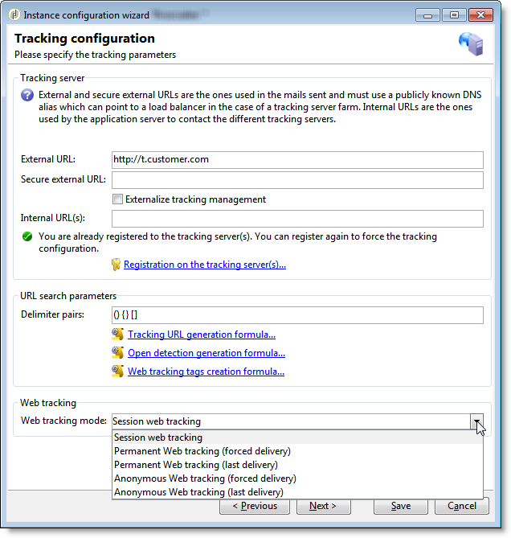

# Specific configurations in v5.11{#specific-configurations-in-v5-11}

This section details the additional configuration required when migrating from v5.11. You should also configure the settings detailed in the [General configurations](../../migration/using/general-configurations.md) section.

## Web applications {#web-applications}

The following warning will be displayed automatically during migration:

```
The webApp ids have been modified during the migration process. Please make sure to check your scripts/css for broken compatibility (any client side javascript or css dealing directly with another element through its id is impacted). See file 'c:\svn\602\nl\build\ncs\var\upgrade/postupgrade/webAppsMigration_*************.txt' for details about the references that were automatically updated, if any.
```

Some components of web applications, for instance the various formula fields, have @id attributes. These are used in the XML code of web applications and are no longer generated in the same way. They are not visible in the interface and you must not normally use them. However, in some cases, @id attributes may have been used to personalize the rendering of web applications, for instance via a stylesheet or using JavaScript code.

During migration, you **must** check the log file path specified in the warning:

* **The file is not empty**: it contains warnings which concern inconsistencies recorded before migration and which still exist. This can be JavaScript code in a web application which references a non-existent ID. Each error must be checked and corrected.
* **The file is empty**: this means that Adobe Campaign has not detected any issues.

Whether the file is empty or not, you must check that these IDs are not used for configuration elsewhere (and adapt configuration if this is the case).

## Workflows {#workflows}

Since the name of the Adobe Campaign installation directory has changed, some workflows may not work after the migration. If a workflow references the nl5 directory in one of its activities, this will raise an error. Replace this reference with **build**. You can run an SQL query to identify these workflows (PostgreSQL example):

```
SELECT   iWorkflowId, sInternalName, sLabel 
FROM XtkWorkflow 
WHERE mData LIKE '%nl5%';
```

## User-friendliness {#user-friendliness}

The Adobe Campaign v5.11 home page is no longer available.

Although not recommended, there are certain solutions if you wish to keep specific interfaces from Adobe Campaign v5.11. For more information, please contact us.

## MySQL {#mysql}

>[!IMPORTANT]
>
>MySQL is only supported in v7 as the main database engine when migrating from version 6.02 or 5.11 using this engine.

MySQL does not manage timezones by default. To enable timezone management, run the following command:

```
mysql_tzinfo_to_sql /usr/share/zoneinfo | mysql -u root mysql
```

>[!NOTE]
>
>For more information, refer to the [https://dev.mysql.com/doc/refman/8.0/en/time-zone-support.html](https://dev.mysql.com/doc/refman/8.0/en/time-zone-support.html) page.

If modifications have been made to the database structure, during configuration for example (creating specific indexes, creating SQL views, etc.), certain precautions should be taken when migrating. Indeed, certain modifications can be generated from incompatibilities with the migration procedure. For example, creating SQL views containing **Timestamp** fields are not compatible with the **usetimestamptz** option. We therefore advise you to follow the recommendations below:

1. Before starting the migration, back up the database.
1. Delete SQL changes.
1. Perform the postupgrade according to the procedure detailed in the  [Prerequisites for migration to Adobe Campaign 7](../../migration/using/prerequisites-for-migration-to-adobe-campaign-7.md) section.
    >[!NOTE]
    >
    >It is imperative that you follow the migration steps presented in the [Prerequisites for migration to Adobe Campaign 7](../../migration/using/prerequisites-for-migration-to-adobe-campaign-7.md) section.
1. Reintegrate SQL changes.

In this example, a **NmcTrackingLogMessages** view had been created and this has a **Timestamp** field named **tslog**. In this case, the migration procedure fails and the following error message appears:

```
2011-10-04 11:57:51.804Z B67B28C0 1 info log Updating table 'NmcTrackingLogMessages'
2011-10-04 11:57:51.804Z B67B28C0 1 error log PostgreSQL error: ERROR: cannot alter type of a column used by a view or rule\nDETAIL: rule _RETURN on view nmctrackinglogmessagesview depends on column "tslog"\n (iRc=-2006)
2011-10-04 11:57:51.804Z B67B28C0 1 error log SQL order 'ALTER TABLE NmcTrackingLogMessages ALTER COLUMN tsLog TYPE TIMESTAMPTZ' was not executed. (iRc=-2006)
```

To make sure the postupgrade works, you must delete the view before the migration and re-create it after the migration while adapting it to the TIMESTAMP WITH TIMEZONE mode.

## Tracking {#tracking}

The tracking formula has been modified. When migrating, the old formula (v5) is replaced by the new one (v7). If you use a personalized formula in Adobe Campaign v5, this configuration has to be adapted in Adobe Campaign v7 (**NmsTracking_ClickFormula** and **NmsTracking_OpenFormula** options).

Web tracking management has also been modified. Once migration to v7 has been carried out, you must start the deployment wizard to finish configuring the web tracking.

  

Three modes are available:

* **Session web tracking**: If the **[!UICONTROL Leads]** package has not been installed, this option is selected by default. This option is the most ideal in terms of performance and it allows you to limit the size of the tracking logs.
* **Permanent Web tracking**
* **Anonymous Web Tracking**: If the **[!UICONTROL Leads]** package is installed, this option is selected by default. It is the most resource-consuming option. As above, the **sSourceId** column must be indexed (in the tracking table and the **CrmIncomingLead** table).

>[!NOTE]
>
>For more information on these three modes, refer to [this section](../../configuration/using/about-web-tracking.md).

## Adobe Campaign v7 tree structure {#campaign-vseven-tree-structure}

During migration, the tree structure is automatically reorganized based on the v7 standards. The new folders are added, the obsolete folders are deleted, and their content is placed in the "To move" folder. All items in this folder must be checked after the migration, and the consultant has to decide to either keep it or delete each one. Items to be kept then have to be moved to the right place.

An option has been added for disabling the automatic migration of the navigation tree. This operation is now manual. Obsolete folders are not deleted and new folders are not added. This option should only be used if the out-of-the-box v5 navigation tree has undergone too many changes. Add the option to the console, before migrating, in the **[!UICONTROL Administration > Options]** node:

* Internal name: NlMigration_KeepFolderStructure
* Data type: Integer
* Value (text): 1

If you use this option, after migration you will have to delete obsolete folders, add the new folders and run all necessary checks.

**List of new folders**:

The following folders need to be added after the migration:

| Internal name | Label | Condition |
|---|---|---|
| nmsAutoObjects | Objects created automatically | - |
| nmsCampaignAdmin | Campaign management | - |
| nmsCampaignMgt | Campaign management | - |
| nmsCampaignRes | Campaign management | - |
| nmsModels | Templates | - |
| nmsOnlineRes | Online | - |
| nmsProduction | Production | - |
| nmsProfilProcess | Processes | - |
| xtkDashboard | Dashboards | - |
| xtkPlatformAdmin | Platform | - |
| nmsLocalOrgUnit | Organizational units | - |
| nmsMRM | MRM | MRM installed |
| nmsOperations | Campaigns | Campaign installed |

**List of obsolete folders**:

The obsolete folders to be deleted after the migration are as follows:

>[!NOTE]
>
>The entire content of the obsolete folders must be checked, and for each item the consultant decides whether to keep or delete it. The items to be kept must be moved to the appropriate place.

| Internal name | Label | Condition |
|---|---|---|
| nmsAdministration | Administration | - |
| nmsDeliveryMgt | Campaign execution | - |
| ncmContent | Content management | Content Manager installed |
| ncmForm | Input form | Content Manager installed |
| ncmImage | Images | Content Manager installed |
| ncmJavascript | JavaScript codes | Content Manager installed |
| ncmJst | JavaScript templates | Content Manager installed |
| ncmParameters | Configuration | Content Manager installed |
| ncmSrcSchema | Data schemas | Content Manager installed |
| ncmStylesheet | XSL style files | Content Manager installed |
| nmsAdminPlan | Administration | Campaign installed |
| nmsResourcePlan | Resources | Campaign installed |
| nmsResourcesModels | Templates | Campaign installed |
| nmsRootPlan | Campaign management | Campaign installed |
| nmsOperator | Marketing operators | MRM installed |
