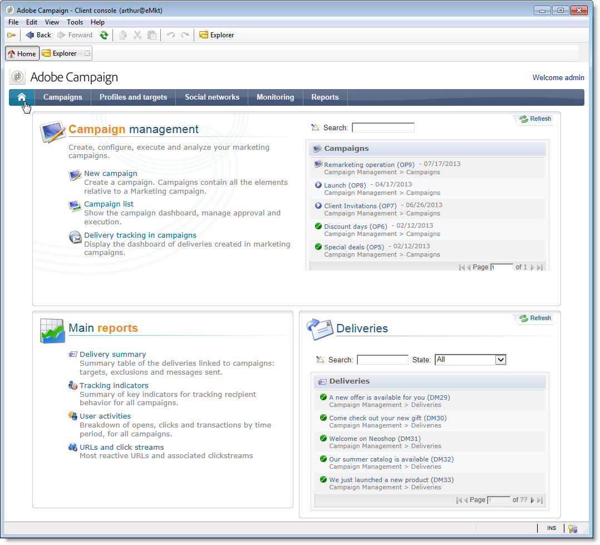
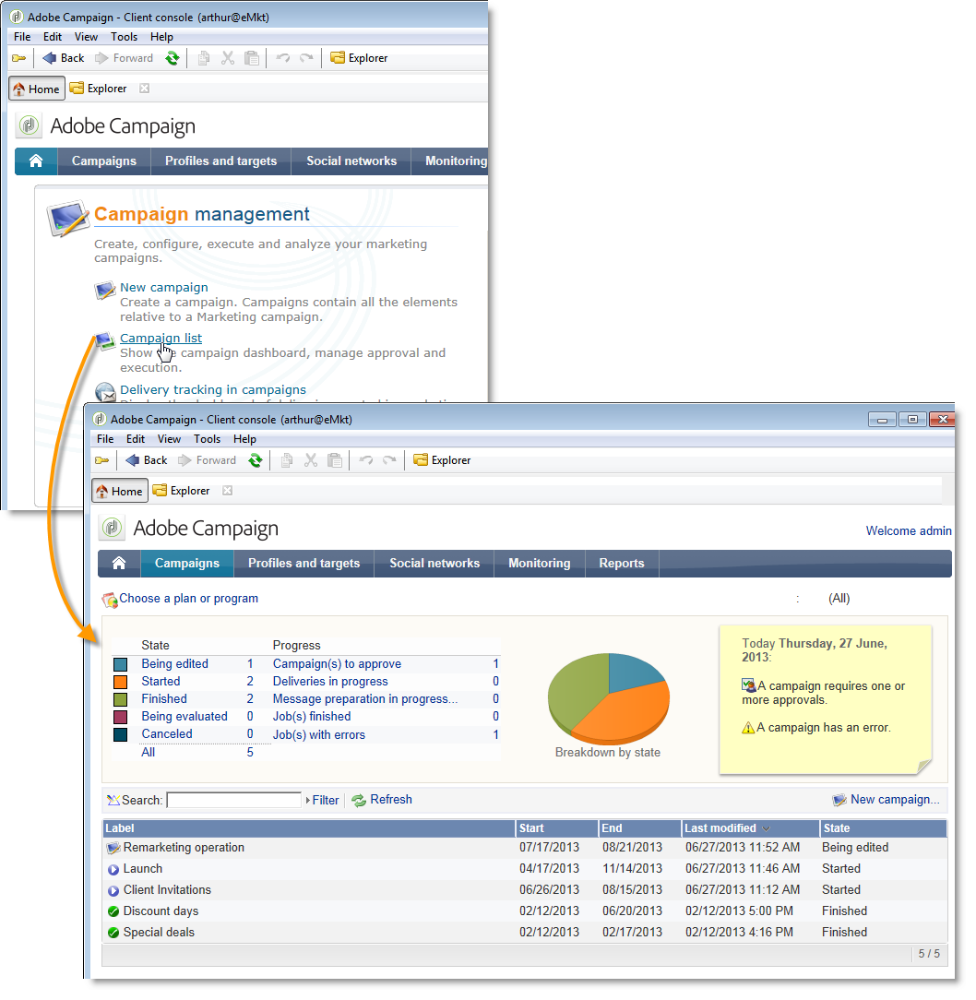

# Specific configurations in v6.02{#specific-configurations-in-v6-02}

The following section details the additional configuration required when migrating from v6.02. You should also configure the settings detailed in the [General configurations](../../migration/using/general-configurations.md) section.

## Web applications {#web-applications}

If you are migrating from v6.02, error logs regarding overview-type web applications may appear. Error message examples:

```
[PU-0006] Entity of type : 'xtk:entityBackupNew' and Id 'nms:webApp|taskOverview', expression '[SQLDATA[' was found : '...)) or (@id IN ([SQLDATA[select 
[PU-0006] Entity of type : 'xtk:formDictionary' and Id 'nms:webApp|lastTasks', expression '[SQLDATA[' was found : '...)) or (@id IN ([SQLDATA[select 
[PU-0006] Entity of type : 'nms:webApp' and Id 'taskOverview', expression '[SQLDATA[' was found : '...@owner-id] IN ([SQLDATA[select iGroupid...'. (iRc=-1)
```

These web applications used SQLData and are not compatible with v7, due to heightened security. These errors will lead to a migration failure.

If you didn't use these web applications, run the following cleanup script and rerun the postupgrade:

```
Nlserver javascript -instance:[instance_name] -file [installation_path]/datakit/xtk/fra/js/removeOldWebApp.js
```

If you have modified these web applications and would like to continue using them in v7, you must activate the **allowSQLInjection** option in your different security zones and re-start the postupgrade. Refer to the [SQLData](../../migration/using/general-configurations.md#sqldata) section for more on this.

## User-friendliness: Home page and navigation {#user-friendliness--home-page-and-navigation}

>[!IMPORTANT]
>
>If you would like to continue using v6.02 overview-type web applications, you must activate the **allowSQLInjection** option in your different security zones before the postupgrade. Refer to [Web applications](#web-applications).

After a migration from version 6.02, the Adobe Campaign v6.02 homepage is no longer displayed but is still accessible and compatible with Adobe Campaign v7.

To continue using the v6.02 homepage, you must install a "compatibility" package after the migration.

To do this, import the compatibility package:

Click **[!UICONTROL Tools > Advanced > Import package]** and choose the **campaignMigration.xml** package in the **`\nl\datakit\nms\[Your language]\package\optional`**.

To allow access to the v6.02 Web Application type interfaces, the **sessionTokenOnly** server configuration option must be activated in the **serverConf.xml** file:

```
sessionTokenOnly="true"
```

This option alters the security levels in order to ensure interface compatibility.

Once the package is installed, the Adobe Campaign v7 home page is replaced by your old v6.02 homepage complete with the general configurations from v7 (blue home page banner). 



All the links on this homepage link to v7 screens except for the lists (**[!UICONTROL operation list]**, **[!UICONTROL delivery tracking in operations]**, etc.) which link to the v6.02 overview (web applications). 



If you want to add another overview configured in v6.02, you need to add this to the home page from the dashboard. (**[!UICONTROL Administration > Access management > Dashboard]**).

>[!NOTE]
>
>Remember to disconnect then reconnect the console in order to register the modifications.

## Message Center {#message-center}

After a Message Center control instance migration, you must republish the transactional message templates for them to work.

In v7, the names of transactional message templates on execution instances have changed. They are currently prefixed by the operator name that corresponds to the control instance on which they are created, for example **control1_template1_rt** (where **control1** is the name of the operator). If you have a significant volume of templates, we recommend deleting old templates on control instances.
