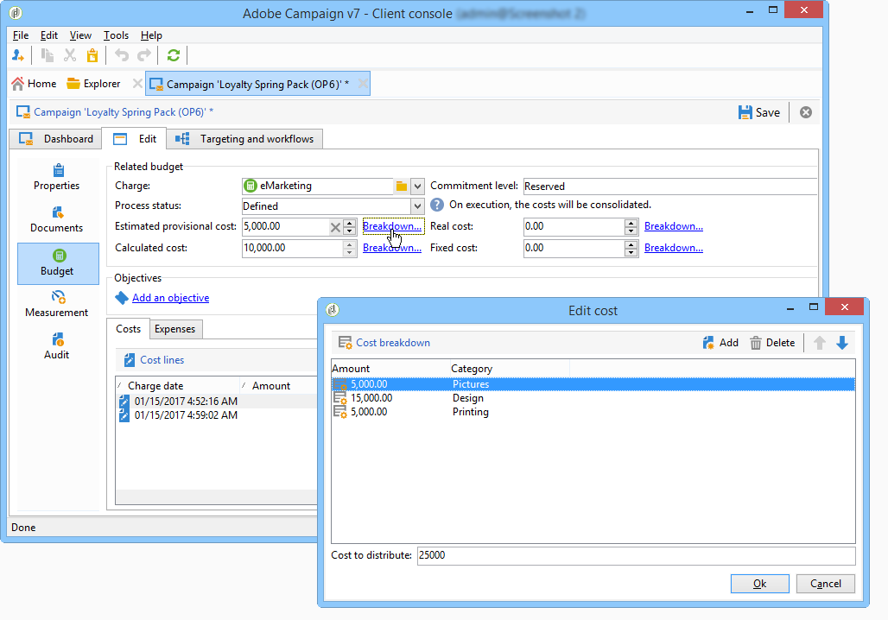

# Control costs{#controlling-costs}

Adobe Campaign lets you control scheduled, committed and invoiced marketing costs and to break them down by category using the Marketing Resource Management module.

The costs committed for the various processes of a campaign are charged to a budget defined in advance by the marketing department. The amounts can be broken down into several categories to make the information more readable and to provide more detailed reporting of marketing investments.

The management and tracking of budgets is centralized in a dedicated node of the Adobe Campaign tree. This lets you monitor the amounts allocated, reserved, committed, and spent from the same view and for all budgets.

The following steps must be applied to implement budget management using MRM:

1. Defining the budget

   For more on this, refer to [Create a budget](#creating-a-budget).

1. Defining the cost calculation method

   Cost structures are defined for the service providers. See [Create a service provider and its cost categories](../../campaign/using/providers--stocks-and-budgets.md#creating-a-service-provider-and-its-cost-categories).

1. Defining campaign costs (deliveries/tasks)

   The costs incurred by the deliveries and tasks are input individually or globally for the campaign template. See [Calculation of costs and stocks](../../campaign/using/marketing-campaign-deliveries.md#calculation-of-costs-and-stocks).

1. Consolidation

   According to the progress status of the tasks, deliveries and campaign, the costs will be calculated and passed on to the corresponding budget.

   When the creation of the campaign is sufficiently advanced, the progress status of the campaign budget can be changed to **[!UICONTROL Specified]**. The calculated cost of the program is then entered automatically with the costs calculated on the campaign. See [Cost commitment, calculation and charging](#cost-commitment--calculation-and-charging).

## Create a budget {#creating-a-budget}

Budgets are created in the map, via the **[!UICONTROL Campaign management > Budgets]** node. The **[!UICONTROL New]** button in the toolbar lets you create a budget.

* Adding a new budget

  Click the **[!UICONTROL New]** icon, name and save the budget.

* Entering the initial amount

  Indicate the allocated amount in the relevant field. The other amounts are entered automatically. See [Calculate amounts](#calculating-amounts).

* Defining the validity period

  Specify the start and end dates. This information is indicative only.

* Expenses

  Create the expense categories to which the costs assigned to this budget for campaigns, tasks etc. can be linked. See [Expense categories](#expense-categories).

  

>[!NOTE]
>
>You can select a related budget.
>
>For more on this, refer to [Linking a budget to another](#linking-a-budget-to-another).

### Calculate amounts {#calculating-amounts}

Each budget is defined by an initial amount which will be decremented from the costs of the various campaigns, deliveries or tasks related to them after they have been scheduled or performed. The status of the amounts (planned, reserved, committed, spent, or invoiced) depends on the type of cost and the level of commitment defined in the campaign, delivery, or task.

>[!NOTE]
>
>The amounts entered for the categories must match the budget envelope defined in the **[!UICONTROL Allocated]** field.

For campaigns, according to the level of commitment, a cost can be planned, committed or reserved for a future action. 

>[!CAUTION]
>
>When a campaign is created, the progress status in **[!UICONTROL Budget]** must be set to **[!UICONTROL Defined]** for the costs to be taken into account on execution. If the status is **[!UICONTROL Being edited]**, the costs will not be consolidated.
>   
>The option **[!UICONTROL Commitment level]** represents a projection of costs into the future before they are charged to the budget. According to the progress of a campaign, task, or delivery, you can decide to assign a higher or lower commitment level (1. Planned, 2. Reserved, 3. Committed) using the combo box.

For example, the estimated planned cost of a web campaign is 45,000 Euro.

For the campaign, when the budget creation status is set to **[!UICONTROL Defined]**, the real cost of the campaign (or, if none, the computed cost) will be carried over into the budget totals.

According to the level of commitment of the campaign budget, the amount will be entered in the **[!UICONTROL Planned]**, **[!UICONTROL Reserved]** or **[!UICONTROL Committed]** field.

The level of commitment can be modified:

* in the **campaign** level, in the **[!UICONTROL Budget]** window, found in the **[!UICONTROL Edit]** tab. This is where budgets, costs and expenses are configured.
* in the **tasks** level, in the **[!UICONTROL Expenses and revenues]** window.

When the budget is **[!UICONTROL Reserved]**, the update is performed automatically for the charged budget.

The procedure is the same at task level.

When an expenditure gives rise to an invoice and the invoice is paid, its amount is then entered in the **[!UICONTROL Invoiced]** field.

### Expense categories {#expense-categories}

The amounts can be distributed in several expense categories for better readability of the data and for more detailed reporting of marketing investments. The expense categories are defined during budget creation, via the **[!UICONTROL Budgets]** node of the tree.

To add a category, click the **[!UICONTROL Add]** button in the lower section of the window.

You can select a category from the existing ones or define a new category by entering it directly in the field. When you confirm your input, a confirmation message lets you add this category to the list of existing categories, and associate it with a Nature if necessary. This information will be used in the budget reports.

### Link a budget to another {#linking-a-budget-to-another}

You can link a budget to a main budget. To do this, select the main budget in the **[!UICONTROL related budget]** field of the secondary budgets. 

An additional tab will be added to the main budget in order to display the list of related budgets.

This information is carried over to the budget reports.

## Add expense lines {#adding-expense-lines}

Expense lines are automatically added to the budget. They are created during delivery analysis and when a task is finished.

For each campaign, delivery, or task, the costs generated are grouped in the expense lines of the budget to which they are charged. These expense lines are created according to the cost lines of the service provider concerned and calculated via the associated cost structures.

Each expense line therefore contains the following information:

* The campaign and the delivery or task to which it is related
* The amount calculated from the cost structures or the estimated provisional cost
* Real cost of the delivery or task concerned
* The corresponding invoice line (MRM only)
* List of costs calculated by cost category (if a cost structure exists)

In the example above, the expense line edited contains the costs calculated for the **New cards** delivery for the **Loyalty Spring Pack** campaign. When the delivery is edited, the **[!UICONTROL Direct Mail]** tab lets you see how the expense line is calculated.

The cost calculation for this delivery is based on the cost categories selected for the service provider concerned:

According to the cost categories selected, the corresponding cost structures are applied in order to calculate the cost lines. In this example, for the service provider concerned, the cost structures are as follows: 

>[!NOTE]
>
>Cost categories and structures are presented in [Create a service provider and its cost categories](../../campaign/using/providers--stocks-and-budgets.md#creating-a-service-provider-and-its-cost-categories).

## Cost commitment, calculation and charging {#cost-commitment--calculation-and-charging}

Costs can be committed for deliveries and tasks. According to the progress of the process to which it is related, the status of a cost is updated.

### Cost calculation process {#cost-calculation-process}

Costs are divided into three categories:

1. Estimated provisional cost

   The estimated provisional cost is an estimate of the costs for the processes of the campaign. As long as it is being edited, the amounts input are not consolidated. It must have **[!UICONTROL Specified]** status for the amounts input to be taken into account in the calculations.

   This amount is input manually and can be broken down into several expense categories. To bread down a cost, click the **[!UICONTROL Breakdown...]** link, and then the **[!UICONTROL Add]** button to define a new amount. 

   

   You can associate each cost with a category so that the cost breakdown by expense category can later be viewed in the related budget and the budget reports.

1. Calculated cost

   The calculated cost depends on the element concerned (campaign, delivery, task, etc.) and its status (being edited, in progress, finished). In any case, if the real cost is specified, the calculated cost will use this amount.

   If the real cost is not provided, the following rules apply:

    * For a campaign being edited, the calculated cost is the estimated provisional cost of the campaign or, if this cost is not defined, the calculated cost will be the sum of all provisional costs of the deliveries and tasks of the campaign. If the campaign is finished, the campaign's calculated cost will be the sum of all calculated costs.
    * For a delivery that has not yet been analyzed, the calculated cost is the estimated provisional cost. If the analysis has already been performed, the calculated cost will be the sum of all the costs calculated from the service provide cost structures and the number of recipients targeted.
    * For a task in progress, the calculated cost uses the estimated provisional cost. If the task is finished, the calculated cost will be the sum of all the costs calculated from the service provider cost structures and the number of days completed. 
    * For the marketing plan, as for the program, the calculated cost is the sum of the costs calculated for the campaigns. If these costs are not specified, the calculated cost will use the estimated provisional costs.

   >[!NOTE]
   >
   >The **[!UICONTROL Breakdown]** link lets you view the details of the calculation and the last cost calculation date.

1. Real cost

   The real cost is input manually, and if necessary is broken down into different expense categories.

### Calculation and charging {#calculation-and-charging}

Costs are calculated via cost structures and charged to the budgets selected in the campaigns, deliveries or tasks concerned.

A check can be performed on the amounts committed to campaigns via the budget approval. Additional checkpoint-style tasks can be created in a campaign in order to set up other approvals. See [Types of task](../../mrm/using/creating-and-managing-tasks.md#types-of-task).

### Example {#example}

We are going to create a campaign with:

* A direct mail delivery using a service provider's cost structures
* A task with a fixed cost
* A task with a daily cost

#### Step 1 - Create the budget {#step-1---creating-the-budget}

1. Create a new budget via the **[!UICONTROL Campaign management > Budgets]** node.

1. Define a budget of 10,000 Euros in the **[!UICONTROL Allocated]** field of the **[!UICONTROL Amounts]** section. Add two expense categories in the lower section of the window:

#### Step 2 - Configure the service provider and define the cost structures {#step-2---configuring-the-service-provider-and-defining-the-cost-structures}

1. Create a service provider and a service template with its cost structure from the **[!UICONTROL Administration > Campaigns]** node. For more on this, refer to [Create a service provider and its cost categories](../../campaign/using/providers--stocks-and-budgets.md#creating-a-service-provider-and-its-cost-categories).

   For direct mail deliveries, create cost categories **[!UICONTROL Envelopes]** (types 114x229 and 162x229), **[!UICONTROL Postage]** and **[!UICONTROL Print]** (types A3 and A4). And then create the following cost structures:

   

1. Add a fixed cost (in the cost categories) whose calculation is fixed and whose amount is blank (in the corresponding cost structure) and which will be specified individually for each delivery.

   

   For tasks, create the following two cost categories:

    * **[!UICONTROL Room reservation]** (Small Room and Large Room), with a **fixed** cost structure in the amount of 300 and 500 Euros:

   

    * **[!UICONTROL Creation]** (**Content template** type), with a **daily** cost structure of 300 Euros:

    

#### Step 3 - Charge the budget in the campaign {#step-3---charging-the-budget-in-the-campaign}

1. Create a campaign and select the budget created in Step 1.

   >[!NOTE]
   >
   >By default, the budget selected for the program is applied to all campaigns in the program.

   

1. Specify the estimated provisional cost, with breakdown:

   

1. Click **[!UICONTROL Ok]** and then **[!UICONTROL Save]** to confirm this information. The calculated cost of the campaign is then updated with the estimated provisional cost.

#### Step 4 - Create the direct mail delivery {#step-4---creating-the-direct-mail-delivery}

1. Create a workflow for the campaign and position the query activities to select the target (warning, the recipient postal addresses must be specified).

1. Create a direct mail delivery and select the service provider created in Step 2: the cost categories are displayed automatically.

1. Override the cost of the envelopes and add a fixed cost. Also select the categories, concerned by these costs.

   

   >[!NOTE]
   >
   >If one of the cost categories is not used, it will not generate any expenses.

1. Start the workflow that you have just created to launch the analysis and calculate the costs.

   

1. If budget approval is enabled for this campaign, approve the budget from the dashboard. You can check the approval of cost categories.

   

The expense line concerning the delivery is added in the **[!UICONTROL Edit > Budget]** tab of the campaign. Edit it to view the details of the calculation.

The cost calculated for the delivery is updated with this information:

When you edit the calculated cost, you can check the cost breakdown and the status and date of the cost calculation.

#### Step 5 - Create tasks {#step-5---creating-tasks}

To this campaign, we will add the two tasks for which the cost structures were created earlier (see [Step 2 - Configure the service provider and define the cost structures](#step-2---configuring-the-service-provider-and-defining-the-cost-structures)). To do this, in the campaign dashboard, click the **[!UICONTROL Add a task]** button. Name the task and click **[!UICONTROL Save]**.

1. The task is then added to the task list. You must edit it to configure it.

1. In the **[!UICONTROL Properties]** tab, select the service and the corresponding cost category:

   

1. Next, click the **[!UICONTROL Expenses and revenue]** icon of the task and specify the estimated provisional cost. 

   

   When the task has been saved, the calculated cost is specified with the value entered for the estimated provisional cost.

   When the task is completed (status **[!UICONTROL Finished]** ), the calculated cost is automatically updated with the cost of the Large Room as entered in its cost structure. This cost also appears in this category in the breakdown.

1. Next, create a second task according to the same procedure; scheduled over five days and related to the cost structure created earlier.

   

   When the task is finished, the calculated cost is specified with the value from the related cost structure, i.e. 1500 Euros in our example (5 days x 300 Euros): 

   

#### Step 6 - Update the campaign budget status {#step-6---update-the-campaign-budget-status}

When the campaign is configured, its status can be updated by setting it to **[!UICONTROL Specified]**. The calculated cost of the campaign will then indicate the sum of the calculated costs of the delivery and the tasks of the campaign:

#### Budget approval {#budget-approval}

When approval is activated, a special link lets you approve the budget from the campaign dashboard. This link is displayed when the targeting workflow has been launched and a direct mail delivery needs to be approved.

You can then click the link to grant or reject approval, or use the link in the notification e-mail if notification has been activated for this campaign.

When the budget has been approved and the delivery finished, the costs are automatically uploaded via a special technical workflow.

## Orders and invoices {#orders-and-invoices}

In the context of MRM, you can save orders with a service provider and issue invoices. The entire life cycle of these orders and invoices can be managed via the Adobe Campaign interface.

### Order creation {#order-creation}

To save a new order with a service provider, click the **[!UICONTROL MRM > Orders]** node of the tree, and then click the **[!UICONTROL New]** button.

Specify the order number, the service provider concerned, and the total amount of the order. 

### Issue and track invoices {#issuing-and-tracking-invoices}

For each service provider, you can save invoices and define their status and the budget charged.

Invoices are created and stored in the **[!UICONTROL MRM > Invoices]** node of the Adobe Campaign tree.

An invoice consists of invoice lines whose total allows the amount to be calculated automatically. These lines are created manually from the **[!UICONTROL Invoice lines]** tab. They can be associated with an order to upload the information to the orders.

The invoices of each service provider are displayed in the **[!UICONTROL Invoices]** tab of the profile:

The **[!UICONTROL Details]** tab lets you display the content of the invoice.

Click **[!UICONTROL Add]** to create a new invoice.
