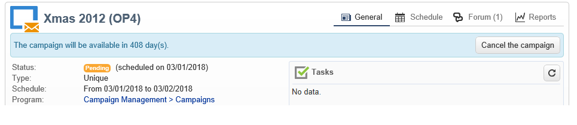
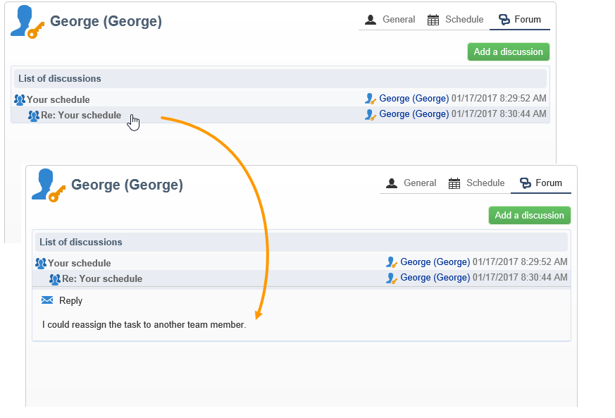
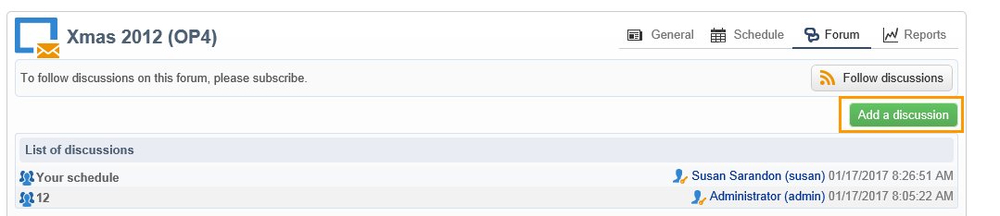
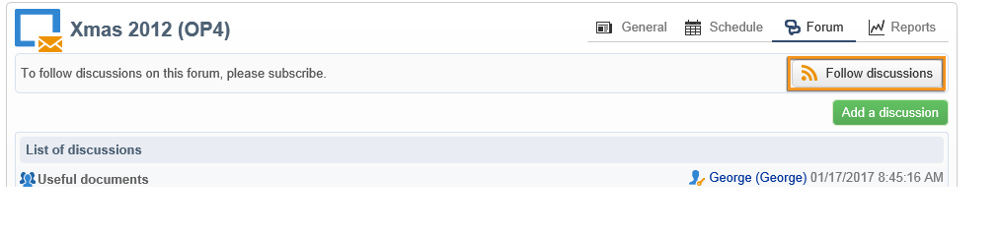
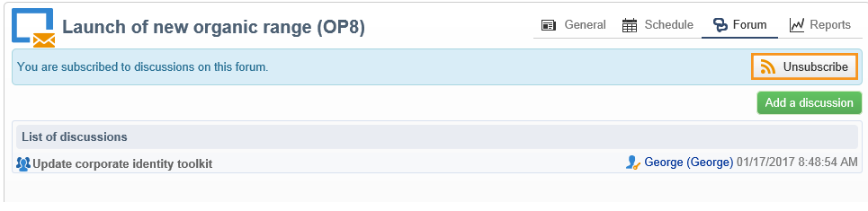
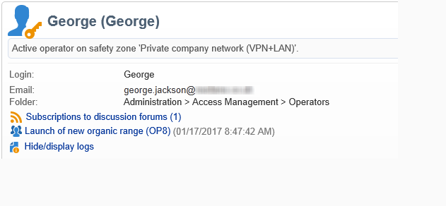

# Discussion forums{#discussion-forums}

Adobe Campaign operators can use discussion forums to share information. The following elements each have their own forum: plans, programs, campaigns, resources, simulations, stocks. Each operator also has a personal forum. All discussions are public, even on personal forums.

Operators can subscribe to a forum to receive a notification email each time a message is posted.

## Access a forum {#accessing-a-forum}

To visit the forum of a campaign, an operator, etc., go to its dashboard and click the **[!UICONTROL Forum]** link in the top right-hand corner. This link also gives you the total number of messages in the forum.

## Use a forum {#using-a-forum}

Messages and their responses are shown in chronological order (from newest to oldest).

To display the content of a message, click on its header.

**Start a new discussion**

To start a new discussion, click the **[!UICONTROL Add a discussion]** button in the top right-hand corner. The **[!UICONTROL Discussion forum]** box comes up (see below).

**Post a message to an existing discussion**

To post a message to an existing discussion, open the message that you want to answer, then click the **[!UICONTROL Reply]** link in the top left-hand corner. The **[!UICONTROL Discussion forum]** box comes up (see below).

When you reply to a message, the person who posted the original message will receive a notification.

**Write a message**

In the **[!UICONTROL Discussion forum]** box:

1. Enter your text in the **[!UICONTROL Message]** field and a discussion title in the **[!UICONTROL Subject]** field.

   

1. If necessary:

    * If you want someone to take part in the discussion who isn't subscribed to the forum, use the **[!UICONTROL Operator to notify]** field. The operator will receive a notification email for this specific message (they will not be subscribed to the forum). To notify several operators, select a group of operators.
    * To add an attachment to the message, click **[!UICONTROL Browse]**. The attachment will also be included in the notification email. Attachments may only be sent individually: to send several files, you need to zip them.

1. Click **[!UICONTROL Create the message]** to post it to the forum.

>[!NOTE]
>
>Once a message has been posted to the forum, it can no longer be changed or deleted.

## Post to the personal forum of an operator {#posting-to-the-personal-forum-of-an-operator}

You can post a message to the forum of an operator if, for instance, your message doesn't concern a specific campaign but you still want to keep track of the conversation in Adobe Campaign. Personal forums are public and all operators will see your message. The operator receives a message each time someone posts to their personal forum.

To access an operator's forum:

* If you have the necessary rights to access the **[!UICONTROL Administration > Access management > Operators]** node of the explorer, open the dashboard of the desired operator and click the **[!UICONTROL Forum]** link in the top right-hand corner.
* If not, find the name of the operator in Adobe Campaign (via a message posted to the forum by this operator, a task being assigned to him) and click on it to access their dashboard. You can also ask your administrator to create a view of the operator folder.

## Subscribe to a forum {#subscribing-to-a-forum}

Subscribing to a forum lets you follow discussions. You will receive an email notification each time a message is posted to the forum. This email will contain the message body and any attachments. To answer a message, click in the email body, then log in to the Adobe Campaign web interface. When you subscribe to a forum, this information is visible to all.

* To subscribe to a forum, click the **[!UICONTROL Follow discussions]** button in the top right hand section above the list of messages.

  

  The section goes blue and shows that you are subscribed to the forum.

* To unsubscribe from a forum, click the **[!UICONTROL Unsubscribe]** button.

  

* Your personal dashboard lists the forums which you are subscribed to. Click the **[!UICONTROL Subscription to discussion forums]** link to display the list, then click the item that interests you to access its forum.

  

  For more on personal dashboards, refer to the [this section](../../platform/using/access-management-operators.md).

* To see who is subscribed to a forum, click the **[!UICONTROL List of subscribers to this discussion forum]** link above the list of messages.

  

## Check notification delivery {#checking-notification-delivery}

If operators subscribed to a forum aren't receiving notifications as expected:

* Check that email addresses are entered in the operator's profiles.
* Go to the **[!UICONTROL Administration > Production > Technical workflows > Campaign processes]** node and check that the **[!UICONTROL Jobs in discussion forums]** workflow is started and free of errors.
* View the delivery logs:

    * On the Adobe Campaign home page, go to **[!UICONTROL Campaigns > Navigation > Deliveries]**, then open the **[!UICONTROL Discussion forum notification]** delivery.
    * In the explorer, go to **[!UICONTROL Administration > Production > Objects created automatically > Technical deliveries > Workflow notifications]**, then click **[!UICONTROL Discussion forum notifications]**.

  In the **[!UICONTROL Discussion forum notifications]** box, the delivery logs are found in the **[!UICONTROL Edit > Delivery]** tab. You can also view the **[!UICONTROL Tracking > Log]** and the **[!UICONTROL Exclusion causes]** tabs.
