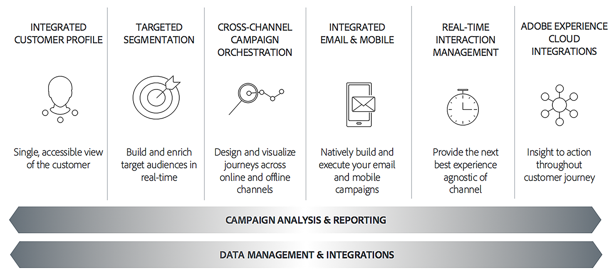

# Get Started with Campaign Classic{#about-adobe-campaign-classic}

To deliver a high degree of customer engagement and great experiences, brands must create consistent customer journeys at all touchpoints. Marketers can now efficiently design, plan, execute, manage, and optimize cross-channel marketing campaigns that deliver a high return on marketing investment and drive loyalty.

Adobe Campaign lets you coordinate the creation of conversational marketing campaigns. Adobe Campaign has innovative features to model, streamline, and automate marketing and customer communication processes.

>[!NOTE]
>
>Adobe Campaign Classic is available in v6.11 and v7. Except when mentioned, help materials apply to both versions, in the [latest build](../../rn/using/latest-release.md). Screenshots reflect Campaign Classic v7 user interface.

 [Discover primary features and capabilities in video](#video)

## Key capabilities {#key-capabilities}

Adobe Campaign provides a platform for designing cross-channel customer experiences and provides an environment for visual campaign orchestration, real time interaction management and cross channel execution.

The marketing campaign cycle in Adobe Campaign illustrates the main areas of functionality of the product:

### Integrated customer profile {#integrated-customer-profile}

Profiles (customers, prospects, newsletter subscribers, etc.) are centralized in the Adobe Campaign database. There are many possible mechanisms for acquiring profiles and building up this database: on-line collection via web forms, manual or automatic import of text files, replication with company databases or other information systems. With Adobe Campaign, you can incorporate marketing history, purchase information, preferences, CRM data, and any relevant PII data in a consolidated view to analyze and take action.

In Adobe Campaign, recipients are the default profiles targeted for sending deliveries (emails, SMS, etc.). Thanks to the recipient data that are stored in the database, you will be able to filter the target that will receive any given delivery and to add personalization data in your delivery contents. Other types of profiles exist in the database. They are designed for different uses. For example, seed profiles are made to test your deliveries before they are sent to the final target.

Profile management basics are explained in [About profiles](../../platform/using/about-profiles.md).

### Targeted segmentation {#targeted-segmentation}

Adobe Campaign has powerful, user-friendly segmentation and targeting features that let you create highly targeted, differentiated offers. The descriptive analysis functionality lets you analyze information upstream and downstream of your marketing campaigns, and the filter management and [graphical query editor](../../platform/using/about-queries-in-campaign.md) functionality lets you filter your subscriber population and sample or create target groups based on an unlimited number of criteria. The analysis and targeting features are described in [this page](../../reporting/using/about-descriptive-analysis.md) and in the [Creating filters](../../platform/using/creating-filters.md) section.

The advanced Data Management functionality extends the data processing capabilities. It simplifies and optimizes the targeting process by including data not modeled in the datamart. This functionality is detailed in [this page](../../workflow/using/targeting-data.md#data-management).

### Cross-channel campaign orchestration {#cross-channel-campaign-orchestration}

Adobe Campaign lets you design and orchestrate targeted and personalized campaigns on multiple channels: email, direct mail, SMS, push notification. A single interface provides you with all the functions required to schedule, orchestrate, configure, personalize, automate, execute, and measure all your campaigns and communications. For more on scheduling and executing campaigns, refer to [this page](../../campaign/using/setting-up-marketing-campaigns.md).

### Personalization and real-time interaction {#personalization-and-real-time-interaction}

Attract your customers' attention and improve response rates thanks to the advanced personalization of message content and headers based on customer profiles and preferences. For more on message content management and personalization, refer to [this page](../../delivery/using/about-personalization.md). Collaborative management of content, notification and approval circuits are detailed in [this section](../../mrm/using/about-marketing-resource-management.md).

### Analysis and reporting {#analysis-and-reporting}

Adobe Campaign lets you monitor and interpret the behavior of your customers by gradually enriching their data and profiles. The reporting and analysis tools let you capitalize on each new campaign, target your marketing initiatives better, and optimize their impact and return on investment. Refer to [this page](../../reporting/using/delivery-reports.md) for more information.

### Adobe Experience Cloud integrations {#adobe-experience-cloud-integrations}

You can combine the delivery functionalities and advanced campaign management functionalities of Adobe Campaign with a set of solutions created to help you personalize your users' experience: Adobe Experience Manager, Adobe Analytics, Adobe Target or Adobe Experience Cloud triggers for example. You can also integrate to Adobe IMS and login to Campaign with your Adobe ID. For more on cross-solution and authentication integrations, refer to [this section](../../integrations/using/about-adobe-id.md).

## Core capabilities and add-ons {#core-capabilities-and-add-ons}

Adobe Campaign offers a set of capabilities to help you implementing and optimizing the conversational marketing functionalities depending on your needs and your architecture. Some of them are core capabilities and some depend on the installation of a package and on your configuration. A detailed product description is available here: [Adobe Campaign Classic Product Description](https://helpx.adobe.com/legal/product-descriptions/adobe-campaign-classic---product-description.html).

The following capabilities are available. Depending on your license agreement, some of these capabilities can be available or not in your instance.

* [Channels](../../delivery/using/steps-about-delivery-creation-steps.md) - design and send deliveries on various channels: email, SMS, Line, mobile app, direct mail,
* [Campaign](../../campaign/using/designing-marketing-campaigns.md) - orchestrate cross-channel campaigns,
* [MRM](../../mrm/using/about-marketing-resource-management.md) - manage marketing resources and budgets,
* [Interaction](../../interaction/using/interaction-and-offer-management.md) - managing offers with Campaign,
* [Message Center](../../message-center/using/about-transactional-messaging.md) - send transactional messages by email, SMS or on mobile app,
* [Social Marketing](../../social/using/about-social-marketing.md) - communicate on social media: Facebook, Twitter,
* [Workflow](../../workflow/using/about-workflows.md) / Data Management - automate processes and manage data with workflows,
* [Web applications](../../web/using/about-web-applications.md) - create web pages and forms,
* [Survey Manager](../../surveys/using/about-surveys.md) - create online surveys and polls,
* [Content Manager](../../delivery/using/about-content-management.md) - manage email content,
* [Distributed Marketing](../../distributed/using/about-distributed-marketing.md) - coordinate campaigns for central/local agencies,
* [Response Manager](../../response/using/about-response-manager.md) - manage customer response,
* [Connectors](../../platform/using/about-connectors.md) - use connectors to communicate with external solutions and database engines,
* [Web Services](../../configuration/using/about-web-services.md) - use Campaign through APIs/Web Services,
* [Reporting](../../reporting/using/about-adobe-campaign-reporting-tools.md) - access built-in reports, analyze data and design your own reports.

## Tutorial video {#video}

This video presents Campaign Classic main features and capabilities.

>[!VIDEO](https://video.tv.adobe.com/v/35129?quality=12)

Additional Campaign Classic how-to videos are available [here](https://experienceleague.adobe.com/docs/campaign-classic-learn/tutorials/overview.html).
