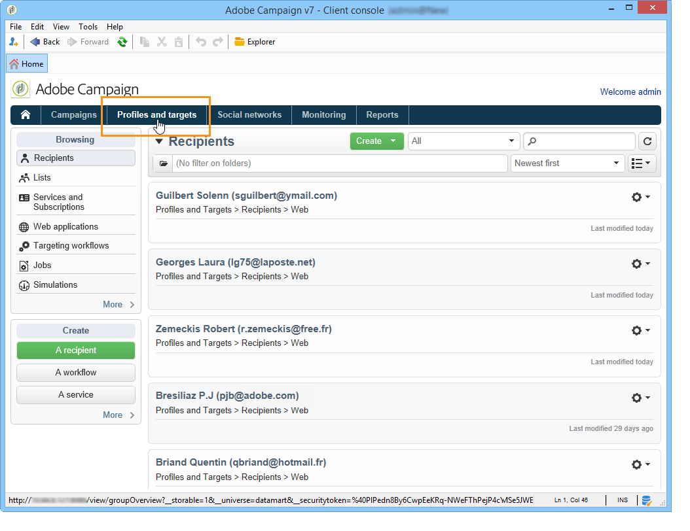
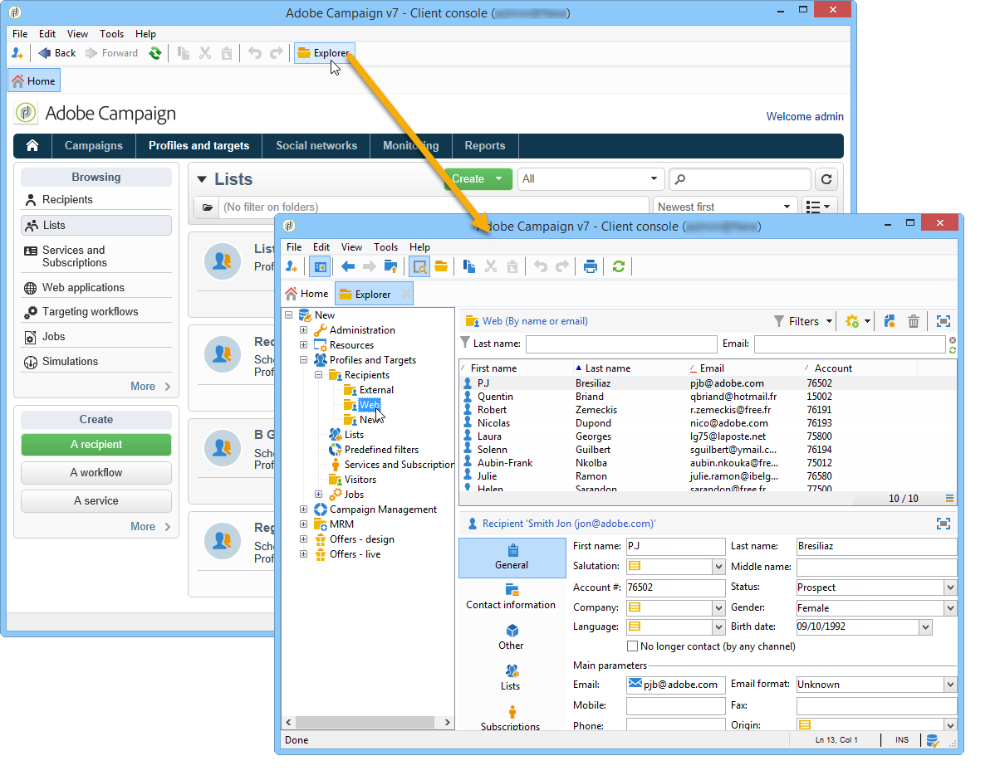

# Get started with profiles{#about-profiles}

Profiles are centralized in the Adobe Campaign database. There are many possible mechanisms for acquiring profiles and building up this database: on-line collection via web forms, manual or automatic import of text files, replication with company databases or other information systems. With Adobe Campaign, you can incorporate marketing history, purchase information, preferences, CRM data, and any relevant PI data in a consolidated view to analyze and take action.

“**Profile**” means a record of information (e.g.: a record in the nmsRecipient table or an external table containing a cookie ID, Customer ID, mobile identifier or other information relevant to a particular channel) representing an end-customer, prospect, or lead.

In Adobe Campaign, recipients are the default profiles targeted for sending deliveries (emails, SMS, etc.). Recipient data stored in the database enable you to filter the target that will receive any given delivery and to add personalization data in your delivery contents. Other types of profiles exist in the database. They are designed for different uses. For example, seed profiles are made to test your deliveries before they are sent to the final target.

 [Understand the concept of profiles in video](#create-profiles-video)

## Profile types {#profile-types}

Adobe Campaign lets you manage profiles throughout their entire lifecycle: creation, import, targeting, action tracking, updates, etc.

Each profile matches a database entry. They contain all the information required for targeting, qualifying and tracking individuals.

Profiles can be identified based on storage space. This means that a profile can match: a recipient, a visitor, an operator, a subscriber, a prospect, etc.

## Recipient profiles {#recipient-profiles}

Delivery recipients are stored in the database as profiles containing the information linked to them: last name, first name, address, subscriptions, deliveries, etc. When you create campaigns, you can define the target of the deliveries to a selection of the profiles in the base according to simple or advanced criteria.

You can also create campaigns aimed at recipients whose profiles are stored not in the database, but in files. These are known as "external" deliveries. For more information about this type of delivery, refer to [this page](../../delivery/using/steps-defining-the-target-population.md#selecting-external-recipients).

The main methods for creating recipient profiles are as follows:

* direct input in the graphical interface screens,
* importing recipient lists,
* on-line collection via web forms.

>[!NOTE]
>
>To find out how files and web forms are imported, refer to [Generic imports and exports](../../platform/using/get-started-data-import-export.md).

## Profiles and targets {#profiles-and-targets}

The **[!UICONTROL Profiles and targets]** link lets you display recipients stored in Adobe Campaign database. You can create new recipient, edit an existing recipient and access its profile. For more on this, refer to [this page](../../platform/using/editing-a-profile.md).

It also gives you access to:

* lists - [Learn more](../../platform/using/creating-and-managing-lists.md)
* subscription services - [Learn more](../../delivery/using/managing-subscriptions.md)
* web applications - [Learn more](../../web/using/about-web-applications.md)
* imports and exports (jobs) - [Learn more](../../platform/using/about-generic-imports-exports.md)
* targeting workflows - [Learn more](../../workflow/using/building-a-workflow.md#implementation-steps-)

The recipients page lets you perform frequent operations on profiles: edits, updates, adds, deletions, sorts.

For more advanced profile manipulations, you need to edit the Adobe Campaign tree. To do this, click the **[!UICONTROL Explorer]** link on the Adobe Campaign home page.

By default, recipients are stored in the **[!UICONTROL Profiles and Targets > Recipients]** node of the tree. You can create recipients from this view, as well as:

* sort and filter the profiles of the database - [Learn more](../../platform/using/filtering-options.md)
* move, copy or delete profiles from the database - [Learn more](../../platform/using/managing-profiles.md),
* update profiles - [Learn more](../../platform/using/updating-data.md)
* export recipients - [Learn more](../../platform/using/exporting-and-importing-profiles.md)
* create recipient groups - [Learn more](../../platform/using/creating-and-managing-lists.md)

To access advanced functionalities and configurations, you need to click the **[!UICONTROL Explorer]** icon. 

The general layout of the Adobe Campaign explorer is presented in [this page](../../platform/using/adobe-campaign-explorer.md).

>[!NOTE]
>
>You can also display an advanced view of this list from the Adobe Campaign tree by clicking the **[!UICONTROL Profiles and targets > Recipients]** link. The list display can be configured to suit your needs. You can add or delete columns, define column order, sort data, etc. List display configuration is described in [this page](../../platform/using/adobe-campaign-ui-lists.md).  
>
>You can also define recipient views. For further information about this functionality, refer to [this section](../../platform/using/access-management-folders.md).

## Active profiles {#active-profiles}

Active profiles are the profiles that are counted for billing purposes.

Active profiles count is available for **Marketing instances** only. It is not available for Execution instances, meaning MID (mid sourcing) and RT (Message Center / Real-time messaging) instances.

If you are hosted on AWS, you can also monitor the number of active profiles used on your instances directly from the Control Panel. For more on this, refer to the [Control Panel documentation](https://docs.adobe.com/content/help/en/control-panel/using/performance-monitoring/active-profiles-monitoring.html).

>[!NOTE]
>
>Control Panel is accessible to all Admin users. The steps to grant Admin access to a user are detailed in [this section](https://experienceleague.adobe.com/docs/control-panel/using/discover-control-panel/managing-permissions.html?lang=en#discover-control-panel).
>
>Note that your instance must be hosted on AWS and upgraded with the latest [Gold Standard](../../rn/using/gs-overview.md) build or the [latest GA build (21.1)](../../rn/using/latest-release.md). Learn how to check your version in [this section](../../platform/using/launching-adobe-campaign.md#getting-your-campaign-version). To check if your instance is hosted on AWS, follow the steps detailed in [this page](https://experienceleague.adobe.com/docs/control-panel/using/faq.html).

Billing only concerns profiles that are **active**. A profile is considered active if the profile has been targeted or communicated with in the past 12 months via any channel.

The profiles that were excluded during delivery preparation (typology rules, quarantines) are not taken into account. A profile that has been targeted by several deliveries will only be counted once.

>[!NOTE]
>
>Facebook and Twitter channels are not taken into account.

You can have an overview of the **[!UICONTROL Number of active profiles]** from Campaign Standard **[!UICONTROL Administration > Campaign Management > Customer metrics]** menu. The actual count is performed by the **[!UICONTROL Number of active billing profiles]** (**[!UICONTROL billingActiveContactCount]**) [technical workflow](../../workflow/using/about-technical-workflows.md), which runs every day and adds the new data to the existing report for the current period in the **[!UICONTROL Customer metrics]** menu. Each period lasts for 12 months.

## Tutorial video {#create-profiles-video}

Learn how to access profile data, sort and filter profiles and manually create and manage profiles.

This video also explains the compliance of Adobe Campaign Classic with General Data Protection Regulations. 

>[!VIDEO](https://video.tv.adobe.com/v/35611?quality=12)

Additional Campaign Classic how-to videos are available [here](https://experienceleague.adobe.com/docs/campaign-classic-learn/tutorials/overview.html).

**See also**

* [Privacy management in Campaign](https://helpx.adobe.com/campaign/kb/acc-privacy.html)

* [Define the target population](../../delivery/using/define-the-right-audience.md)

* [Create queries and segment data in workflows](../../workflow/using/targeting-data.md)

* [Select target mapping](../../delivery/using/selecting-a-target-mapping.md)

* [Define the audience - best practices](../../delivery/using/define-the-right-audience.md)
