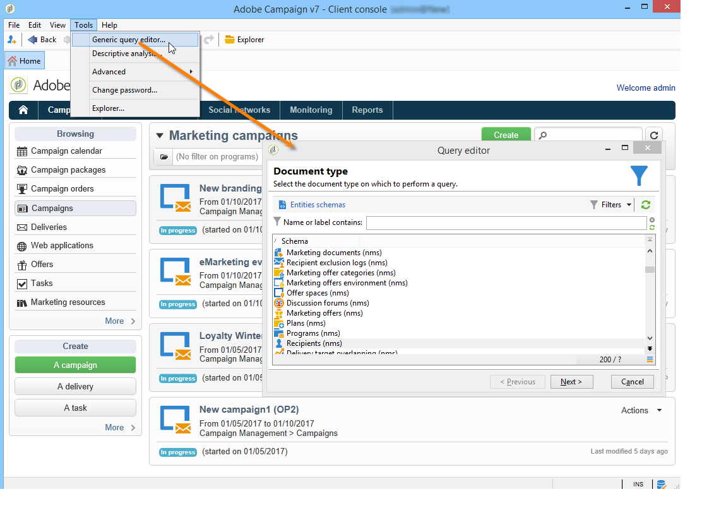

# Get started with queries{#about-queries-in-campaign}

The query tool is available at various levels of the application and can be used to define target populations, segment customers, extract and filter tracking logs, create filters, and more.

It provides a dedicated assistant — the generic query editor — accessible from the **[!UICONTROL Tools > Generic query editor...]** menu. This editor enables database queries to extract, organize, group, and sort information. For example, it can retrieve recipients who clicked more than n times on a newsletter link during a given period.

The generic query editor centralizes all querying capabilities. It allows the creation and storage of restriction filters, which can then be reused in other contexts, such as the Query box of a targeting workflow.

>[!BEGINTABS]

>[!TAB Query the database] 

Steps to create a query are detailed in **[Campaign v8 (console) documentation](https://experienceleague.adobe.com/en/docs/campaign/campaign-v8/data/query/query-editor){target=_blank}**

{target=_blank}

>[!TAB Add a query in a workflow]

Learn the key steps related to the query creation in the context of a workflow in the **[Campaign v8 documentation](https://experienceleague.adobe.com/en/docs/campaign/automation/workflows/wf-activities/targeting-activities/query){target=_blank}**

{target=_blank}

>[!TAB Filter conditions]

To design your query, you must select the filtering conditions in the query editor. Available capabilities and use cases are detailed in the **[Campaign v8 documentation](https://experienceleague.adobe.com/en/docs/campaign/campaign-v8/data/query/filter-conditions){target=_blank}**

{target=_blank}

>[!ENDTABS]

