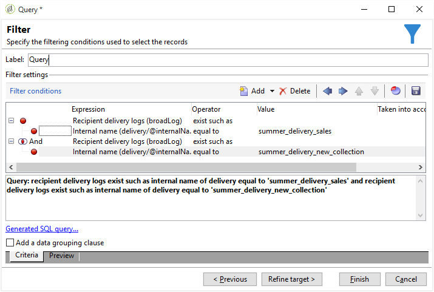

# About queries in Campaign{#about-queries-in-campaign}

The Adobe Campaign query tool can be found on multiple levels of the software: to create a target population, segment customers, extract and filter tracking logs, build filters, etc.

The Adobe Campaign query tool lets you query a database using a dedicated wizard: the generic query editor. It is accessed via the **Tools > Generic query editor...** menu. It lets you extract information stored in a database and organize, group, sort, etc. For instance, the user can recover recipients who clicked more than 'n' times on the link of a newsletter over a given period. This tool lets you collect, sort and display results based on your needs.

This tool combines all Adobe Campaign querying possibilities. For instance, it lets you create and save restriction filters. This means that a user filter created in the Generic query editor can be used in the Query box of a targeting workflow, etc.

Queries are created using fields of the selected table or using a formula.

[Click here](../../workflow/using/designing-queries.md) to discover Campaign query editor through a set of use cases.

