# Manage access to folders{#folder-access-management}

Each folder of the Explorer navigation tree has read, write, and delete access rights attached to it. To access a file, an operator or group of operators must at least have read access to it.

## Folders and views {#folders-and-views}

### What is a folder {#about-folders}

Folders are nodes in Adobe Campaign tree. These nodes are created by right-clicking the tree, via the **[!UICONTROL Add new folder]** menu. By default, the first menu enables you to add the folder corresponding to the current context.

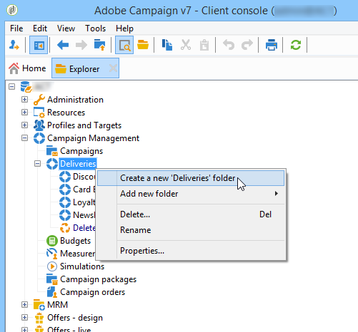

You can customize the Explorer navigation tree. Learn configuration steps and best practices [in this section](adobe-campaign-workspace.md).

### What is a view {#about-views}

In addition, you can create views in order to restrain access to data and organize the content of the tree to suit your requirements. You can then assign rights to the views.

A view is a folder that displays records that are physically stored in one or more other folders of the same type. For example, if you create a Campaign folder that is a view, it displays all the campaigns present in the database by default, whatever their origin. This data can then be filtered.

When you convert a folder to a view, all the data corresponding to the folder type present in the database is displayed in the view, irrespective of the folder in which it is saved. You can then filter it to restrict the list of data displayed.

>[!IMPORTANT]
>
>The views contain data and provide access to it, but the data is not physically stored in the view folder. The operator must have the appropriate rights for the desired action in the data source folders (read access at least).  
>
>To give access to a view without giving access to its source folder, simply do not give read access on the parent node of the source folder.

To distinguish views from folders, the name of each view is displayed in a different color (dark cyan).

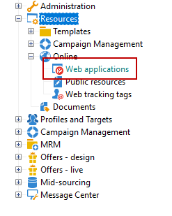

### Add folders and create views {#adding-folders-and-creating-views}

In the example below, we will create new folders to display specific data:

1. Create a new **[!UICONTROL Deliveries]** type folder, and name it **Deliveries France**.
1. Right-click this folder and select **[!UICONTROL Properties...]**.

   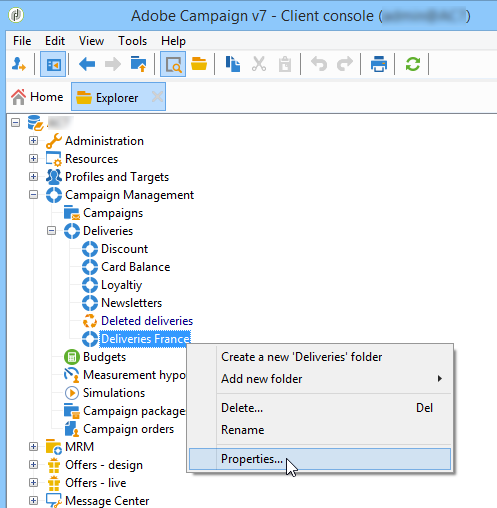

1. In the **[!UICONTROL Restriction]** tab, select **[!UICONTROL This folder is a view]**. All the deliveries in the database will then be displayed.

   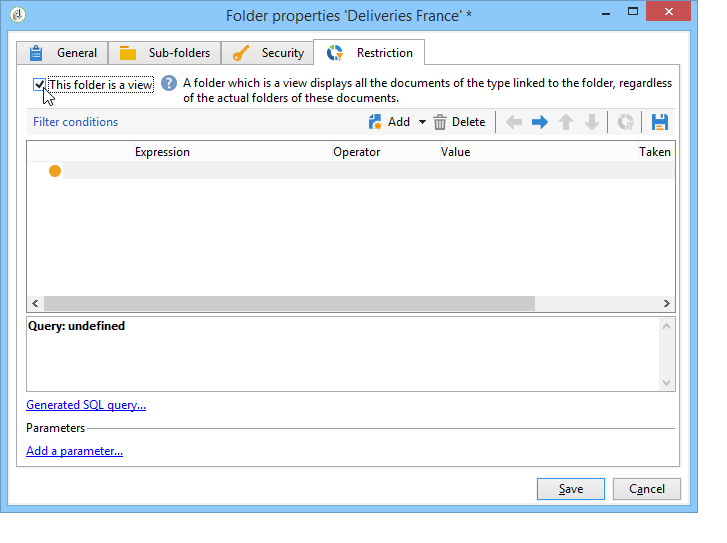

1. Define the delivery filter criteria from the query editor in the middle section of the window: the campaigns corresponding to the defined filter will then be displayed.

   >[!NOTE]
   >
   >The query editor is presented in [this section](../../platform/using/about-queries-in-campaign.md).

   With the following filter conditions:

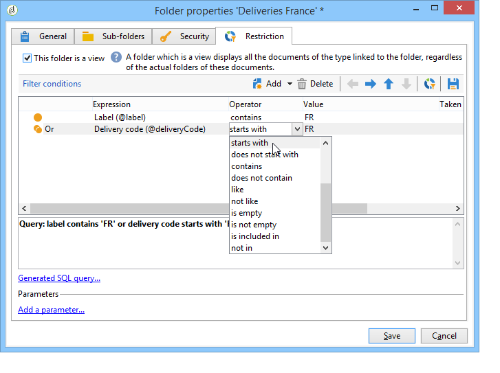

The following deliveries will be displayed in the view:

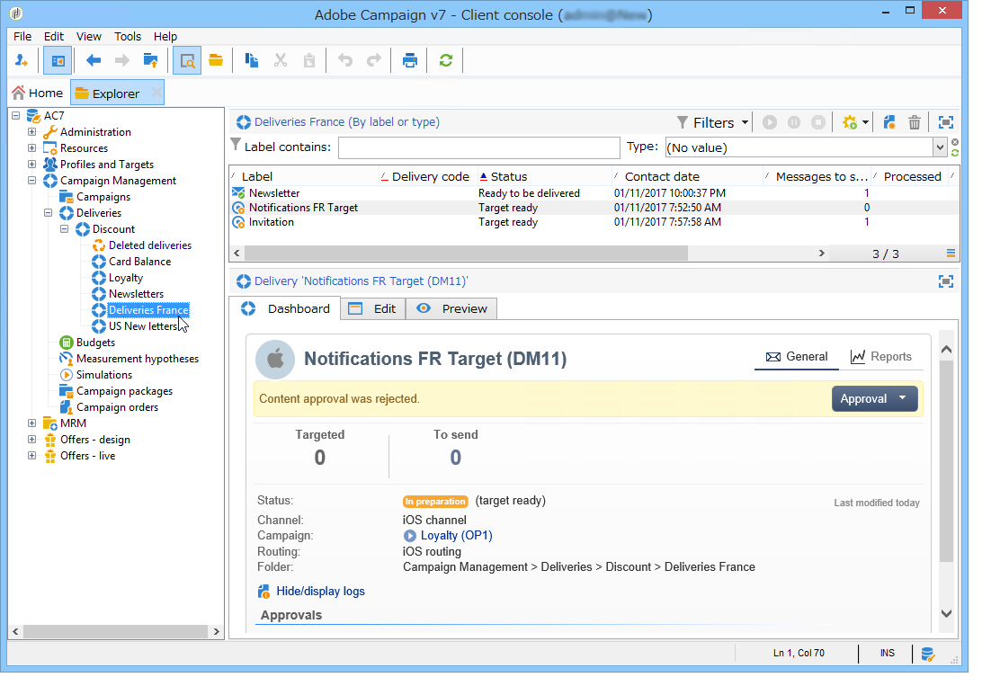

>[!NOTE]
>
>When managing [transactional messaging](../../message-center/using/about-transactional-messaging.md) events, the **[!UICONTROL Real time events]** or **[!UICONTROL Batch events]** folders must not be set as views on the execution instances, as this could lead to access right issues. For more on event collection, see [this section](../../message-center/using/event-collection.md).

## Permissions on a folder

### Edit permissions on a folder {#edit-permissions-on-a-folder}

To edit permissions on a specific folder of the tree, follow the steps below:

1. Right-click on the folder and select **[!UICONTROL Properties...]**.

   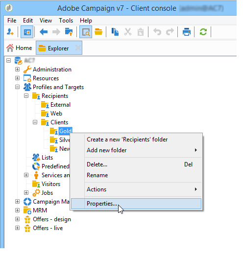

1. Click the **[!UICONTROL Security]** tab to view authorizations on this folder.

   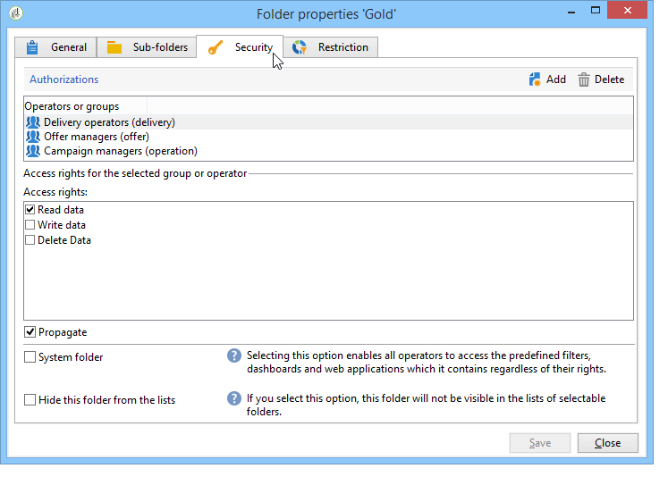

### Modify permissions {#modify-permissions}

To modify permissions, you can:

* **Replace a group or an operator**. To do this, click one of the groups (or operators) with rights to the folder, and select a new group (or a new operator) from the drop-down list:

  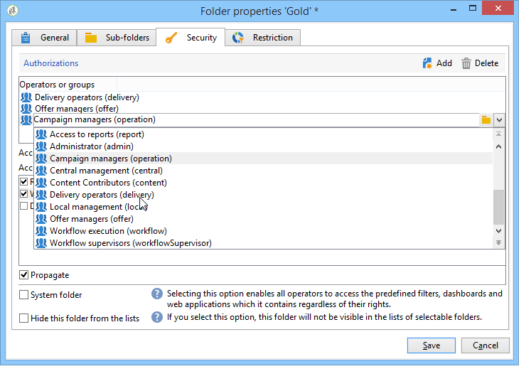

* **Authorize a group or an operator**. To do this, click the **[!UICONTROL Add]** button and select the group or operator to which you want to assign authorizations for this folder.
* **Forbid a group or an operator**. To do this, click **[!UICONTROL Delete]** and select the group or operator from which you want to remove authorization for this folder.
* **Select the rights assigned to a group or an operator**. To do this, click the group or operator concerned, then select the access rights you want to grant and deselect the others.

  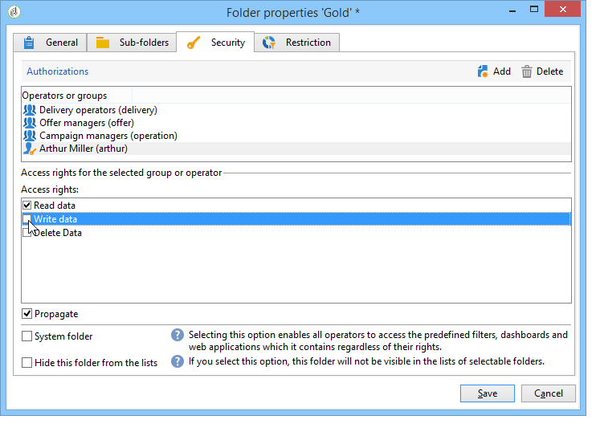

### Propagate permissions {#propagate-permissions}

You can propagate authorizations and access rights. To do this, select the **[!UICONTROL Propagate]** option in the folder properties.

The authorizations defined in this window will then be applied to all the sub-folders of the current node. You can then overload these authorizations for each of the sub-folders.

>[!NOTE]
>
>Clearing this option for a folder does not automatically clear it for the sub-folders. You must clear it explicitly for each of the sub-folders.

### Grant access to all operators {#grant-access-to-all-operators}

In the **[!UICONTROL Security]** tab, if the **[!UICONTROL System folder]** option is selected, all operators will have access to this data, regardless of their rights. If this option is cleared, you must explicitly add the operator (or their group) to the list of authorizations in order for them to have access.

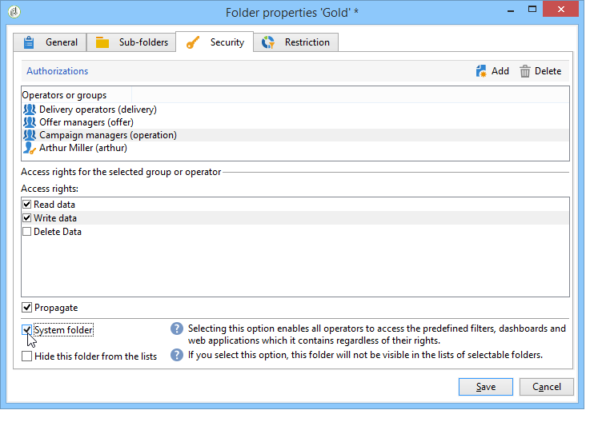
