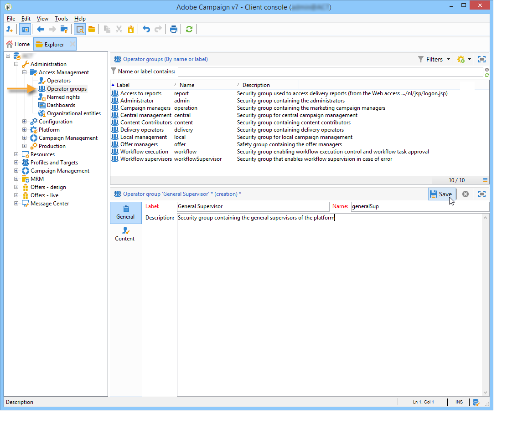
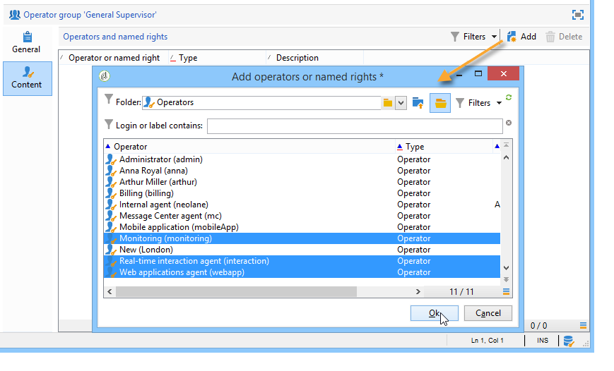

# Create and manage operator groups {#operator-groups}

Operator groups are created via the **[!UICONTROL Administration > Access management > Operator groups]** node in the tree.

## Create a new operator group {#creating-a-new-operator-group}

To create a new operator group, apply the following steps:

1. Click the **[!UICONTROL New]** button to the right of the list of groups or right-click the list and choose **[!UICONTROL New]**.
1. In the section lower window, from the **[!UICONTROL General]** tab, enter the name and a description for this group in the corresponding fields.

   

1. Click the **[!UICONTROL Content]** tab to define authorizations for this group.
1. Click the **[!UICONTROL Add]** button to select an appointed right or an operator to associate to the group.
1. Click the drop-down list or on the folder to the right of the **[!UICONTROL Folder]** field to locate the appointed rights or operators to associate to this group.
1. Select the rights or operators to add and click **[!UICONTROL OK]** to validate.

   

   Repeat this operation to add other rights or operators.

1. Click the **[!UICONTROL Save]** button to add the group to the list.

## Default groups {#default-groups}

The default operator groups are:

1. **[!UICONTROL Administrator]**

   The operators in this group have full access to the instance. Administrators are users who can access the most technical parts of the interface. They hold the **[!UICONTROL Administration]** role and make sure that the platform is all set up.

   This group contains the following named right:

    * **[!UICONTROL ADMINISTRATION]**: right to execute/create/edit/delete any object such as workflow, delivery, scripts, etc.

1. **[!UICONTROL Delivery operators]**

   The operators in this group are in charge of managing deliveries: they enable access to the main resources required for creating and preparing deliveries (campaign typologies, delivery mappings, default templates, personalization blocks, etc.).

   This group contains the following named rights:

    * **[!UICONTROL PREPARE DELIVERIES]**: right to create, edit and start the delivery analysis,
    * **[!UICONTROL START DELIVERIES]**: right to approve previously analyzed deliveries.

1. **[!UICONTROL Campaign managers]**

   The operators in this group can manage marketing campaigns: it lets you access the objects linked to campaigns (plans, programs, workflows, budgets, etc.) within the framework of **[!UICONTROL Campaign]** (optional Adobe Campaign module).

   This group contains the following named rights:

    * **[!UICONTROL INSERT FOLDERS]**: right to insert folders into the Adobe Campaign tree (provided you have editing rights for the concerned branches),
    * **[!UICONTROL WORKFLOW]**: right to use workflows.

   >[!NOTE]
   >
   >This group does not enable operators to start deliveries.

1. **[!UICONTROL Content contributors]**

   The operators in this group can access the Content folders, within the framework of **[!UICONTROL Content management]** (optional Adobe Campaign module). This group does not grant any additional rights.

1. **[!UICONTROL Access to reports]**

   This group is reserved for external operators, to access the delivery reports via a Web access.

1. **[!UICONTROL Workflow execution]**

   This group lets you assign operators the right to manage workflows which are unrelated to campaigns.

1. **[!UICONTROL Workflow supervisors]**

   The operators in this group receive an email notification in case of alerts concerning campaign workflows.

1. Local / Central management

   These groups let you use **[!UICONTROL Distributed marketing]** (optional Adobe Campaign module).

1. **[!UICONTROL Offer managers]**

   The operators in this group can create and maintain offers. For more information on this, refer to this [page](../../interaction/using/operator-profiles.md).
   This group contains the following named rights:

    * **[!UICONTROL INSERT FOLDERS]**: Right to insert folders into the Adobe Campaign tree (provided you have editing rights for the concerned branches),
    * **[!UICONTROL EDIT FOLDERS]**: Right to alter folder properties such as internal name, label, associated image, sub folder order, etc.
