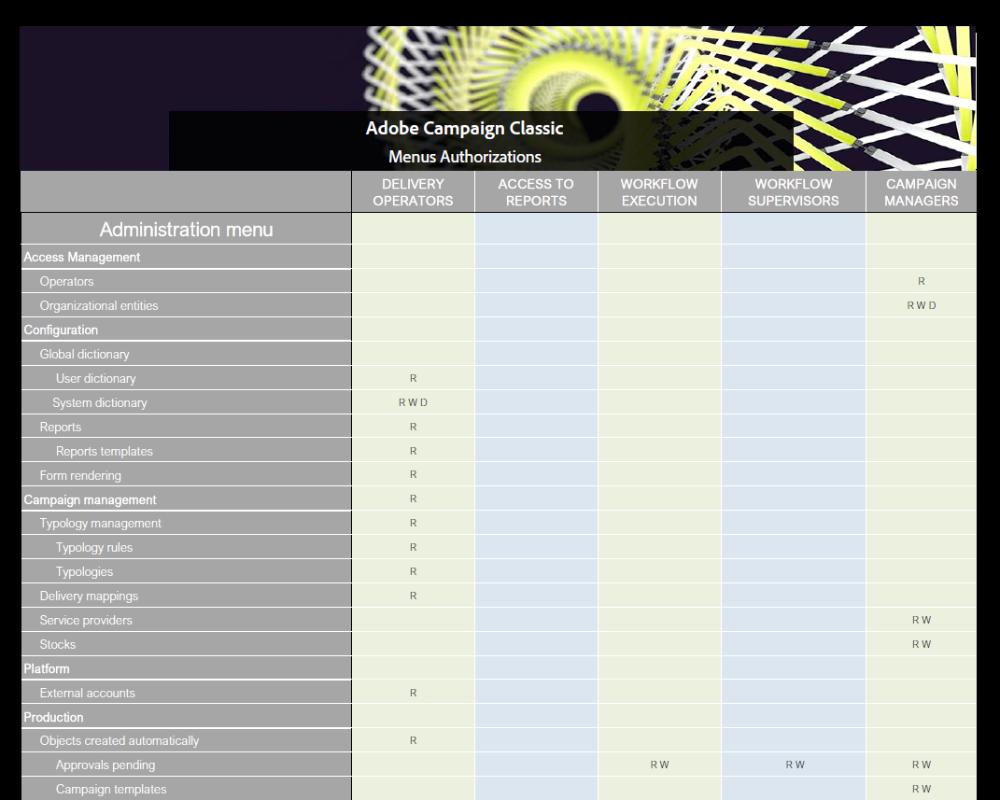

# Use named rights to set up permissions{#named-rights}

By default, Adobe Campaign proposes a set of named rights that let you define the authorizations assigned to operators and groups of operators. These rights can be edited from the **[!UICONTROL Administration > Access management > Named rights]** node of the tree. 

These rights are as follows:

* **[!UICONTROL ADMINISTRATION]**: Operators with the **[!UICONTROL ADMINISTRATION]** right has full access on the instance. Admin users can execute/create/edit/delete any object such as workflow, delivery, scripts, etc.

* **[!UICONTROL APPROVAL ADMINISTRATION]**: You can set multiple approval steps within workflows and deliveries to ensure that the current state has been approved by an assigned operator or group. Users with the **[!UICONTROL APPROVAL ADMINISTRATION]** right can set approval steps and also assign an operator or operator group who should approve those steps.

* **[!UICONTROL CENTRAL]**: Right for central management (Distributed Marketing).

* **[!UICONTROL DELETE FOLDER]**: Right to delete folders. With this right, users are allowed to delete folders from the explorer view.

* **[!UICONTROL EDIT FOLDERS]**: Right to alter folder properties such as internal name, label, associated image, sub folder order, etc.

* **[!UICONTROL EXPORT]**: Users can export data out of their Adobe Campaign instances into a file on server or local machine using the **[!UICONTROL EXPORT]** workflow activity.

* **[!UICONTROL FILES ACCESS]**: Right to read and write access for files via a script which can be written in the **[!UICONTROL JavaScript]** workflow activity to read/write files on a server.

* **[!UICONTROL IMPORT]**: Right for generic data import. **[!UICONTROL IMPORT]** allows you to import data into any other table whereas the **[!UICONTROL RECIPIENT IMPORT]** right allows to import into the recipient table only.

* **[!UICONTROL INSERT FOLDERS]**: Right to insert folders. Users with the **[!UICONTROL INSERT FOLDERS]** right can create new folders in the folder tree in explorer view.

* **[!UICONTROL LOCAL]**: Right for local management (Distributed Marketing).

* **[!UICONTROL MERGE]**: Right to merge the selected records into one. If recipients exist as duplicates, the **[!UICONTROL MERGE]** right allows user to select the duplicates and merge them into a primary recipient.

* **[!UICONTROL PREPARE DELIVERIES]**: Right to create, edit and save a delivery. Users with the **[!UICONTROL PREPARE DELIVERIES]** right can also start the delivery analysis process.

* **[!UICONTROL PRIVACY DATA RIGHT]**: Right to collect and delete privacy data. For more on this, refer to this [page](https://helpx.adobe.com/campaign/kb/acc-privacy.html).

* **[!UICONTROL PROGRAM EXECUTION]**: Right to execute commands in various programming languages.

* **[!UICONTROL RECIPIENT IMPORT]**: Right to import recipients. Users with the **[!UICONTROL RECIPIENT IMPORT]** right can import a local file into recipient table.

* **[!UICONTROL SQL SCRIPT EXECUTION]** Right to execute any SQL command directly on the database.

* **[!UICONTROL START DELIVERIES]**: Right to approve previously analyzed deliveries. After the delivery analysis, delivery will pause at various approval steps and will need to be approved to resume. Users with the **[!UICONTROL START DELIVERIES]** right are allowed to approve deliveries.

* **[!UICONTROL USE SQL DATA MANAGEMENT ACTIVITY]**: Right to write your own SQL scripts using the SQL Data Management activity, in order to create and populate work tables (see [this section](../../workflow/using/sql-data-management.md)).

* **[!UICONTROL WORKFLOW]**: Right to execute workflows. Without this right, users cannot start, stop or restart workflows.

* **[!UICONTROL WEBAPP]**: Right to use web applications.

>[!NOTE]
>
>This list can differ depending on the add-ons installed on the platform.

## Access rights matrix {#access-rights-matrix}

Default groups and named rights allow operators to access certain folders in the navigation hierarchy, and grant read, write, and delete permissions.

Adobe Campaign access rights matrix is available [here](/help/platform/using/assets/access-rights-matrix.pdf).

