# Create and manage operators {#operators}

## Get started with Campaign operators  {#about-operators}

An operator is an Adobe Campaign user who has permissions to log in and perform actions.

By default, operators are stored in the **[!UICONTROL Administration > Access management > Operators]** node.

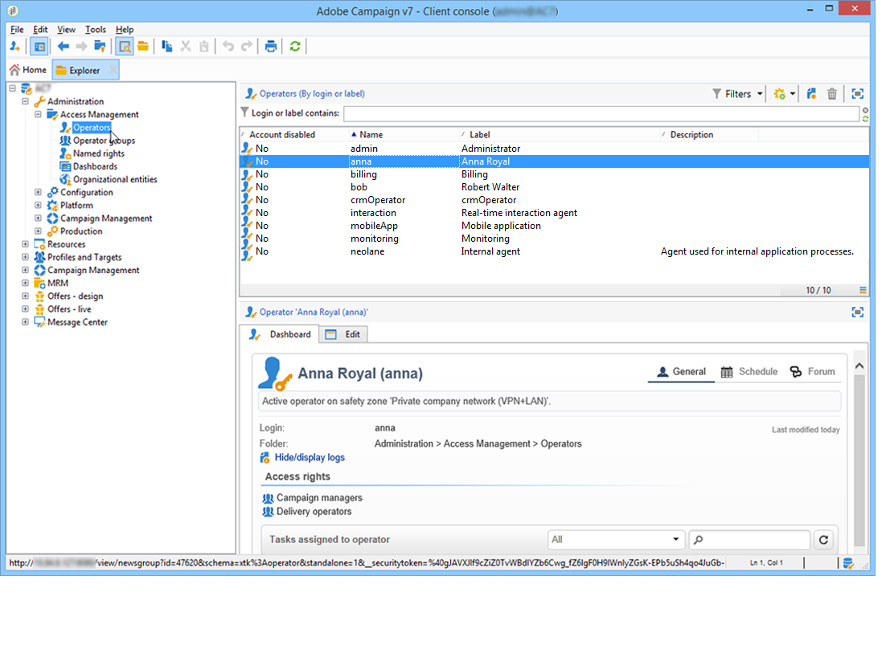

Operators can be created manually or mapped on an existing LDAP directory.

Complete procedure to create an operator is described in [this page](#creating-an-operator).

For more on Adobe Campaign and LDAP integration, refer to [this page](../../installation/using/connecting-through-ldap.md).

>[!IMPORTANT]
>
>Operators need to be linked to a security zone to log on to an instance. For more on security zones in Adobe Campaign, refer to [this page](../../installation/using/security-zones.md).

Users can also directly connect to Adobe Campaign using their Adobe ID. For more on this, refer to this [page](../../integrations/using/about-adobe-id.md).

## Create an operator {#creating-an-operator}

To create a new operator and grant permissions, follow the steps below:

1. Click the **[!UICONTROL New]** button located above the list of operators, and enter the details of the new operator.

   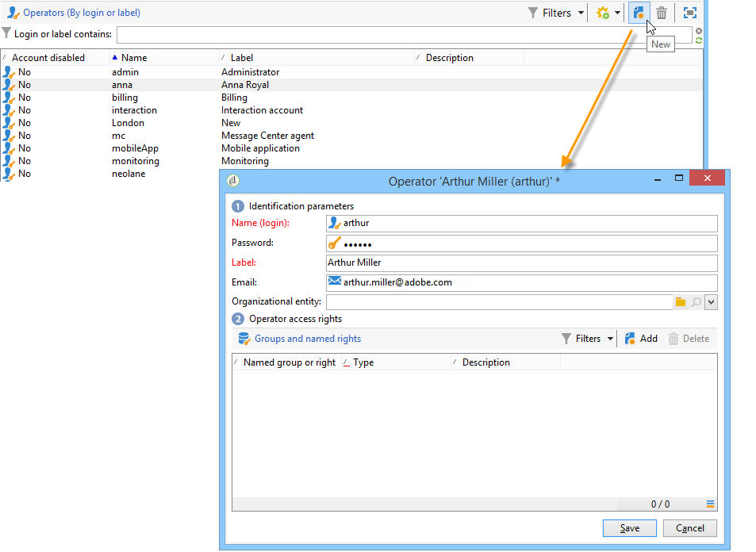

1. Specify the **[!UICONTROL Identification parameters]** of the user: its login, password and name. The login and password will be used by the operator to log on to Adobe Campaign. Once the user is logged on, they can change their password via the **[!UICONTROL Tools > Change password]** menu. The email of the operator is essential as it enables the operator to receive notifications, for instance when processing approvals.

   This section also enables you to link an operator to an organizational entity. For more on this, refer to the [this page](../../campaign/using/about-distributed-marketing.md).

1. Select the permissions granted to the operator in the **[!UICONTROL Operator access rights]** section.

   To assign rights to the operator, click the **[!UICONTROL Add]** button located above the list of rights, then select a group of operators from the list of available groups:

   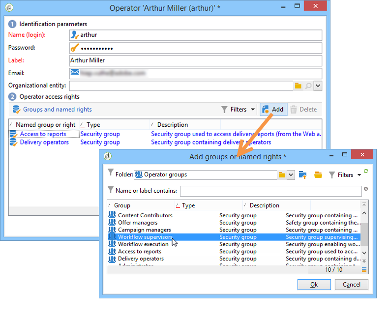

   You can also select one or more named rights (refer to [Named rights](#named-rights)). To do this, click the arrow to the right of the **[!UICONTROL Folder]** field, and select **[!UICONTROL Named rights]**:

   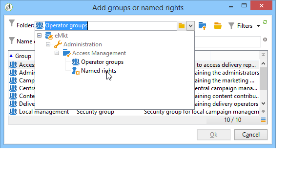

   Select groups and/or named rights to be assigned and click **[!UICONTROL OK]** to validate.

1. Click **[!UICONTROL Ok]** to create the operator: the profile is added to the list of existing operators.

   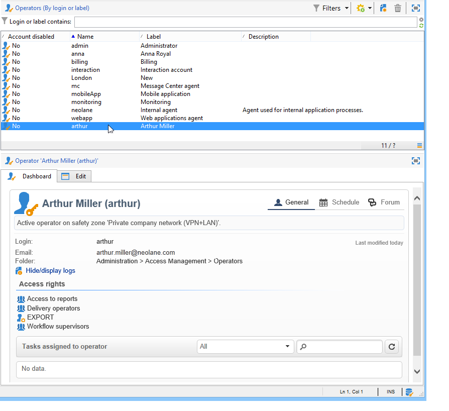

>[!NOTE]
>
>You can organize the operators according to your requirements by creating new operator folders. To do this, right-click the operator folder and select **[!UICONTROL Add an 'Operators' folder]**.

Once the operator's profile has been created, you can add to or update their information. To do this, click the **[!UICONTROL Edit]** tab. 

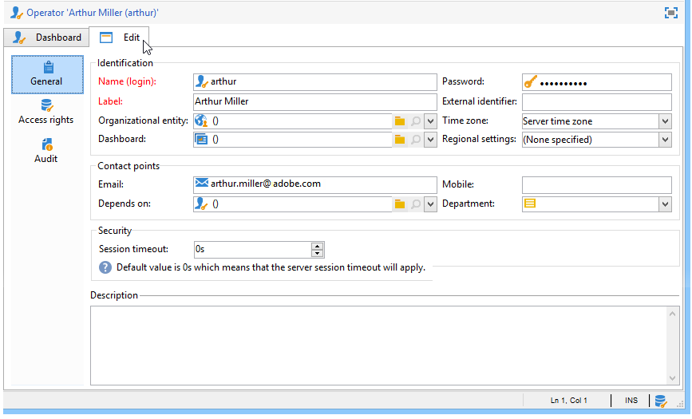

>[!NOTE]
>
>The **[!UICONTROL Session timeout]** field lets you adjust the delay before the FDA session timeout. For more on this, refer to [About Federated Data Access](../../installation/using/about-fda.md).

## Define the operator's time zone {#time-zone-of-the-operator}

In the **[!UICONTROL General]** tab, you can select the time zone of the operator. By default, operators work in the server time zone. However, it is possible to select another time zone using the drop-down list.

The configuration of time zones is described in [this page](../../installation/using/time-zone-management.md).

>[!NOTE]
>
>Collaborations within various time zones require the storage of dates in UTC. Dates are converted in the appropriate time zone in the following contexts: when a date is displayed in the user time zone, when files are imported and exported, when an email delivery is scheduled, when activities are scheduled in a workflow (scheduler, wait, time constraint, etc.)  
>
>Constraints and recommendations linked to these contexts are presented in related sections of the Adobe Campaign documentation.

In addition, the **[!UICONTROL Regional settings]** drop-down list lets you select the format to display dates and numbers.

## Add permissions {#access-rights-options}

Use the **[!UICONTROL Access rights]** tab to update the groups and named rights linked to the operator.

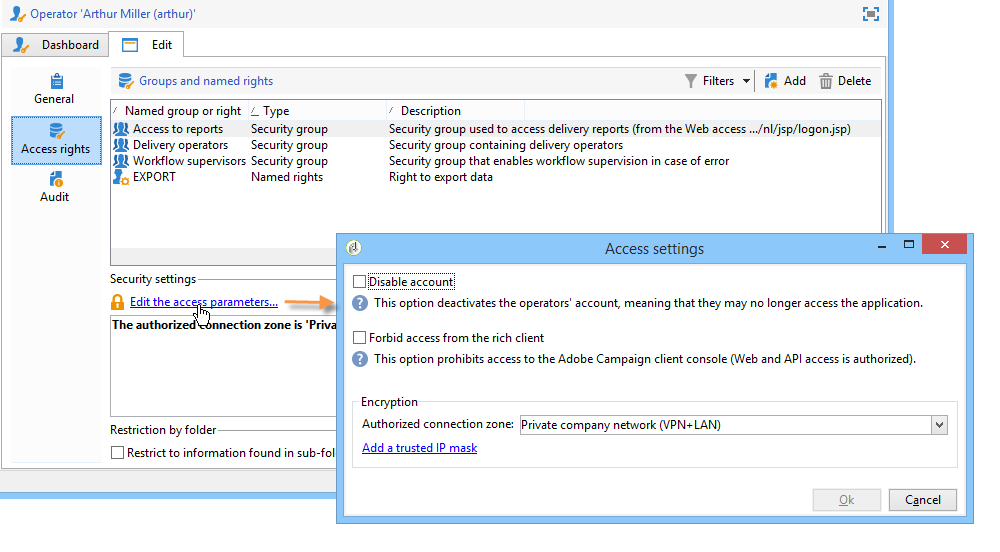

The **[!UICONTROL Edit the access parameters...]** link lets you access the following options:

* The **[!UICONTROL Disable account]** option lets you disable the operator's account: he will no longer access Adobe Campaign.

  >[!NOTE]
  >
  >Even if his account is disabled, the operator can still receive alerts or notifications from Campaign. To stop sending Campaign notifications to this operator, Adobe recommends you to remove the email address from his profile.

* The **[!UICONTROL Forbid access from the rich client]** option lets you restrict the use of Adobe Campaign to [Web access](../../platform/using/adobe-campaign-workspace.md#console-and-web-access) or through APIs: access to the Adobe Campaign client console is no longer available.
* It's possible to link a safety zone to the operator. For more on this, refer to [this page](../../installation/using/security-zones.md).
* You can also define a trusted IP mask using the appropriate link.

  The operator will be able to connect to Adobe Campaign without entering their password if their IP address is in this list.

  You can also specify a set of IP addresses that will be authorized to connect without a password, such as in the following example:

  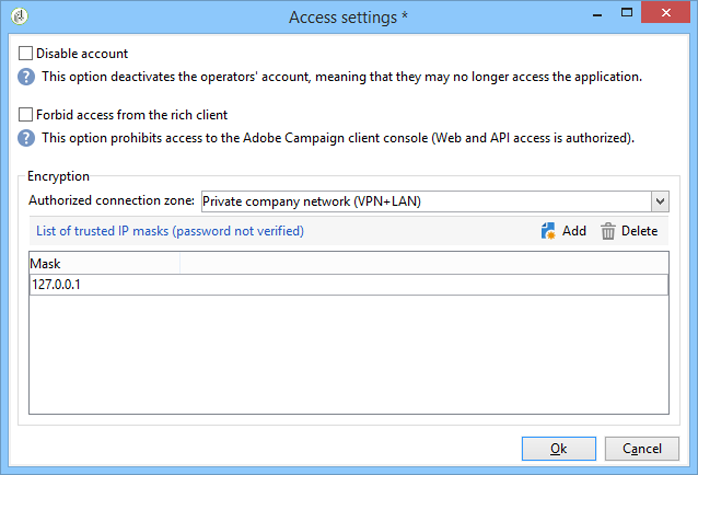

  >[!NOTE]
  >
  >To keep access to your platform secure, this option must be used with care.

* The **[!UICONTROL Restrict to information found in sub-folders of:]** option lets you limit the rights attributed to the operator of a folder. Only the subfolders of the node specified in this option will be visible to the user:

  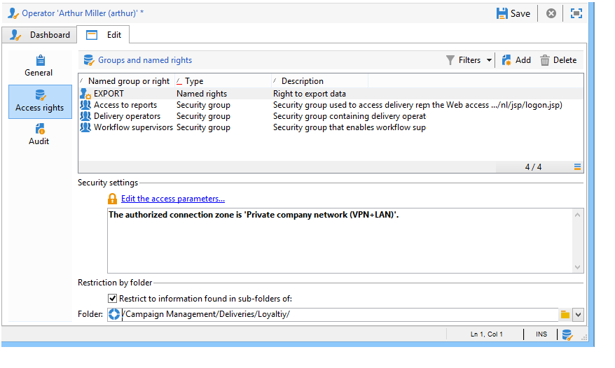

  >[!IMPORTANT]
  >
  >This is a very tight restriction, and it must be used with caution. An operator logged in with this type of rights can ONLY see the content of the specified folder, and has no access to any other node of the tree via the explorer. However, depending on the functionalities he has access to (for example: workflows), he can display data that is usually stored in nodes that he cannot see.

### Check settings {#check-settings}

The **[!UICONTROL Audit]** tab lets you view information related to the operator. The various tabs are added to automatically based on the settings defined in the operator's area of intervention.

You can access:

* The list of rights on folders linked to the operator.

  

  >[!NOTE]
  >
  >For more on this, refer to [Folder access management](#folder-access-management).

* The operator approvals log.

  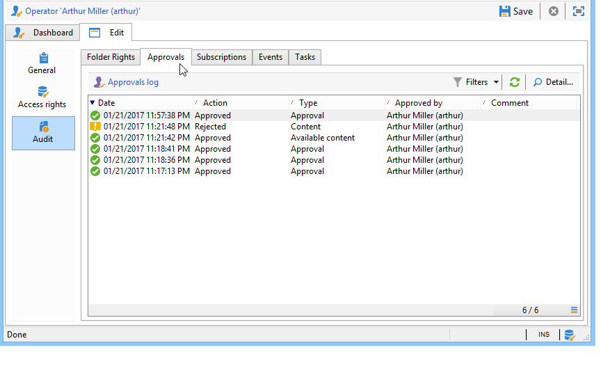

* The list of discussion forums which they are subscribed to.
* Events in their calendar.
* The list of tasks assigned to them.

## Default operators {#default-operators}

Adobe Campaign uses technical operators with profiles configured by default: Administrator ('admin'), Billing ('billing'), Monitoring, Web application agent ('webapp'), etc. Some of these depend on the applications and options installed on the platform: 'central' and 'local' operators, for instance, are only visible if the Distributed Marketing option is installed.

>[!IMPORTANT]
>
>These technical operators are notified by default when information messages are returned by the platform. We strongly recommend providing a contact email for them.  
>
>To make sure Web applications operate correctly, we also recommend not defining specific regional settings for the 'webapp' operator.

By default, the 'webapp' technical operator has the named ADMINISTRATION right, which can lead to security risks. To fix this problem, we recommend removing this right. To do this:

1. From the **[!UICONTROL Administration > Access management > Named rights]** node, click **[!UICONTROL New]** to create a right and name it WEBAPP.

   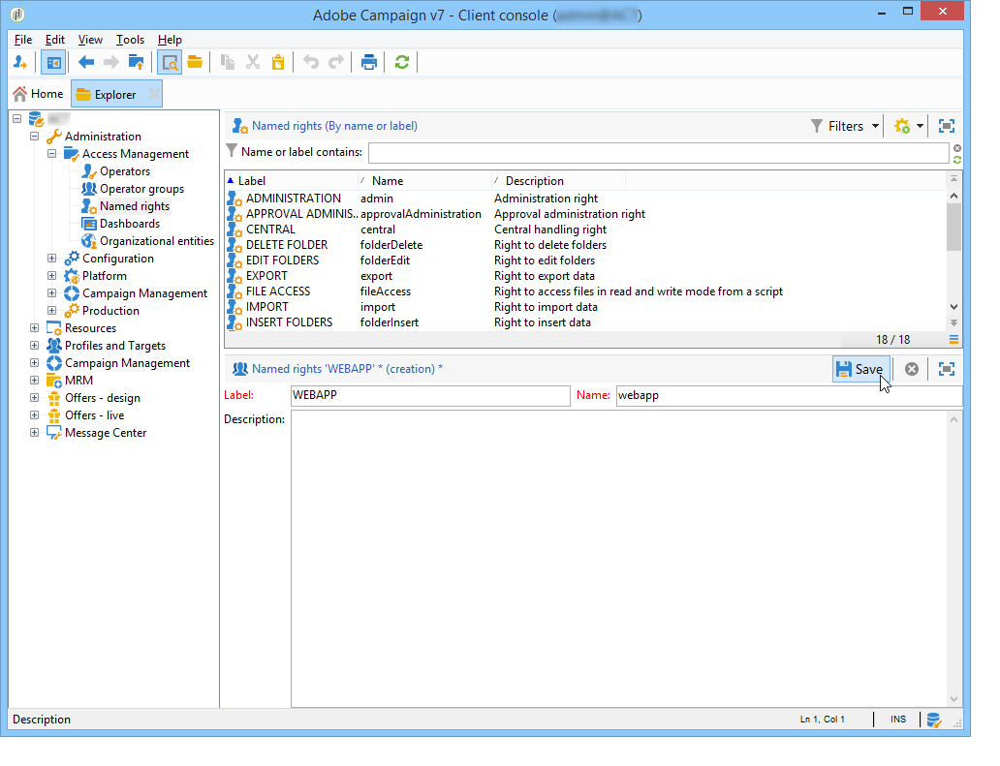

   Named rights are detailed in the [Named rights](#named-rights) section.

1. From the **[!UICONTROL Administration > Access management > Operators]** node, select the Web applications agent operator ('webapp').

   Select the **[!UICONTROL Edit]** tab, then the **[!UICONTROL Access rights]** tab and delete the ADMINISTRATION named right from the list.

   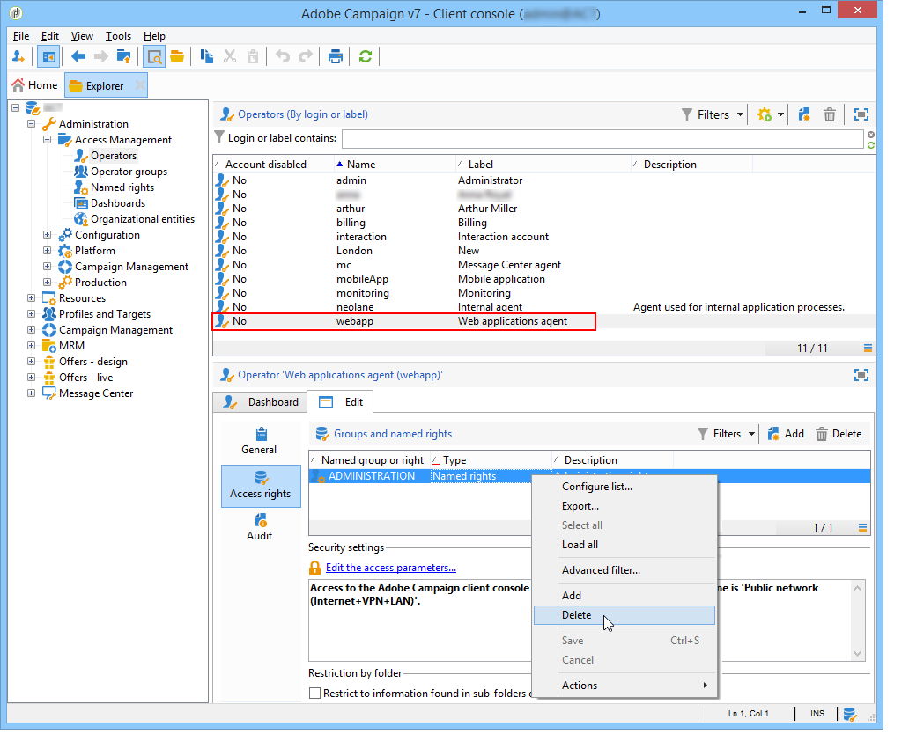

   Click **[!UICONTROL Add]** and select the WEBAPP right that you have just created, then save your changes.

   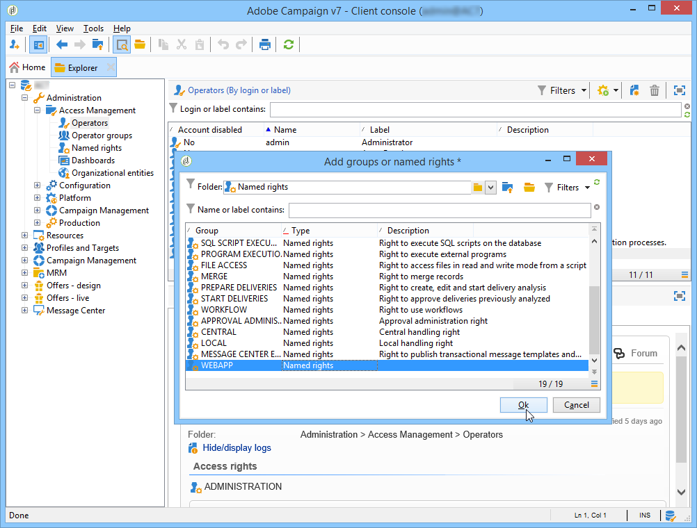

1. Assign the 'webapp' operator read and write data access rights on the folders that concern this operator, which is primarily the 'Recipient' folders.

   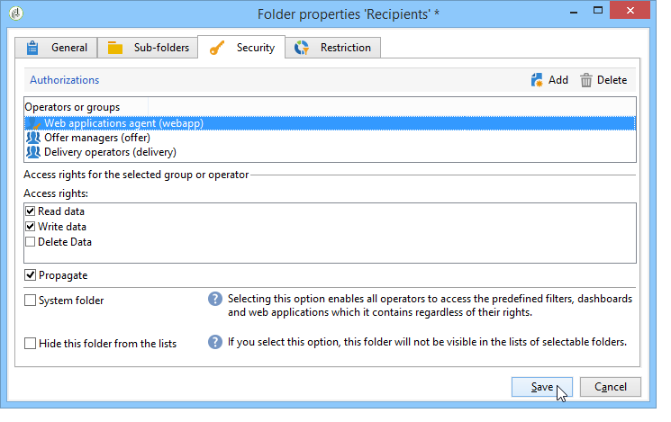

   Modifying rights on tree folders is detailed in the [Folder access management](#folder-access-management) section.

>[!NOTE]
>
>For more information on Security guidelines, refer to [Adobe Campaign Security configuration checklist](https://helpx.adobe.com/campaign/kb/acc-security.html).
