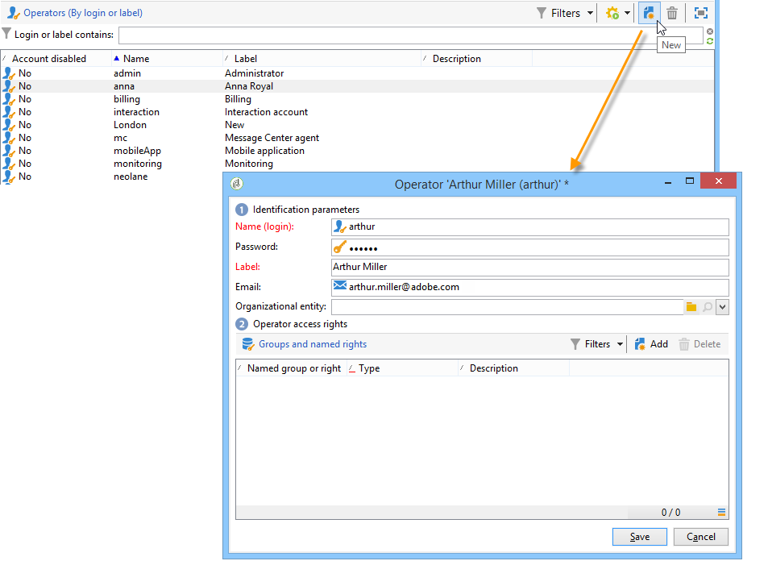

# Access management{#access-management}

## About permissions {#about-permissions}

Adobe Campaign lets you define and manage the rights assigned to the various operators. These are a set of rights and restrictions that authorize or deny:

* Access to certain functionalities (via the named rights),
* Access to certain records,
* Creation, modification and/or deletion of records (actions, contacts, campaigns, groups, etc.).

The permissions apply to operator profiles or operator groups.

They are completed by safety parameters linked to the operator's connection mode to Adobe Campaign. For more on this, refer to [this page](../../installation/using/configuring-campaign-server.md#defining-security-zones).

There are two types of permissions you can grant to a user:

* You can define groups of operators to which you attribute rights, then associate the operators with one or more groups. This enables you to reuse rights and make operator profiles more consistent. It also facilitates the management and maintenance of profiles. Group creation and management are presented in [Operator groups](#operator-groups).
* You can attribute named rights directly to users, in some cases to overload the rights allocated via groups. These rights are presented in [Named rights](#named-rights).

>[!NOTE]
>
>Before starting defining permissions, Adobe recommends you to read the [Security configuration checklist](https://helpx.adobe.com/campaign/kb/acc-security.html).

## Operators {#operators}

### About operators {#about-operators}

An operator is an Adobe Campaign user who has permissions to log in and perform actions.

By default, operators are stored in the **[!UICONTROL Administration > Access management > Operators]** node.

Operators can be created manually or mapped on an existing LDAP directory.

Complete procedure to create an operator is described in [this page](#creating-an-operator).

For more on Adobe Campaign and LDAP integration, refer to [this page](../../installation/using/connecting-through-ldap.md).

>[!IMPORTANT]
>
>Operators need to be linked to a security zone to log on to an instance. For more on security zones in Adobe Campaign, refer to [this page](../../installation/using/configuring-campaign-server.md#defining-security-zones).

Users can also directly connect to Adobe Campaign using their Adobe ID. For more on this, refer to this [page](../../integrations/using/about-adobe-id.md).

### Creating an operator {#creating-an-operator}

To create a new operator and grant permissions, follow the steps below:

1. Click the **[!UICONTROL New]** button located above the list of operators, and enter the details of the new operator.

   

1. Specify the **[!UICONTROL Identification parameters]** of the user: its login, password and name. The login and password will be used by the operator to log on to Adobe Campaign. Once the user is logged on, they can change their password via the **[!UICONTROL Tools > Change password]** menu. The email of the operator is essential as it enables the operator to receive notifications, for instance when processing approvals.

   This section also enables you to link an operator to an organizational entity. For more on this, refer to the [this page](../../campaign/using/about-distributed-marketing.md).

1. Select the permissions granted to the operator in the **[!UICONTROL Operator access rights]** section.

   To assign rights to the operator, click the **[!UICONTROL Add]** button located above the list of rights, then select a group of operators from the list of available groups:

   

   You can also select one or more named rights (refer to [Named rights](#named-rights)). To do this, click the arrow to the right of the **[!UICONTROL Folder]** field, and select **[!UICONTROL Named rights]**:

   

   Select groups and/or named rights to be assigned and click **[!UICONTROL OK]** to validate.

1. Click **[!UICONTROL Ok]** to create the operator: the profile is added to the list of existing operators.

   

>[!NOTE]
>
>You can organize the operators according to your requirements by creating new operator folders. To do this, right-click the operator folder and select **[!UICONTROL Add an 'Operators' folder]**.

Once the operator's profile has been created, you can add to or update their information. To do this, click the **[!UICONTROL Edit]** tab. 

>[!NOTE]
>
>The **[!UICONTROL Session timeout]** field lets you adjust the delay before the FDA session timeout. For more on this, refer to [About Federated Data Access](../../installation/using/about-fda.md).

### Time zone of the operator {#time-zone-of-the-operator}

In the **[!UICONTROL General]** tab, you can select the time zone of the operator. By default, operators work in the server time zone. However, it is possible to select another time zone using the drop-down list.

The configuration of time zones is described in [this page](../../installation/using/time-zone-management.md).

>[!NOTE]
>
>Collaborations within various time zones require the storage of dates in UTC. Dates are converted in the appropriate time zone in the following contexts: when a date is displayed in the user time zone, when files are imported and exported, when an email delivery is scheduled, when activities are scheduled in a workflow (scheduler, wait, time constraint, etc.)  
>
>Constraints and recommendations linked to these contexts are presented in related sections of the Adobe Campaign documentation.

In addition, the **[!UICONTROL Regional settings]** drop-down list lets you select the format to display dates and numbers.

### Access rights options {#access-rights-options}

Use the **[!UICONTROL Access rights]** tab to update the groups and named rights linked to the operator.

The **[!UICONTROL Edit the access parameters...]** link lets you access the following options:

* The **[!UICONTROL Disable account]** option lets you disable the operator's account: he will no longer access Adobe Campaign.
* The **[!UICONTROL Forbid access from the rich client]** option lets you restrict the use of Adobe Campaign to [Web access](../../platform/using/adobe-campaign-workspace.md#console-and-web-access) or through APIs: access to the Adobe Campaign client console is no longer available.
* It's possible to link a safety zone to the operator. For more on this, refer to [this page](../../installation/using/configuring-campaign-server.md#defining-security-zones).
* You can also define a trusted IP mask using the appropriate link.

  The operator will be able to connect to Adobe Campaign without entering their password if their IP address is in this list.

  You can also specify a set of IP addresses that will be authorized to connect without a password, such as in the following example:

  

  >[!NOTE]
  >
  >To keep access to your platform secure, this option must be used with care.

* The **[!UICONTROL Restrict to information found in sub-folders of:]** option lets you limit the rights attributed to the operator of a folder. Only the subfolders of the node specified in this option will be visible to the user:

  

  >[!IMPORTANT]
  >
  >This is a very tight restriction, and it must be used with caution. An operator logged in with this type of rights can ONLY see the content of the specified folder, and has no access to any other node of the tree via the explorer. However, depending on the functionalities he has access to (for example: workflows), he can display data that is usually stored in nodes that he cannot see.

### Folders, approval and tasks of an operator {#folders--approval-and-tasks-of-an-operator}

The **[!UICONTROL Audit]** tab lets you view information related to the operator. The various tabs are added to automatically based on the settings defined in the operator's area of intervention.

You can access:

* The list of rights on folders linked to the operator.

  

  >[!NOTE]
  >
  >For more on this, refer to [Folder access management](#folder-access-management).

* The operator approvals log.

  

* The list of discussion forums which they are subscribed to.
* Events in their calendar.
* The list of tasks assigned to them.

### Default operators {#default-operators}

Adobe Campaign uses technical operators with profiles configured by default: Administrator ('admin'), Billing ('billing'), Monitoring, Web application agent ('webapp'), etc. Some of these depend on the applications and options installed on the platform: 'central' and 'local' operators, for instance, are only visible if the Distributed Marketing option is installed.

>[!IMPORTANT]
>
>These technical operators are notified by default when information messages are returned by the platform. We strongly recommend providing a contact email for them.  
>
>To make sure Web applications operate correctly, we also recommend not defining specific regional settings for the 'webapp' operator.

By default, the 'webapp' technical operator has the named ADMINISTRATION right, which can lead to security risks. To fix this problem, we recommend removing this right. To do this:

1. From the **[!UICONTROL Administration > Access management > Named rights]** node, click **[!UICONTROL New]** to create a right and name it WEBAPP.

   

   Named rights are detailed in the [Named rights](#named-rights) section.

1. From the **[!UICONTROL Administration > Access management > Operators]** node, select the Web applications agent operator ('webapp').

   Select the **[!UICONTROL Edit]** tab, then the **[!UICONTROL Access rights]** tab and delete the ADMINISTRATION named right from the list.

   

   Click **[!UICONTROL Add]** and select the WEBAPP right that you have just created, then save your changes.

   

1. Assign the 'webapp' operator read and write data access rights on the folders that concern this operator, which is primarily the 'Recipient' folders.

   

   Modifying rights on tree folders is detailed in the [Folder access management](#folder-access-management) section.

>[!NOTE]
>
>For more information on Security guidelines, refer to [Adobe Campaign Security configuration checklist](https://helpx.adobe.com/campaign/kb/acc-security.html).

## Operator groups {#operator-groups}

Operator groups are created via the **[!UICONTROL Administration > Access management > Operator groups]** node in the tree.

### Creating a new operator group {#creating-a-new-operator-group}

To create a new operator group, apply the following steps:

1. Click the **[!UICONTROL New]** button to the right of the list of groups or right-click the list and choose **[!UICONTROL New]**.
1. In the section lower window, from the **[!UICONTROL General]** tab, enter the name and a description for this group in the corresponding fields.

   

1. Click the **[!UICONTROL Content]** tab to define authorizations for this group.
1. Click the **[!UICONTROL Add]** button to select an appointed right or an operator to associate to the group.
1. Click the drop-down list or on the folder to the right of the **[!UICONTROL Folder]** field to locate the appointed rights or operators to associate to this group.
1. Select the rights or operators to add and click **[!UICONTROL OK]** to validate.

   

   Repeat this operation to add other rights or operators.

1. Click the **[!UICONTROL Save]** button to add the group to the list.

### Default groups {#default-groups}

The default operator groups are:

1. **[!UICONTROL Administrator]**

   The operators in this group have full access to the instance. Administrators are users who can access the most technical parts of the interface. They hold the **[!UICONTROL Administration]** role and make sure that the platform is all set up.

   This group contains the following named right:

    * **[!UICONTROL ADMINISTRATION]**: right to execute/create/edit/delete any object such as workflow, delivery, scripts, etc.

1. **[!UICONTROL Delivery operators]**

   The operators in this group are in charge of managing deliveries: they enable access to the main resources required for creating and preparing deliveries (campaign typologies, delivery mappings, default templates, personalization blocks, etc.).

   This group contains the following named rights:

    * **[!UICONTROL PREPARE DELIVERIES]**: right to create, edit and start the delivery analysis,
    * **[!UICONTROL START DELIVERIES]**: right to approve previously analyzed deliveries.

1. **[!UICONTROL Campaign managers]**

   The operators in this group can manage marketing campaigns: it lets you access the objects linked to campaigns (plans, programs, workflows, budgets, etc.) within the framework of **[!UICONTROL Campaign]** (optional Adobe Campaign module).

   This group contains the following named rights:

    * **[!UICONTROL INSERT FOLDERS]**: right to insert folders into the Adobe Campaign tree (provided you have editing rights for the concerned branches),
    * **[!UICONTROL WORKFLOW]**: right to use workflows.

   >[!NOTE]
   >
   >This group does not enable operators to start deliveries.

1. **[!UICONTROL Content contributors]**

   The operators in this group can access the Content folders, within the framework of **[!UICONTROL Content management]** (optional Adobe Campaign module). This group does not grant any additional rights.

1. **[!UICONTROL Access to reports]**

   This group is reserved for external operators, to access the delivery reports via a Web access.

1. **[!UICONTROL Workflow execution]**

   This group lets you assign operators the right to manage workflows which are unrelated to campaigns.

1. **[!UICONTROL Workflow supervisors]**

   The operators in this group receive an email notification in case of alerts concerning campaign workflows.

1. Local / Central management

   These groups let you use **[!UICONTROL Distributed marketing]** (optional Adobe Campaign module).

1. **[!UICONTROL Offer managers]**

   The operators in this group can create and maintain offers. For more information on this, refer to this [page](../../interaction/using/operator-profiles.md).
   This group contains the following named rights:

    * **[!UICONTROL INSERT FOLDERS]**: Right to insert folders into the Adobe Campaign tree (provided you have editing rights for the concerned branches),
    * **[!UICONTROL EDIT FOLDERS]**: Right to alter folder properties such as internal name, label, associated image, sub folder order, etc.

## Named rights {#named-rights}

By default, Adobe Campaign proposes a set of named rights that let you define the authorizations assigned to operators and groups of operators. These rights can be edited from the **[!UICONTROL Administration > Access management > Named rights]** node of the tree. 

These rights are as follows:

* **[!UICONTROL ADMINISTRATION]**: Operators with the **[!UICONTROL ADMINISTRATION]** right has full access on the instance. Admin users can execute/create/edit/delete any object such as workflow, delivery, scripts, etc.

* **[!UICONTROL APPROVAL ADMINISTRATION]**: You can set multiple approval steps within workflows and deliveries to ensure that the current state has been approved by an assigned operator or group. Users with the **[!UICONTROL APPROVAL ADMINISTRATION]** right can set approval steps and also assign an operator or operator group who should approve those steps.

* **[!UICONTROL CENTRAL]**: Right for central management (Distributed Marketing).

* **[!UICONTROL DELETE FOLDER]**: Right to delete folders. With this right, users are allowed to delete folders from the explorer view.

* **[!UICONTROL EDIT FOLDERS]**: Right to alter folder properties such as internal name, label, associated image, sub folder order, etc.

* **[!UICONTROL EXPORT]**: Users can export data out of their Adobe Campaign instances into a file on server or local machine using the **[!UICONTROL EXPORT]** workflow activity.

* **[!UICONTROL FILES ACCESS]**: Right to read and write access for files via a script which can be written in the **[!UICONTROL JavaScript]** workflow activity to read/write files on a server.

* **[!UICONTROL IMPORT]**: Right for generic data import. **[!UICONTROL IMPORT]** allows you to import data into any other table whereas the **[!UICONTROL RECIPIENT IMPORT]** right allows to import into the recipient table only.

* **[!UICONTROL INSERT FOLDERS]**: Right to insert folders. Users with the **[!UICONTROL INSERT FOLDERS]** right can create new folders in the folder tree in explorer view.

* **[!UICONTROL LOCAL]**: Right for local management (Distributed Marketing).

* **[!UICONTROL MERGE]**: Right to merge the selected records into one. If recipients exist as duplicates, the **[!UICONTROL MERGE]** right allows user to select the duplicates and merge them into a primary recipient.

* **[!UICONTROL PREPARE DELIVERIES]**: Right to create, edit and save a delivery. Users with the **[!UICONTROL PREPARE DELIVERIES]** right can also start the delivery analysis process.

* **[!UICONTROL PRIVACY DATA RIGHT]**: Right to collect and delete privacy data. For more on this, refer to this [page](https://helpx.adobe.com/campaign/kb/acc-privacy.html).

* **[!UICONTROL PROGRAM EXECUTION]**: Right to execute commands in various programming languages.

* **[!UICONTROL RECIPIENT IMPORT]**: Right to import recipients. Users with the **[!UICONTROL RECIPIENT IMPORT]** right can import a local file into recipient table.

* **[!UICONTROL SQL SCRIPT EXECUTION]** Right to execute any SQL command directly on the database.

* **[!UICONTROL START DELIVERIES]**: Right to approve previously analyzed deliveries. After the delivery analysis, delivery will pause at various approval steps and will need to be approved to resume. Users with the **[!UICONTROL START DELIVERIES]** right are allowed to approve deliveries.

* **[!UICONTROL USE SQL DATA MANAGEMENT ACTIVITY]**: Right to write your own SQL scripts using the SQL Data Management activity, in order to create and populate work tables (see [this section](../../workflow/using/sql-data-management.md)).

* **[!UICONTROL WORKFLOW]**: Right to execute workflows. Without this right, users cannot start, stop or restart workflows.

* **[!UICONTROL WEBAPP]**: Right to use web applications.

>[!NOTE]
>
>This list can differ depending on the add-ons installed on the platform.

## Access rights matrix {#access-rights-matrix}

Default groups and named rights allow operators to access certain folders in the navigation hierarchy, and grant read, write, and delete permissions.

Adobe Campaign access rights matrix is available [here](/help/platform/using/assets/access-rights-matrix.pdf).

## Folder access management {#folder-access-management}

Each folder of the tree has read, write, and delete access rights attached to it. To access a file, an operator or group of operators must at least have read access to it.

### Edit permissions on a folder {#edit-permissions-on-a-folder}

To edit permissions on a specific folder of the tree, follow the steps below:

1. Right-click on the folder and select **[!UICONTROL Properties...]**.

   

1. Click the **[!UICONTROL Security]** tab to view authorizations on this folder.

   

### Modify permissions {#modify-permissions}

To modify permissions, you can:

* **Replace a group or an operator**. To do this, click one of the groups (or operators) with rights to the folder, and select a new group (or a new operator) from the drop-down list:

  

* **Authorize a group or an operator**. To do this, click the **[!UICONTROL Add]** button and select the group or operator to which you want to assign authorizations for this folder.
* **Forbid a group or an operator**. To do this, click **[!UICONTROL Delete]** and select the group or operator from which you want to remove authorization for this folder.
* **Select the rights assigned to a group or an operator**. To do this, click the group or operator concerned, then select the access rights you want to grant and deselect the others.

  

### Propagate permissions {#propagate-permissions}

You can propagate authorizations and access rights. To do this, select the **[!UICONTROL Propagate]** option in the folder properties.

The authorizations defined in this window will then be applied to all the sub-folders of the current node. You can then overload these authorizations for each of the sub-folders.

>[!NOTE]
>
>Clearing this option for a folder does not automatically clear it for the sub-folders. You must clear it explicitly for each of the sub-folders.

### Grant access to all operators {#grant-access-to-all-operators}

In the **[!UICONTROL Security]** tab, if the **[!UICONTROL System folder]** option is selected, all operators will have access to this data, regardless of their rights. If this option is cleared, you must explicitly add the operator (or their group) to the list of authorizations in order for them to have access.

## Folders and views {#folders-and-views}

### About folders {#about-folders}

Folders are nodes in Adobe Campaign tree. These nodes are created by right-clicking the tree, via the **[!UICONTROL Add new folder]** menu. By default, the first menu enables you to add the folder corresponding to the current context.

You can grant permissions to these folders as on all the other folders of the tree. See [Folder access management](#folder-access-management).

### About views {#about-views}

In addition, you can create views in order to restrain access to data and organize the content of the tree to suit your requirements. You can then assign rights to the views.

A view is a folder that displays records that are physically stored in one or more other folders of the same type. For example, if you create a Campaign folder that is a view, it displays all the campaigns present in the database by default, whatever their origin. This data can then be filtered.

When you convert a folder to a view, all the data corresponding to the folder type present in the database is displayed in the view, irrespective of the folder in which it is saved. You can then filter it to restrict the list of data displayed.

>[!IMPORTANT]
>
>The views contain data and provide access to it, but the data is not physically stored in the view folder. The operator must have the appropriate rights for the desired action in the data source folders (read access at least).  
>
>To give access to a view without giving access to its source folder, simply do not give read access on the parent node of the source folder.

To distinguish views from folders, the name of each view is displayed in a different color (dark cyan).

### Adding folders and creating views {#adding-folders-and-creating-views}

In the example below, we will create new folders to display specific data:

1. Create a new **[!UICONTROL Deliveries]** type folder, and name it **Deliveries France**.
1. Right-click this folder and select **[!UICONTROL Properties...]**.

   

1. In the **[!UICONTROL Restriction]** tab, select **[!UICONTROL This folder is a view]**. All the deliveries in the database will then be displayed.

   

1. Define the delivery filter criteria from the query editor in the middle section of the window: the campaigns corresponding to the defined filter will then be displayed.

   >[!NOTE]
   >
   >The query editor is presented in [this section](../../platform/using/about-queries-in-campaign.md).

   With the following filter conditions:

The following deliveries will be displayed in the view:

>[!NOTE]
>
>When managing [transactional messaging](../../message-center/using/about-transactional-messaging.md) events, the **[!UICONTROL Real time events]** or **[!UICONTROL Batch events]** folders must not be set as views on the execution instances, as this could lead to access right issues. For more on event collection, see [this section](../../message-center/using/event-collection.md).