# Accessing an external database{#accessing-an-external-database}

## About Federated Data Access {#about-federated-data-access}

Adobe Campaign provides the **Federated Data Access** (FDA) option in order to process information stored in one or more external databases: you can access external data without changing the structure of Adobe Campaign data.

>[!CAUTION]
>
>The **Federated Data Access** (FDA) module is optional. Please check your Adobe Campaign license agreement.   
>Moreover, accessing an external database via FDA is only possible for on-premise or hybrid installations.

### Operating principle {#operating-principle}

The FDA option allows you to collect data from the SQL sources and automatically detect the structure of the targeted tables.

In order to use this functionality, you have to:

1. Have an external database that is compatible with the Adobe Campaign FDA module. The list of database systems and compatible versions is detailed in the [compatibility matrix](https://helpx.adobe.com/campaign/kb/compatibility-matrix.html). Users must also have the [necessary permissions](https://helpx.adobe.com/campaign/classic/platform/using/accessing-an-external-database.html#remote-database-access-rights) in Adobe Campaign and on the external database.
1. [Install the drivers](https://helpx.adobe.com/campaign/classic/platform/using/accessing-an-external-database.html#specific-configurations-by-database-type) that correspond to your database on the Adobe Campaign server.
1. [Create and configure an external account](https://helpx.adobe.com/campaign/classic/platform/using/accessing-an-external-database.html#connecting-to-the-database) that allows you to establish the connection between Adobe Campaign and the external database.
1. [Create the read schema](https://helpx.adobe.com/campaign/classic/platform/using/accessing-an-external-database.html#creating-the-data-schema) of the external database in Adobe Campaign. This allows you to recognize the data structure of the external database.
1. Eventually, [Create a new target mapping](https://helpx.adobe.com/campaign/classic/platform/using/accessing-an-external-database.html#defining-data-mapping) from the previously created schema, in the case where the recipients of your deliveries come from the external database. This presents certain limitations, particularly in regard to personalizing the deliveries.

Once the data read schema is created, data can be processed in Adobe Campaign workflows. For more on this, refer to [this section](https://helpx.adobe.com/campaign/classic/workflow/using/executing-a-workflow.html#architecture).

### Best practices and recommendations {#best-practices-and-recommendations}

The FDA option is made to manipulate the data in external databases in batch mode in workflows. Using the FDA in another context, for example for unitary operations, must be carried out with precaution (Personalization, Interaction, real-time deliveries, etc.).

Before starting to exploit your external database, carry out performance tests to detect any possible problems and optimize using this option.

Avoid the operations that need to use both the Adobe Campaign and the external database as much as possible. To do this, you can:

* Export the Adobe Campaign database to the external database and execute the operations only from the external database before re-importing the results into Adobe Campaign.
* Collect the data from the external Adobe Campaign database and execute the operations locally.

If you want to carry out personalization in your deliveries using data from the external database, collect the data to use in a workflow to make it available in a temporary table. Then use the data from the temporary table to personalize your delivery.

### Limitations {#limitations}

The FDA option is subjected to the limitation soft the external database system that you use.

For performance reasons, we do not advise using this functionality for carrying out unitary operations (delivery personalization, Interaction module, real time).

## Specific configurations by database type {#specific-configurations-by-database-type}

Depending on the external databases that you want to be able to access from Adobe Campaign, you will need to carry out certain specific configurations. These configurations essentially involve installing drivers and declaring environment variables that belong to each RDBMS on the Adobe Campaign server.

As a general rule, you need to install the corresponding client layer on the external database on the Adobe Campaign server.

>[!NOTE]
>
>Compatible versions are listed in [Campaign Compatibility Matrix](https://helpx.adobe.com/campaign/kb/compatibility-matrix.html#FederatedDataAccessFDA) .

### Configure access to Hadoop {#configure-access-to-hadoop}

Connecting to an Hadoop external database in FDA requires the following configurations on the Adobe Campaign server.

#### For Windows {#for-windows}

1. Install ODBC and [Azure HD Insight](https://www.microsoft.com/en-us/download/details.aspx?id=40886) drivers for Windows.
1. Create the DSN (Data Source Name) by running the ODBC DataSource Adminstrator tool. A System DSN sample for Hive is provided for you to modify.

   ```
   Description: vorac (or any name you like)
   Host: vorac.azurehdinsight.net
   Port: 443
   Database: sm_tst611 (or your database name)
   Mechanism: Azure HDInsight Service
   User/Password: admin/<your password here>
   ```

1. Create the Hadoop external account, as detailed in the [Creating a shared connection](https://helpx.adobe.com/campaign/standard/platform/using/accessing-an-external-database.html#creating-a-shared-connection) section.

#### For Linux {#for-linux}

1. Install unixodbc for Linux.

   ```
   apt-get install unixodbc
   ```

1. Download and install ODBC drivers for Apache Hive from HortonWorks: [https://www.hortonworks.com/downloads/](https://www.hortonworks.com/downloads/).

   ```
   dpkg -i hive-odbc-native_2.1.10.1014-2_amd64.deb
   ```

1. Check ODBC files location.

   ```
   
   root@campadpac71:/tmp# odbcinst -j
   unixODBC 2.3.1
   DRIVERS............: /etc/odbcinst.ini
   SYSTEM DATA SOURCES: /etc/odbc.ini
   FILE DATA SOURCES..: /etc/ODBCDataSources
   USER DATA SOURCES..: /root/.odbc.ini
   SQLULEN Size.......: 8
   SQLLEN Size........: 8
   SQLSETPOSIROW Size.: 8
   ```

1. Create the DSN (Data Source Name) and edit the odbc.ini file. Then, create a DSN for your Hive connection.

   Here is an example for HDInsight to setup a connection called "viral":

   ```
   [ODBC Data Sources]
   vorac 
   
   [vorac]
   Driver=/usr/lib/hive/lib/native/Linux-amd64-64/libhortonworkshiveodbc64.so
   HOST=vorac.azurehdinsight.net
   PORT=443
   Schema=sm_tst611
   HiveServerType=2
   AuthMech=6
   UID=admin
   PWD=<your password here>
   HTTPPath=
   UseNativeQuery=1
   ```

   >[!NOTE]
   >
   >The **UseNativeQuery** parameter here is very important. Campaign is Hive-aware and will not work correctly unless UseNativeQuery is set. Typically, the driver or Hive SQL Connector will rewrite queries and tamper the column ordering.

   The authentication setup depends on the Hive/Hadoop configuration. For instance, for HD Insight, use AuthMech=6 for user/password authentication, as described [here](http://www.simba.com/products/Spark/doc/ODBC_InstallGuide/unix/content/odbc/hi/configuring/authenticating/azuresvc.htm).

1. Export the variables.

   ```
   export ODBCINI=/etc/myodbc.ini
   export ODBCSYSINI=/etc/myodbcinst.ini
   ```

1. Setup Hortonworks drivers via /usr/lib/hive/lib/native/Linux-amd64-64/hortonworks.hiveodbc.ini.

   You have to use UTF-16 to be able to connect with Campaign and unix-odbc (libodbcinst).

   ```
   [Driver]
   
   DriverManagerEncoding=UTF-16
   ErrorMessagesPath=/usr/lib/hive/lib/native/hiveodbc/ErrorMessages/
   LogLevel=0
   LogPath=/tmp/hive
   SwapFilePath=/tmp
   
   ODBCInstLib=libodbcinst.so
   ```

1. You can now test your connection using isql.

   ```
   isql vorac
   isql vorac -v
   ```

1. Create the Hadoop external account, as detailed in the [Creating a shared connection](https://helpx.adobe.com/campaign/standard/platform/using/accessing-an-external-database.html#creating-a-shared-connection) section.

### Configure access to MySQL {#configure-access-to-mysql}

aFor more information on how to configure your MySQL database, refer to this [article](https://helpx.adobe.com/campaign/kb/campaign_fda_mysql.html).

### Configure access to Netezza {#configure-access-to-netezza}

Connecting to a Netezza external database in FDA requires additional configurations below on the Adobe Campaign server:

1. Install the ODBC drivers for Netezza, according to the operating system that you use:

    * **nz-linuxclient-v7.2.0.0.tar.gz** for Linux. Select the folder that corresponds to your operating system (linux or linux64) and start the unpack command. You can leave the installation to be carried out in the repository that is suggested by default: "/usr/local/nz".
    * **nz-winclient-v7.2.0.0.zip** for Windows. Unzip the file and start the executable script that corresponds to your operating system: nzodbcsetup.exe or nzodbcsetup64.exe. Follow the wizard instructions to finish installing the drivers.

1. Configure the ODBC driver. The configuration can be carried out in the standard files: **/etc/odbc.ini** for general parameters and **/etc/odbcinst.ini** for declaring drivers.

    * **/etc/odbc.ini**

      ```    
      [ODBC]
      InstallDir=/etc/
      ```    
    
      "InstallDir" corresponds to the location of the odbcinst.ini file.
    
    * **/etc/odbcinst.ini**

      ```    
      [ODBC Drivers]
      NetezzaSQL = Installed
       
      [NetezzaSQL]
      Driver           = /usr/local/nz/lib/libnzsqlodbc3.so
      Setup            = /usr/local/nz/lib/libnzsqlodbc3.so
      APILevel         = 1
      ConnectFunctions = YYN
      Description      = Netezza ODBC driver
      DriverODBCVer    = 03.51
      DebugLogging     = false
      LogPath          = /tmp
      UnicodeTranslationOption = utf8
      CharacterTranslationOption = all
      PreFetch         = 256
      Socket           = 16384
      ```

1. Specify the environment variables of the Adobe Campaign server:

    * **LD_LIBRARY_PATH**: /usr/local/nz/lib and /usr/local/nz/lib64. "/usr/local/nz" corresponds to the installation repository offered by default when installing the drivers. Here you need to specify the repository that you have selected for the installation.
    * **ODBCINI**: location of the odbc.ini file (for example /etc/odbc.ini).
    * **NZ_ODBC_INI_PATH**: location of the odbc.ini file. Netezza also requires this second variable for using the odbc.ini file.

1. Create the Netezza external account, as detailed in the [Creating a shared connection](https://helpx.adobe.com/campaign/standard/platform/using/accessing-an-external-database.html#creating-a-shared-connection) section.

>[!NOTE]
>
>Operations on schemas containing automatically generated primary keys are not taken into account.  
>The table will be using the **Organize on** clause on the first index defined in the schema. As this clause is limited to 1 to 4 columns with Netezza, this index cannot contain more than 4 columns.

### Configure access to Oracle {#configure-access-to-oracle}

Connecting to an Oracle external database in FDA requires additional configurations below on the Adobe Campaign server.

#### For Linux {#for-linux-1}

1. Install the Oracle full client corresponding to your version of Oracle.
1. Add your TNS definitions to your installation. To do this, specify them in a **tnsnames.ora** file in the /etc/oracle repository. If this repository does not exist, create it.

   Then create a new TNS_ADMIN environment variable: export TNS_ADMIN=/etc/oracle and restart the machine.

1. Integrate Oracle into your Adobe Campaign server (nlserver). To do this, check that the **customer.sh** file is present in the "nl6" folder of the Adobe Campaign server tree structure and that it includes the links to the Oracle libraries.

   For example, for a client in 11.2:

   ```
   export ORACLE_HOME=/usr/lib/oracle/11.2
   export TNS_ADMIN=/etc/oracle
   export LD_LIBRARY_PATH=$ORACLE_HOME/client64/lib:$LD_LIBRARY_PATH
   ```

   >[!NOTE]
   >
   >These values (particularly ORACLE_HOME), depends on your installation repositories. Make sure to check your tree structure before referencing these values.

1. Install the libraries necessary for Oracle:

    * **libclntsh.so**

      ```    
      cd /usr/lib/oracle/<version>/client<architecture>/lib
      ln -s libclntsh.so.<version> libclntsh.so
      ```

    * **libaio1**

      ```    
      aptitude install libaio1
      or
      yum install libaio1
      ```

#### For Windows {#for-windows-1}

1. Install the Oracle client.
1. In the C:Oracle folder, create a **tnsnames.ora** file containing your TNS definition.

   Add a TNS_ADMIN environment variable with C:Oracle as value and restart the machine.

### Configure access to Sybase IQ {#configure-access-to-sybase-iq}

Connecting to a Sybase IQ external database in FDA requires additional configurations below on the Adobe Campaign server:

1. Make sure the unixodbc package is on the server.
1. Install **iq_odbc**. An error can occur at the end of the installation. This error can be ignored.
1. Install **iq_client_common**. A Java error can occur at the end of the installation. This error can be ignored.
1. Configure the ODBC driver. The configuration can be carried out in the standard files: /etc/odbc.ini for general parameters and /etc/odbcinst.ini for declaring drivers:

    * **/etc/odbc.ini** (replace values like " `<server_alias>  " characters by your own): </server_alias>`

      ```    
      [ODBC Data Sources]
      <server_alias>=libdbodbc.so
      
      [<server_alias>]
      Driver=/opt/sybase/IQ-16_0/lib64/libdbodbc16.so
      Description=<description>
      Username=<username>
      Password=<password>
      ServerName=<server_name>
      CommLinks=tcpip(host=<host>)
      
      ```

    * **/etc/odbcinst.ini**

      ```    
      
      [ODBC DRIVERS]
      SAP SybaseIQ=Installed
      
      [SAP SybaseIQ]
      Driver=/opt/sybase/IQ-16_0/lib64/libdbodbc16.so
      ```

1. Add the path for the new libodbc16.so library in the LD_LIBRARY_PATH variable. To do that:

    * If you are using a customer.sh file to declare your path: add the path /opt/sybase/IQ-16_0/lib64 for the LD_LIBRARY_PATH variable.
    * Otherwise, use a Unix command.

1. Create a new FDA external account, as described in the [Creating a shared connection](https://helpx.adobe.com/campaign/standard/platform/using/accessing-an-external-database.html#creating-a-shared-connection) section. For Sybase IQ, the server name corresponds to the ODBC connection ( `<server_alias>  ) defined in step 5. It is not necessarily the name of the server itself. </server_alias>`

>[!NOTE]
>
>For Windows, you must install the Sybase IQ client on the Adobe Campaign server and create an ODBC connection. Make sure you create a system datasource when the Adobe Campaign server (nlserver) is running as a service in Windows.

### Configure access to Teradata {#configure-access-to-teradata}

Connecting to a Teradata external database in FDA requires certain additional configurations on the Adobe Campaign server. For more information on how to configure your Teradata database, refer to this [article](https://helpx.adobe.com/campaign/kb/campaign_fda_teradata.html).

1. Install the [ODBC driver for Teradata](http://downloads.teradata.com/download/connectivity/odbc-driver/linux).

   It is made up of three packages that can be installed on Red Hat (or CentOS)/Suse in the following order:

    * TeraGSS
    * tdicu1510 (install it using setup_wrapper.sh)
    * tdodbc1510 (install it using setup_wrapper.sh)

1. Configure the ODBC driver. The configuration can be carried out in the standard files: **/etc/odbc.ini** for general parameters and /etc/odbcinst.ini for declaring drivers:

    * **/etc/odbc.ini**

      ```    
      [ODBC]
      InstallDir=/etc/
      ```    
    
      "InstallDir" corresponds to the location of the **odbcinst.ini** file.
    
    * **/etc/odbcinst.ini**

      ```    
      [ODBC DRIVERS]
      teradata=Installed
       
      [teradata]
      Driver=/opt/teradata/client/15.10/lib64/tdata.so
      APILevel=CORE
      ConnectFunctions=YYY
      DriverODBCVer=3.51
      SQLLevel=1
      ```

1. Specify the environment variables of the Adobe Campaign server:

    * **LD_LIBRARY_PATH**: /opt/teradata/client/15.10/lib64 and /opt/teradata/client/15.10/odbc_64/lib.
    * **ODBCINI**: location of the odbc.ini file (for example /etc/odbc.ini).
    * **NLSPATH**: location of the opermsgs.cat file (/opt/teradata/client/15.10/msg/opermsgs.cat)

### Configure access to SAP HANA {#configure-access-to-sap-hana}

Connecting to an SAP HANA external database in FDA requires certain additional configurations on the Adobe Campaign server:

1. Install the ODBC drivers for SAP HANA, according to the operating system that you use:

    * **hdb_client_linux.tgz** for Linux. Once unzipped, launch the hdbinst command and follow the instructions to finish installing the drivers.
    * **hdb_client_windows.zip** for Windows. Unzip the file and start the executable: **hdbinst.exe**. Follow the wizard instructions to finish installing the drivers.

1. Configure the ODBC driver. The configuration can be carried out in the standard files: /etc/odbc.ini for general parameters and /etc/odbcinst.ini for declaring drivers.

    * **/etc/odbc.ini**

      ```    
      [ODBC]
      InstallDir=/etc/
      
      [HDB]
      Driver=HDBODBC
      servernode=localhost:39013 (this value depend of your server)
      User:SYSTEM
      ```    
    
      "InstallDir" corresponds to the location of the **odbcinst.ini** file.
    
    * **/etc/odbcinst.ini**

      ```    
      [HDBODBC]
      Description = "SmartCloudPT HANA"
      Driver = /usr/sap/hdbclient/libodbcHDB.so
      ```

1. Specify the environment variables of the Adobe Campaign server:

    * **LD_LIBRARY_PATH**: It should include the link to your SAP Hana client (/usr/sap/hdbclient/ [libodbcHDB.so](http://libodbchdb.so/) by default).
    * **ODBCINI**: location of the odbc.ini file (for example /etc/odbc.ini).

1. Create the SAP Hana external account, as detailed in the [Creating a shared connection](https://helpx.adobe.com/campaign/standard/platform/using/accessing-an-external-database.html#creating-a-shared-connection) section.

## Remote database access rights {#remote-database-access-rights}

First, so that the user can carry out operations on an external database via FDA, the latter must have a specific named right in Adobe Campaign.

1. Select the **[!UICONTROL Administration > Access Management > Named Rights]** node in the Adobe Campaign explorer.
1. Create a new right by specifying your chosen label.
1. The **[!UICONTROL Name]** field must take the following format **user:base@server**, where :

    * **user** corresponds with the name of the user in the external database.
    * **base** corresponds with the name of the external database.
    * **server** corresponds with the name of the external database server.

      >[!NOTE]
      >
      >The **:base** part is optional in Oracle.

1. Save the named right then link it to your chosen user from the **[!UICONTROL Administration > Access Management > Operators]** node of the Adobe Campaign explorer.

Then, to process the data contained in an external database, the Adobe Campaign user must have at least 'Write' rights on the database to be able to create worktables. These are deleted automatically by Adobe Campaign.

Generally speaking, the following rights are necessary:

* **CONNECT**: connection to the remote database,
* **READ Data**: read-only access to tables containing customer data,
* **READ 'MetaData'**: access to the server data catalogs to obtain the table structure,
* **LOAD**: mass loading in work tables (required when working on collections and joins),
* **CREATE/DROP** for **TABLE/INDEX/PROCEDURE/FUNCTION**,
* **EXPLAIN** (recommended): for monitoring performances in case of problems,
* **WRITE Data** (depending on the integration scenario).

>[!NOTE]
>
>The database administrator needs to make these rights match with the rights specific to each database engine. For more information, refer to [RDBMS specific rights](https://docs.campaign.adobe.com/doc/AC6.1/en/technicalResources/technicalResources.html).

## Connecting to the database {#connecting-to-the-database}

To enable a connection to the external database, you must indicate the connection parameters, i.e. the targeted data source and the name of the table with data requiring loading.

>[!CAUTION]
>
>The Adobe Campaign user needs specific rights for the external database and the Adobe Campaign application server to process data from an external database. For more on this, refer to the [Remote database access rights](https://helpx.adobe.com/campaign/standard/platform/using/accessing-an-external-database.html#remote-database-access-rights) section.   
>To avoid any malfunction, operators who access remote shared data must be working from separate spaces.

### Creating a shared connection {#creating-a-shared-connection}

To enable a connection to a shared external database, as long as this connection is active, the database can be accessed via Adobe Campaign.

1. The configuration must be defined beforehand via the **[!UICONTROL Administration > Platform > External accounts]** node.
1. Click the **[!UICONTROL New]** button and select the **[!UICONTROL External database]** type.
1. Define the **[!UICONTROL Connection]** parameters of the external database.

   For connections to an **ODBC** type database the **[!UICONTROL Server]** field must contain the name of the ODBC data source and not the server name. Moreover, certain additional configurations may be necessary depending on the databases used. Refer to the [Specific configurations by database type](https://helpx.adobe.com/campaign/standard/platform/using/accessing-an-external-database.html#specific-configurations-by-database-type) section.

1. Once the parameters are entered, click the **[!UICONTROL Test the connection]** button to approve them.

   

1. If necessary, uncheck the **[!UICONTROL Enabled]** option to disable access to this database without deleting its configuration.
1. To allow Adobe Campaign to access this database, you must deploy the SQL functions. Click the **[!UICONTROL Parameters]** tab then the **[!UICONTROL Deploy functions]** button.

   

You can define specific work tablespaces for the tables and for the index in the **[!UICONTROL Parameters]** tab.

### Creating a connection with Windows authentication {#creating-a-connection-with-windows-authentication}

You can also connect via FDA by using Windows authentication. To do this:

* Make sure that the Adobe Campaign service is executed by a Windows account that is different from the local system account.
* Make sure that the Adobe Campaign operator disposes of sufficient rights for the Adobe Campaign application server and the external database.
* Create the corresponding external account without specifying the **[!UICONTROL Account]** and the **[!UICONTROL Password]** . Only specify the name of the database.

### Creating a temporary connection {#creating-a-temporary-connection}

You can directly define a connection to an external database from workflow activities. In this case, it will be on a local external database, reserved to be used within a current workflow: it will not be saved on the external accounts. This type of punctual connection can be created on different activities of the workflow, particularly the **[!UICONTROL Query]** , the **[!UICONTROL Data loading (RDBMS)]** , the **[!UICONTROL Enrichment]** activity or the **[!UICONTROL Split]** activity.

>[!CAUTION]
>
>This type of configuration is not recommended but may be used periodically to collect data. Nevertheless, you should create an external account, as presented in the [Creating a shared connection](https://helpx.adobe.com/campaign/classic/platform/using/accessing-an-external-database.html#creating-a-shared-connection) section.

For example, in the query activity, the steps for creating a periodic connection to an external database are as follows:

1. Click the **[!UICONTROL Add data...]** and select the **[!UICONTROL External data]** options.
1. Select the **[!UICONTROL Locally defining the data source]** option.

   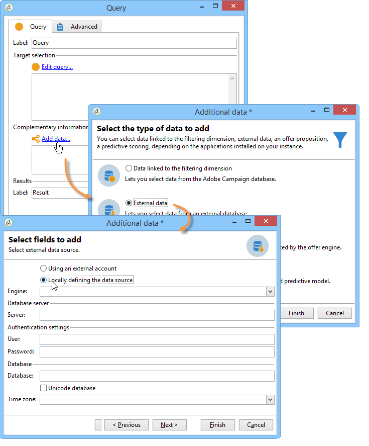

1. Select the target database engine in the drop-down list. Enter the name of the server and provide the authentication parameters.

   Also specify the name of the external database.

   

   Click the **[!UICONTROL Next]** button.

1. Select the table where the data is stored.

   You can enter the name of the table directly in the corresponding field or click the edit icon to access the list of the database tables.

   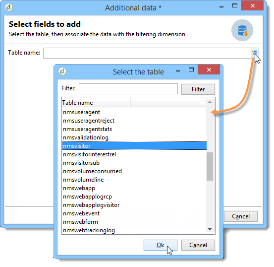

1. Click the **[!UICONTROL Add]** button to define one or several reconciliation fields between the external database data and the data in the Adobe Campaign database. The **[!UICONTROL Edit expression]** icons of the **[!UICONTROL Remote field]** and **[!UICONTROL Local field]** gives you access to the list of fields of each of the tables.

   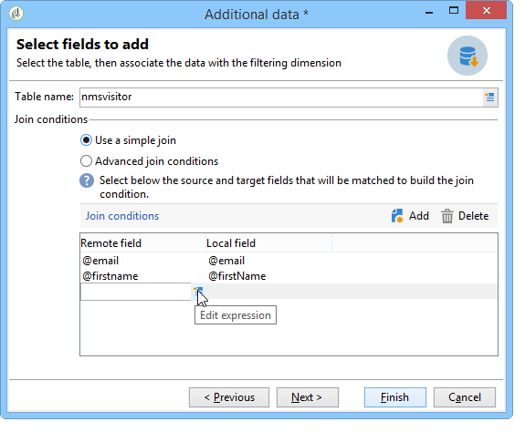

1. If necessary, specify a filtering condition and the data sorting mode.
1. Select the additional data to be collected in the external database. To do this, double click on the fields(s) that you want to add to display them in the **[!UICONTROL Output columns]** . 

   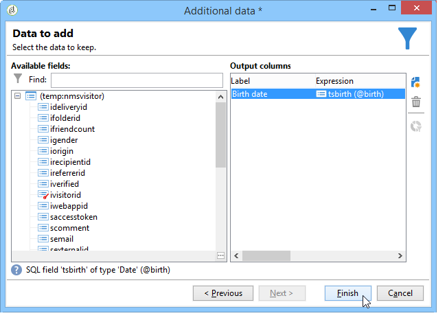

   Click **[!UICONTROL Finish]** to confirm this configuration.

### Secure connection {#secure-connection}

You can secure access to an external database when configuring an external FDA account.

To do this, add "**:ssl**" after the server address and address of the port used. For example: **192.168.0.52:4501:ssl**.

The data will then be sent via the secure SSL protocol.

### Additional configurations {#additional-configurations}

If necessary, you can create the schema for processing data in an external database. Likewise, Adobe Campaign lets you define mapping on the data in an external table. These configurations are general and do not apply to workflows exclusively.

>[!NOTE]
>
>For more on creating schemas in Adobe Campaign and defining a new data mapping, refer [this page](https://helpx.adobe.com/campaign/classic/configuration/using/about-schema-edition.html).

## Creating the data schema {#creating-the-data-schema}

To create a schema on an external database, click the **[!UICONTROL New]** button above the list of data schemas and choose **[!UICONTROL Access external data]** .

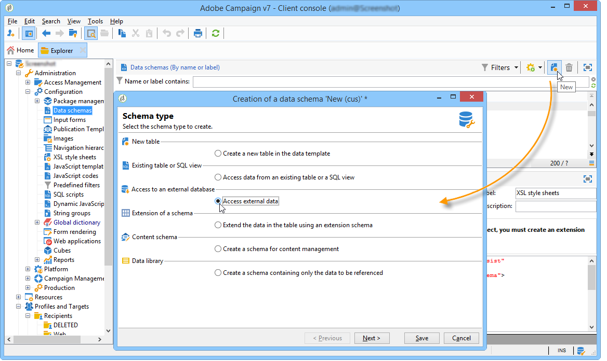

Enter a name and a description for the schema and select the external account which will enable connection to the database. This enables access to the list of tables available in the external base. Choose the table which contains the data to be collected.

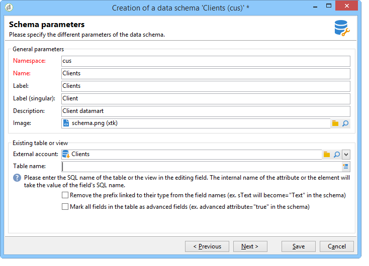

Click **[!UICONTROL OK]** to confirm. Adobe Campaign automatically detects the structure of the selected table and generates the logical schema.

>[!NOTE]
>
>Adobe Campaign does not generate links.

Click **[!UICONTROL Save]** to confirm creation.

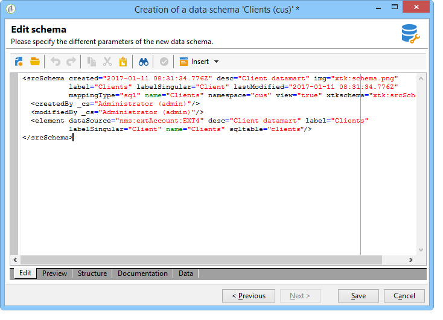

The indexes are created automatically when mapping a table (standard or FDA mapping).

## Defining data mapping {#defining-data-mapping}

Adobe Campaign lets you define mapping on the data in an external table.

To do this, once the schema of the external table has been created, you need to create a new delivery mapping to use the data in this table as a delivery target.

To do this, apply the following steps:

1. Create a new delivery mapping and choose the targeting dimension, the schema you just created, for example.

   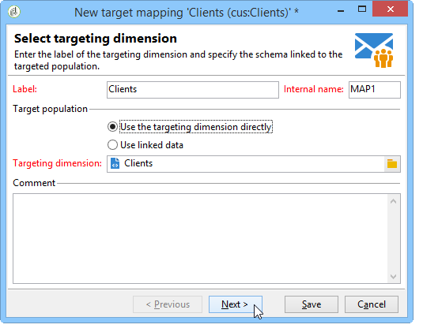

1. Indicate the fields where the delivery information is stored (last name, first name, email, address, etc.).

   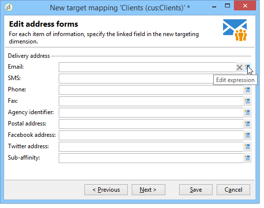

1. Specify the parameters for information storage, including the suffix of the extension schemas in order for them to be easily identifiable.

   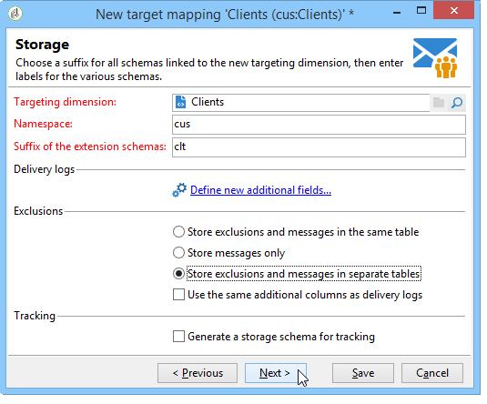

   You can choose whether to store exclusions (**excludelog**), with messages (**broadlog**) or in a separate table.

   You can also choose whether to manage tracking for this delivery mapping (**trackinglog**).

1. Then select the extensions to be taken into account. The extension type depends on your platform's parameters and options (view your license contract).

   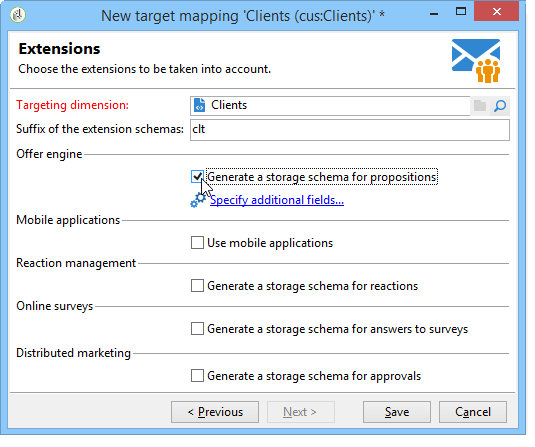

   Click the **[!UICONTROL Save]** button to launch delivery mapping creation: all linked tables are created automatically based on the selected parameters.

## Additional options {#additional-options}

### HTTP relay to a remote instance {#http-relay-to-a-remote-instance}

You can access external databases configured in remote instances using the HTTP protocol.

>[!NOTE]
>
>Not all SQL data types are supported by this feature. Blob data types are not supported at all. It is possible that other data types may not work depending on the targeted database (Timestamp on Microsoft SQL Server, for example). Please contact Adobe support for more information.

This simplifies transferring and synchronizing data between two instances. It also enables you to sidestep any tunneling between an instance and a remote database as well as the installation of the client layers to access this database. The destination instance can be a hosted instance.

>[!CAUTION]
>
>This option is only for facilitating data replication flows (ETL).   
>For example, it allows a cloud-hosted instance to have direct access to the data in an "on-premise" hosted database. However, it is not intended to allow targeting to be carried on an "on-premise" hosted database directly from the cloud.

To do this, you must configure the external accounts of the two instances so that the local instance can communicate with the remote instance using the HTTP protocol:

* Local instance: select the new **[!UICONTROL HTTP relay to a remote database]** connection type.

  In case of bulk load data transfer, also specify the buffer size. Select the compression option if you want to reduce the size of the transferred data.

  The **[!UICONTROL Data source]** must be defined with the following syntax: "nms:extAccount : `<internal_name_of_the_external_account>  " </internal_name_of_the_external_account>`

  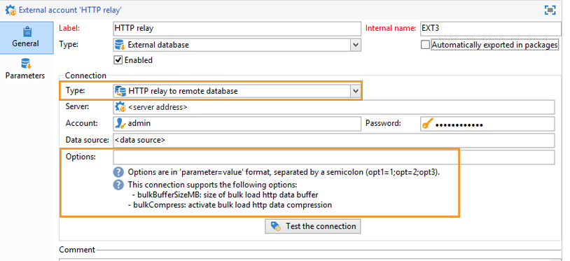

  >[!NOTE]
  >
  >We recommend that you use an HTTPS connection.

* Remote instance: in the FDA external account of the database accessed via the HTTP relay, check the Target of an **[!UICONTROL 'HTTP relay to a remote database' account option]** .

  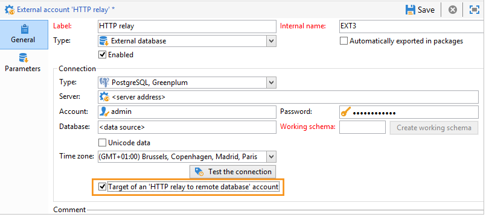

The following example shows the new possible operating mode:

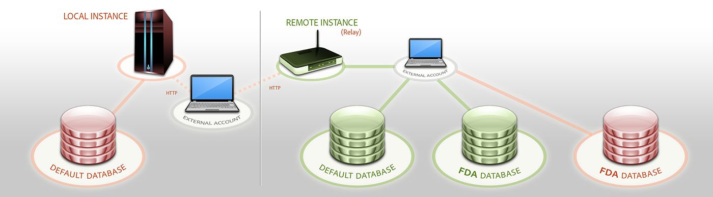

>[!CAUTION]
>
>The default database of the remote instance must be accessed via an external account as well.

This operating method avoids that the cleanup workflow of each instance deletes the work tables of the databases that use the instance as relay.

Thus, in the previous example, the cleanup workflow of the remote instance will not perform any action on the red FDA database as it is used by the local instance.

### Directly creating temporary schemas {#directly-creating-temporary-schemas}

If you want to manage several accesses to an FDA external database, a new option lets you create a working schema directly when configuring an external account.

>[!NOTE]
>
>This option only works with PostgreSQL.


### Optimizing email personalization with external data {#optimizing-email-personalization-with-external-data}

From build 8740, the option **[!UICONTROL Prepare the personalization data with a workflow]** is now available in the **[!UICONTROL Analysis]** tab of the delivery properties.

During the delivery analysis, this option automatically creates and executes a workflow that stores all of the data linked to the target in a temporary table, including data from tables linked in FDA.

By checking this option, you can achieve a significant increase in performance for executing personalization.

### Cloud Messaging - FDA synchronization {#cloud-messaging---fda-synchronization}

When the Cloud Messaging server and the Marketing server have not been synchronized for a long period, the volume of missing broadlogs on the Marketing server can be significant. To optimize broadlog synchronization via the FDA, the **NmsMidSourcing_LogsPeriodHour** option has been added. This allows a maximum period (expressed in hours) to be specified as to limit the number of broadlogs recovered every time the synchronization workflow is executed.

The option is to be added in the console, in the **[!UICONTROL Administration > Options]** node.

>[!CAUTION]
>
>This option must **only** be used for synchronizing a significant volume of broadlogs via the FDA.

>[!NOTE]
>
>The option is only taken into account if a last recovery date exists (**NmsMidSourcing_LastBroadLog_&#42;** option).

### Message Center - Read access on the XtkFolder table {#message-center---read-access-on-the-xtkfolder-table}

From build 8141 and above, manual action is necessary if Message Center uses the FDA as an archiving mode.

You need to grant read access on the XtKFolder table to the user linked with the external FDA account.

For a PostgreSQL database for example, the command is as follows:

```
GRANT SELECT ON XtkFolder TO DBUSER;
```

This user must have read access to the following tables:

* NmsBroadLogRtEvent
* NmsBroadLogBatchEvent
* NmsTrackingLogRtEvent
* NmsTrackingLogBatchEvent
* NmsRtEvent
* NmsBatchEvent
* NmsBroadLogMsg
* NmsTrackingUrl
* NmsDelivery
* NmsWebTrackingLog

>[!NOTE]
>
>This modification deletes the "Permission denied for relation xtkfolder" error message.

If the working schema selected in the external FDA account is not the out-of-the-box Neolane account, then this modification to the access rights is not necessary.

## Using data from an external database in a workflow {#using-data-from-an-external-database-in-a-workflow}

In several Adobe Campaign workflow activities, you can use the data stored in an external database.

### Filtering on external data {#filtering-on-external-data}

The query activity allows you to add external data and use it in the defined filter configurations.

For more on this, refer to the [Query](https://helpx.adobe.com/campaign/classic/workflow/using/targeting-data.html#selecting-data) section.

### Creating sub-sets {#creating-sub-sets}

The split activity allows you to create sub-sets. You can use external data to define the filtering criteria to use.

For more on this, refer to the [Split](https://helpx.adobe.com/campaign/classic/workflow/using/split.html) section.

### Loading external database {#loading-external-database}

You can use the external data in the Data loading (RDBMS). This activity is presented in the [Data loading](https://helpx.adobe.com/campaign/classic/workflow/using/data-loading--rdbms-.html) section.

### Adding information and links {#adding-information-and-links}

The enrichment activity allows you to add additional data to the workflow's worktable as well as links to an external table. For this reason, it can exploit the data from an external database. This activity is presented in the [Enrichment](https://helpx.adobe.com/campaign/classic/workflow/using/enrichment.html) section.
