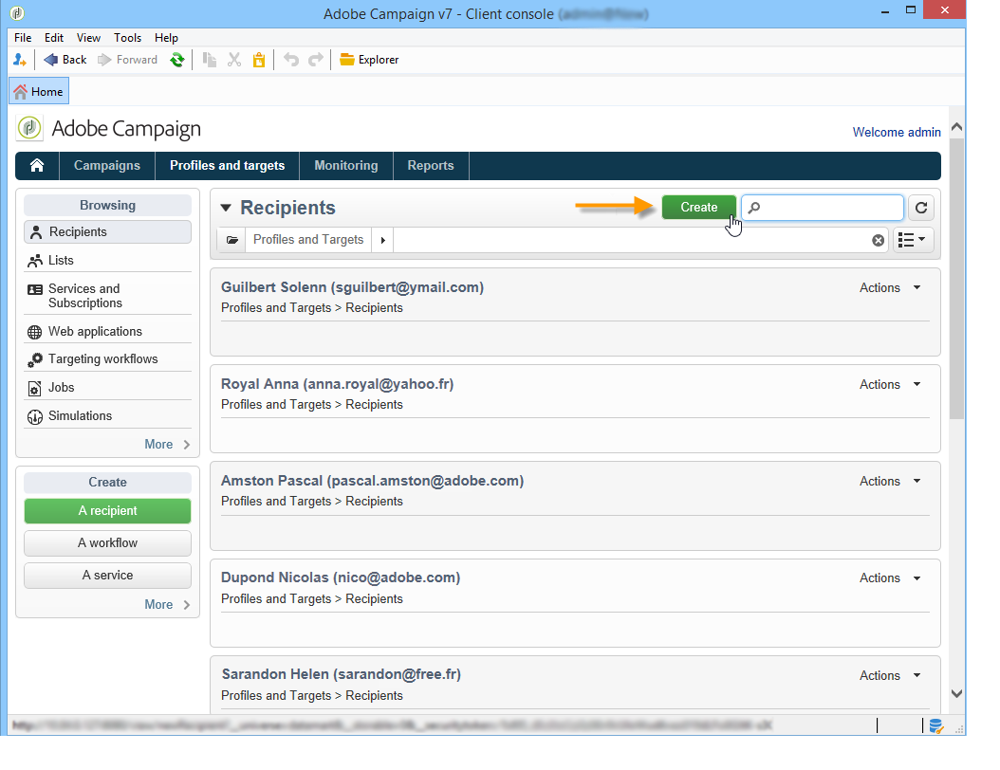

# Adding profiles{#adding-profiles}

In most cases, profiles are [imported to Campaign through a workflow](https://helpx.adobe.com/campaign/classic/workflow/using/importing-data.html). However, you can add one or more profiles directly from the interface, by clicking the **[!UICONTROL Create]** button. They will then be added to the database.

Enter the information for this profile. The tabs and fields to be completed are described in [Editing a profile](https://helpx.adobe.com/campaign/standard/platform/using/editing-a-profile.html).

Click **[!UICONTROL Save]** to validate profile creation. The profile is then added in Adobe Campaign database.
