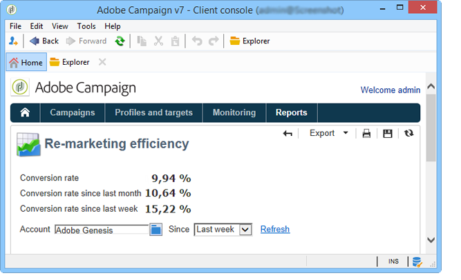

# Adobe Analytics Data Connector{#adobe-analytics-data-connector}

## About Data Connector integration {#about-data-connector-integration}

>[!IMPORTANT]
>
>Adobe Analytics Data Connector is not compatible with Transactional messaging (Message Center).

Data Connector (previously known as Adobe Genesis) allows Adobe Campaign and Adobe Analytics interact through the **Web Analytics connectors** package. It forwards data to Adobe Campaign in the form of segments concerning user behavior following an email campaign. Conversely, it sends indicators and attributes of email campaigns delivered by Adobe Campaign to Adobe Analytics - Data connector.

Using Data connector, Adobe Campaign has a way of measuring internet audience (Web Analytics). Thanks to these integrations, Adobe Campaign can recover data on visitor behavior for one or more sites following a marketing campaign, and (after analysis) run re-marketing campaigns with a view to converting them into buyers. Conversely, the Web analytics tools enable Adobe Campaign to forward indicators and campaign attributes to their platforms.

The action fields for each tool are as follows:

* Web analytics' role:

    1. marks the email campaigns launched with Adobe Campaign,
    1. saves recipient behavior, on the site they browsed after clicking the campaign email, in the form of segments. Segments concern abandoned products (viewed but not added to the cart or purchased), purchases or cart abandonments.

* Adobe Campaign's role:

    1. sends the indicators and campaign attributes to the connector, which in turn forwards them to the Web analytics tool,
    1. recovers and analyzes segments,
    1. triggers a re-marketing campaign.

## Setting up the integration {#setting-up-the-integration}

To set up the Adobe Analytics/Adobe Campaign Classic integration, you must connect to your Adobe Campaign instance and perform the following operations:

In Adobe Analytics:

1. Create a new **[!UICONTROL Report suite]**. 

   For the detailed procedure on Report suite creation, refer to this [section](https://experienceleague.adobe.com/docs/analytics/admin/manage-report-suites/new-report-suite/t-create-a-report-suite.html?lang=en#prerequisites).

1. From your **[!UICONTROL Report suite]**, create two **[!UICONTROL Conversion variables]**: one for the Delivery name and one for the BroadlogID. 

   To learn how to edit **[!UICONTROL Conversion variables]**, refer to this [section](https://experienceleague.adobe.com/docs/analytics/admin/admin-tools/conversion-variables/t-conversion-variables-admin.html?lang=en#admin-tools).

1. Then, configure the following **[!UICONTROL Success events]**:

   * **[!UICONTROL Clicked]**
   * **[!UICONTROL Opened]**
   * **[!UICONTROL Person clicks]**
   * **[!UICONTROL Processed]**
   * **[!UICONTROL Scheduled]**
   * **[!UICONTROL Sent]**
   * **[!UICONTROL Total bounces]**
   * **[!UICONTROL Unique Clicks]**
   * **[!UICONTROL Unique Opens]**
   * **[!UICONTROL Unsubscribed]**

   To learn how to configure **[!UICONTROL Success events]**, refer to this [section](https://experienceleague.adobe.com/docs/analytics/admin/admin-tools/success-events/t-success-events.html?lang=en#admin-tools)

When your report suite is configured, you will need to configure the **[!UICONTROL External accounts]** in Adobe Campaign Classic:

1. Install the **[!UICONTROL Web Analytics connectors]** package in Adobe Campaign.

1. Go to the **[!UICONTROL Administration]** > **[!UICONTROL Platform]** > **[!UICONTROL External accounts]** folder of the Adobe Campaign tree.

1. Click **[!UICONTROL New]** above the list of external accounts.

1. Use the drop-down list to select the **[!UICONTROL Web Analytics]** type.

1. Select **[!UICONTROL Adobe Analytics]** from the **[!UICONTROL Integration]** drop-down.

1. Click **[!UICONTROL Configure]** next to the **[!UICONTROL Integration]** drop-down.

1. From the **[!UICONTROL Configure Analytics integration]** window, map your external account with your previously created Report suite providing the following information:

   * **[!UICONTROL E-Mail]**
   * **[!UICONTROL IMS Org]**
   * **[!UICONTROL Analytics Company]**
   * **[!UICONTROL Report Suite]**

1. From the **[!UICONTROL eVars]** category, map the two **[!UICONTROL Conversion variables]** configured in [!DNL Adobe Analytics].

1. From the **[!UICONTROL Events]** category, map the ten **[!UICONTROL Success events]** configured in [!DNL Adobe Analytics].

1. Click **[!UICONTROL Submit]** when done. 

1. Settings can be viewed clicking **[!UICONTROL Data Settings]** from your **[!UICONTROL External account]**.

1. If needed, you can add or remove segments from the **[!UICONTROL Update Segments]** Tab.

After configuring the external account, the following components will be created on Adobe Analytics side:

* Nine built-in Classifications:
  * Delivery Tool 
  * Channel 
  * Delivery Label 
  * Operation Nature 
  * Operation Label
  * Custom Tag 1 
  * Custom Tag 2 
  * Custom Tag 3
  * Contact Date
* A Data Source
* Calculated Metrics (aemInstance)
* Three Segments:
  * Genesis Remarketing - Product Views
  * Genesis Remarketing - Product Purchases
  * Genesis Remarketing - Cart Abandonment

### Technical workflows of web analytics processes {#technical-workflows-of-web-analytics-processes}

Data exchange between Adobe Campaign and Adobe Analytics is handled by four technical workflows which run as a background task.

They are available in the Adobe Campaign tree, under the **[!UICONTROL Administration > Production > Technical workflows > Web analytics process]** folder.

* **[!UICONTROL Recovering of web events]**: once an hour, this workflow downloads segments about the behavior of users on a given site, includes them in the Adobe Campaign database and starts the re-marketing workflow.
* **[!UICONTROL Event purge]**: this workflow enables you to delete all events from the database depending on the period configured in the **[!UICONTROL Lifespan]** field. For more on this, refer to [Step 2: Create the external account in Campaign](#step-2--create-the-external-account-in-campaign).
* **[!UICONTROL Identification of converted contacts]**: directory of the visitors who made a purchase following a re-marketing campaign. The data collected by this workflow is accessible in the **[!UICONTROL Re-marketing efficiency]** report, refer to this [page](#creating-a-re-marketing-campaign).
* **[!UICONTROL Sending of indicators and campaign attributes]**: lets you send email campaign indicators via Adobe Campaign to the Adobe Experience Cloud using Adobe Analytics - Data connector. This workflow is triggered at 4am every day and it can take 24 hours for the data to be sent to Analytics.

  Please note that this workflow should not be restarted or else it will resend all the prior data which can skew Analytics results.

  The indicators involved are:
      
  * **[!UICONTROL Messages to deliver]** (@toDeliver)
  * **[!UICONTROL Processed]** (@processed)
  * **[!UICONTROL Success]** (@success)
  * **[!UICONTROL Total count of opens]** (@totalRecipientOpen)
  * **[!UICONTROL Recipients who have opened]** (@recipientOpen)
  * **[!UICONTROL Total number of recipients who clicked]** (@totalRecipientClick)
  * **[!UICONTROL People who clicked]** (@personClick)
  * **[!UICONTROL Number of distinct clicks]** (@recipientClick)
  * **[!UICONTROL Opt-Out]** (@optOut)
  * **[!UICONTROL Errors]** (@error)

  >[!NOTE]
  >
  >Data sent is the delta based on the last snapshot which may lead to negative value in the metric data.

  The attributes sent are as follows:

  * **[!UICONTROL Internal name]** (@internalName)
  * **[!UICONTROL Label]** (@label)
  * **[!UICONTROL Label]** (operation/@label): only if the **Campaign** package is installed
  * **[!UICONTROL Nature]** (operation/@nature): only if the **Campaign** package is installed
  * **[!UICONTROL Tag 1]** (webAnalytics/@tag1)
  * **[!UICONTROL Tag 2]** (webAnalytics/@tag2)
  * **[!UICONTROL Tag 3]** (webAnalytics/@tag3)
  * **[!UICONTROL Contact date]** (scheduling/@contactDate)

## Tracking deliveries in Adobe Campaign {#tracking-deliveries-in-adobe-campaign}

In order for the Adobe Experience Cloud to be able to track activity on the sites once the delivery is sent by Adobe Campaign, you need to reference the matching connector in the delivery properties. To do this, apply the following steps:

1. Open the delivery of the campaign to be tracked.

   

1. Open the delivery properties.
1. Go to the **[!UICONTROL Web Analytics]** tab and select the previously created external account. Refer to [Step 2: Create the external account in Campaign](#step-2--create-the-external-account-in-campaign).

   

1. You can now send your delivery and access your report for it in Adobe Analytics.

## Creating a re-marketing campaign {#creating-a-re-marketing-campaign}

To prepare your re-marketing campaign, simply create delivery templates to be used for re-marketing type campaigns. Then configure your re-marketing campaign and link it to a segment. Each segment must have a different re-marketing campaign.

Re-marketing campaigns are started automatically once Adobe Campaign has finished recovering the segments analyzing the behavior of people targeted by the initial campaign. In case of cart abandonment or product viewing without a purchase, a delivery is sent to the concerned recipients in order for their site browsing to end in a purchase.

Adobe Campaign provides personalized delivery templates which you can use or database yourselves on to prepare campaigns.

1. From the **[!UICONTROL Explorer]**, go to the **[!UICONTROL Resources]** > **[!UICONTROL Templates]** > **[!UICONTROL Delivery templates]** folder of the Adobe Campaign tree.

1. Duplicate the **[!UICONTROL Email delivery (re-marketing)]** template or the re-marketing template examples offered by Adobe Campaign.

   

1. Personalize the template to suit your needs and save it.

1. Create a new campaign and select the **[!UICONTROL Re-marketing campaign]** template from the drop-down list.

   

1. Click the **[!UICONTROL Configure...]** link to specify the segment and delivery template linked to the campaign.

1. Select the previously configured external account.

   

1. Select the concerned segment.

   

1. Select the delivery template to be used for this re-marketing campaign, then click **[!UICONTROL Finish]** to close the window.

   

1. Click **[!UICONTROL OK]** to close the campaign window.

The **[!UICONTROL Re-marketing efficiency]** report is accessed via the global reports page. It lets you view the number of contacts converted (i.e. having purchased something) in relation to the number of cart abandonments following the Adobe Campaign re-marketing campaign. The conversion rate is calculated per week, month or since the start of synchronization between Adobe Campaign and Web analytics tools.

