# Adobe Analytics Data Connector{#adobe-analytics-data-connector-legacy}

>[!IMPORTANT]
>
>Adobe Analytics Data Connector is now deprecated. Deprecated capabilities are still available, but they will not be further enhanced, nor supported. Learn more [in this page](../../rn/using/deprecated-features.md).

## About Data Connector integration {#about-data-connector-integration}

>[!IMPORTANT]
>
>Adobe Analytics Data Connector is not compatible with Transactional messaging (Message Center).

Data Connector (previously known as Adobe Genesis) allows Adobe Campaign and Adobe Analytics interact through the **Web Analytics connectors** package. It forwards data to Adobe Campaign in the form of segments concerning user behavior following an email campaign. Conversely, it sends indicators and attributes of email campaigns delivered by Adobe Campaign to Adobe Analytics - Data connector.

Using Data connector, Adobe Campaign has a way of measuring internet audience (Web Analytics). Thanks to these integrations, Adobe Campaign can recover data on visitor behavior for one or more sites following a marketing campaign, and (after analysis) run re-marketing campaigns with a view to converting them into buyers. Conversely, the Web analytics tools enable Adobe Campaign to forward indicators and campaign attributes to their platforms.

For more information on the implementation of the integration Adobe Analytics with Adobe Campaign, refer to this [documentation](https://helpx.adobe.com/marketing-cloud/how-to/analytics-ac.html).

The action fields for each tool are as follows:

* Web analytics' role:

    1. marks the email campaigns launched with Adobe Campaign,
    1. saves recipient behavior, on the site they browsed after clicking the campaign email, in the form of segments. Segments concern abandoned products (viewed but not added to the cart or purchased), purchases or cart abandonments.

* Adobe Campaign's role:

    1. sends the indicators and campaign attributes to the connector, which in turn forwards them to the Web analytics tool,
    1. recovers and analyzes segments,
    1. triggers a re-marketing campaign.

## Setting up the integration {#setting-up-the-integration}

To set up the Data connector, you must connect to your Adobe Campaign instance and perform the following operations:

* [Step 1: Configure integration in Analytics](#step-1--configure-integration-in-analytics)
* [Step 2: Create the external account in Campaign](#step-2--create-the-external-account-in-campaign)
* [Step 3: Synchronize Adobe Campaign and Adobe Analytics](#step-3--synchronize-adobe-campaign-and-adobe-analytics)

### Step 1: Configure integration in Analytics {#step-1--configure-integration-in-analytics}

The following steps detail the configuration of Data connector using a wizard.

1. Log in to the Adobe Experience Cloud using an Adobe ID or or Enterprise ID.

   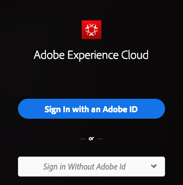

1. From the list of Experience Cloud solutions, select **[!UICONTROL Analytics]**.

   

1. From the **[!UICONTROL Admin]** tab, select **[!UICONTROL Data Connectors]**.
   
   You need to have the following Analytics tools permissions to access the **[!UICONTROL Data Connectors]** menu. For more on this, refer to this [page](https://experienceleague.adobe.com/docs/analytics/admin/admin-console/permissions/analytics-tools.html)
   * Integrations (Create)
   * Integrations (Update)
   * Integrations (Delete)

   

1. From the list of partners, select **[!UICONTROL Adobe Campaign Classic]**.

   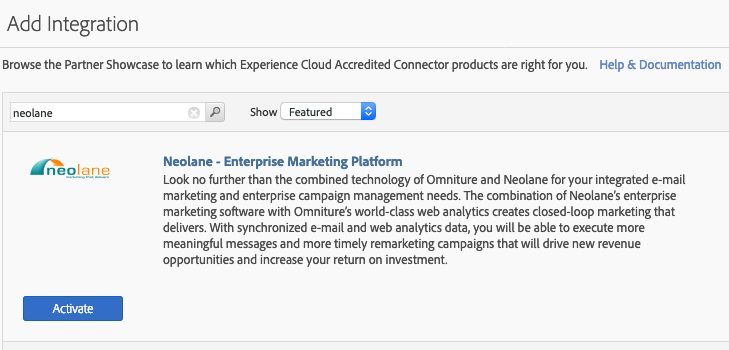

1. In the **[!UICONTROL Add integration]** dialog, click **[!UICONTROL Activate]**.
1. Check **[!UICONTROL I accept these terms and conditions]** and select the **[!UICONTROL Report suite]** linked to this integration and enter the connector label.

   When done, click **[!UICONTROL Create and configure this integration]**.

   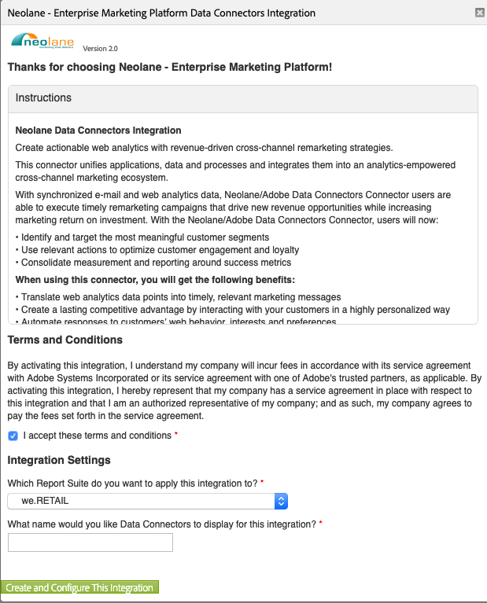

1. Enter the email address that will receive the notifications on behalf of the connector, then copy the **[!UICONTROL Account ID]** as it appears in the external Adobe Campaign account (for more on this, refer to the [Step 2: Create the external account in Campaign](#step-2--create-the-external-account-in-campaign)).

   

1. Specify the identifiers required for measuring the impact of the email campaign, i.e. the internal campaign name (cid) and the iNmsBroadlog (bid) table ID. You should also specify the indicators for events to be collected.
Make sure that your **[!UICONTROL Events]** are of Numeric type, otherwise they will not appear in the drop-down menu.

   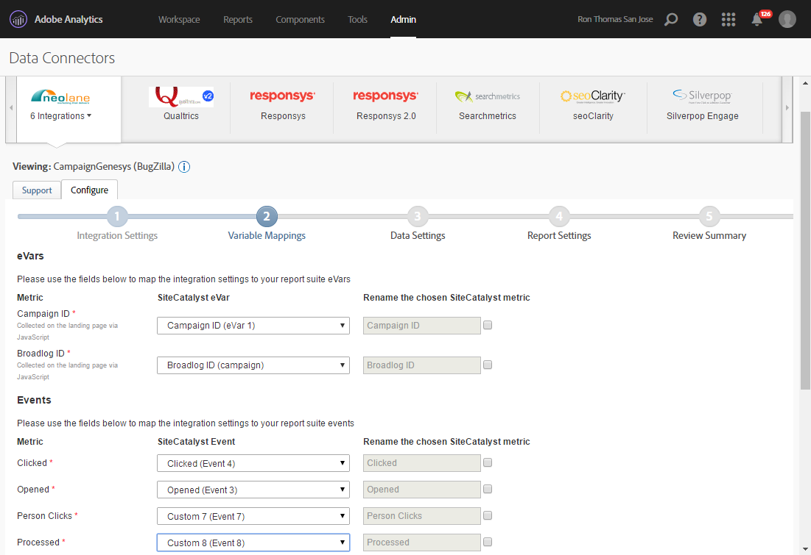

1. If necessary, specify the personalized segments.

   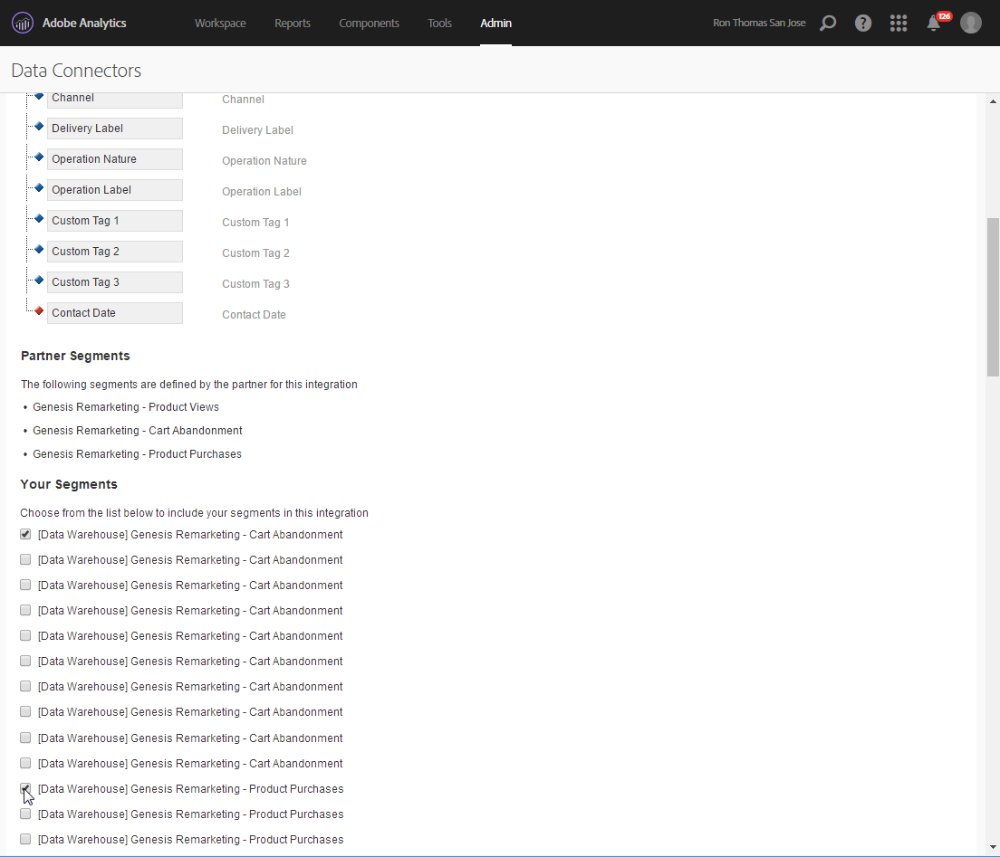

1. In **[!UICONTROL Data collection]**, select a method for recovering data, in this case the **[!UICONTROL cid]** and **[!UICONTROL bid]** identifiers specified in step 6.

   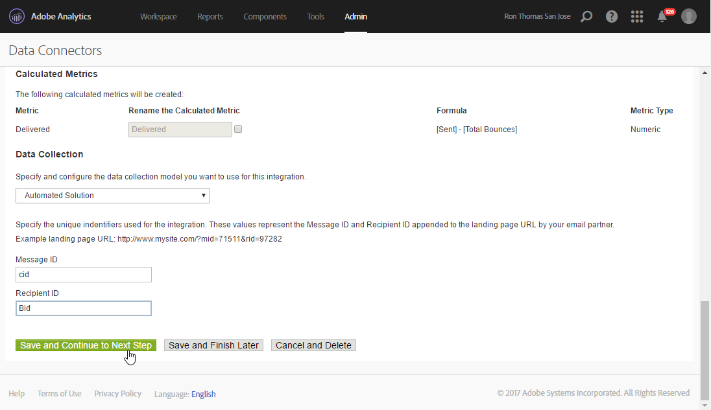

1. Select the information to display in the dashboard.

   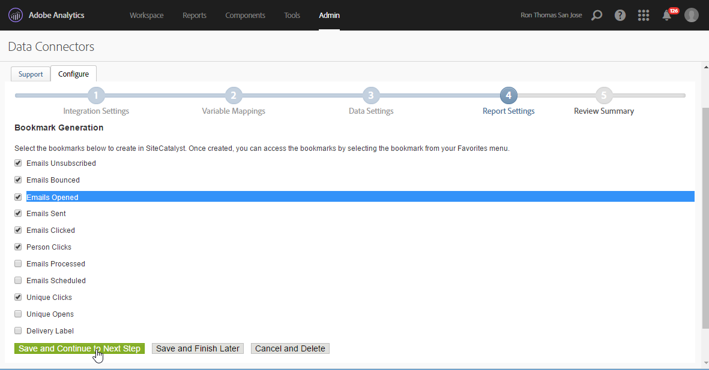

1. Check the configuration in the page which sums up the previous steps.

   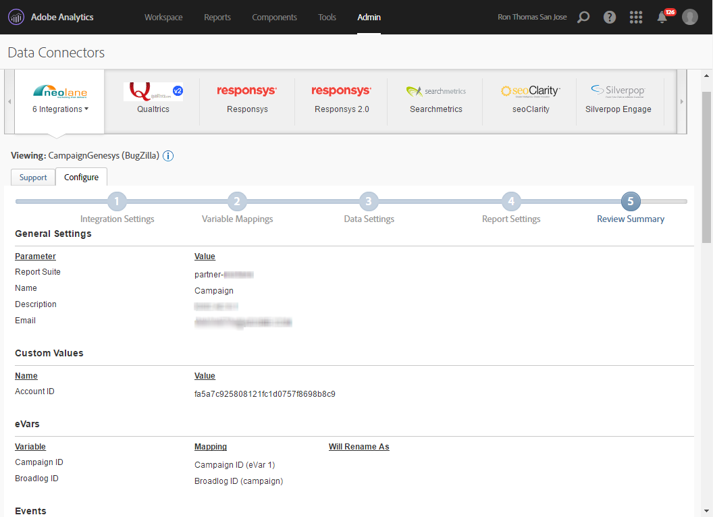

1. Click **[!UICONTROL Activate Now]** to approve configuration and activate the connector.

   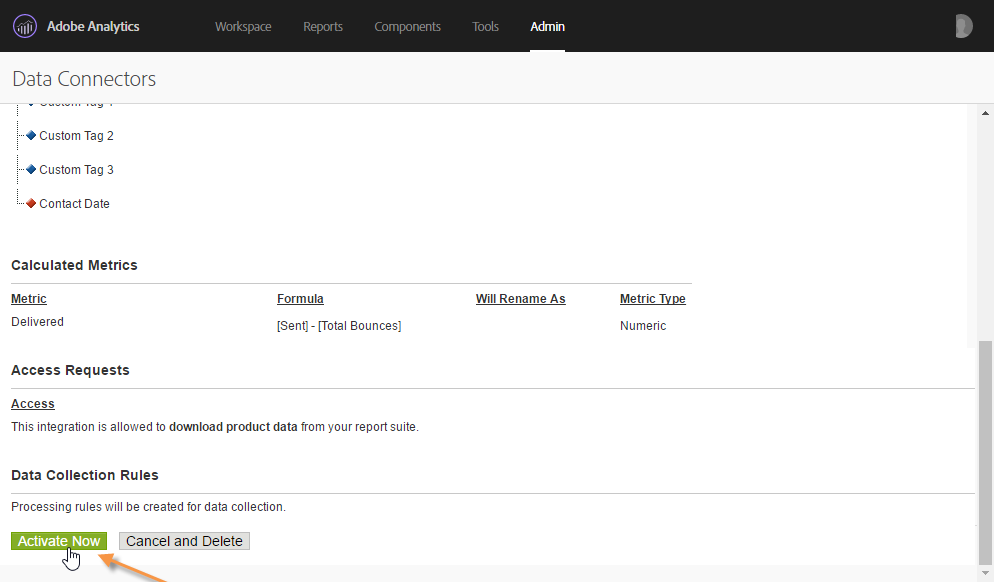

   The Data connector is now configured.

### Step 2: Create the external account in Campaign {#step-2--create-the-external-account-in-campaign}

The integration of Adobe Campaign into the Analytics platforms is carried out using a connector. To synchronize the applications, apply the following process:

1. Install the **Web Analytics connectors** package in Adobe Campaign.
1. Go to the **[!UICONTROL Administration > Platform > External accounts]** folder of the Adobe Campaign tree.
1. Right-click the list of external accounts and select **[!UICONTROL New]** in the drop-down menu (or click the **[!UICONTROL New]** button above the list of external accounts).
1. Use the drop-down list to select the **[!UICONTROL Web Analytics]** type.
1. Select the provider for the connector, i.e. **[!UICONTROL Adobe Analytics - Data Connector]** in this case.

   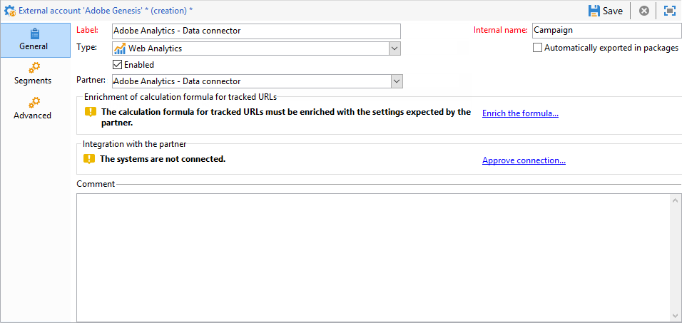

1. Click the **[!UICONTROL Enrich the formula...]** link to change the URL calculation formula to specify the Web analytics tool integration information (campaign IDs) and the domains of the sites whose activity must be tracked.
1. Specify the domain name(s) of the sites.

   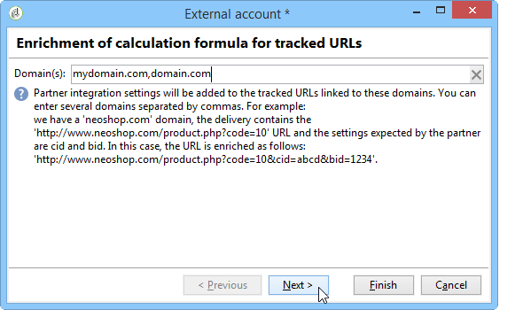

1. Click **[!UICONTROL Next]** and make sure the domain names have been saved.

   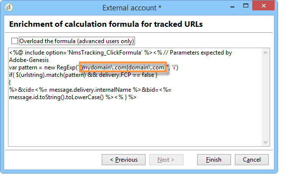

1. If necessary, you must overload the calculation formula. To do this, check the box and edit the formula directly in the window.

   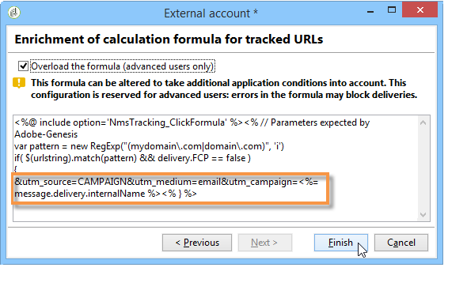

   >[!IMPORTANT]
   >
   >This configuration mode is reserved for expert users: any error in this formula may result in email deliveries being stopped.

1. The **[!UICONTROL Advanced]** tab lets you configure or modify more technical settings.

    * **[!UICONTROL Lifespan]**: lets you specify the delay (in days_ after which the web events recovered in Adobe Campaign by technical workflows. Default: 180 days.
    * **[!UICONTROL Persistence]**: lets you the period during which all web events (a purchase for example) can be attributed to a re-marketing campaign, Default: 7 days.

>[!NOTE]
>
>If you are using several audience measuring tools, you can select **[!UICONTROL Other]** in the **[!UICONTROL Partners]** drop-down list when creating the external account. You may only reference one external account in the delivery properties: you will therefore need to adapt the formula of tracked URLs by adding the parameters expected by the Adobe and all other measuring tools used.

### Step 3: Synchronize Adobe Campaign and Adobe Analytics {#step-3--synchronize-adobe-campaign-and-adobe-analytics}

Once you have created the external account, you need to synchronize both applications.

1. Go to your previously created external account.
1. Change the account **[!UICONTROL Label]** as needed.
1. Change the **[!UICONTROL Internal name]** so that it matches the **[!UICONTROL Name]** chosen while configuring the Data Connector.

   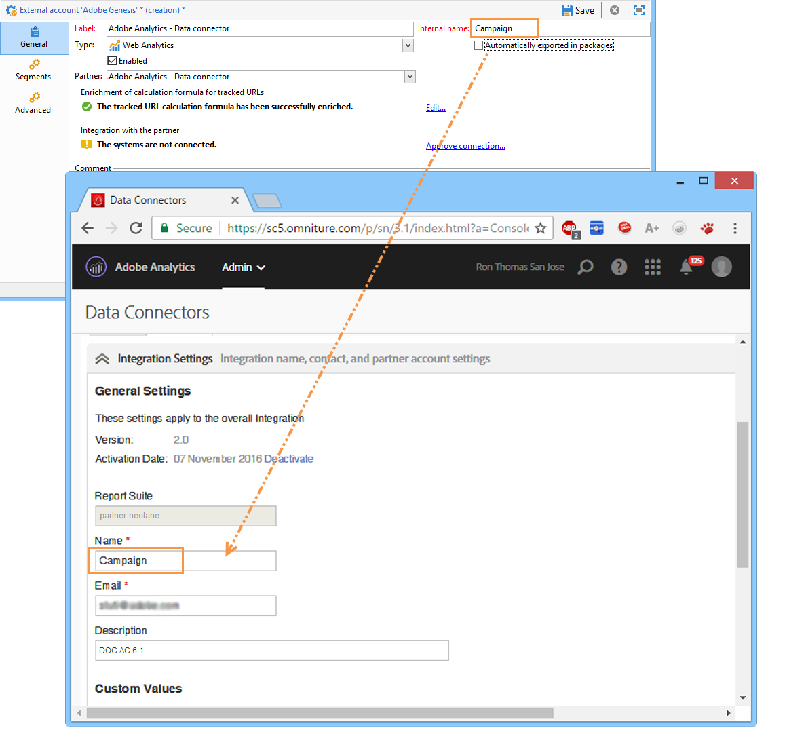

1. Click the **[!UICONTROL Approve connection]** link.

   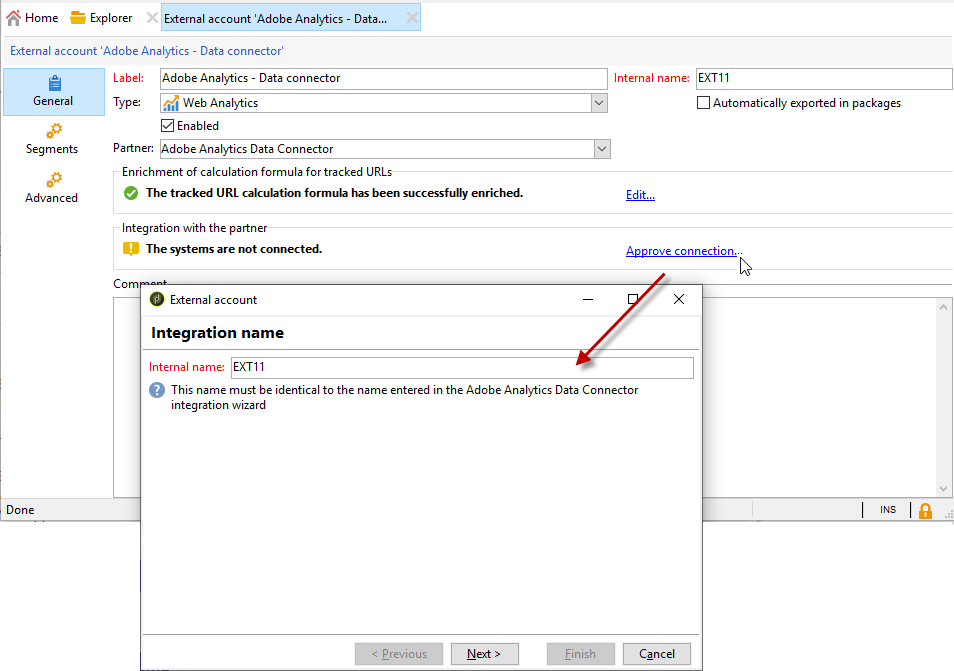

   Make sure the **[!UICONTROL Internal name]** matches the **[!UICONTROL Name]** specified in the Data Connector configuration wizard.

1. Enter the **[!UICONTROL Account ID]** in the Data Connector configuration wizard.

   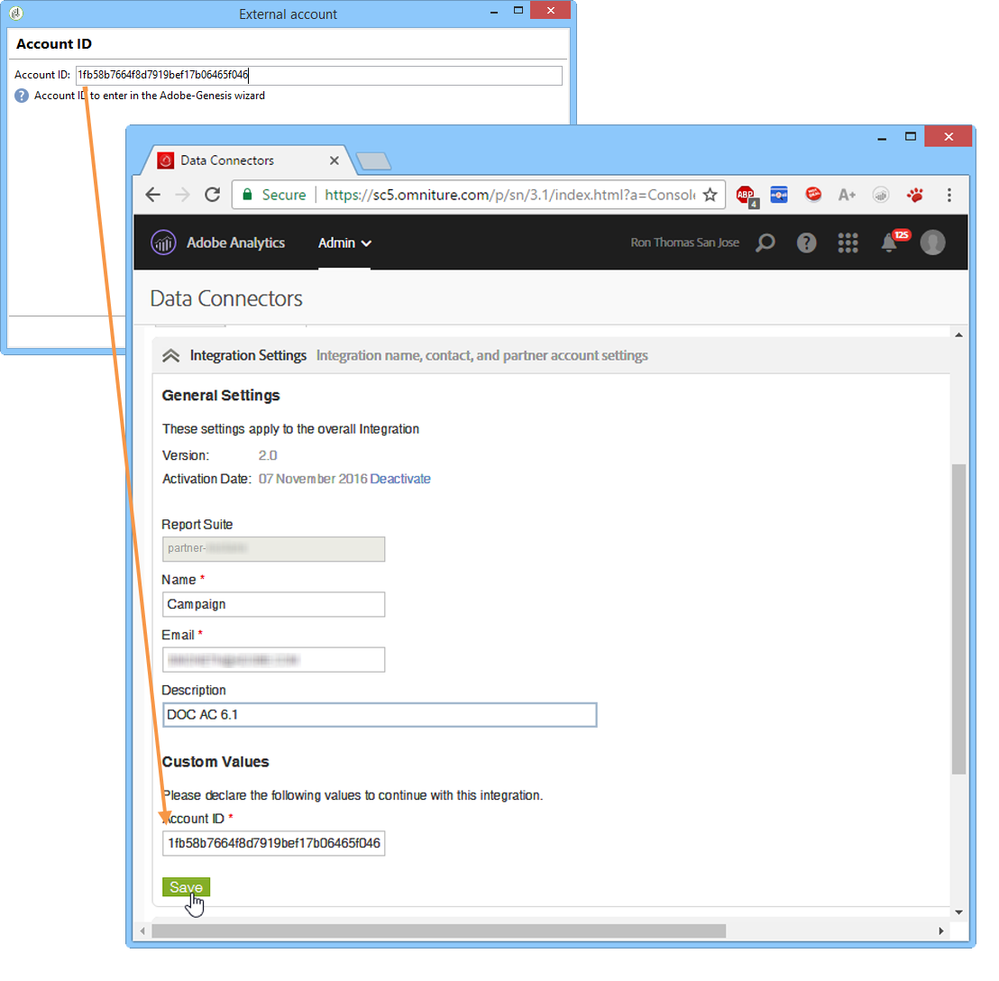

1. Follow the steps according to the Data Connector wizard guide, then return to the external account in Adobe Campaign.
1. Click **[!UICONTROL Next]** in order for the data exchange to take place between Adobe Campaign and Adobe Analytics - Data connector.

   The segment list is displayed once synchronization is complete. 

   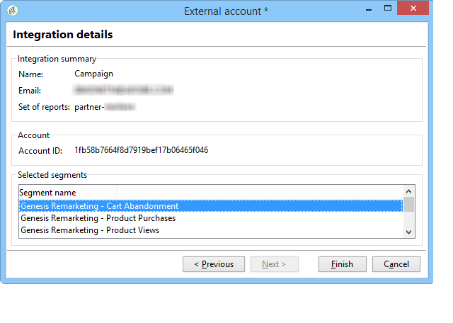

When the synchronization of data between Adobe Campaign and Adobe Analytics - Data connector is effective, the three default segments defined in the Data Connector wizard are recovered by Adobe Campaign and become accessible in the **[!UICONTROL Segments]** tab of the Adobe Campaign external account. 

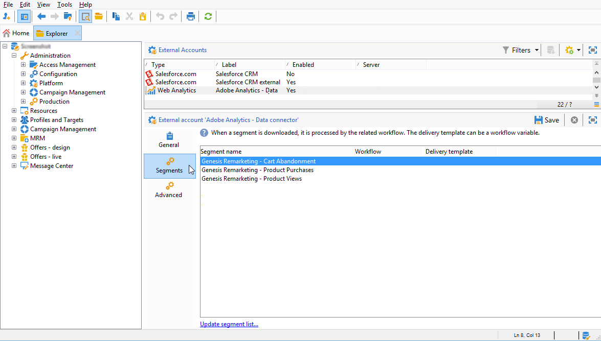

If additional segments have been configured in the Data Connector wizard, you can add them to Adobe Campaign. To do this, click the **[!UICONTROL Update segment list]** link and follow the steps outlined in the external account wizard. Once the operation is carried out, the new segments will be displayed in the list.

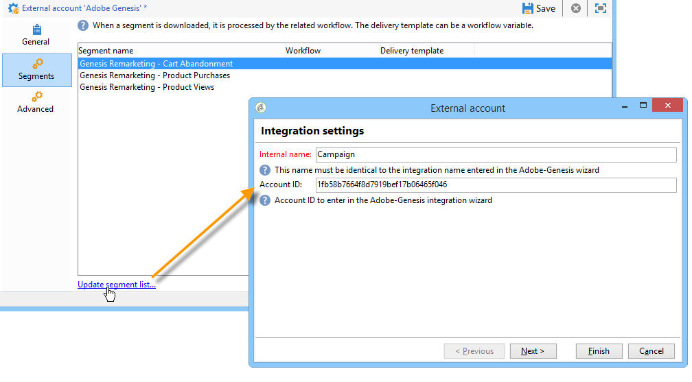

### Technical workflows of web analytics processes {#technical-workflows-of-web-analytics-processes}

Data exchange between Adobe Campaign and Adobe Analytics - Data connector is handled by four technical workflows which run as a background task.

They are available in the Adobe Campaign tree, under the **[!UICONTROL Administration > Production > Technical workflows > Web analytics process]** folder.

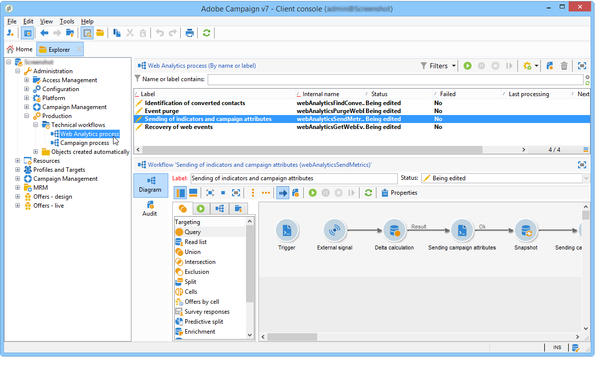

* **[!UICONTROL Recovering of web events]**: once an hour, this workflow downloads segments about the behavior of users on a given site, includes them in the Adobe Campaign database and starts the re-marketing workflow.
* **[!UICONTROL Event purge]**: this workflow enables you to delete all events from the database depending on the period configured in the **[!UICONTROL Lifespan]** field. For more on this, refer to [Step 2: Create the external account in Campaign](#step-2--create-the-external-account-in-campaign).
* **[!UICONTROL Identification of converted contacts]**: directory of the visitors who made a purchase following a re-marketing campaign. The data collected by this workflow is accessible in the **[!UICONTROL Re-marketing efficiency]** report, refer to this [page](#creating-a-re-marketing-campaign).
* **[!UICONTROL Sending of indicators and campaign attributes]**: lets you send email campaign indicators via Adobe Campaign to the Adobe Experience Cloud using Adobe Analytics - Data connector. This workflow is triggered at 4am every day and it can take 24 hours for the data to be sent to Analytics.

  Please note that this workflow should not be restarted or else it will resend all the prior data which can skew Analytics results.

  The indicators involved are:

    * **[!UICONTROL Messages to deliver]** (@toDeliver)
    * **[!UICONTROL Processed]** (@processed)
    * **[!UICONTROL Success]** (@success)
    * **[!UICONTROL Total count of opens]** (@totalRecipientOpen)
    * **[!UICONTROL Recipients who have opened]** (@recipientOpen)
    * **[!UICONTROL Total number of recipients who clicked]** (@totalRecipientClick)
    * **[!UICONTROL People who clicked]** (@personClick)
    * **[!UICONTROL Number of distinct clicks]** (@recipientClick)
    * **[!UICONTROL Opt-Out]** (@optOut)
    * **[!UICONTROL Errors]** (@error)

  >[!NOTE]
  >
  >Data sent is the delta based on the last snapshot which may lead to negative value in the metric data.

  The attributes sent are as follows:

    * **[!UICONTROL Internal name]** (@internalName)
    * **[!UICONTROL Label]** (@label)
    * **[!UICONTROL Label]** (operation/@label): only if the **Campaign** package is installed
    * **[!UICONTROL Nature]** (operation/@nature): only if the **Campaign** package is installed
    * **[!UICONTROL Tag 1]** (webAnalytics/@tag1)
    * **[!UICONTROL Tag 2]** (webAnalytics/@tag2)
    * **[!UICONTROL Tag 3]** (webAnalytics/@tag3)
    * **[!UICONTROL Contact date]** (scheduling/@contactDate)

## Tracking deliveries in Adobe Campaign {#tracking-deliveries-in-adobe-campaign}

In order for the Adobe Experience Cloud to be able to track activity on the sites once the delivery is sent by Adobe Campaign, you need to reference the matching connector in the delivery properties. To do this, apply the following steps:

1. Open the delivery of the campaign to be tracked.

   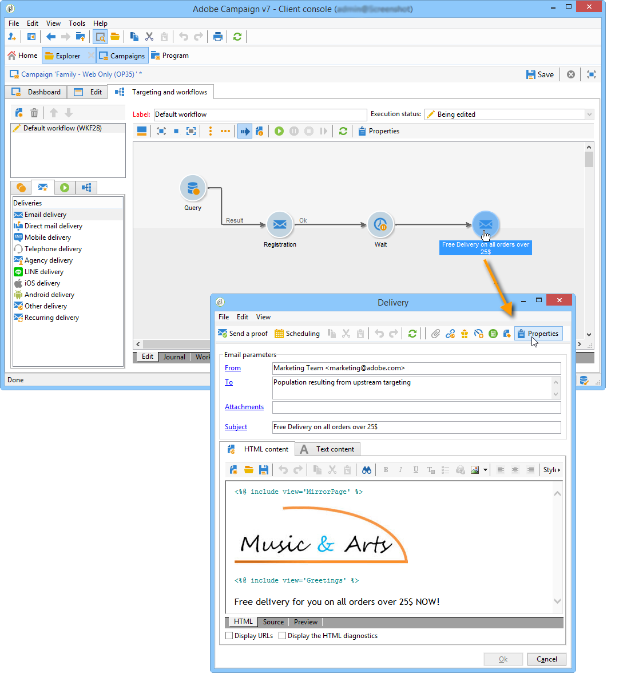

1. Open the delivery properties.
1. Go to the **[!UICONTROL Web Analytics]** tab and select the previously created external account. Refer to [Step 2: Create the external account in Campaign](#step-2--create-the-external-account-in-campaign).

   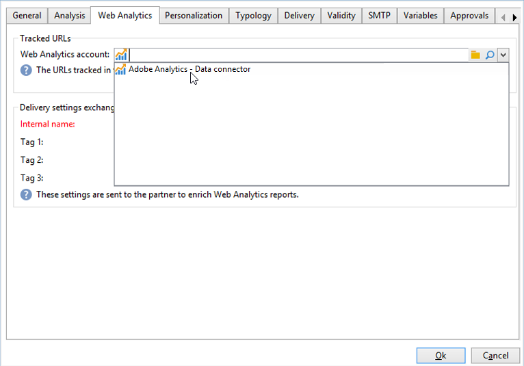

1. You can now send your delivery and access your report for it in Adobe Analytics.

## Creating a re-marketing campaign {#creating-a-re-marketing-campaign}

To prepare your re-marketing campaign, simply create delivery templates to be used for re-marketing type campaigns. Then configure your re-marketing campaign and link it to a segment. Each segment must have a different re-marketing campaign.

Re-marketing campaigns are started automatically once Adobe Campaign has finished recovering the segments analyzing the behavior of people targeted by the initial campaign. In case of cart abandonment or product viewing without a purchase, a delivery is sent to the concerned recipients in order for their site browsing to end in a purchase.

Adobe Campaign provides personalized delivery templates which you can use or database yourselves on to prepare campaigns.

1. From the **[!UICONTROL Explorer]**, go to the **[!UICONTROL Resources > Templates > Delivery templates]** folder of the Adobe Campaign tree.
1. Duplicate the **[!UICONTROL Email delivery (re-marketing)]** template or the re-marketing template examples offered by Adobe Campaign.
1. Personalize the template to suit your needs and save it.

   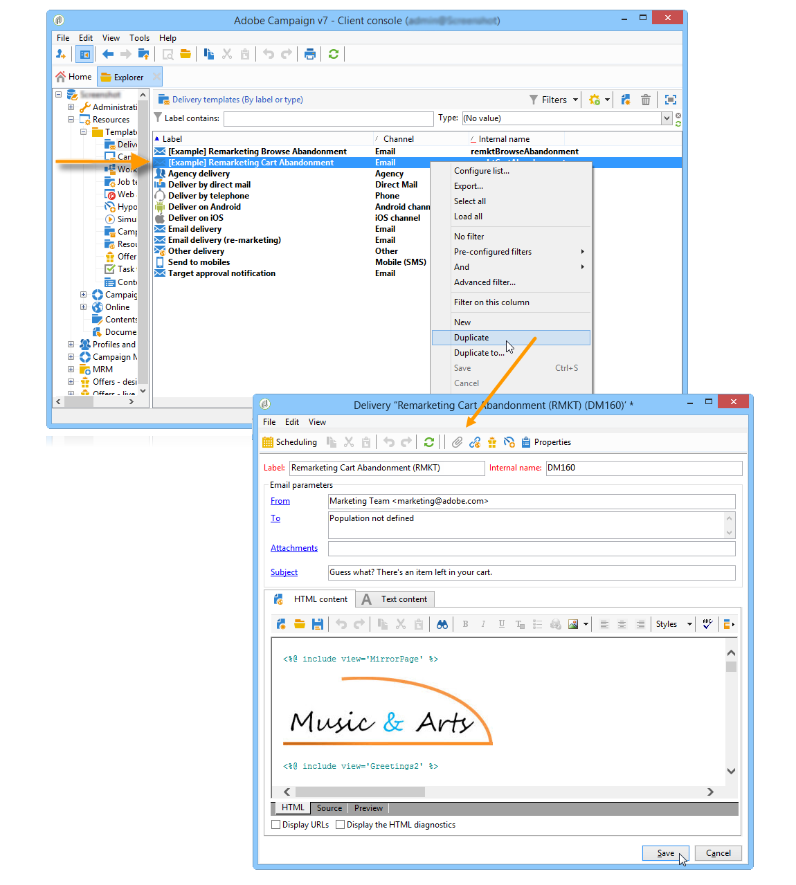

1. Create a new campaign and select the **[!UICONTROL Re-marketing campaign]** template from the drop-down list.

   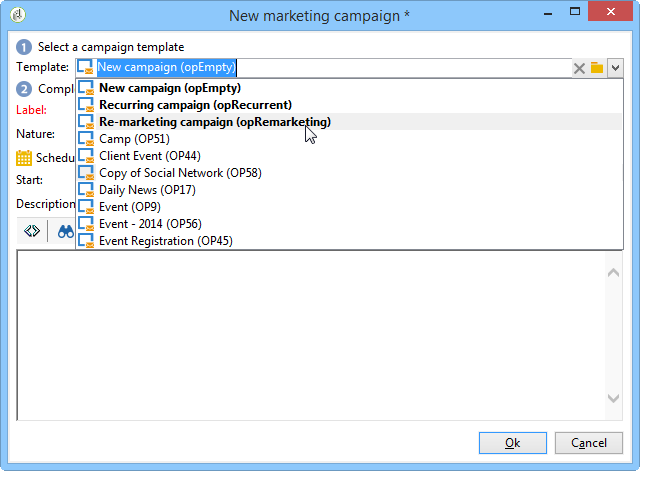

1. Click the **[!UICONTROL Configure...]** link to specify the segment and delivery template linked to the campaign.
1. Select the previously configured external account.

   

1. Select the concerned segment.

   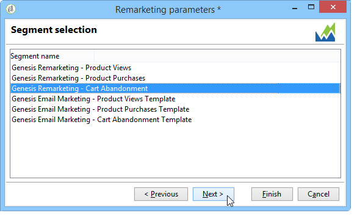

1. Select the delivery template to be used for this re-marketing campaign, then click **[!UICONTROL Finish]** to close the window.

   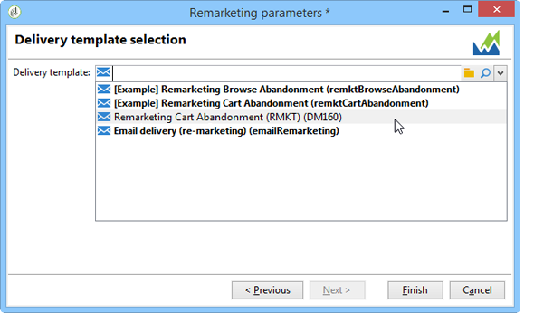

1. Click **[!UICONTROL OK]** to close the campaign window.

The **[!UICONTROL Re-marketing efficiency]** report is accessed via the global reports page. It lets you view the number of contacts converted (i.e. having purchased something) in relation to the number of cart abandonments following the Adobe Campaign re-marketing campaign. The conversion rate is calculated per week, month or since the start of synchronization between Adobe Campaign and Web analytics tools.

