# Adobe Analytics Connector provisioning {#adobe-analytics-connector-provisioning}


>[!IMPORTANT]
>
> These steps should only be carried out by Hybrid and On-Premise implementations.
>
>For Hosted implementations, please contact [Adobe Customer Care](https://helpx.adobe.com/enterprise/admin-guide.html/enterprise/using/support-for-experience-cloud.ug.html) team. 

The integration between Adobe Campaign Classic and Adobe Analytics authentication supports Adobe Identity Management Service (IMS):

* If you are managing a migrated external account, you must implement Adobe IMS and connect to Adobe Campaign via an Adobe ID. The user logged in via Adobe ID IMS should be the owner of the **Data connector** account in Adobe Analytics and have a set of permissions for the **Product profile** mentioned below.

* If you are implementing a new connector, implementing Adobe IMS is optional. Without an Adobe ID User, Adobe Campaign will use a technical user to sync with Adobe Analytics.

For this integration to work, you have to create an Adobe Analytics product profile which will be used exclusively for the Analytics connector. Then, you will need to create an Adobe I/O project.

## Create an Adobe Analytics Product profile {#analytics-product-profile}

Product Profile determines the level of access a user has on your different Analytics Components.

If you already have an Analytics Product Profile, you should still create a new Adobe Analytics product profile used exclusively for the Analytics connector. This will ensure that your Product profile is set with the correct permissions for this integration. 

For more information on Product profiles, refer to the [Admin console documentation](https://helpx.adobe.com/mt/enterprise/admin-guide.html).

1. From the [Admin console](https://adminconsole.adobe.com/), select your Adobe Analytics **[!UICONTROL Product]**.

    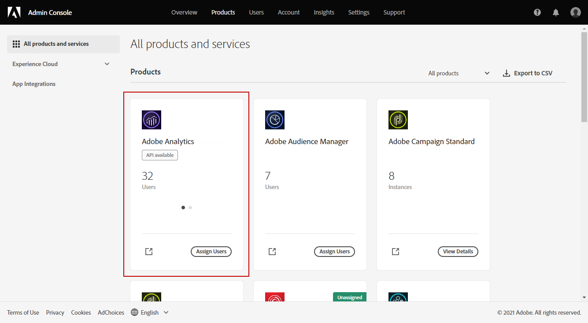

1. Click **[!UICONTROL New Profile]**.

    

1. Add a **[!UICONTROL Product profile name]**, we suggest using the following syntax: `reserved_campaign_classic_<Company Name>`. Then, click **[!UICONTROL Next]**.
   
   This **[!UICONTROL Product profile]** should be used exclusively for the Analytics Connector to prevent misconfiguration errors.

1. Open your newly created **[!UICONTROL Product profile]** and select the **[!UICONTROL Permissions]** tab.

    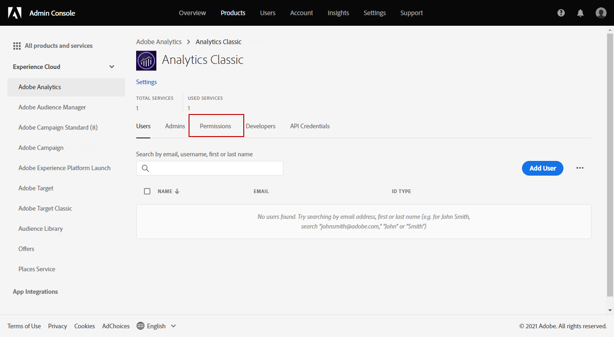

1. Configure the different capabilities clicking **[!UICONTROL Edit]** and select the permissions to assign to your **[!UICONTROL Product profile]** by clicking the plus (+) icon. 

   For more information on how to manage permissions, refer to the [Admin console documentation](https://helpx.adobe.com/mt/enterprise/using/manage-permissions-and-roles.html).

1. For the **[!UICONTROL Report Suites]** capability, add the **[!UICONTROL Report Suites]** you need to use later on.
      
      If you don't have any report suites, you can create it following [these steps](../../platform/using/adobe-analytics-connector.md#report-suite-analytics).

    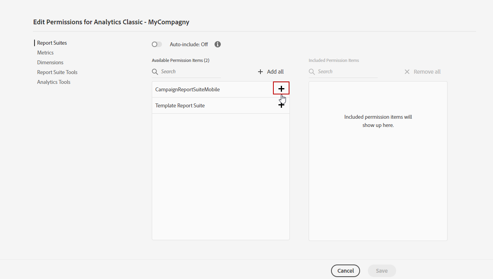

1. For the **[!UICONTROL Metrics]** capability, add the **[!UICONTROL Metrics]** you will need to configure later on. 

    If needed, you can switch on the Auto-include option which will add every permissions item into the included list and will automatically add new permission items.

    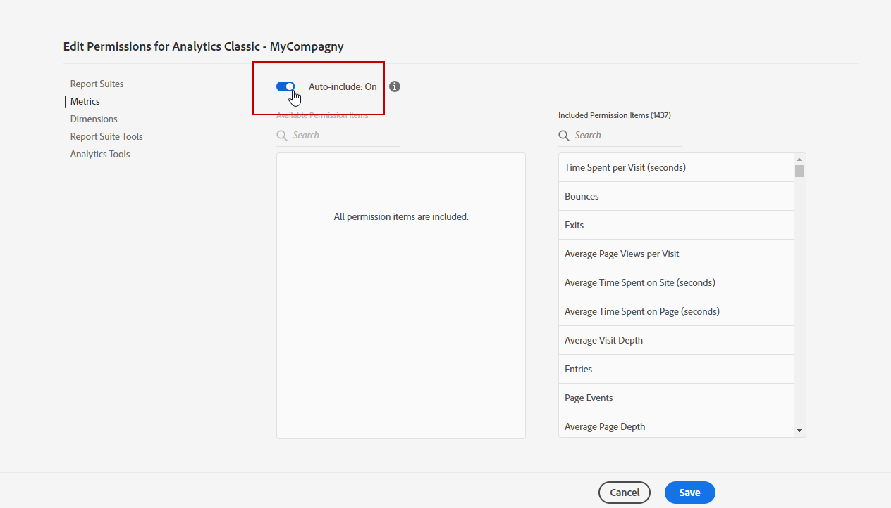

1. For the **[!UICONTROL Dimensions]** capability, add the **[!UICONTROL Dimensions]** you will need to configure later on.

1. For the **[!UICONTROL Report Suite Tools]** capability, add the following permissions:

   * **[!UICONTROL Report suite Mgmt]**
   * **[!UICONTROL Conversion variables]**
   * **[!UICONTROL Success events]**
   * **[!UICONTROL Custom data Warehouse report]**
   * **[!UICONTROL Data sources manager]**
   * **[!UICONTROL Classifications]**

1. For the **[!UICONTROL Analytics Tools]** capability, add the following permissions:

   * **[!UICONTROL Code Manager - Web services]**
   * **[!UICONTROL Logs - Web services]**
   * **[!UICONTROL Web services]**
   * **[!UICONTROL Web service access]**
   * **[!UICONTROL Calculated metric creation]**
   * **[!UICONTROL Segment creation]**

Your Product profile is now configured. You then need to create the Adobe I/O project.

## Create Adobe I/O Project {#create-adobe-io}

1. Access Adobe I/O and log in as **System Administrator** of your Organization.
   
   For more information on Admin roles, refer to this [page](https://helpx.adobe.com/enterprise/using/admin-roles.html).
   
1. Click **[!UICONTROL Create a new project]**.

    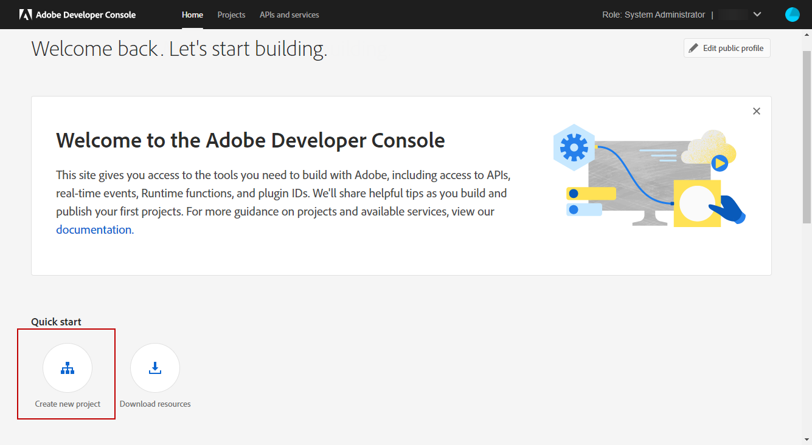

1. Click **[!UICONTROL Add to Project]** and select **[!UICONTROL API]**.

    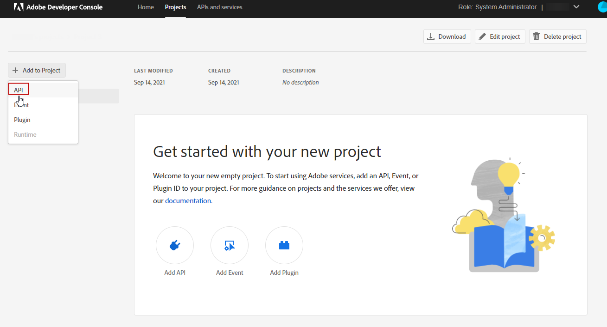

1. Select [!DNL Adobe Analytics] and click **[!UICONTROL Next]**.

    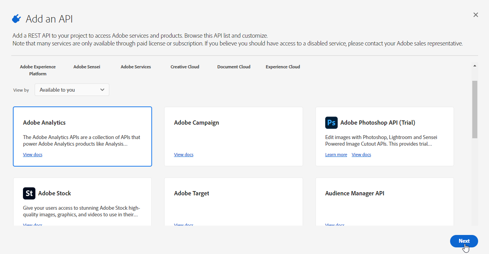

1. Choose **[!UICONTROL Service Account (JWT)]** as authentication type and click **[!UICONTROL Next]**.

    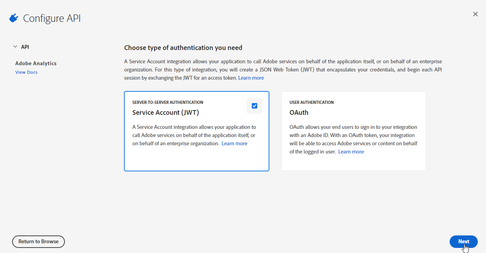

1. Select the **[!UICONTROL Option 1: Generate a Key-Pair]** option and click **[!UICONTROL Generate a Key-Pair]**.

   The config.zip file will then be automatically downloaded.

    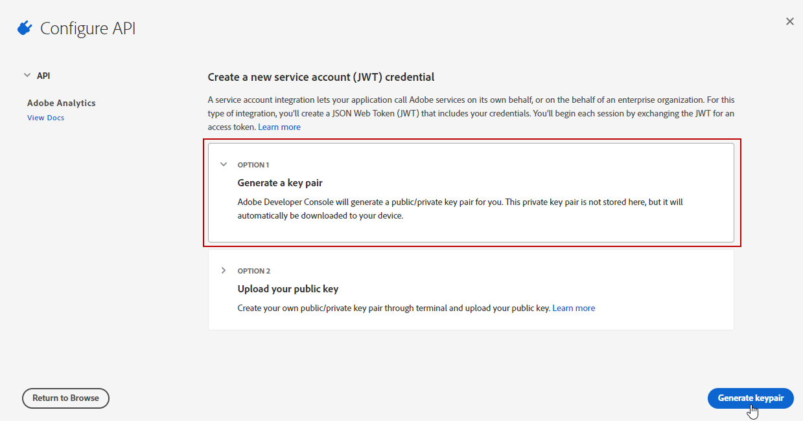

1. Click **[!UICONTROL Next]**. 

    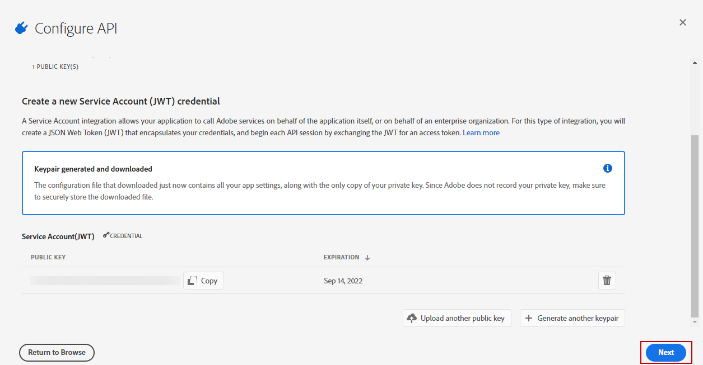

1. Select the **[!UICONTROL Product profile]** created in the previous steps detailed in this [section](#analytics-product-profile).

1. Then, click **[!UICONTROL Save Configured API]**.

    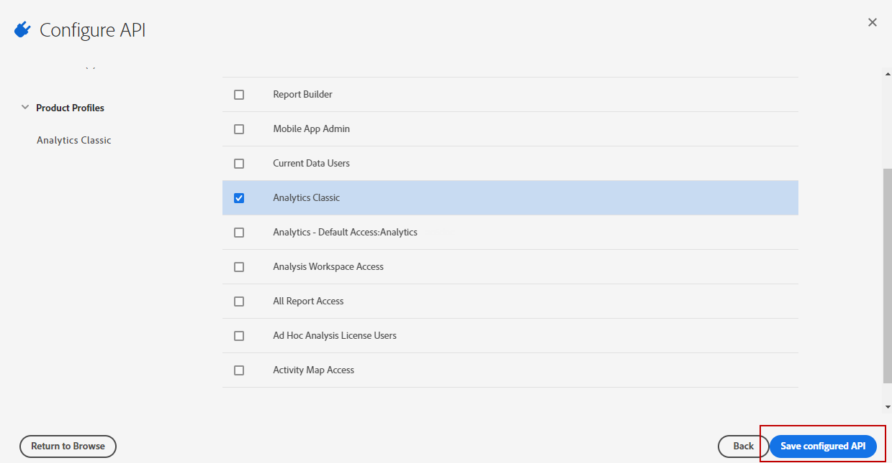

1. From your project, select [!DNL Adobe Analytics] and copy the following information under **[!UICONTROL Service Account (JWT)]**:

   * **[!UICONTROL Client ID]**
   * **[!UICONTROL Client Secret]**
   * **[!UICONTROL Technical account ID]**
   * **[!UICONTROL Organization ID]**

    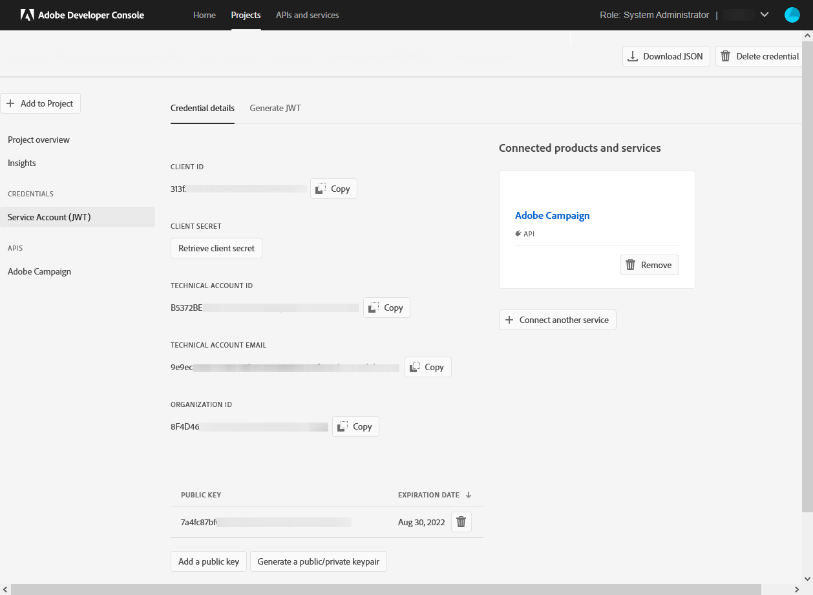

1. Use the private key generated in step 6. 
    
    If you already set up Triggers using these credentials, your private key must be the same for this connector configuration.

1. Encode the private key using the following command: `base64 ./private.key > private.key.base64`. This will save the base64 content to a new file `private.key.base64`.

    >[!NOTE]
    >
    >Extra lines can sometimes be automatically added when copy/pasting the private key. Remember to remove it before encoding your private key.

1. Copy the contents from the file `private.key.base64`.

1. Login via SSH to each container where the Adobe Campaign instance is installed and add the Project credentials in Adobe Campaign by running the following command as `neolane` user. This will insert the **[!UICONTROL Technical Account]** credentials in the instance configuration file.

    ```
    nlserver config -instance:<instance name> -setimsjwtauth:Organization_Id/Client_Id/Technical_Account_ID/<Client_Secret>/<Base64_encoded_Private_Key>
    ```

You can now start using the Analytics connector and track your customer behaviors.
