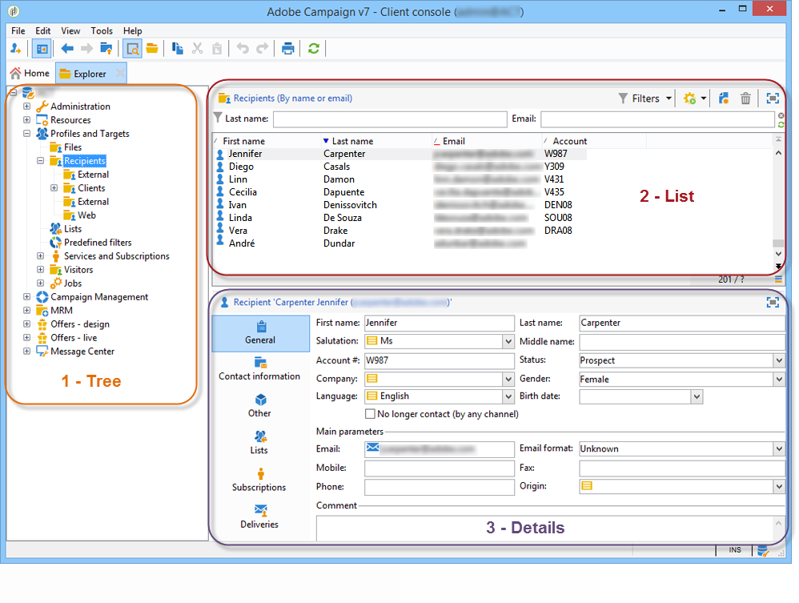
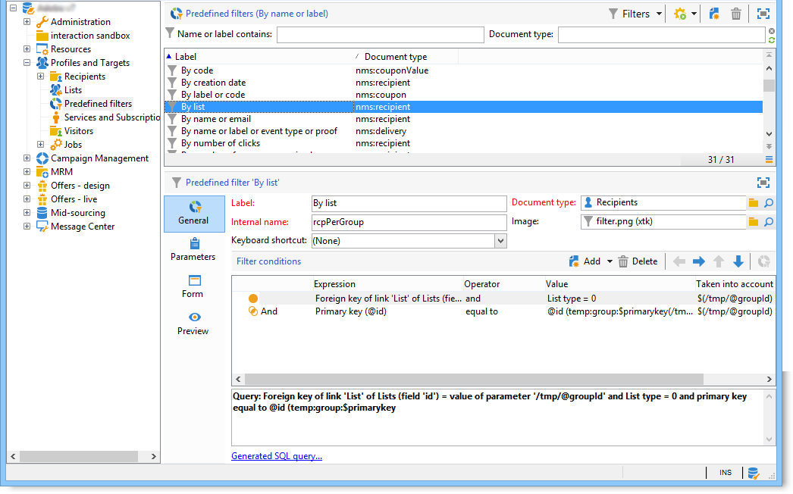
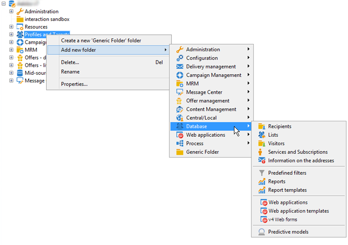
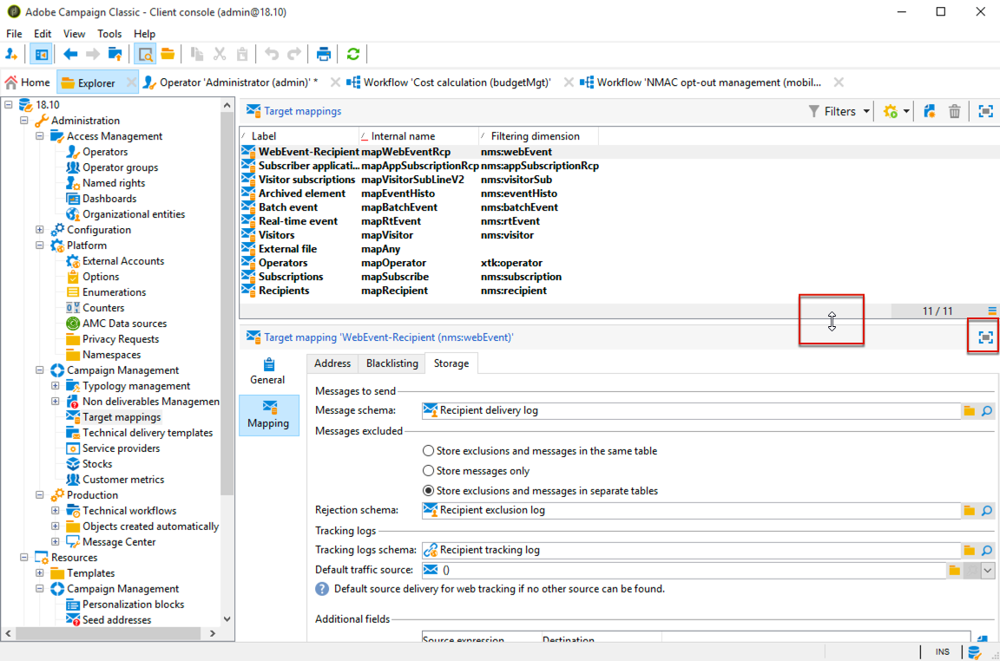

# Use Adobe Campaign explorer

The Adobe Campaign explorer is accessible via the toolbar icon. It lets you access the Adobe Campaign all the Adobe Campaign capabilities, configuration screens and a more detailed view of some of the platform elements.

>[!NOTE]
>
>To learn more about Adobe Campaign explorer, refer to these pages in the Campaign v8 documentation: to learn more [about the user interface](https://experienceleague.adobe.com/en/docs/campaign/campaign-v8/new/campaign-ui#ac-explorer-ui){target=_blank}, its [settings](https://experienceleague.adobe.com/en/docs/campaign/campaign-v8/config/configuration/ui-settings){target=_blank} or [how to manage folders and views in the explorer](https://experienceleague.adobe.com/en/docs/campaign/campaign-v8/config/configuration/folders-and-views){target=_blank}.

<!--
The **[!UICONTROL Explorer]** workspace is divided into three zones:

**1 - Tree**: you can personalize the content of the tree (add, move, or delete nodes). This procedure is intended for expert users only. For more on this, refer to  [this section](#about-navigation-hierarchy).).

**2 - List**: you can filter this list, run searches, add information, or sort data. [Learn more](adobe-campaign-ui-lists.md).

**3 - Details**: you can display the details of the selected element. The icon in the upper right-hand section lets you display this information in full-screen format.

## Folders and navigation tree{#about-navigation-hierarchy}

The navigation tree works like a file browser (e.g. Windows Explorer). Folders may contain sub-folders. Selecting a node displays the view corresponding to the node.

The view displayed is a list associated with a schema and an input form to edit the selected line.

To add a new folder to the tree, right-click the folder in the branch where you wish to insert a folder, and select **[!UICONTROL Add new folder]** . In the shortcut menu, select the type of file to be created.

Learn how to configure Campaign navigation tree [in this section](../../configuration/using/configuration.md).

Learn how to set permissions on folders [in this section](access-management-folders.md).

## Folder configuration best practices

* **Use built-in folders**

  Using the built-in folders makes it easier for people not involved in the project to use, maintain and troubleshoot the application. You should not create custom folder structures for recipients, lists, deliveries, etc., but use the standard folders such as Administration, Profiles & Targets, Campaign management.

* **Create sub-folders**

  Place technical workflows under the standard folder: Administration / Production / Technical Workflows, and create subdirectories per workflow type.
  
* **Set a naming convention**

  For example you can name the workflows in alphabetical order, so that they appear sorted in the order of execution.
  
  For example:
  
  * A1 – import recipients, starts at 10:00;
  * A2 – import tickets, starts at 11:00.

* **Create templates for users to start with**

  Create delivery templates, workflow templates, campaign templates specific to users. This structure can save time and make sure that the right delivery mapping and typologies are used for each user.

## Screen resolution {#screen-resolution}

For optimal navigation and usability, Adobe recommends using a minimum screen resolution of 1600x900 pixels.

>[!CAUTION]
>
>Resolutions under 1600x900 pixels are not supported by Adobe Campaign.

In the **[!UICONTROL Explorer]** workspace, if some parts of the **[!UICONTROL Details]** zone appear to be truncated, expand it using the arrow on top of the zone or click the **[!UICONTROL Enlarge]** button.

## Browse and customize lists {#browsing-lists}

Learn how to browse, manage and customize lists [in this section](adobe-campaign-ui-lists.md).
-->
