# Manage and customize lists{#manage-and-customize-lists}

You can access the lists of records in Campaign database using the Explorer. You can filter these lists, run searches, add information, filter and sort data.

## Count records {#counting-records}

By default, Adobe Campaign loads the first 200 records of a list. This means that the display does not necessarily show all the records of the table you are viewing. You can run a count of the number of records in the list and load more records.

In the lower right-hand part of the list screen, a **[!UICONTROL counter]** shows how many records have been loaded and the total number of records in the database (after applying any filters):

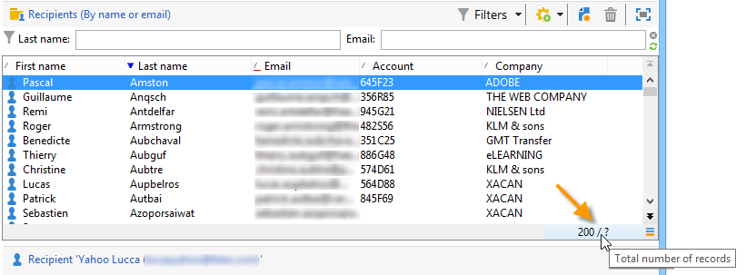

If a "**?**" appears instead of the number on the right, click the counter to launch the calculation.

### Load more records {#loading-more-records}

To load (and therefore display) additional records (200 lines by default) click **[!UICONTROL Continue loading]**.

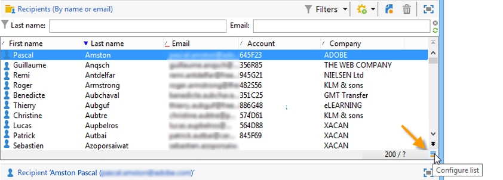

To load all the records, right-click the list and select **[!UICONTROL Load all]**.

>[!CAUTION]
>
>Depending on the number of records, the time for loading the full list can be long.

### Change default number of records {#change-default-number-of-records}

To change the default number of records loaded, click **[!UICONTROL Configure list]** in the bottom right-hand corner of the list.

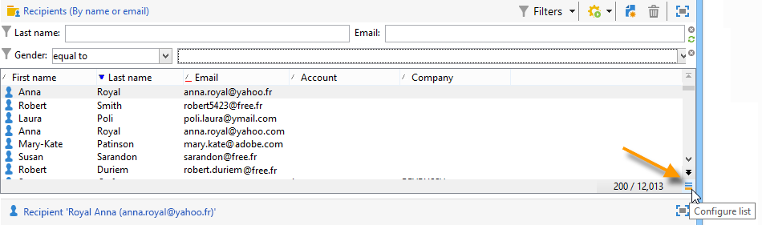

In the list configuration window, click **[!UICONTROL Advanced parameters]** (bottom left) and change the number of lines to retrieve.

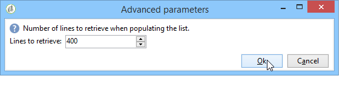

## Configure lists {#configuring-lists}

### Add columns {#add-columns}

There are two ways to add a column in a list.

You can quickly add a column to a list from the detail of a record. To do this:

1. From a detail screen, right-click the field you want to display in a column.
1. Select **[!UICONTROL Add in the list]**.

   The column is added to the right of the existing columns.

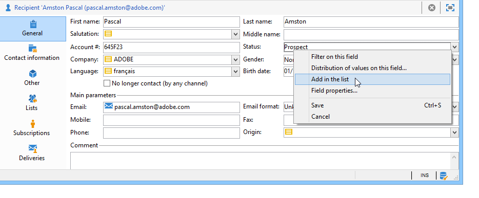

Another way to add columns, for example if you want to display data which is not displayed on the detail screen, is to use the list configuration window. To do this:

1. Click **[!UICONTROL Configure list]** below and to the right of the list.

   

1. In the list configuration window, double-click the field to be added in the **[!UICONTROL Available fields]** list in order to add it to the **[!UICONTROL Output columns]**. 

   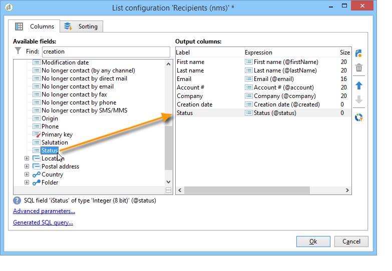

   >[!NOTE]
   >
   >By default, advanced fields are not displayed. To display them, click **Display advanced fields** below and to the right of the list of available fields.
   >
   >The labels are displayed by table and then in alphabetical order.
   >
   >Use the **Search** field to run a search in the available fields. For further information, refer to [this section](#sorting-a-list).
   >
   >Fields are identified by specific icons: SQL fields, linked tables, calculated fields, etc. For each field selected, the description is displayed under the list of available fields. [Learn more](#configuring-lists).  
   >
   >You can also sort and filter data. See [this section](../../platform/using/filtering-options.md).

1. Repeat for each column to be displayed.
1. Use the arrows to modify the **display order**. The highest column will be on the left in the list of records.

   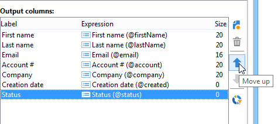

1. If you need, you can click **[!UICONTROL Distribution of values]** to view the repartition of values for the selected field in the current folder.

   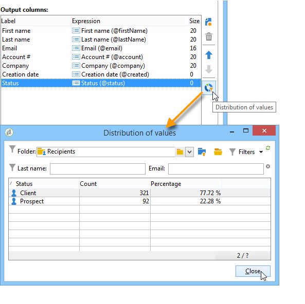

1. Click **[!UICONTROL OK]** to confirm the configuration and display the result.

### Create a new column {#create-a-new-column}

You can create new columns to display additional fields in the list. To do this:

1. Click **[!UICONTROL Configure the list]** at below and to the right of the list.
1. Click **[!UICONTROL Add]** to display a new field in the list.

### Remove a column {#remove-a-column}

You can mask one or more columns in a list of records using **[!UICONTROL Configure list]** located below and to the right of the list.

In the list configuration window, select the column to be masked from the **[!UICONTROL Output columns]** zone, and click the delete button.

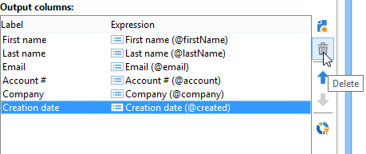

Repeat for each column to be masked. Click **[!UICONTROL OK]** to confirm the configuration and display the result.

### Adjust column width {#adjust-column-width}

When a list is active, i.e. at least one line is selected, you can use F9 to adjust the width of the columns so that all the columns can be displayed on screen.

### Display data in sub-folders {#display-sub-folders-records}

Lists can display:

* Either the records contained in the selected folder only,
* Or the records in the selected folder AND its sub-folders.

To switch from one display mode to the other, click **[!UICONTROL Display sub-levels]** in the toolbar.

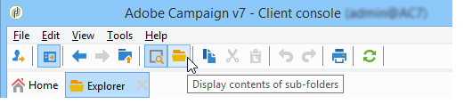

## Save a list configuration {#saving-a-list-configuration}

The list configurations are defined locally at the workstation level. When the local cache is cleared, local configurations are disabled.

By default, the defined display parameters apply to all lists with the corresponding folder type. Thus, when you modify how the list of recipients is displayed from a folder, this configuration will be applied to all the other recipient folders.

It is, however, possible to save more than one configuration to be applied to different folders of the same type. The configuration is saved with the properties of the folder containing the data and can be reapplied.

For example, for a delivery folder, it is possible to configure the following display:

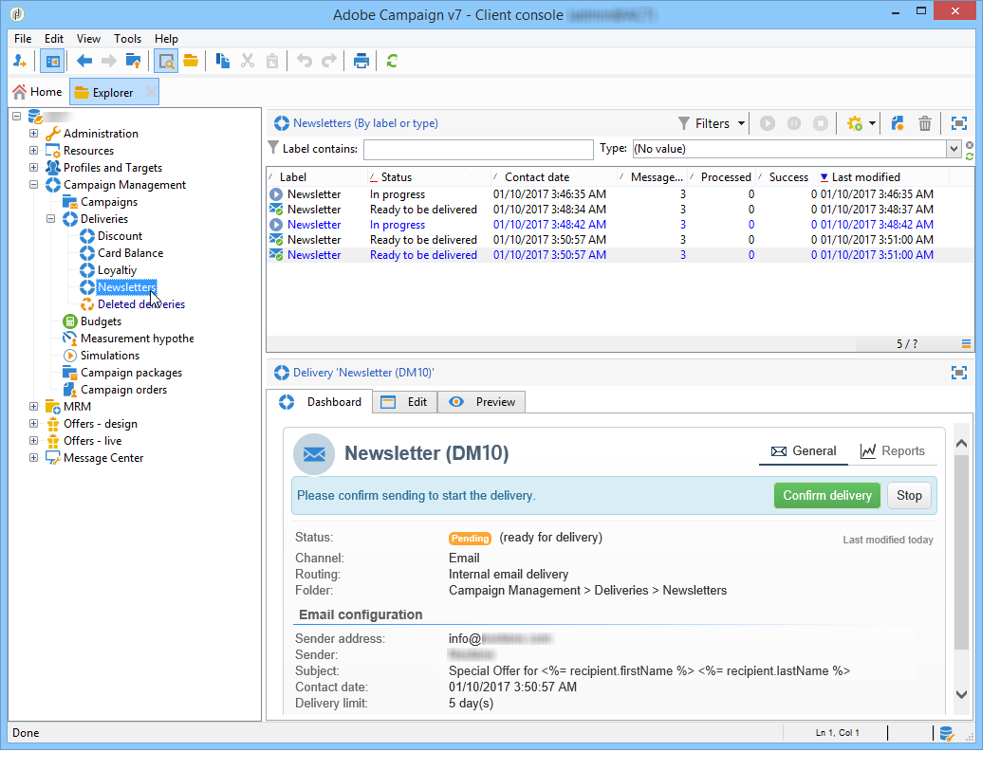

To save this list configuration so that it can be reused, follow the steps below:

1. Right click the folder containing the displayed data.
1. Select **[!UICONTROL Properties]**.
1. Click **[!UICONTROL Advanced settings]** and then specify a name in the **[!UICONTROL Configuration]** field. 

   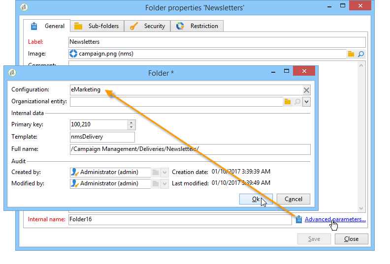

1. Click **[!UICONTROL OK]** and then click **[!UICONTROL Save]**.

You can then apply this configuration to another **Delivery** folder:

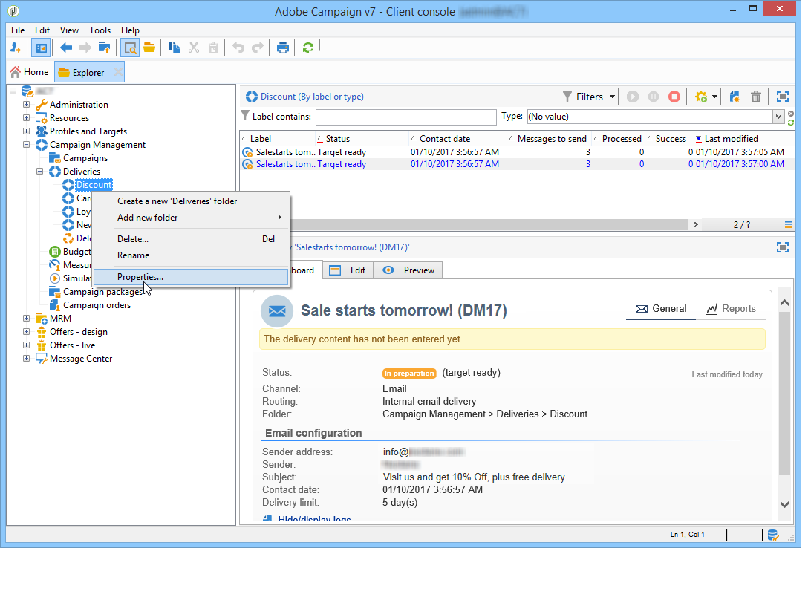

Click **[!UICONTROL Save]** in the folder properties window. The list display is modified to match the specified configuration:

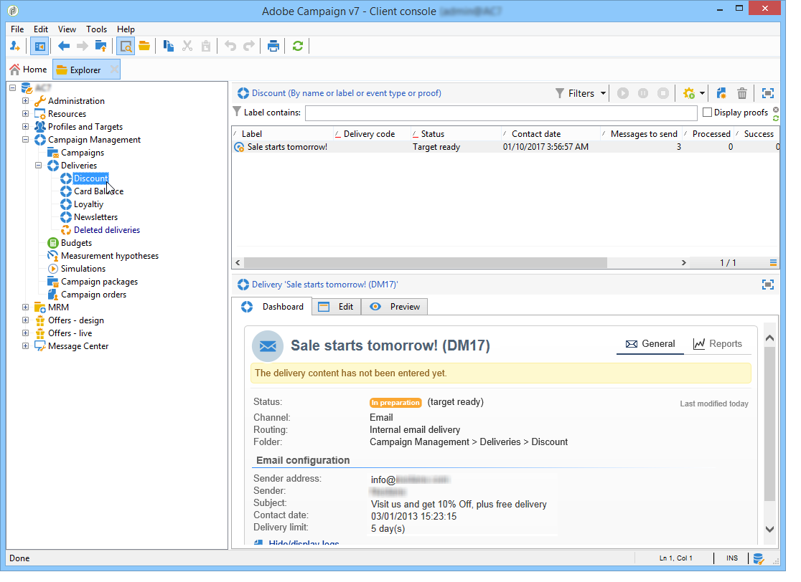

## Export a list {#exporting-a-list}

To export data from a list, you must use an export wizard. To access it, select the elements to be exported from the list, right-click and select **[!UICONTROL Export...]**.

The use of the import and export functions is explained in [Generic imports and exports](../../platform/using/about-generic-imports-exports.md).

>[!CAUTION]
>
>Elements from a list must not be exported using the Copy/Paste function.

## Sort a list {#sorting-a-list}

Lists can contain a large amount of data. You can sort these data or apply simple or advanced filters. Sorting lets you display data in ascending or descending order. Filters let you define and combine criteria to display selected data only.

Click the column header to apply an ascending or descending sort, or to cancel data sorting. Active sort status and sorting order are indicated by a blue arrow before the column label. A red dash before the column label means that the sort is applied to data indexed from the database. This sorting method is used to optimize sort jobs.

You can also configure sorting or combine sort criteria. To do this, follow the steps below:

1. **[!UICONTROL Configure list]** below and to the right of the list. 

   

1. In the list configuration window, click the **[!UICONTROL Sorting]** tab.
1. Select the fields to sort and the sort direction (ascending or descending).

   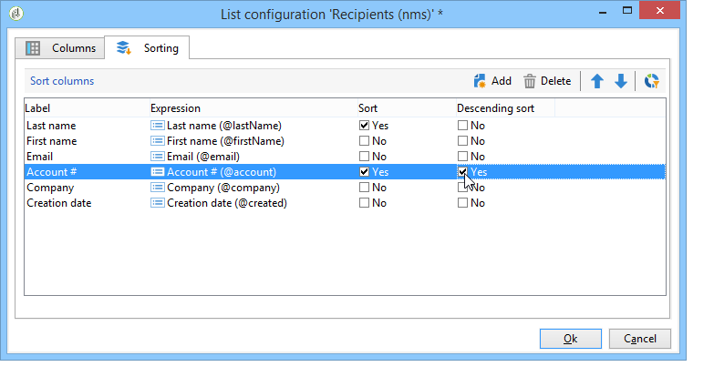

1. Sort priority is defined by the order of the sort columns. To change the priority, use the appropriate icons to change the order of the columns.

   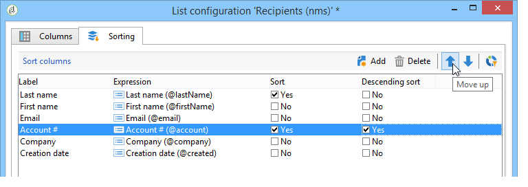

   Sort priority does not affect the display of the columns in the list.

1. Click **[!UICONTROL Ok]** to confirm this configuration and display the result in the list.

### Searching elements {#running-a-search}

You can run a search of the available fields in an editor using the **[!UICONTROL Search]** field located above the list of fields. Press **Enter** on the keyboard or browse the list. The fields that match your search will have bold labels.

>[!NOTE]
>
>You can create filters to display only some of the data in a list. [Learn more](../../platform/using/creating-filters.md).
