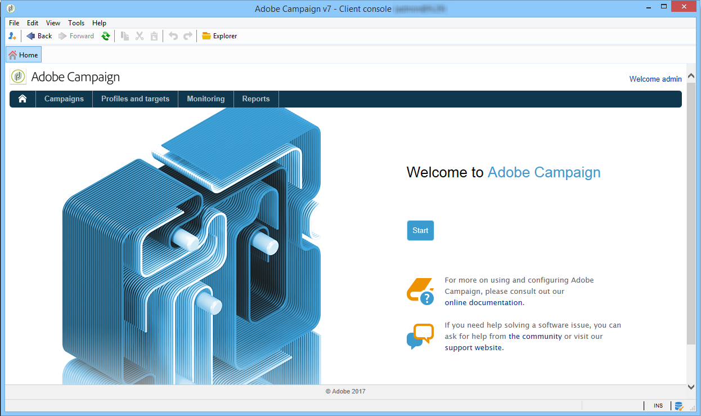
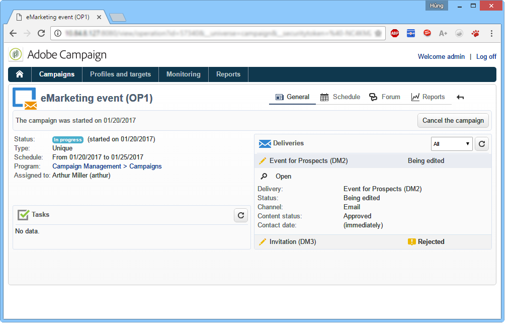
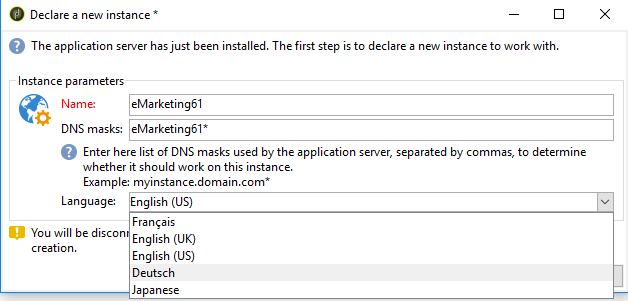
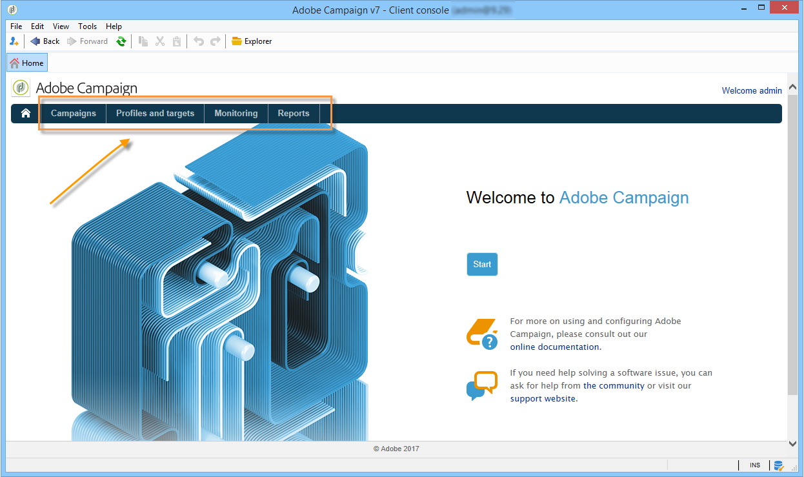
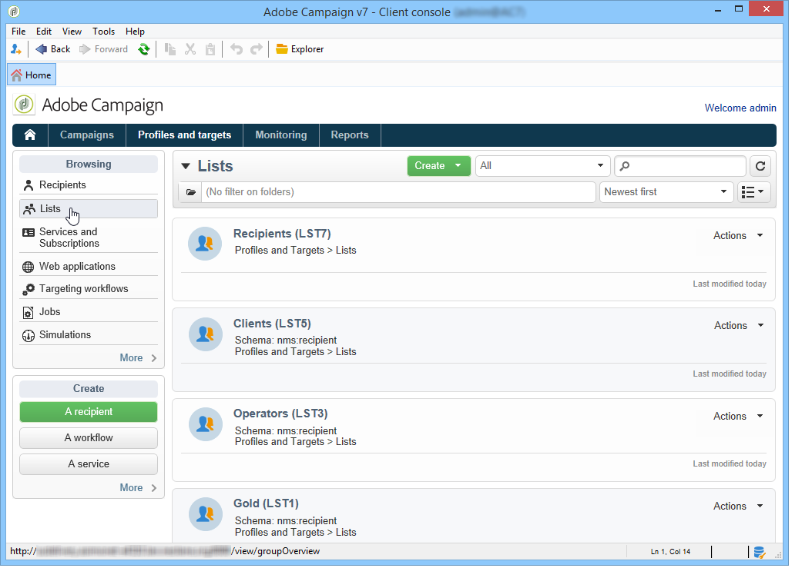
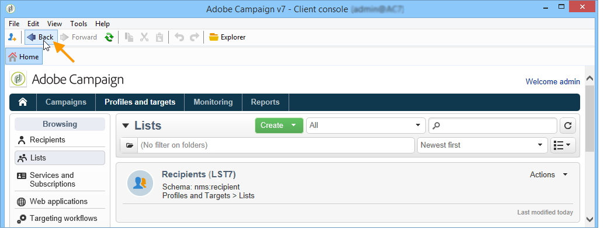
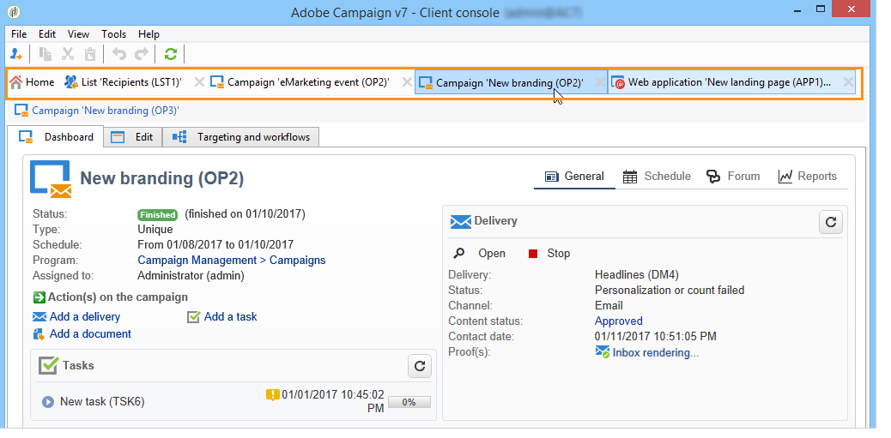
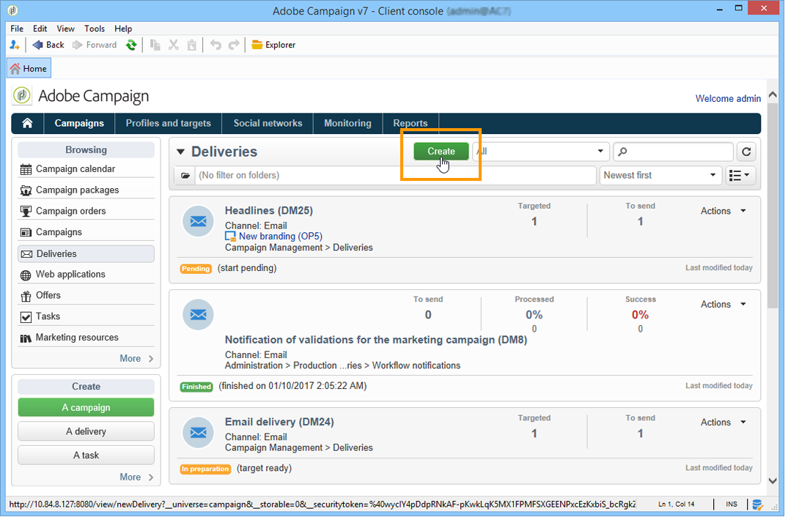
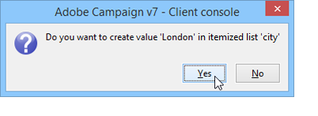
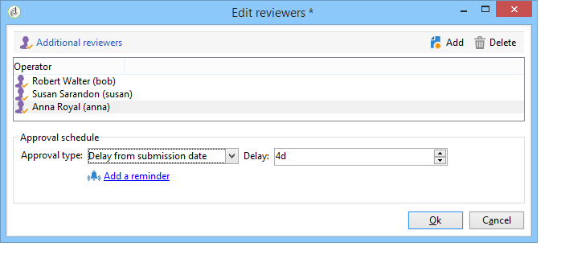

# Adobe Campaign workspace{#adobe-campaign-workspace}

## Explore Adobe Campaign interface {#about-adobe-campaign-interface}

Once you are connected to the database, you will access the Adobe Campaign home page, which is a dashboard: it is made up of links and shortcuts which let you access capabilities, depending on your installation as well as general platform configurations.

From the central section of the home page, you can use links to access Campaign online documentation portal, forum and the support website.

 Discover Campaign workspace in [video](#video)

>[!NOTE]
>
>Adobe Campaign capabilities available on your instance depend on modules and add-ons installed. Some of them may also not be available, depending on your permissions and specific configurations.  
>
>Before installing any module or add-on, you need to check your license agreement or contact your Adobe account executive.

### Console and web access {#console-and-web-access}

The Adobe Campaign platform is accessible via a console or via an internet browser.

The Web access provides an interface that is similar to the console but with a reduced set of functionalities.

For instance, for a given operator, a campaign will show up with the following options in the console:

Whereas with Web access, the options will mainly enable viewing:

### Languages {#languages}

The language is selected when installing your Adobe Campaign Classic instance.

You can choose between five different languages:

* English (UK)
* English (US)
* French
* German
* Japanese

The language you chose for your Adobe Campaign Classic instance might impact date and time formats. For more on this, refer to this [section](../../platform/using/adobe-campaign-workspace.md#date-and-time).

For more information on how to create an instance, refer to this [page](../../installation/using/creating-an-instance-and-logging-on.md).

>[!CAUTION]
>
>The language cannot be changed after the instance creation. 

## Navigation basics {#navigation-basics}

### Browse pages {#browsing-pages}

The various functionalities of the platform are broken down into core capabilities: use the links that you see in the top section of the interface to access them. 

The list of core capabilities you can access depends on the packages and add-ons you have installed and on your access rights.

Each capability includes a set of functionalities based on task related needs and use context. For instance, the **[!UICONTROL Profiles and targets]** link gets you to the recipient lists, subscription services, existing targeting workflows and the shortcuts for creating these elements.

The lists are available via the **[!UICONTROL Lists]** link in the left-hand section of the **[!UICONTROL Profiles and Targets]** interface.

### Use tabs {#using-tabs}

* When you click a core capability or a link, the relevant page replaces the current page. To go back to the previous page, click the **[!UICONTROL Back]** button on the toolbar. To return to the home page, click the **[!UICONTROL Home]** button. 

  

* In the case of a menu or a shortcut to a display screen (such as a web application, program, delivery, report, etc.), the matching page is displayed in another tab. This enables you to browse from one page to the other using the tabs.

  

### Create an element {#creating-an-element}

Each core capability section lets you browse among the available elements. To do this, use the shortcuts in the **[!UICONTROL Browsing]** section. The **[!UICONTROL Other choices]** link lets you access all other pages, regardless of environment.

You can create a new element (delivery, Web application, workflow, etc.) using the shortcuts in the **[!UICONTROL Create]** section on the left of the screen. Use the **[!UICONTROL Create]** button above the list to add new elements to the list.

For example, on the delivery page, use the **[!UICONTROL Create]** button to create a new delivery.

## Formats and units {#formats-and-units}

### Date and time {#date-and-time}

The language of your Adobe Campaign Classic instance impacts date and time formats.

Language is selected when installing Campaign, and cannot be changed afterwards. You can select: English (US), English (EN), French, German or Japanese. For more on this, refer to [this page](../../installation/using/creating-an-instance-and-logging-on.md).

Main differences between US English and UK English are: 

<table> 
 <thead> 
  <tr> 
   <th> Formats  </th> 
   <th> English (US)  </th> 
   <th> English (EN)  </th> 
  </tr> 
 </thead> 
 <tbody> 
  <tr> 
   <td> Date  </td> 
   <td> Week starts on Sunday  </td> 
   <td> Week starts on Monday  </td> 
  </tr> 
  <tr> 
   <td> Short date  </td> 
   <td> 
%2M/%2D/%4Y

<strong>ex: 09/25/2018</strong>
 </td> 
   <td> 
%2D/%2M/%4Y

<strong>ex: 25/09/2018</strong>
 </td> 
  </tr> 
  <tr> 
   <td> Short date with time  </td> 
   <td> 
%2M/%2D/%4Y %I:%2N:%2S %P

<strong>ex: 09/25/2018 10:47:25 PM</strong>
 </td> 
   <td> 
%2D/%2M/%4Y %2H:%2N:%2S

<strong>ex: 25/09/2018 22:47:25</strong>
 </td> 
  </tr> 
 </tbody> 
</table>

### Add values in an enumeration {#add-values-in-an-enumeration}

Using the input fields with a drop-down list, you can enter an enumeration value, which can be stored and then offered as an option in the drop-down list. For example, in the **[!UICONTROL City]** field of the **[!UICONTROL General]** tab of a recipient profile, you can enter London. When you press Enter to confirm this value, a message asks if you want to save this value for the enumeration associated with the field. 

If you click **[!UICONTROL Yes]**, this value will be available in the combo box of the relevant field (in this case: **[!UICONTROL London]**).

>[!NOTE]
>
>Enumerations (also known as 'itemized lists') are managed by the administrator via the **[!UICONTROL Administration > Platform > Enumerations]** section. For more on this, refer to [Managing enumerations](../../platform/using/managing-enumerations.md).

### Default units {#default-units}

In the fields that express a duration (e.g. validity period of the resources of a delivery, approval deadline for a task, etc.), the value can be expressed in the following **units**:

* **[!UICONTROL s]** for seconds,
* **[!UICONTROL mn]** for minutes,
* **[!UICONTROL h]** for hours,
* **[!UICONTROL d]** for days.

## Tutorial video {#video}

This video presents Campaign Classic workspace.

>[!VIDEO](https://video.tv.adobe.com/v/35130?quality=12)

Additional Campaign Classic how-to videos are available [here](https://experienceleague.adobe.com/docs/campaign-classic-learn/tutorials/overview.html).
