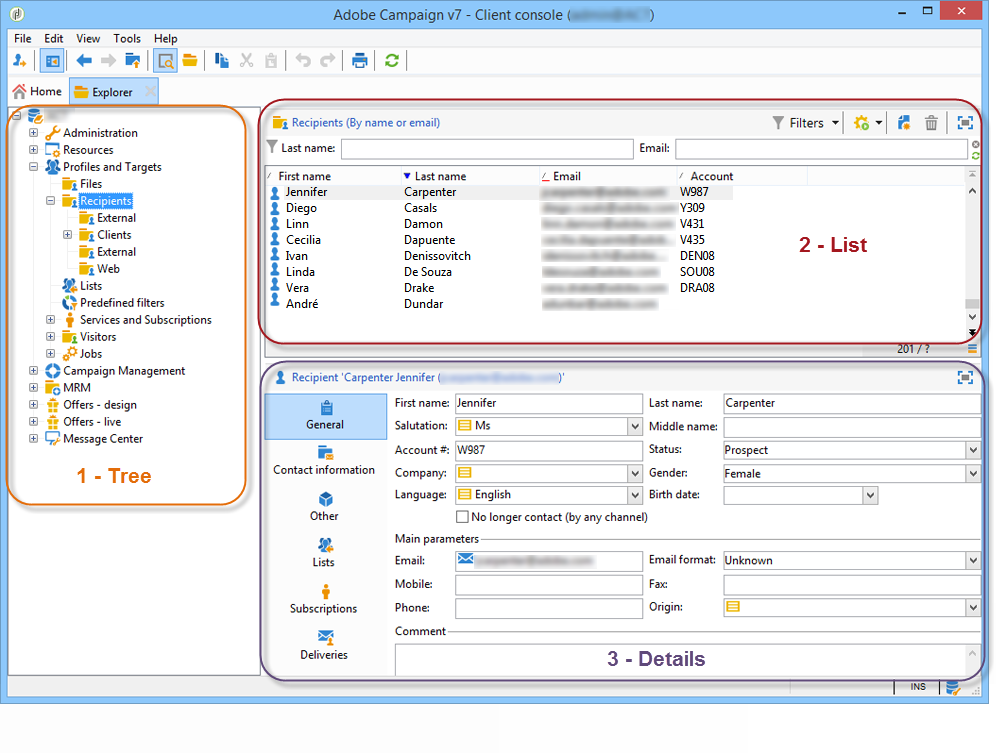
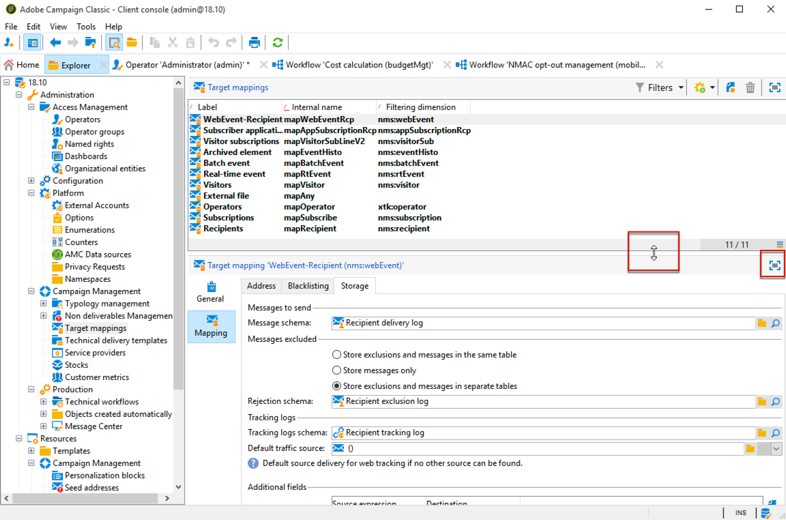

# Adobe Campaign workspace{#adobe-campaign-workspace}

## About Adobe Campaign interface {#about-adobe-campaign-interface}

Once you are connected to the database, you will access the Adobe Campaign home page, which is a dashboard: it is made up of links and shortcuts which let you access capabilities, depending on your installation as well as general platform configurations.

From the central section of the home page, you can use links to access Campaign online documentation portal, forum and the support website.

The screenshot above is an example of the home page for an Adobe Campaign user. For more on this, watch the [Adobe Campaign Interface overview video](https://docs.adobe.com/content/help/en/campaign-learn/campaign-classic-tutorials/getting-started/interface-overview.html).

>[!NOTE]
>
>Adobe Campaign capabilities available on your instance depend on modules and add-ons installed. Some of them may also not be available, depending on your permissions and specific configurations.  
>
>Before installing any module or add-on, you need to check your license agreement or contact your Adobe account executive.

### Console and web access {#console-and-web-access}

The Adobe Campaign platform is accessible via a console or via an internet browser.

The Web access provides an interface that is similar to the console but with a reduced set of functionalities.

For instance, for a given operator, a campaign will show up with the following options in the console:

Whereas with Web access, the options will mainly enable viewing:

### Languages {#languages}

The language is selected when installing your Adobe Campaign Classic instance and cannot be changed afterwards. For more information on how to create an instance, refer to this [page](../../installation/using/creating-an-instance-and-logging-on.md).

You can choose between five different languages:

* English (UK)
* English (US)
* French
* German
* Japanese

The language you chose for your Adobe Campaign Classic instance might impact date and time formats. For more on this, refer to this [section](../../platform/using/adobe-campaign-workspace.md#date-and-time).

## Navigation basics {#navigation-basics}

### Browsing pages {#browsing-pages}

The various functionalities of the platform are broken down into core capabilities: use the links that you see in the top section of the interface to access them. 

The list of core capabilities you can access depends on the packages and add-ons you have installed and on your access rights.

Each capability includes a set of functionalities based on task related needs and use context. For instance, the **[!UICONTROL Profiles and targets]** link gets you to the recipient lists, subscription services, existing targeting workflows and the shortcuts for creating these elements.

The lists are available via the **[!UICONTROL Lists]** link in the left-hand section of the **[!UICONTROL Profiles and Targets]** interface.

### Using tabs {#using-tabs}

* When you click a core capability or a link, the relevant page replaces the current page. To go back to the previous page, click the **[!UICONTROL Back]** button on the toolbar. To return to the home page, click the **[!UICONTROL Home]** button. 

  

* In the case of a menu or a shortcut to a display screen (such as a web application, program, delivery, report, etc.), the matching page is displayed in another tab. This enables you to browse from one page to the other using the tabs.

  

### Creating an element {#creating-an-element}

Each core capability section lets you browse among the available elements. To do this, use the shortcuts in the **[!UICONTROL Browsing]** section. The **[!UICONTROL Other choices]** link lets you access all other pages, regardless of environment.

You can create a new element (delivery, Web application, workflow, etc.) using the shortcuts in the **[!UICONTROL Create]** section on the left of the screen. Use the **[!UICONTROL Create]** button above the list to add new elements to the list.

For example, on the delivery page, use the **[!UICONTROL Create]** button to create a new delivery.

## Using Adobe Campaign explorer {#using-adobe-campaign-explorer}

### About Adobe Campaign explorer {#about-adobe-campaign-explorer}

The Adobe Campaign explorer is accessible via the toolbar icon. It lets you access the Adobe Campaign all the Adobe Campaign capabilities, configuration screens and a more detailed view of some of the platform elements.

The **[!UICONTROL Explorer]** workspace is divided into three zones:

**1 - Tree**: you can personalize the content of the tree (add, move, or delete nodes). This procedure is intended for expert users only. For more on this, refer to [this page](../../configuration/using/about-navigation-hierarchy.md).

**2 - List**: you can filter this list, run searches, add information, or sort data.

**3 - Details**: you can display the details of the selected element. The icon in the upper right-hand section lets you display this information in full-screen format.

### Screen resolution {#screen-resolution}

For optimal navigation and usability, Adobe recommends using a minimum screen resolution of 1600x900 pixels.

>[!CAUTION]
>
>Resolutions under 1600x900 pixels may not be supported by Adobe Campaign.

In the **[!UICONTROL Explorer]** workspace, if some parts of the **[!UICONTROL Details]** zone appear to be truncated, expand it using the arrow on top of the zone or click the **[!UICONTROL Enlarge]** button.

### Browsing lists {#browsing-lists}

To browse a list, you can use **the scroll bars** (horizontal and vertical) to scroll through it without changing the record selection, **the mouse wheel**, or **the arrow keys**.

>[!NOTE]
>
>Configuration and personalization of list content are presented in [Configuring lists](#configuring-lists).  
>
>You can also sort and filter data. See [Filtering options](../../platform/using/filtering-options.md).

### Counting records {#counting-records}

By default, Adobe Campaign loads the first 200 records of a list. This means that the display does not necessarily show all the records of the table you are viewing. You can run a count of the number of records in the list and load more records.

In the lower right-hand part of the list screen, a **[!UICONTROL counter]** shows how many records have been loaded and the total number of records in the database (after applying any filters):

If a "**?**" appears instead of the number on the right, click the counter to launch the calculation.

### Loading more records {#loading-more-records}

To load (and therefore display) additional records (200 lines by default) click **[!UICONTROL Continue loading]**.

To load all the records, right-click the list and select **[!UICONTROL Load all]**.

>[!CAUTION]
>
>Depending on the number of records, the time for loading the full list can be long.

### Change default number of records {#change-default-number-of-records}

To change the default number of records loaded, click **[!UICONTROL Configure list]** in the bottom right-hand corner of the list.

In the list configuration window, click "Advanced parameters" (bottom left) and change the number of lines to retrieve.

### Configuring lists {#configuring-lists}

#### Add columns {#add-columns}

There are two ways to add a column in a list.

You can quickly add a column to a list from the detail of a record. To do this:

1. From a detail screen, right-click the field you want to display in a column.
1. Select **[!UICONTROL Add in the list]**.

   The column is added to the right of the existing columns.

Another way to add columns, for example if you want to display data which is not displayed on the detail screen, is to use the list configuration window. To do this:

1. Click **[!UICONTROL Configure list]** below and to the right of the list.

   

1. In the list configuration window, double-click the field to be added in the **[!UICONTROL Available fields]** list in order to add it to the **[!UICONTROL Output columns]**. 

   

   >[!NOTE]
   >
   >By default, advanced fields are not displayed. To display them, click **Display advanced fields** below and to the right of the list of available fields.
   >
   >The labels are displayed by table and then in alphabetical order.
   >
   >Use the **Search** field to run a search in the available fields. For further information, see [Sorting a list](#sorting-a-list).
   >
   >Fields are identified by specific icons: SQL fields, linked tables, calculated fields, etc. For each field selected, the description is displayed under the list of available fields.
    [Configuring lists](#configuring-lists).  
   >
   >You can also sort and filter data. See [Filtering options](../../platform/using/filtering-options.md).

1. Repeat for each column to be displayed.
1. Use the arrows to modify the **display order**. The highest column will be on the left in the list of records.

   

1. If you need, you can click **[!UICONTROL Distribution of values]** to view the repartition of values for the selected field in the current folder.

   

1. Click **[!UICONTROL OK]** to confirm the configuration and display the result.

#### Create a new column {#create-a-new-column}

You can create new columns to display additional fields in the list. To do this:

1. Click **[!UICONTROL Configure the list]** at below and to the right of the list.
1. Click **[!UICONTROL Add]** to display a new field in the list.

#### Remove a column {#remove-a-column}

You can mask one or more columns in a list of records using **[!UICONTROL Configure list]** located below and to the right of the list.

In the list configuration window, select the column to be masked from the **[!UICONTROL Output columns]** zone, and click the delete button.

Repeat for each column to be masked. Click **[!UICONTROL OK]** to confirm the configuration and display the result.

#### Adjust column width {#adjust-column-width}

When a list is active, i.e. at least one line is selected, you can use F9 to adjust the width of the columns so that all the columns can be displayed on screen.

#### Display sub-folders records {#display-sub-folders-records}

Lists can display:

* Either the records contained in the selected folder only,
* Or the records in the selected folder AND its sub-folders.

To switch from one display mode to the other, click **[!UICONTROL Display sub-levels]** in the toolbar.

### Saving a list configuration {#saving-a-list-configuration}

The list configurations are defined locally at the workstation level. When the local cache is cleared, local configurations are disabled.

By default, the defined display parameters apply to all lists with the corresponding folder type. Thus, when you modify how the list of recipients is displayed from a folder, this configuration will be applied to all the other recipient folders.

It is, however, possible to save more than one configuration to be applied to different folders of the same type. The configuration is saved with the properties of the folder containing the data and can be reapplied.

For example, for a delivery folder, it is possible to configure the following display:

To save this list configuration so that it can be reused, follow the steps below:

1. Right click the folder containing the displayed data.
1. Select **[!UICONTROL Properties]**.
1. Click **[!UICONTROL Advanced settings]** and then specify a name in the **[!UICONTROL Configuration]** field. 

   

1. Click **[!UICONTROL OK]** and then click **[!UICONTROL Save]**.

You can then apply this configuration to another **Delivery** folder:

Click **[!UICONTROL Save]** in the folder properties window. The list display is modified to match the specified configuration:

### Exporting a list {#exporting-a-list}

To export data from a list, you must use an export wizard. To access it, select the elements to be exported from the list, right-click and select **[!UICONTROL Export...]**.

The use of the import and export functions is explained in [Generic imports and exports](../../platform/using/generic-imports-and-exports.md).

>[!CAUTION]
>
>Elements from a list must not be exported using the Copy/Paste function.

### Sorting a list {#sorting-a-list}

Lists can contain a large amount of data. You can sort these data or apply simple or advanced filters. Sorting lets you display data in ascending or descending order. Filters let you define and combine criteria to display selected data only.

Click the column header to apply an ascending or descending sort, or to cancel data sorting. Active sort status and sorting order are indicated by a blue arrow before the column label. A red dash before the column label means that the sort is applied to data indexed from the database. This sorting method is used to optimize sort jobs.

You can also configure sorting or combine sort criteria. To do this, follow the steps below:

1. **[!UICONTROL Configure list]** below and to the right of the list. 

   

1. In the list configuration window, click the **[!UICONTROL Sorting]** tab.
1. Select the fields to sort and the sort direction (ascending or descending).

   

1. Sort priority is defined by the order of the sort columns. To change the priority, use the appropriate icons to change the order of the columns.

   

   Sort priority does not affect the display of the columns in the list.

1. Click **[!UICONTROL Ok]** to confirm this configuration and display the result in the list.

### Running a search {#running-a-search}

You can run a search of the available fields in an editor using the **[!UICONTROL Search]** field located above the list of fields. Press **Enter** on the keyboard or browse the list. The fields that match your search will have bold labels.

>[!NOTE]
>
>You can create filters to display only some of the data in a list. See [Creating filters](../../platform/using/creating-filters.md).

## Formats and units {#formats-and-units}

### Date and time {#date-and-time}

The language of your Adobe Campaign Classic instance impacts date and time formats.

Language is selected when installing Campaign, and cannot be changed afterwards. You can select: English (US), English (EN), French, German or Japanese. For more on this, refer to [this page](../../installation/using/creating-an-instance-and-logging-on.md).

Main differences between US English and UK English are: 

<table> 
 <thead> 
  <tr> 
   <th> Formats  </th> 
   <th> English (US)  </th> 
   <th> English (EN)  </th> 
  </tr> 
 </thead> 
 <tbody> 
  <tr> 
   <td> Date  </td> 
   <td> Week starts on Sunday  </td> 
   <td> Week starts on Monday  </td> 
  </tr> 
  <tr> 
   <td> Short date  </td> 
   <td> 
%2M/%2D/%4Y

<strong>ex: 09/25/2018</strong>
 </td> 
   <td> 
%2D/%2M/%4Y

<strong>ex: 25/09/2018</strong>
 </td> 
  </tr> 
  <tr> 
   <td> Short date with time  </td> 
   <td> 
%2M/%2D/%4Y %I:%2N:%2S %P

<strong>ex: 09/25/2018 10:47:25 PM</strong>
 </td> 
   <td> 
%2D/%2M/%4Y %2H:%2N:%2S

<strong>ex: 25/09/2018 22:47:25</strong>
 </td> 
  </tr> 
 </tbody> 
</table>

### Add values in an enumeration {#add-values-in-an-enumeration}

Using the input fields with a drop-down list, you can enter an enumeration value, which can be stored and then offered as an option in the drop-down list. For example, in the **[!UICONTROL City]** field of the **[!UICONTROL General]** tab of a recipient profile, you can enter London. When you press Enter to confirm this value, a message asks if you want to save this value for the enumeration associated with the field. 

If you click **[!UICONTROL Yes]**, this value will be available in the combo box of the relevant field (in this case: **[!UICONTROL London]**).

>[!NOTE]
>
>Enumerations (also known as 'itemized lists') are managed by the administrator via the **[!UICONTROL Administration > Platform > Enumerations]** section. For more on this, refer to [Managing enumerations](../../platform/using/managing-enumerations.md).

### Default units {#default-units}

In the fields that express a duration (e.g. validity period of the resources of a delivery, approval deadline for a task, etc.), the value can be expressed in the following **units**:

* **[!UICONTROL s]** for seconds,
* **[!UICONTROL mn]** for minutes,
* **[!UICONTROL h]** for hours,
* **[!UICONTROL d]** for days.

