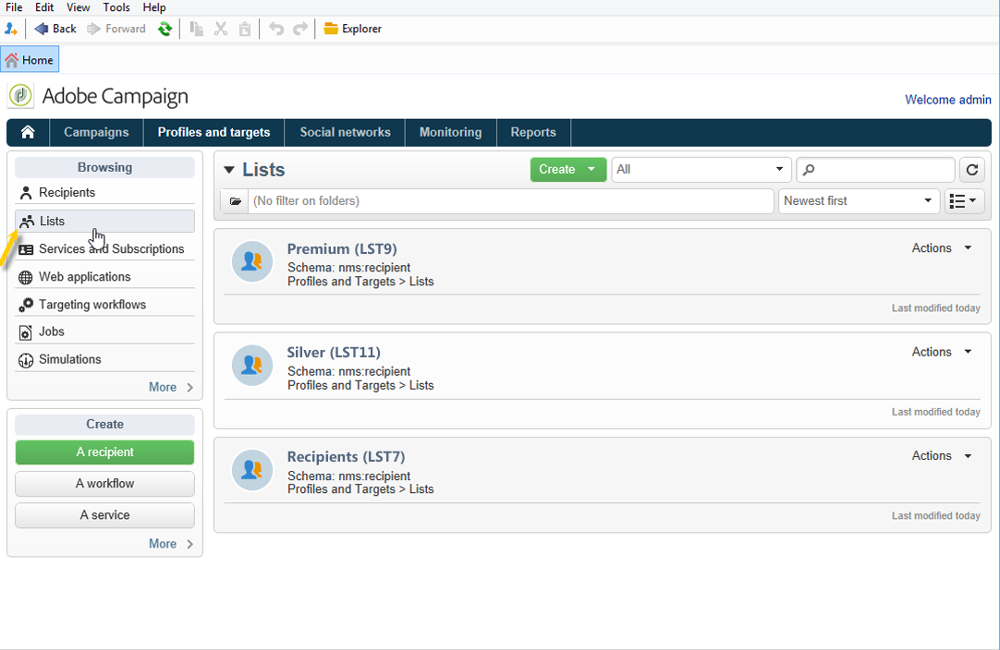
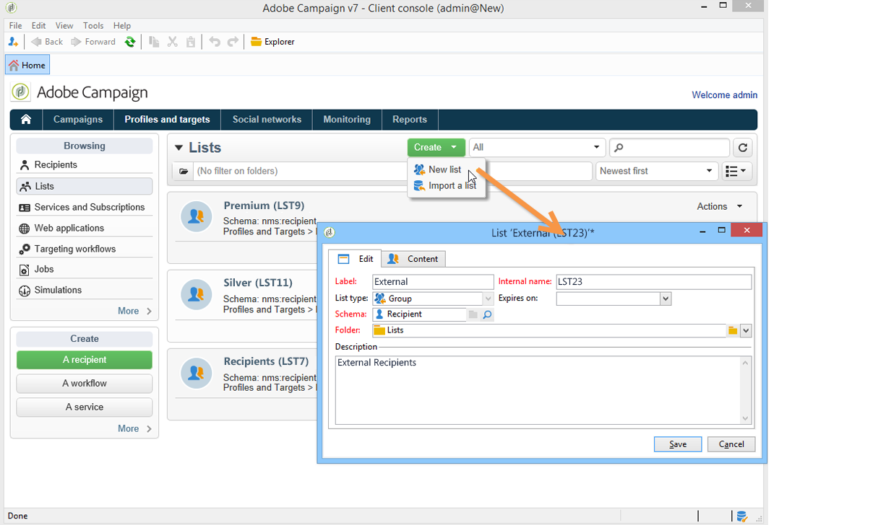
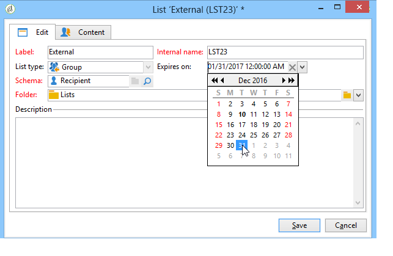
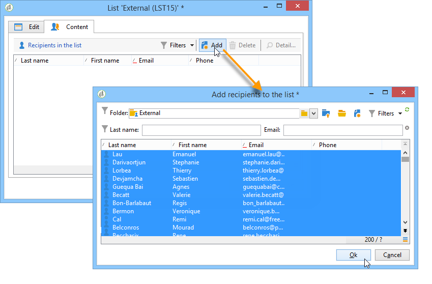
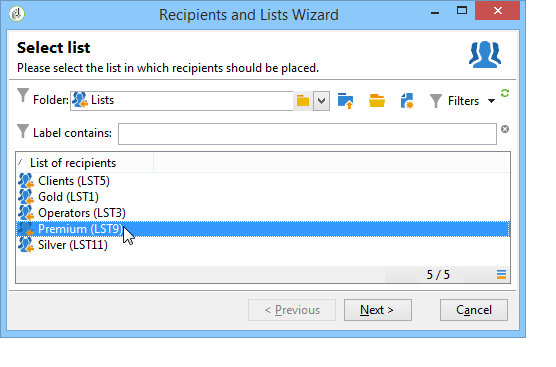
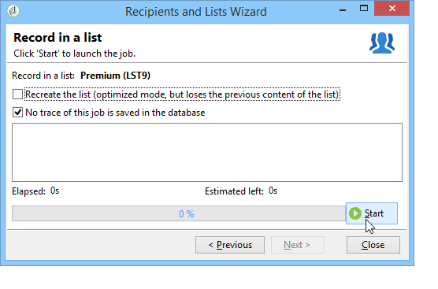
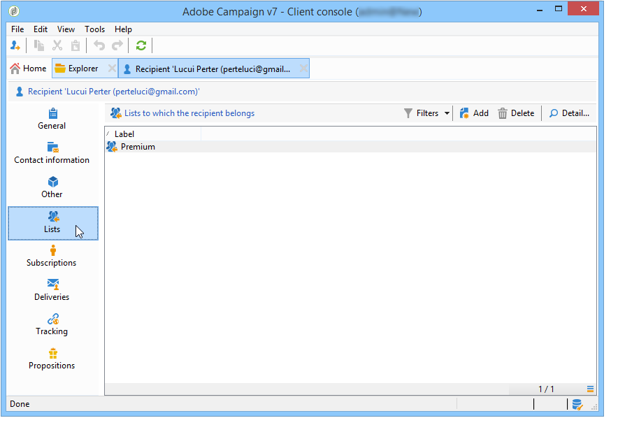
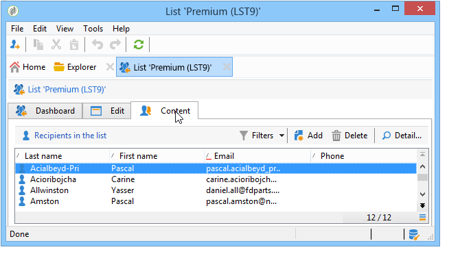
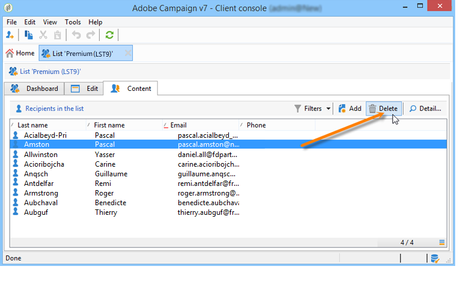
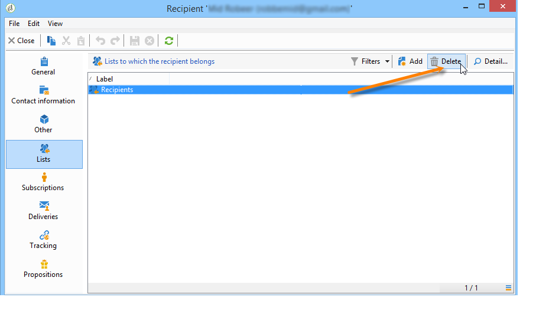

# Create and manage lists{#creating-and-managing-lists}

## What is a list? {#about-lists-in-adobe-campaign}

A list is a static set of profiles that can be targeted in delivery actions or updated during import operations or during workflow execution. For example, a population extracted from the database via a query can supply a list.

Lists are created and managed via the **[!UICONTROL Lists]** link in the **[!UICONTROL Profiles and targets]** tab.

Two types of lists are available in Adobe Campaign:

* **[!UICONTROL Group]** type: The **[!UICONTROL Group]** type lists belong to a **static** list of people selected according to specific criteria. The list is like a snapshot of a set of profiles. Please note that it is not updated automatically in the event of profiles being added to the database.

  For more information on how to create a **[!UICONTROL Group]** type list, refer to this [page](#creating-a-profile-list-from-a-group).

* **[!UICONTROL List]** type: The **[!UICONTROL List]** type lists allows you to use workflows to create and manage lists. These will be specific lists resulting from data imports, that can be updated via the dedicated **[!UICONTROL List update]** workflow activity.

  Unlike the **[!UICONTROL Group]** type list, this type list can be automatically updated with a **[!UICONTROL Scheduler]** activity. Note that For an example on how to create **[!UICONTROL List]** type lists, refer to [this page](../../workflow/using/list-update.md).

 [Discover this feature in video](#create-list-video)

## Create a profile list from a group {#creating-a-profile-list-from-a-group}

**[!UICONTROL Group]** type lists created via the **[!UICONTROL Profiles and targets]** link must be based on the default Adobe Campaign profile table (nms:recipient).

>[!NOTE]
>
>To create lists containing other types of data, you must run a workflow. For example, by using a query on the visitor table then updating the list, you can create a visitor list. For more information on workflows, refer to [this section](../../workflow/using/about-workflows.md).

To create a new **[!UICONTROL Group]** type list, apply the following steps:

1. Click the **[!UICONTROL Create]** button and select **[!UICONTROL New list]**.

   

1. Enter the information in the **[!UICONTROL Edit]** tab of the list creation window.

    * Enter the list name in the **[!UICONTROL Label]** field and, if necessary, change the internal name.
    * Add a description for this list.
    * You can specify an expiration date: when this date is reached, the list is purged and automatically deleted.
    
      

1. In the **[!UICONTROL Content]** tab, click **[!UICONTROL Add]** to select the profiles belonging to the list.

   

1. Click **[!UICONTROL Save]** to save the list. It is then added to the overview of lists.

You can create new profiles directly from the 'add profiles' window by clicking **[!UICONTROL Create]**. The profile will be added to the database.

The profile list can be configured just like other lists. See [this section](../../platform/using/adobe-campaign-workspace.md#configuring-lists).

## Link data to a list {#linking-data-to-a-list}

>[!NOTE]
>
>Linking data to a list can only been done with a **[!UICONTROL Group]** type list.

The profiles of a set of profiles can be filtered and linked to a list. Delivery actions may then be sent to this list, to target profiles. To group profiles:

1. Select profiles and right-click. 
1. Select **[!UICONTROL Actions > Associate selection with a list...]**.

   

1. Select the desired list or create a new list using the **[!UICONTROL Create]** button, then click **[!UICONTROL Next]**.

   

1. Click the **[!UICONTROL Start]** button.

   

The **[!UICONTROL Recreate the list]** option deletes the earlier content from the list. This mode is optimized since no query is needed to verify whether the profiles are already linked to the list.

If you uncheck the **[!UICONTROL No trace of this job is saved in the database]** option, you can select (or create) the execution folder where the information linked to this process will be stored.

The upper section of the window lets you monitor execution. The **[!UICONTROL Stop]** button lets you stop the process. Contacts already processed will be linked to the list.

You can monitor the process via the **[!UICONTROL Lists]** tab on the profiles concerned by this operation:

You can also edit the list via the Adobe Campaign home page: click the **[!UICONTROL Profiles and Targets > Lists]** menu and select the concerned list. The **[!UICONTROL Content]** tab shows the profiles linked to this list.

## Remove a profile from a list {#removing-a-profile-from-a-list}

To remove a profile from a list, you can:

* Edit the list, select the profile in the **[!UICONTROL Content]** tab, then click the **[!UICONTROL Delete]** icon.

  

* Edit the profile, click the **[!UICONTROL List]** tab, then click the **[!UICONTROL Delete]** icon. 

  

## Delete a list of profiles {#deleting-a-list-of-profiles}

You can delete one or more lists from the group list in the Adobe Campaign tree. To do this, edit the tree via the **[!UICONTROL Advanced > Explorer]** link in the Adobe Campaign home page. Select the group(s) concerned and right-click. Select **[!UICONTROL Delete]**. A warning message asks you to confirm the deletion.

>[!NOTE]
>
>When you delete a list, the profiles on the list are not affected but the data in their profile is updated.

## Tutorial video {#create-list-video}

### How to create a list of recipients

A list is a static set of recipients that can be targeted in delivery actions or updated during import operations or during workflow execution. A list of recipients is also referred to as audience.

Learn how to create an audience by configuring a list of recipients from the Explorer.

>[!VIDEO](https://video.tv.adobe.com/v/25602/quality=12)

### How use a workflow to create a list of recipients {#create-list-in-a-wf-video}

Learn how create a workflow in order to target recipients and how to make it recurring before using the list in an email target.

>[!VIDEO](https://video.tv.adobe.com/v/25603?quality=12)

Additional Campaign Classic how-to videos are available [here](https://experienceleague.adobe.com/docs/campaign-classic-learn/tutorials/overview.html).
