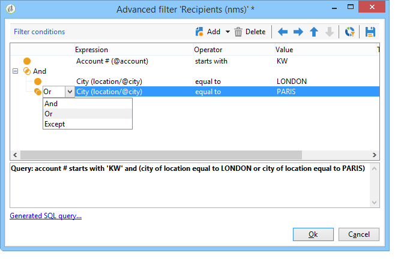

# Create filters{#creating-filters}

When you navigate in the Adobe Campaign tree (from the **[!UICONTROL Explorer]** menu in the home page), the data contained in the database is displayed in lists. These lists can be configured to display only the data required by the operator. Actions can then be launched on the filtered data. Filter configuration lets you select data from a list **[!UICONTROL dynamically]**. If the data is modified, the filtered data is updated.

>[!NOTE]
>
>User interface configuration settings are defined locally at the device level. It may sometimes be necessary to clean up this data, particularly if problems arise when refreshing data. To do this, use **[!UICONTROL File > Clear the local cache]** menu.

## Typology of available filters {#typology-of-available-filters}

Adobe Campaign lets you apply filters to data lists.

These filters can be used once, or you can save them for future use. You can apply several filters at the same time.

The following filter types are available in Adobe Campaign:

* **Default filters**

  The **default filter** is accessible via the fields located above the lists. It lets you filter on predefined fields (for recipient profiles, these are the name and email address by default). You can use the fields to enter the characters to filter on or to selection the filter conditions from a drop-down list.

  
<!--
  >[!NOTE]
  >
  >The **%** character replaces any character string. For example, the string `%@yahoo.com` lets you display all the profiles with an e-mail address in the domain "yahoo.com".
-->
  You can change the default filter of a list. For more on this, refer to [Change the default filter](#altering-the-default-filter).

* **Simple filters**

  **Simple filters** are one-off filters on the columns. They are defined with one or more simple search criteria on the displayed columns.

  You can combine several simple filters on the same data list to refine your search. The filter fields are displayed one beneath the other. They can be deleted independently of each other.

  

  Simple filters are detailed in [Create a simple filter](#creating-a-simple-filter).

* **Advanced filters**

  **Advanced filters** are created using a query or a combination of queries on the data.

  For more on creating an advanced filter, refer to [Create an advanced filter](#creating-an-advanced-filter).

  You can use functions to define the content of the filter. For more on this, refer to [Create an advanced filter with functions](#creating-an-advanced-filter-with-functions).

  >[!NOTE]
  >
  >For more on building queries in Adobe Campaign, refer to [this section](../../platform/using/about-queries-in-campaign.md).

* **User filters**

  An **application filter** is an advanced filter that has been saved, to use and share its configuration with the other operators.

  The **[!UICONTROL Filters]** button located above the lists offers a set of application filters that can be combined to refine the filtering. The method for creating these filters is presented in [Save a filter](#saving-a-filter).

## Change the default filter {#altering-the-default-filter}

To change the default filter for a recipient list, click the **[!UICONTROL Profiles and Targets > Pre-defined filters]** node of the tree.

For all other types of data, configure the default filter via the **[!UICONTROL Administration > Configuration > Predefined filters]** node.

Apply the following steps:

1. Select the filter you want to be used by default.
1. Click the **[!UICONTROL Parameters]** tab and select **[!UICONTROL Default filter for the associated document type]**.

   

   >[!CAUTION]
   >
   >If a default filter is already applied to the list, you need to disable it before applying a new filter. To do this, click the red cross to the right of the filtering fields.

1. Click **[!UICONTROL Save]** to apply the filter.

   >[!NOTE]
   >
   >The filter definition window is detailed in [Create an advanced filter](#creating-an-advanced-filter) and [Save a filter](#saving-a-filter).

## Create a simple filter {#creating-a-simple-filter}

To create a **simple filter**, apply the following steps:

1. Right-click the field you want to filter and select **[!UICONTROL Filter on this field]**.

   

   The default filter fields are displayed above the list.

1. Select the filter option from the drop-down list, or enter the filter criteria to apply (the method for selecting or entering criteria depends on the type of field: text, enumerated, etc.).

   

1. To activate the filter, press Enter on the keyboard, or click the green arrow to the right of the filter fields.

If the field on which you want to filter the data is not displayed in the form of the profile, you can add it in the columns displayed, then filter on that column. To do this,

1. Click the **[!UICONTROL Configure the list]** icon.

   

1. Select the column to be displayed, for example the age of the recipients.

   

1. Right-click the **Age** column in the recipient list, and select **[!UICONTROL Filter on this column]**.

   

   You can then select the age filtering options.

   

## Create an advanced filter {#creating-an-advanced-filter}

To create an **advanced filter**, apply the following steps:

1. Click the **[!UICONTROL Filters]** button and select **[!UICONTROL Advanced filter...]**. 

   

   You can also right-click the list of data to filter and select **[!UICONTROL Advanced filter...]**.

   The filtering condition definition window is displayed.

1. Click the **[!UICONTROL Expression]** column to define the input value.
1. Click **[!UICONTROL Edit expression]** to select the field to which the filter will be applied.

   

1. From the list, select the field on which data will be filtered. Click **[!UICONTROL Finish]** to confirm.
1. Click the **[!UICONTROL Operator]** column and select the operator to be applied from the drop-down list.
1. Select an expected value from the **[!UICONTROL Value]** column. You can combine several filters to refine your query. To add a filter condition, click **[!UICONTROL Add]**.

   

1. You can assign a hierarchy to the expressions or change the order of the query expressions using the toolbar arrows.
1. The default operator between expressions is **And**, but you can change this by clicking the field. You can select an **Or** operator.

   

1. Click **[!UICONTROL OK]** to confirm filter creation and apply it to the list.

The filter applied is displayed above the list.

To edit or modify this filter, click its label.

To cancel this filter, click the **[!UICONTROL Remove this filter]** icon to the right of the filter.

You can save an advanced filter to keep it for future use. For further information about this type of filter, see [Save a filter](#saving-a-filter).

### Create an advanced filter with functions {#creating-an-advanced-filter-with-functions}

Advanced filters can use functions; **filters with functions** are created via an expression editor that lets you create formulas using the database data and advanced functions. To create a filter with functions, repeat advanced filter creation steps 1, 2 and 3, then proceed as follows:

1. In the field selection window, click **[!UICONTROL Advanced selection]**.
1. Select the type of formula to be used: aggregate, existing user filter or expression.

   

   The following options are available:

    * **[!UICONTROL Field only]** to select a field. This is the default mode. 
    * **[!UICONTROL Aggregate]** to select the aggregate formula to be used (counts, sum, average, maximum, minimum).
    * **[!UICONTROL User filter]** to select one of the existing user filters. User filters are detailed in [Save a filter](#saving-a-filter).
    * **[!UICONTROL Expression]** to access the expressions editor.

      The expression editor lets you define an advanced filter. It looks like this:
    
      

      It lets you select fields in the database tables and attach advanced functions to them: Select the function to use in the **[!UICONTROL List of functions]**. The functions available are detailed in [List of functions](../../platform/using/defining-filter-conditions.md#list-of-functions). Next, select the field or fields concerned by the functions and click **[!UICONTROL OK]** to approve the expression.

      >[!NOTE]
      >
      >For an example of filter creation based on an expression, refer to [this section](../../workflow/using/sending-a-birthday-email.md#identifying-recipients-whose-birthday-it-is).

## Save a filter {#saving-a-filter}

Filters are specific to each operator and are re-initialized each time the operator clears the cache of their client console.

You can create an **application filter** by saving an advanced filter: it can be re-used by right-clicking in any list or via the **[!UICONTROL Filters]** button located above the lists.

These filters can also be accessed directly via the delivery wizard, in the target selection stage (refer to [this section](../../delivery/using/creating-an-email-delivery.md) for more on creating deliveries). To create the application filter, you can:

* Convert an advanced filter to an application filter. To do this, click **[!UICONTROL Save]** before closing the advanced filter editor.

  

* Create this application filter via the **[!UICONTROL Administration > Configuration > Predefined filters]** (or **[!UICONTROL Profiles and targets > Predefined filters]** for recipients) node of the tree. To do this, right-click the list of filters, and select **[!UICONTROL New...]**. The procedure is the same as for creating advanced filters.

  The **[!UICONTROL Label]** field enables you to name this filter. This name will appear in the combo box of the **[!UICONTROL Filters...]** button. 

  

You can delete all filters on the current list by right-clicking and selecting **[!UICONTROL No filter]** or via the **[!UICONTROL Filters]** icon located above the list.  

You can combine filters by clicking the **[!UICONTROL Filters]** button and using the **[!UICONTROL And...]** menu.

## Filter recipients {#filtering-recipients}

Predefined filters (see [Save a filter](#saving-a-filter)) enable you to filter the profiles of recipients contained in the database. You can edit filters from the **[!UICONTROL Profiles and Targets > Predefined filters]** node of the tree. The filters are listed in the upper section of the workspace, via the **[!UICONTROL Filters]** button.

Select a filter to display its definition and to access a preview of the filtered data.

>[!NOTE]
>
>For a detailed example of predefined filter creation, refer to [Use case](../../platform/using/use-case.md).

The predefined filters are:

<table> 
 <tbody> 
  <tr> 
   <td> <strong>Label</strong>  </td> 
   <td> <strong>Query</strong>  </td> 
  </tr> 
  <tr> 
   <td> Opened  </td> 
   <td> Selects recipients who have opened a delivery.  </td> 
  </tr> 
  <tr> 
   <td> Opened but not clicked  </td> 
   <td> Selects recipients who have opened a delivery but have not clicked on a link.  </td> 
  </tr> 
  <tr> 
   <td> Inactive recipients  </td> 
   <td> Selects recipients who have not opened a delivery in X months.  </td> 
  </tr> 
  <tr> 
   <td> Last activity by device type  </td> 
   <td> Selects recipients who have clicked or opened delivery Y using device X in the last Z days.  </td> 
  </tr> 
  <tr> 
   <td> Last activity by device type (Tracking)  </td> 
   <td> Selects recipients who have clicked or opened delivery Y using device X in the last Z days.  </td> 
  </tr> 
  <tr> 
   <td> Untargeted recipients  </td> 
   <td> Selects recipients who have never been targeted via channel Y in X months.  </td> 
  </tr> 
  <tr> 
   <td> Very active recipients  </td> 
   <td> Selects recipients who have clicked in a delivery at least X times in the last Y months.  </td> 
  </tr> 
  <tr> 
 <td> Denylisted email address  </td> 
    <td> Selects recipients whose email address is on the denylist.  </td>
  </tr> 
  <tr> 
   <td> Quarantined email address  </td> 
   <td> Selects recipients whose email address is quarantined.  </td> 
  </tr> 
  <tr> 
   <td> Email addresses duplicated in the folder  </td> 
   <td> Selects recipients whose email address is duplicated in the folder.  </td> 
  </tr> 
  <tr> 
   <td> Neither opened nor clicked  </td> 
   <td> Selects recipients who have not opened a delivery, or clicked in a delivery.  </td> 
  </tr> 
  <tr> 
   <td> New recipients (days)  </td> 
   <td> Selects recipients that were created in the last X days.  </td> 
  </tr> 
  <tr> 
   <td> New recipients (minutes)  </td> 
   <td> Selects recipients that were created in the last X minutes.  </td> 
  </tr> 
  <tr> 
   <td> New recipients (months)  </td> 
   <td> Selects recipients that were created in the last X months.  </td> 
  </tr> 
  <tr> 
   <td> By subscription  </td> 
   <td> Selects recipients by subscription.  </td> 
  </tr> 
  <tr> 
   <td> By clicking on a specific link  </td> 
   <td> Selects recipients who clicked on a particular URL in a delivery.  </td> 
  </tr> 
  <tr> 
   <td> By post delivery behavior  </td> 
   <td> Selects recipients according to their behavior after receiving a delivery.  </td> 
  </tr> 
  <tr> 
   <td> By creation date  </td> 
   <td> Selects recipients by creation date, over a period ranging from X months (current date minus n months) to Y months (current date minus n months).  </td> 
  </tr> 
  <tr> 
   <td> By list  </td> 
   <td> Selects recipients by list.  </td> 
  </tr> 
  <tr> 
   <td> By number of clicks  </td> 
   <td> Selects recipients who clicked in a delivery in the last X months.  </td> 
  </tr> 
  <tr> 
   <td> By number of messages received  </td> 
   <td> Selects recipients according to the number of messages that they received.  </td> 
  </tr> 
  <tr> 
   <td> By number of opens  </td> 
   <td> Selects recipients who opened between X and Y deliveries over Z amount of time.  </td> 
  </tr> 
  <tr> 
   <td> By name or email  </td> 
   <td> Selects recipients according to their name or email.  </td> 
  </tr> 
  <tr> 
   <td> By age range  </td> 
   <td> Selects recipients according to their age.  </td> 
  </tr> 
 </tbody> 
</table>

>[!NOTE]
>
>All comparisons concerning counting and periods are to be understood in the broader sense (recipients that correspond to the query limits are included in the comparison).

Examples of how the data is calculated:

* Selects recipients who are less than 30 years old: 

  

* Selects recipients who are 18 years of age or older:

  

* Selects recipients aged between 18 and 30:

  

## Advanced settings for data filters {#advanced-settings-for-data-filters}

Click the **[!UICONTROL Settings]** tab to access the following options:

* **[!UICONTROL Default filter for the associated document type]**: this option lets you suggest this filter by default in the editor of the lists concerned by the sort.

  For example, the **[!UICONTROL By name or login]** filter is applied to operators. This option is selected, and so the filter is always offered on all operator lists.

* **[!UICONTROL Filter shared with other operators]**: this option lets you make the filter available to all the other operators on the current database.
* **[!UICONTROL Use parameter entry form]**: this option lets you define the filter field(s) to be displayed above the list when this filter is selected. These fields let you define the filter settings. This form must be entered in XML format via the **[!UICONTROL Form]** button. For example, the preconfigured filter **[!UICONTROL Recipients who have opened]**, available from the recipients list, displays a filter field that lets you select the delivery at which the filter is aimed.

  The **[!UICONTROL Preview]** button displays the result of the selected filter.

* The **[!UICONTROL Advanced parameters]** link lets you define additional settings. In particular, you can associate a SQL table with the filter to make it common to all editors that share the table.

  Select the **[!UICONTROL Do not restrict the filter]** option if you want to stop the user from overriding this filter.

  This option is enabled for "Recipients of a delivery" and "Recipients of deliveries belonging to a folder" filters offered in the delivery wizard that cannot be overloaded.

  
