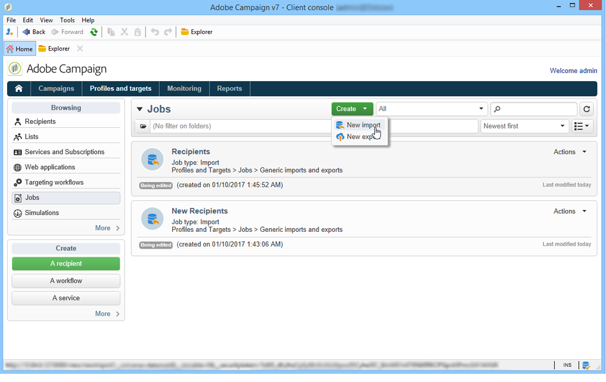
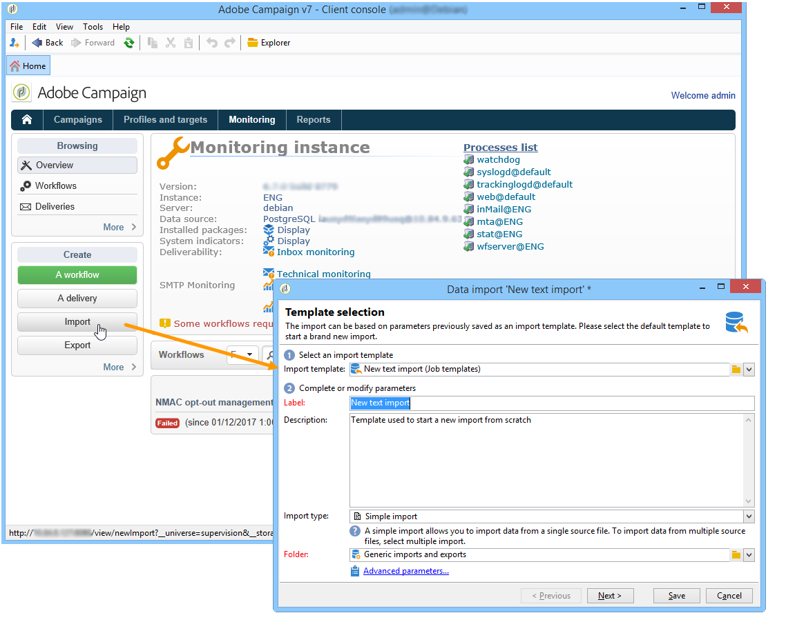
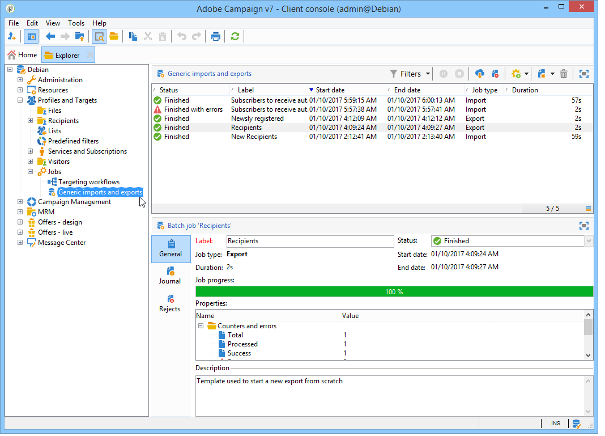

# Create import and export jobs {#creating-import-export-jobs}

Once templates have been configured, import and export operations can be launched in several contexts in Adobe Campaign.

* In the **[!UICONTROL Profiles and targets]** section of Adobe Campaign workspace, click the **[!UICONTROL Jobs]** link: this takes you to the list of existing imports and exports.

  Click the **[!UICONTROL Create]** button and select the type of job you want to perform.

    

* You can also launch imports and exports from the **[!UICONTROL Monitoring]** section of the workspace: two dedicated links enable you to start the import or export directly.

  

* Finally, imports and exports can  be launched from the Adobe Campaign explorer.

  

All of these open data import or export wizards. They are detailed in these sections:

* [Configure an import job](../../platform/using/executing-import-jobs.md)
* [Configure an export job](../../platform/using/executing-export-jobs.md)
