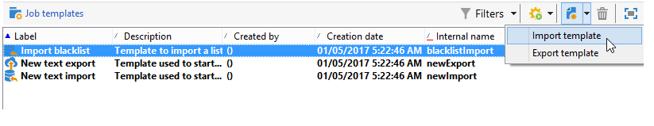

# Create import and export templates {#creating-import-export-templates}

Import and export templates are stored in the **[!UICONTROL Resources > Templates > Job templates]** directory of the Adobe Campaign tree.

By default, three import templates and one export template are present in this directory. They must not be modified.

* The native template **[!UICONTROL Import denylist]** is already configured to import a list of email addresses which were added to the denylist.

* The **[!UICONTROL New text import]** and **[!UICONTROL New text export]** templates let you configure an import or export from scratch.

You can duplicate existing templates to create your own templates, or create a new template via the **[!UICONTROL New > Import template]** / **[!UICONTROL Export template]** menu.

The process to configure a template is then the same than the one presented in these sections: 

* [Configure an import job](../../platform/using/executing-import-jobs.md)
* [Configure an export job](../../platform/using/executing-export-jobs.md)
