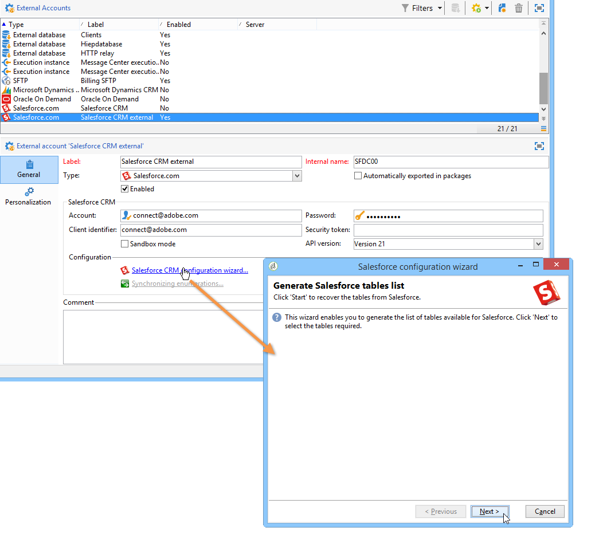
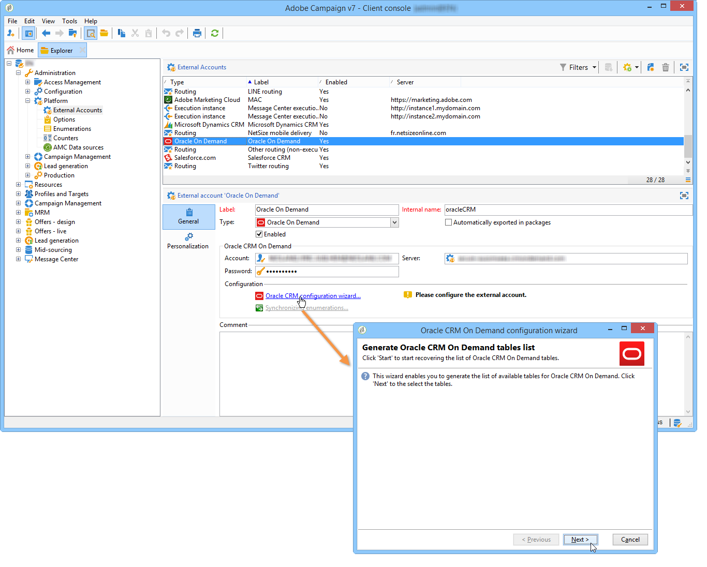
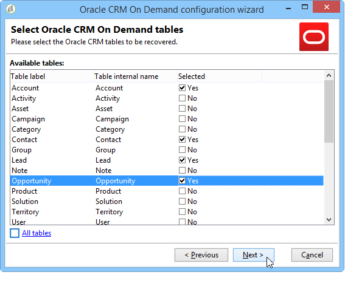
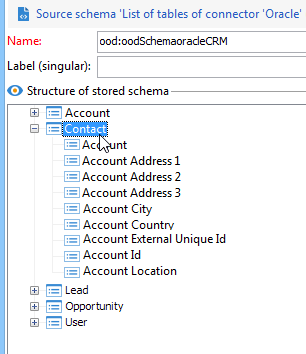
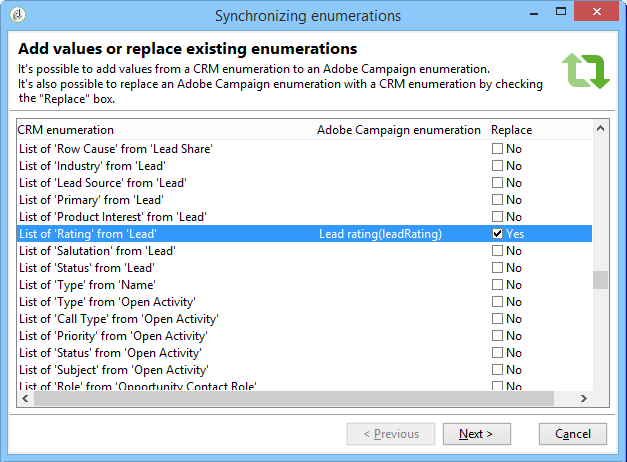
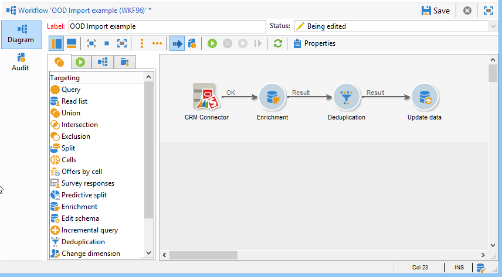
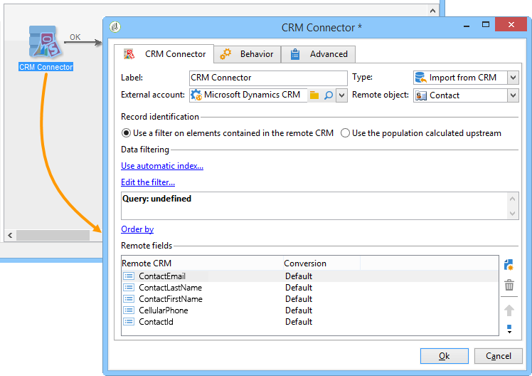
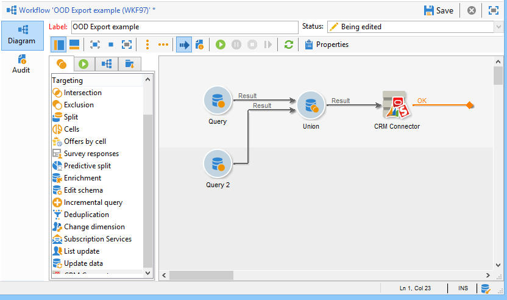
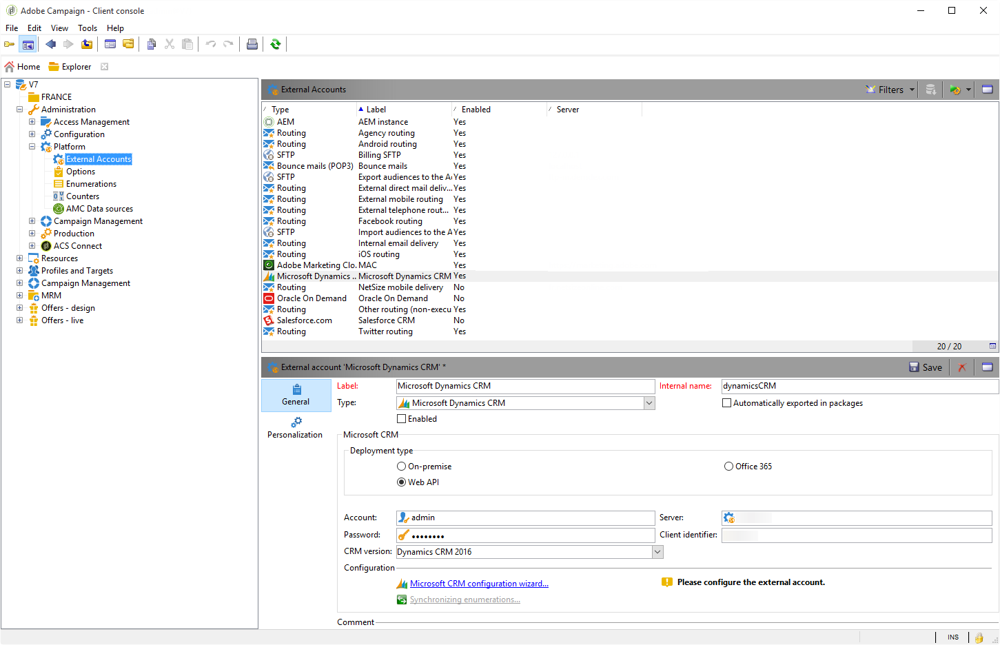
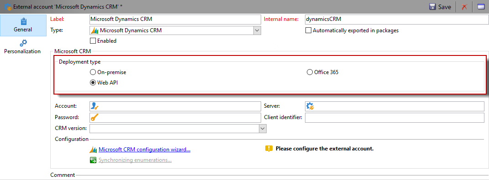

# CRM Connectors{#crm-connectors}

## About CRM connectors {#about-crm-connectors}

Adobe Campaign provides various CRM connectors for linking your Adobe Campaign platform to your third-party systems. These CRM connectors enable you to synchronize contacts, accounts, purchases, etc. They make for easy integration of your application with various third-party and business applications.

These connectors enable quick and easy data integration: Adobe Campaign provides a dedicated wizard for collecting and selecting from the tables available in the CRM. This guarantees two-directional synchronization to make sure data is up-to-date at all times throughout the systems.

>[!NOTE]
>
>This feature is available in Adobe Campaign through the **CRM connectors** dedicated package.

Connecting to the CRM is carried out via dedicated workflow activities. These activities are detailed in the chapter presented in [this section](../../workflow/using/crm-connector.md).

### Compatible CRM systems and limitations {#compatible-crm-systems-and-limitations}

CRMs listed below can be integrated into Adobe Campaign.

Supported versions are detailed in the [Compatibility matrix](https://helpx.adobe.com/campaign/kb/compatibility-matrix.html).

* **Salesforce.com**

  Refer to [this section](#example-for-salesforce-com) to learn how to set up the connection with Salesforce.com.

  >[!CAUTION]
  >
  >When connecting Adobe Campaign with Salesforce.com, limitations are:  
  >
  >    
  >    
  >    * Test production instances are supported.
  >    * Assignation rules are supported.
  >    * Multiple selection enumerations are not supported by Adobe Campaign.
  >    
  >

* **Oracle On Demand**

  Refer to [this section](#example-for-oracle-on-demand) to learn how to set up the connection with Oracle On Demand.

  >[!CAUTION]
  >
  >When connecting Adobe Campaign with Oracle On Demand, limitations are:  
  >
  >    
  >    
  >    * Adobe Campaign can synchronize any object available in the standard Oracle On Demand templates. If you have added personalized tables in Oracle On Demand, these won't be recovered in Adobe Campaign.
  >    * API version v1.0 lets you sort or filter data during a query but does not let you do both simultaneously.
  >    * The dates sent by Oracle On Demand do not contain time zone information.
  >    * Multiple selection enumerations are not supported by Adobe Campaign.
  >    
  >

* **MS Dynamics CRM** and **MS Dynamics Online**

  Refer to [this section](#example-for-microsoft-dynamics) to learn how to set up the connection with Microsoft Dynamics.

  Learn about Adobe Campaign and Microsoft Dynamics integration use cases in [this video](https://helpx.adobe.com/campaign/kt/acc/using/acc-integrate-dynamics365-with-acc-feature-video-set-up.html).

  >[!CAUTION]
  >
  >When connecting Adobe Campaign with Microsoft Dynamics, limitations are:  
  >
  >    
  >    
  >    * Installing plug-ins can change the CRM's behavior, which can lead to compatibility issues with Adobe Campaign. 
  >    * Multiple selection enumerations are not supported by Adobe Campaign.
  >    
  >

## Setting up the connection {#setting-up-the-connection}

To use CRM connectors in Adobe Campaign, apply the following steps:

1. Create the external account
1. Collect the CRM tables
1. Synchronize enumerations
1. Create the synchronization workflow

>[!NOTE]
>
>The CRM connectors only work with a secure URL (https).

### Example for Salesforce.com {#example-for-salesforce-com}

To configure the **Salesforce.com** connector with Adobe Campaign, follow the steps below:

1. Create a new external account via the **[!UICONTROL Administration > Platform > External accounts]** node of the Adobe Campaign tree.
1. Run the configuration wizard to generate the available CRM tables.

   

   The configuration wizard lets you collect tables and create the matching schema.

   Click **[!UICONTROL Start]** to run the execution.

   

   >[!NOTE]
   >
   >To approve the setup, you need to log off and back on to the Adobe Campaign console.

1. Check the schema generated in Adobe Campaign in the **[!UICONTROL Administration > Configuration > Data schemas]** node.

   

1. Once the schema is created, you can synchronize enumerations automatically via the CRM to Adobe Campaign.

   To do this, click the **[!UICONTROL Synchronizing enumerations...]** link and select the Adobe Campaign enumeration that matches the CRM enumeration.

   You can replace all values of an Adobe Campaign enumeration with those of the CRM: to do this, select **[!UICONTROL Yes]** in the **[!UICONTROL Replace]** column.

   

   Click **[!UICONTROL Next]** and then **[!UICONTROL Start]** to start importing the list.

1. Check the imported values in the **[!UICONTROL Administration > Platform > Enumerations]** menu.

   

1. To import Salesforce data or to export Adobe Campaign data to Salesforce, you need to create a workflow and use the **[!UICONTROL CRM connector]** activity.

   

### Example for Oracle On Demand {#example-for-oracle-on-demand}

To configure the **Oracle On Demand** connector to work with Adobe Campaign, apply the following steps:

1. Create a new external account via the **[!UICONTROL Administration > Platform > External accounts]** node of the Adobe Campaign tree.

   

1. Open the configuration wizard: Adobe Campaign automatically shows the tables of the Oracle data model. Select the tables you want to collect.

   

1. Click **[!UICONTROL Next]** to start creating the matching schema.

   The matching data schema becomes available in Adobe Campaign.

   

1. Start synchronizing enumerations between Adobe Campaign and Oracle On Demand.

   

1. To import Oracle On Demand data into Adobe Campaign, create the following type of workflow:

   

   This workflow imports contacts via Oracle On Demand, synchronizes them with the existing Adobe Campaign data, deletes duplicate contacts, and updates the Adobe Campaign database.

   The **[!UICONTROL CRM Connector]** activity needs to be configured as shown here:

   

1. To export Adobe Campaign data to Oracle On Demand, create the following workflow:

   

   This workflow collects the relevant data using queries, then exports it into the Oracle On Demand contacts table.

### Example for Microsoft Dynamics {#example-for-microsoft-dynamics}

To configure the Microsoft Dynamics connector to work with Adobe Campaign, apply the following steps:

1. Create a new external account via the **[!UICONTROL Administration > Platform > External accounts]** node of the Adobe Campaign tree.

   

1. Select the **Deployment type**: **[!UICONTROL On-premise]**, **[!UICONTROL Office 365]** or **[!UICONTROL Web API]**, depending on the connector you want to configure.

   Adobe Campaign Classic supports the Dynamics 365 REST interface with OAuth protocol for authentication.

   If you select a **[!UICONTROL WebAPI]** deployment, you need to register an app on Azure Directory and get the **clientId** from the Azure Directory. This registration is documented in [this page](https://msdn.microsoft.com/en-us/library/mt622431.aspx).

   >[!NOTE]
   >
   >The redirectURL parameter is not required by Adobe Campaign Classic.

   The **clientId** value is used with the username/password to fetch bearer token using grant type password. This is called **Resource Owner Password Credentials Grant**. For more on this, refer to [this page](https://blogs.msdn.microsoft.com/wushuai/2016/09/25/resource-owner-password-credentials-grant-in-azure-ad-oauth/).

   

   For more information on CRM version compatibility, refer to the [Compatibility matrix](https://helpx.adobe.com/campaign/kb/compatibility-matrix.html).

1. Open the configuration wizard. Adobe Campaign automatically detects the tables from the Microsoft Dynamics data template.

   

1. Select the tables to be recovered.

   

1. Click **[!UICONTROL Next]** and start creating the corresponding schema.

   

   >[!NOTE]
   >
   >To approve the configuration, you must disconnect/reconnect to the Adobe Campaign console.

   The matching data schema becomes available in Adobe Campaign.

   

1. Start synchronizing enumerations between Adobe Campaign and Microsoft Dynamics.

   

1. To import the Microsoft Dynamics data into Adobe Campaign, create the following type of workflow:

   

   This workflow imports the contacts via Microsoft Dynamics, synchronizes them with the existing Adobe Campaign data, deletes duplicate contacts, and updates the Adobe Campaign database.

   The **[!UICONTROL CRM Connector]** activity needs to be configured as below:

   

## Data synchronization {#data-synchronization}

Synchronization between Adobe Campaign and the CRM is carried out via a dedicated workflow activity: [CRM connector](../../workflow/using/crm-connector.md).

This activity enables you to:

* Import from the CRM (refer to [Importing from the CRM](#importing-from-the-crm)),
* Export to CRM (refer to [Exporting to the CRM](#exporting-to-the-crm)),
* Import objects deleted in the CRM (refer to [Importing objects deleted in the CRM](#importing-objects-deleted-in-the-crm)),
* Delete objects in the CRM (refer to [Deleting objects in the CRM](#deleting-objects-in-the-crm)).

Select the external account that matches the CRM that you want to configure synchronization with, then select the object to be synchronized (accounts, opportunities, leads, contacts, etc.).

The configuration of this activity depends on the process to be carried out. Various configurations are detailed below.

### Importing from the CRM {#importing-from-the-crm}

To import data via the CRM in Adobe Campaign, you need to create the following type of workflow:

For an import activity, the **CRM Connector** activity configuration steps are:

1. Select an **[!UICONTROL Import from the CRM]** operation.
1. Go to the **[!UICONTROL Remote object]** drop-down list and select the object concerned by the process. This object coincides with one of the tables created in Adobe Campaign during connector configuration.
1. Go to the **[!UICONTROL Remote fields]** section and enter the fields to be imported.

   To add a field, click the **[!UICONTROL Add]** button in the toolbar, then click the **[!UICONTROL Edit expression]** icon.

   

   If necessary, alter the data format via the drop-down list of the **[!UICONTROL Conversion]** columns. Possible conversion types are detailed in [Data format](#data-format).

   >[!CAUTION]
   >
   >The identifier of the record in the CRM is mandatory for linking objects in CRM and in Adobe Campaign. It is added automatically when the box is approved.  
   >
   >The last modification date on the CRM side is also mandatory for incremental data imports.

1. You can also filter the data to be imported based on your needs. To do this, click the **[!UICONTROL Edit the filter...]** link.

   In the following example, Adobe Campaign will only import contacts for which some activity has been recorded since Nov 1st 2012.

   

   >[!CAUTION]
   >
   >The limitations linked to data filtering modes are detailed in [Filtering data](#filtering-data).

1. The **[!UICONTROL Use automatic index...]** option enables you to automatically manage incremental object synchronization between the CRM and Adobe Campaign, depending on the date and their last modification.

   For more on this, refer to [Variable management](#variable-management).

#### Variable management {#variable-management}

Enabling the **[!UICONTROL Automatic index]** option lets you collect only objects modified since the last import.

The date of the last synchronization is stored in an option specified in the configuration window, by default: **LASTIMPORT_<%=instance.internalName%>_<%=activityName%>**.

>[!NOTE]
>
>This note only applies to the generic **[!UICONTROL CRM Connector]** activity. For other CRM activities, the process is automatic.  
>
>This option has to be manually created and populated under **[!UICONTROL Administration]** > **[!UICONTROL Platform]** > **[!UICONTROL Options]**. It must be a text option and its value needs to match the following format: **yyyy/MM/dd hh:mm:ss**. 
> 
>You need to manually update this option for any further import.

You can specify the remote CRM field to be taken into account to identify the most recent changes.

By default, the following fields are used (in the specified order):

* For Microsoft Dynamics: **modifiedon**,
* For Oracle On Demand: **LastUpdated**, **ModifiedDate**, **LastLoggedIn**,
* For Salesforce.com: **LastModifiedDate**, **SystemModstamp**.

Activating the **[!UICONTROL Automatic index]** option generates three variables that can be used in the synchronization workflow via a **[!UICONTROL JavaScript code]** type activity. These activities are:

* **vars.crmOptionName**: represents the name of the option that contains the last import date.
* **vars.crmStartImport**: represents the start date (included) of the last data recovery.
* **vars.crmEndDate**: represents the end date (excluded) of the last data recovery.

  >[!NOTE]
  >
  >These dates are shown in the following format: **yyyy/MM/dd hh:mm:ss**.

#### Filtering data {#filtering-data}

To ensure efficient operation with the various CRMs, filters need to be created using the following rules:

* Each filtering level may only use one type of operator.
* The AND NOT operator is not supported.
* Comparisons may only concern null values ('is empty'/'is not empty' type) or numbers. This means that the value (right-hand column) is assessed and the result of this assessment must be a number. JOIN type comparisons are therefore not supported.
* The value contained in the right-hand column is assessed in JavaScript.
* JOIN comparisons are not supported.
* The expression in the left-hand column must be a field. It cannot be a combination of several expressions, a number, etc.

For instance, the following filtering conditions will NOT be valid for a CRM import, because the OR operator is placed at the same level as the AND operators:

* The OR operator is placed at the same level as the AND operators
* Comparisons are carried out on text strings.

#### Order by {#order-by}

In Microsoft Dynamics and Salesforce.com, you can sort the remote fields to be imported in ascending or descending order.

To do this, click the **[!UICONTROL Order by]** link and add the columns to the list.

The order of the columns in the list is the sorting order:

#### Record identification {#record-identification}

Rather than import elements included (and possibly filtered) in the CRM, you can use a population calculated beforehand in the workflow.

To do this, select the **[!UICONTROL Use the population calculated upstream]** option and specify the field that contains the remote identifier.

Then select the fields of the inbound population that you want to import, as shown below:

### Exporting to the CRM {#exporting-to-the-crm}

Exporting Adobe Campaign data into the CRM lets you copy entire contents to a CRM database.

To export data towards the CRM, you need to create the following type of workflow:

For an export, apply the following configuration to the **CRM Connector** activity:

1. Select an **[!UICONTROL Export to CRM]** operation.
1. Go to the **[!UICONTROL Remote object]** drop-down list and select the object concerned by the process. This object coincides with one of the tables created in Adobe Campaign during connector configuration.

   >[!CAUTION]
   >
   >The export function of the **CRM Connectors** activity can insert or update fields on the CRM side. To enable field updates in the CRM, you need to specify the primary key of the remote table. If the key is missing, data will be inserted (instead of being updated).

1. In the **[!UICONTROL Mapping]** section, specify the fields to be exported and their mapping in the CRM.

   

   To add a field, click the **[!UICONTROL Add]** button in the toolbar, then click the **[!UICONTROL Edit expression]** icon.

   >[!NOTE]
   >
   >For a given field, if no match is defined on the CRM side, the values cannot be updated: they are inserted directly into the CRM.

   If necessary, alter the data format via the drop-down list of the **[!UICONTROL Conversion]** columns. Possible conversion types are detailed in [Data format](#data-format).

   >[!NOTE]
   >
   >The list of records to be exported and the result of the export are saved in a temporary file that remains accessible until the workflow is finished or re-started. This enables you to start the process again in case of errors without running the risk of exporting the same record several times or losing data.

### Additional configurations {#additional-configurations}

#### Data format {#data-format}

You can convert data format on the fly when importing them to or from the CRM.

To do this, select the conversion to be applied in the matching column.

The **[!UICONTROL Default]** mode applies automatic data conversion, which in most cases equals a copy/paste of the data. However, time zone management is applied.

Other possible conversions are:

* **[!UICONTROL Date only]**: this mode deletes Date + Time type fields.
* **[!UICONTROL Without time offset]**: this mode cancels the time zone management applied in the default mode.
* **[!UICONTROL Copy/Paste]**: this mode uses raw data such as strings (no conversion).

#### Error processing {#error-processing}

Within the framework of data imports or exports, you can apply a specific process to errors and rejects. To do this, select the **[!UICONTROL Process rejects]** and **[!UICONTROL Process errors]** options in the **[!UICONTROL Behavior]** tab.

These options place the matching output transitions.

Then place the activities relevant to the processes you want to apply.

To process errors for instance, you can add a wait box and schedule retries.

Rejects are collected with their error code and the related message, this means you can set up the tracking of rejects to optimize your synchronization process.

>[!NOTE]
>
>Even when the **[!UICONTROL Process rejects]** option isn't enabled, a warning is generated for each rejected column with an error code and message.

The **[!UICONTROL Reject]** output transition lets you access the output schema that contains the specific columns relevant to error messages and codes. These columns are:

* For Oracle On Demand: **errorLogFilename** (name of the log file on the Oracle side), **errorCode** (error code), **errorSymbol** (error symbol, different from the error code), **errorMessage** (description of the error context).
* For Salesforce.com: **errorSymbol** (error symbol, different from the error code), **errorMessage** (description of the error context).

### Importing objects deleted in the CRM {#importing-objects-deleted-in-the-crm}

To enable the setting up of an extensive data synchronization process, you can import objects deleted in the CRM into Adobe Campaign.

To do this, apply the following steps:

1. Select an **[!UICONTROL Import objects deleted in the CRM]** operation.
1. Go to the **[!UICONTROL Remote object]** drop-down list and select the object concerned by the process. This object coincides with one of the tables created in Adobe Campaign during connector configuration.
1. Specify the deletion period to be taken into account in the **[!UICONTROL Start date]** and the **[!UICONTROL End date]** fields. These dates will be included in the period.

   

   >[!CAUTION]
   >
   >The element deletion period must coincide with the limitations specific to the CRM. This means that for Salesforce.com, for instance, elements deleted over 30 days ago cannot be recovered.

### Deleting objects in the CRM {#deleting-objects-in-the-crm}

To delete objects on the CRM side, you need to specify the primary key of the remote elements to be deleted.

The **[!UICONTROL Behavior]** tab lets you enable the processing of rejects. This option generates a second output transition for the **[!UICONTROL CRM connector]** activity. For more on this, refer to [Error processing](#error-processing).

>[!NOTE]
>
>Even when the **[!UICONTROL Process rejects]** option is disabled, a warning is generated for each rejected column.

