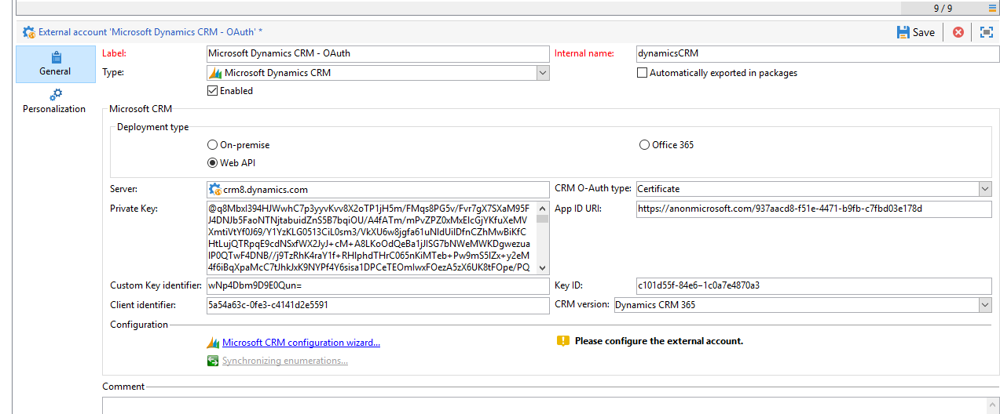
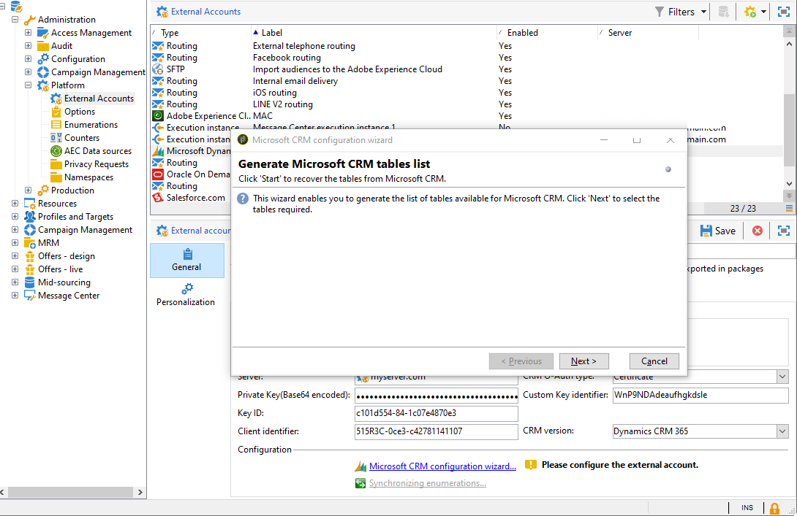
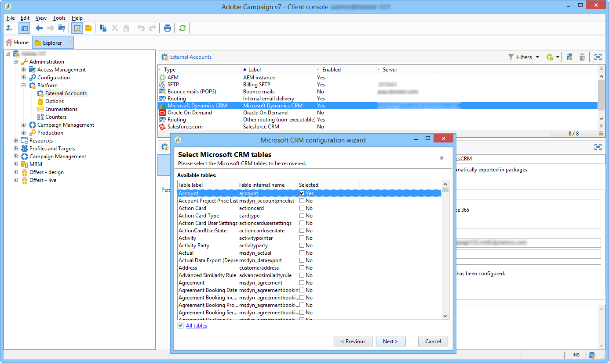
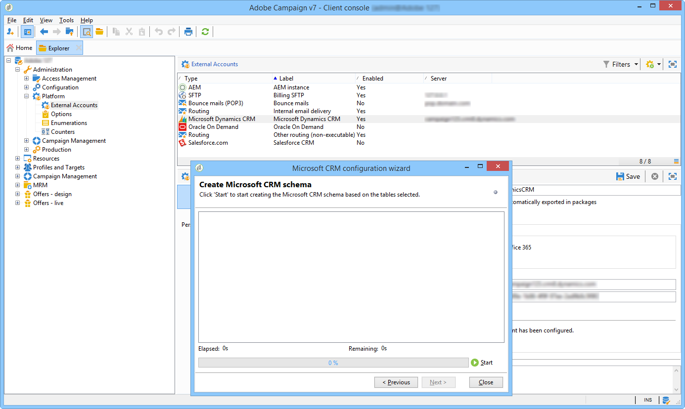
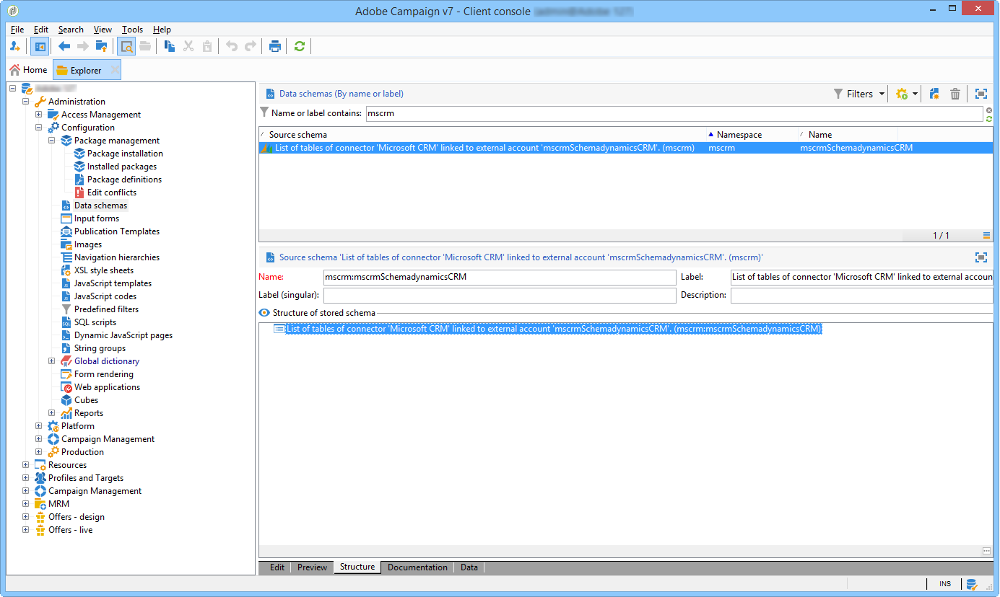
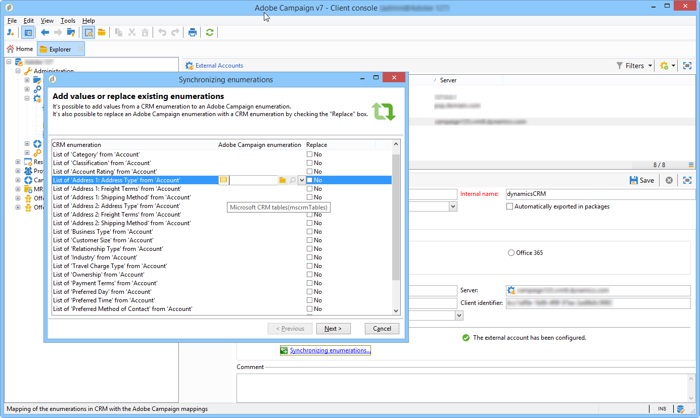

# Connect Campaign and Microsoft Dynamics 365{#connect-to-msdyn}
   
In this page, you will  learn how to connect Campaign Classic to **Microsoft Dynamics CRM 365**.

Possible deployment is via **Web API** (recommended). Refer to [the section below](#microsoft-dynamics-implementation-step) to learn steps to set up the connection with Microsoft Dynamics.

Data synchronization is carried out via a dedicated workflow activity. [Learn more](../../platform/using/crm-data-sync.md).

## Implementation steps{#microsoft-dynamics-implementation-steps}

To connect Microsoft Dynamics 365 to work with Adobe Campaign via **Web API**, you need to apply the following steps:

In Microsoft Dynamics CRM:
1. Get Microsoft Dynamics Client ID
1. Generate Microsoft Dynamics Client Secret
1. Configure permissions
1. Create an App User
1. Encode the private key

[Learn more in this section](#config-crm-microsoft)

In Campaign Classic:
1. Create a new external account
1. Configure the external account with Microsoft Dynamics settings
1. Use the configuration wizard to map tables and synchronize enumerations
1. Create the synchronization workflow

[Learn more in this section](#configure-acc-for-microsoft)


>[!CAUTION]
> When connecting Adobe Campaign with Microsoft Dynamics, you cannot:
> * Install plug-ins which can change the CRM's behavior, and lead to compatibility issues with Adobe Campaign
> * Select multiple enumerations

## Configure Microsoft Dynamics CRM {#config-crm-microsoft}

To generate the access token and keys to setup the account, you need to login to [Microsoft Azure Directory](https://portal.azure.com) using a **Global administrator** credentials. Then follow the steps outlined below.

### Get Microsoft Dynamics Client ID {#get-client-id-microsoft}

To get the Client ID, you need to register an App in Azure Active Directory. Client ID is the same as Application ID. 

1. Navigate to **Azure Active Directory > App Registrations**, and click  **New Application Registration**.
1. Give a unique name which can help identify an instance, such as **adobecampaign`<instance identifier>`**.
1. Choose **Application type** as **Web app / API**.
1. Use `http://localhost` for **Sign-on URL**.

Once you save, you get an **Application ID** which is the Client Identifier for Campaign.

Learn more in [this page](https://docs.microsoft.com/en-us/powerapps/developer/common-data-service/walkthrough-register-app-azure-active-directory).

### Generate Microsoft Dynamics Client Secret {#config-client-secret-microsoft}

The client secret is the key which is unique to the Client ID. To get the certificate key identifier, follow the steps below:

1. Navigate to **Azure Active Directory > App Registrations** and select the Application which was created earlier.
1. Click on **Certificates and Secret**.
1. Click on **Upload certificate** and then browse and upload your public certificate generated.
1. To generate the certificate you can use openssl.

   For example:

   ```
   - openssl req -x509 -sha256 -nodes -days 365 -newkey rsa:2048 -keyout '<'private key name'>' -out '<'public certificate name'>
   ```

   >[!NOTE]
   >
   >You can change the number of days, here `-days 365`, in the code sample for a longer certificate validity period.

1. You will then need to encode it in base64. To do so, you can use the help of a Base64 encoder or use the command line `base64 -w0 private.key` for Linux.

1. Click on the **Manifest** link to get the **Certificate key identifier (customKeyIdentifier)** and the **Key ID (keyId)**.

### Configure permissions {#config-permissions-microsoft}

**Step 1**: Configure the **Required Permissions** for the app that was created.

1. Navigate to **Azure Active Directory > App Registrations** and select the Application which was created earlier.
1. Click **Settings** on the top left.
1. On **Required Permissions**, click **Add** and **Select an API > Dynamics CRM Online**.
1. Click **Select**, enable **Access Dynamics 365 as organization users** checkbox and click **Select**.
1. Then, from your app, select the **Manifest** under the **Manage** menu.

1. From the **Manifest** editor, set the `allowPublicClient` property from `null` to `true` and click **Save**.

**Step 2**: Grant admin consent

1. Navigate to **Azure Active Directory > Enterprise applications**.

1. Select the application to which you want to grant tenant-wide admin consent.

1. From the left pane menu, select **Permissions** under **Security**.

1. Click **Grant admin consent**.

For more information on this, refer to [Azure documentation](https://docs.microsoft.com/en-us/azure/active-directory/manage-apps/grant-admin-consent#grant-admin-consent-from-the-azure-portal).

### Create an App User {#create-app-user-microsoft}

>[!NOTE]
>
> This step is optional with **[!UICONTROL Password credentials]** authentication.

The App user is the user that the application registered above will use. Any changes made to Microsoft Dynamics using the App registered above will be done via this user.

**Step 1**: Create a non-interactive user on azure active directory

1. Click **Azure Active Directory > Users** and click **New User**.
1. Give a proper name that you want use and the username should be an email format.
1. Choose **Dynamics 365 Administrator** in the **Directory Role**.

**Step 2**:  Assign a proper license to the created user

1. From [Microsoft Azure](https://portal.azure.com), click on **Admin app**.
1. Go to **Users > Active Users** and click on the newly created user.
1. Click on **Edit product licenses** and select the **Dynamics 365 Customer Engagement Plan**.
1. Click **Close**.

**Step 3**: Create an application user on Dynamics CRM

1. From [Microsoft Azure](https://portal.azure.com), navigate to **Settings > Security > Users**.
1. Click on drop down, select **Application users** and click **New**.
1. Use the same username as the user created on active directory above 

   >[!NOTE]
   >
   >Using the same name throws duplicate key error, so until we get a confirmation as whether this step is needed, use a different username and proceed.
   >

1. Assign the **Application ID** for [the application you created earlier](#get-client-id-microsoft).
1. Click on **Manage Roles** and choose the **System administrator** role to the user.

## Configure Campaign {#configure-acc-for-microsoft}

>[!NOTE]
>
> Post the decommissioning of [RDS from Microsoft](https://docs.microsoft.com/en-us/previous-versions/dynamicscrm-2016/developers-guide/dn281891(v=crm.8)?redirectedfrom=MSDN#microsoft-dynamics-crm-2011-endpoint), the On-premise and Office 365 types of CRM deployments are no longer compatible with Campaign. Adobe Campaign now only supports Web API deployment for the CRM version **Dynamic CRM 365**. [Learn more](../../rn/using/deprecated-features.md#crm-connectors).

To connect Microsoft Dynamics 365 and Campaign, you need to create and configure a dedicated **[!UICONTROL External Account]** in Campaign.

1. Navigate to **[!UICONTROL Administration > Platform > External accounts]**.

1. Select the **[!UICONTROL Microsoft Dynamics CRM]** external account. Check the **[!UICONTROL Enabled]** option.

1. Fill in the information required to connect Microsoft Dynamics 365 and Campaign.

   >[!NOTE]
   >
   >Microsoft Dynamics CRM External account configuration with each **[!UICONTROL CRM O-Auth type]** is detailed [in this section](../../installation/using/external-accounts.md#microsoft-dynamics-crm-external-account).

   

1. Click the **[!UICONTROL Microsoft CRM configuration wizard...]** link. Adobe Campaign automatically detects the tables from the Microsoft Dynamics data template.

   

1. Select the tables to be recovered.

   

1. Click **[!UICONTROL Next]** to start creating the corresponding schema.

   

   >[!NOTE]
   >
   >To approve the configuration, you must disconnect/reconnect to the Adobe Campaign console.

   You can check that the matching data schema becomes available in Adobe Campaign.

   

1. Click the **[!UICONTROL Synchronizing enumerations...]** link to start synchronizing enumerations between Adobe Campaign and Microsoft Dynamics.

   

Campaign and Microsoft Dynamics are now connected. You can set up data synchronization between the two systems. Learn more in the [Data synchronization](../../platform/using/crm-data-sync.md) section.

## Supported field data types {#ms-dyn-supported-types}

For Microsoft Dynamics 365 supported/unsupported attribute types are listed below:


| Attribute  type                                                                   | Supported |
| --------------------------------------------------------------------------------- | --------- |
| Basic types : boolean, datetime, decimal, float, double, integer, bigint , string | Yes       |
| Money (as double)                                                                 | Yes       |
| memo, entityname , primarykey, uniqueidentifier (as strings)                      | Yes       |
| Status, picklist (we store the possible values in enumerations), state (string)   | Yes       |
| owner (as string)                                                                 | Yes       |
| Lookup (only single entity reference lookups)                                     | Yes       |
| customer                                                                          | No        |
| Regarding                                                                         | No        |
| PartyList                                                                         | No        |
| ManagedProperty                                                                   | No        |
